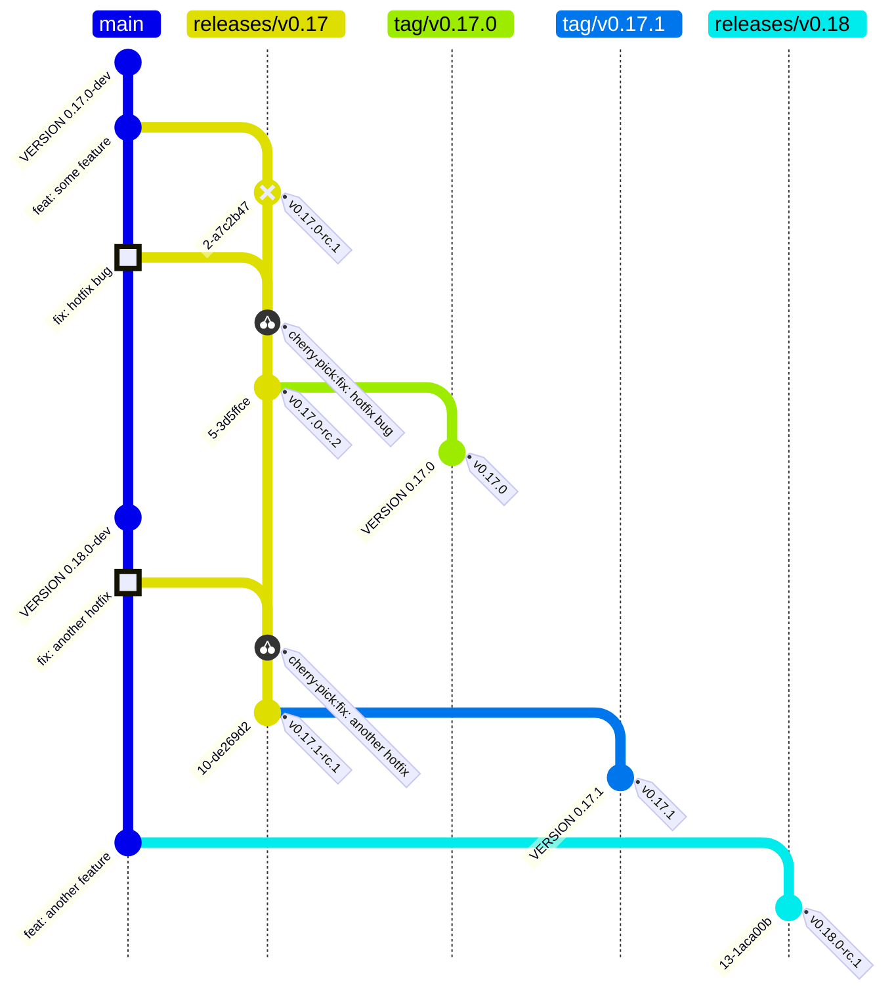
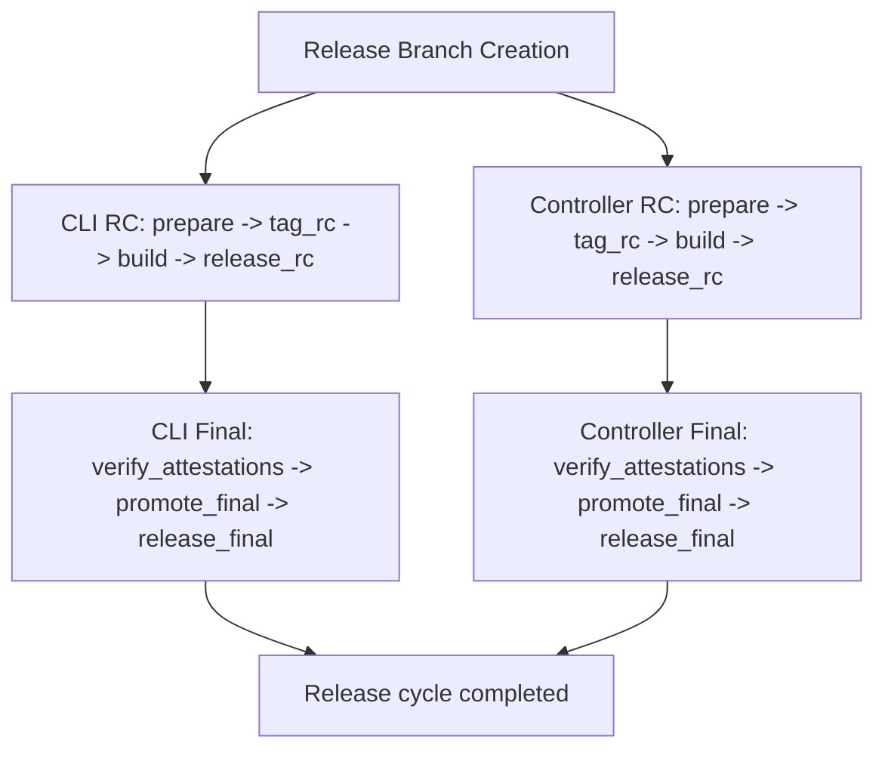

# Release Process

This guide is for OCM release managers.

Scope: **CLI and Kubernetes Controller are released together in version lockstep** (RC and final).

---

## General Information

### Context and scope

Development in the [Open Component Model monorepo](https://github.com/open-component-model/open-component-model)
happens on `main`, while releases are prepared and promoted from release branches (`releases/vX.Y`).
This repository follows a lockstep release model for multiple components — currently the
[CLI](https://github.com/open-component-model/open-component-model/tree/main/cli) and the
[Kubernetes Controller](https://github.com/open-component-model/open-component-model/tree/main/kubernetes/controller).

### Release cadence

The default cadence is sprint-based. At the start of each sprint, create a Release Candidate (RC)
for the current release branch. After one sprint of testing, promote the previous RC to a final release.
At the end of each sprint (typically Friday), assign the next release responsible.

Patch releases are handled out-of-band and created on demand for critical fixes.
A scheduled release can be skipped if the branch is not ready or there are no meaningful changes.

### Release Responsible

The release responsible coordinates and executes the release flow.
This role rotates each sprint and involves:

- Triggering and supervising release branch creation
- Creating release candidates for all lockstep components
- Promoting release candidates to final releases
- Coordinating patch releases when needed
- Keeping this guide accurate and up to date

**Quick links:**
[Create release branch](#1-create-the-release-branch) ·
[Create RC](#2-create-a-release-candidate-cli--controller) ·
[Promote to Final](#3-promote-rc-to-final-release-cli--controller) ·
[Patch release](#4-create-a-patch-release-if-needed)

### Release Checklist

Copy this checklist to your "Sprint Responsible" issue:

```markdown
- [ ] Release branch created (`releases/v0.X`)
- [ ] CLI RC created and verified
- [ ] Controller RC created and verified
- [ ] (wait 1 sprint for testing)
- [ ] CLI Final promoted
- [ ] Controller Final promoted
- [ ] Both releases visible on GitHub Releases page
```

### Timeline

| When | Action |
|------|--------|
| Sprint Start | Create RCs for both components |
| Sprint End | Assign next release responsible |
| Next Sprint Start | Promote previous RCs to Final |

### Guardrails

Once a release branch is created, it enters cut-off mode:
no feature or breaking-change work is accepted.
All fixes must go to `main` first, then be cherry-picked to the release branch.

---

## Release Workflow Diagram

The following diagram illustrates a typical release cycle with an initial release (`v0.17.0`)
and a subsequent patch release (`v0.17.1`):



---

## What to do

### 1) Create the release branch

A new release branch marks the cut-off point for that minor release line.
Once created, only bug fixes and documentation changes are allowed.

1. Run workflow **[Release Branch Creation](./.github/workflows/release-branch.yml)**.
2. Set target branch to `releases/v0.X`.
3. Confirm the branch was created successfully.

<details>
<summary>Cut-off policy for this release branch</summary>

- No feature or breaking-change work is accepted.
- Non-bugfix and non-documentation changes require release responsible approval.
- Non-critical bug fixes require release responsible approval.
- Fixes must be merged to `main` first, then cherry-picked to this branch.
- Do not introduce release-branch-only commits unless explicitly approved.

</details>

<details>
<summary>What happens in the background?</summary>

- Validate `target_branch` against `releases/v0.X`.
- Normalize `source_branch` (default `main`) and resolve its HEAD SHA.
- Create `refs/heads/<target_branch>` from source SHA, or skip if target already exists.
- Publish source, target, and commit SHA in the workflow summary.

</details>

### 2) Create a Release Candidate (CLI + Controller)

Release candidates are created for both components sequentially, in lock-step.

1. Run workflow **[CLI Release](./.github/workflows/cli-release.yml)** with:
   - `dry_run = true` first to validate
   - `dry_run = false` for actual release
2. Run workflow **Controller Release** with equivalent inputs
   (once `controller-release.yml` is available).
3. Verify both pre-releases were created successfully on the GitHub Releases page.

> ⚠️ **Always do a dry-run first** before the actual release.

> CLI and Controller are released together. Do not release only one of them.

<details>
<summary>Understanding the Dry-Run Summary</summary>

Dry-run mode validates the release workflow without creating any tags, releases, or artifacts.
The workflow summary shows exactly what **would** happen:

| Field | Description |
|-------|-------------|
| RC Version | The RC version that would be created (e.g., `0.17.1-rc.1`) |
| Base Version | The final version after promotion (e.g., `0.17.1`) |
| Set Latest | Whether `:latest` tag would be applied to OCI images |
| Highest Final Version | The current highest released version |

**Important for Patch Releases:**

When releasing a patch for an older version line (e.g., `v0.16.1` when `v0.17.0` already exists),
the dry-run summary will show:

```
Set Latest: false
Highest Final Version: 0.17.0
```

This means the patch release will **not** be marked as the GitHub "Latest Release"
and the `:latest` OCI tag will **not** be updated. This is expected behavior to prevent
users from accidentally downgrading when pulling `:latest`.

</details>

<details>
<summary>What happens in the background?</summary>

- **CLI path (`cli-release.yml`)**
   - `prepare`: compute next RC metadata + changelog.
   - `tag_rc`: create/push RC tag (skipped on dry-run).
   - `build`: call `cli.yml` to build binaries and OCI artifacts.
   - `release_rc`: publish GitHub pre-release with artifacts.
- **Controller path (`controller-release.yml`)**
   - Mirrors the same RC flow for controller artifacts (image + Helm chart).
- If one component fails, do not proceed to final promotion.

</details>

### 3) Promote RC to Final Release (CLI + Controller)

Final promotion takes an existing RC and promotes it to a stable release.
The workflow verifies attestations before creating any final artifacts.

The final promotion is triggered automatically after the RC phase completes
and the `cli/release` environment gate is approved.

1. Wait for the RC to be tested (typically 1 sprint).
2. Go to the workflow run in GitHub Actions.
3. Approve the `cli/release` environment gate (requires reviewer approval + wait timer).
4. The workflow will automatically:
   - Verify RC attestations
   - Create final tag from RC commit
   - Promote OCI image tags
   - Publish final GitHub release
5. Repeat for **Controller Release** once `controller-release.yml` is available.
6. Verify both final releases are published on the GitHub Releases page.

> 🔐 **Security:** The workflow automatically verifies all attestations from the RC release
> before proceeding. If verification fails, the promotion is aborted.

<details>
<summary>What happens in the background?</summary>

- **CLI path (`cli-release.yml`)**
   - `verify_attestations`: verify binary and OCI image attestations (gated by environment approval).
   - `promote_final`: create final tag from RC commit, promote OCI image tags.
   - `release_final`: publish final GitHub release with assets from RC.
- **Controller path (`controller-release.yml`)**
   - Mirrors the same final promotion pattern for controller image + Helm chart.
- Final is only valid when both components are promoted in the same cycle.

</details>

<details>
<summary>Workflow execution view (technical)</summary>



</details>

### 4) Create a patch release (if needed)

Patch releases address critical fixes for an already-released version.
The fix must always land on `main` first, then be cherry-picked to the release branch.

> ⚠️ **Older version lines:** When creating a patch for an older release line
> (e.g., `v0.16.1` when `v0.17.0` exists), the release will NOT be marked as "Latest"
> on GitHub and the `:latest` OCI tags will remain on the newer version.
> This is intentional — use dry-run first to verify this behavior in the summary.

1. Ensure the fix was merged to `main` first.
2. Cherry-pick the fix to the active release branch `releases/v0.X`.
3. Create a patch PR to the release branch.
4. Create and test RCs for **both** CLI and Controller.
5. Promote both components to final.

<details>
<summary>Patch PR naming and cherry-pick flow</summary>

```bash
# Check out the target release branch
git checkout releases/v0.X

# Cherry-pick the commit from main
git cherry-pick <commit-hash>

# Create a PR to the release branch
gh pr create \
   --title "[releases/v0.X] cherry-pick: <Original PR or Commit>" \
   --body "Cherry-pick of <Original PR or Commit> from main to releases/v0.X" \
   --base releases/v0.X \
   --draft
```

Merge the PR, then follow the RC and Final promotion steps as usual.

</details>

---

## Release notes

Release notes are generated automatically by the release workflows using [git-cliff](https://git-cliff.org).
The release responsible does not need to manually compose notes for normal RC or final runs—the
changelog is derived from conventional commit messages.

---

## Troubleshooting

If something goes wrong during a release, check the following common issues:

**RC was not created**
- Check if the workflow run failed before tag creation.
- Rerun as dry-run first, then rerun with `dry_run=false`.

**Final promotion fails with "no RC found"**
- Verify that the latest RC tag exists on the release branch.
- Create a new RC for both components, then promote again.

**CLI and Controller versions diverged**
- Ensure both workflows were run for the same release branch in the same cycle.
- Stop promotion and align on a fresh RC cycle in lockstep.

**Final release exists for one component but not the other**
- Check the status of both workflow runs and the release pages.
- Complete or rerun the missing component release immediately.

**Attestation verification failed**
- Verify that the RC release binaries have valid build provenance attestations.
- Check that the OCI image was pushed to GHCR with attestation metadata.
- Use `gh attestation verify <file> --repo <repo>` to manually verify binaries.
- Use `gh attestation verify oci://<image>@<digest> --repo <repo>` to verify OCI images.
- If attestations are missing, create a new RC (attestations are generated during build).
