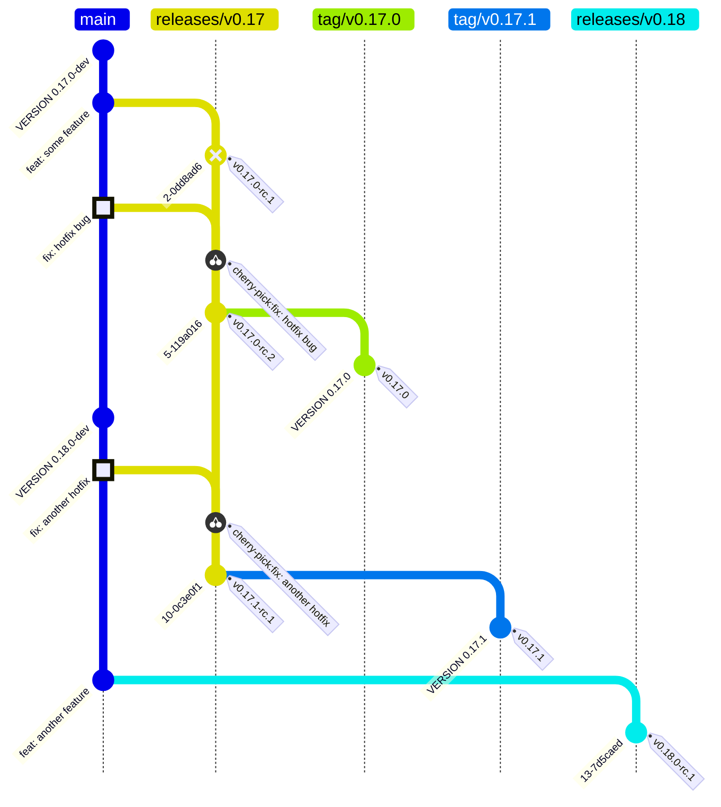

# Release Process

This guide is for OCM release managers.

Scope: **CLI and Kubernetes Controller are released together in version lockstep** (RC and final).

---

## General Information

### Context and scope

Development in the [Open Component Model monorepo](https://github.com/open-component-model/open-component-model) happens on `main`, while releases are prepared and promoted from release branches (`releases/v0.X`).
This repository follows a lockstep release model for multiple components. Currently, the release unit is:
- [CLI](https://github.com/open-component-model/open-component-model/tree/main/cli)
- [Kubernetes Controller](https://github.com/open-component-model/open-component-model/tree/main/kubernetes/controller)

### Release cadence

- Default cadence is sprint-based:
  - **Release Candidate (RC):** create an RC for the current release branch at the start of a sprint.
  - **Final release:** promote the previous sprint’s RC after one sprint of testing/grace period.
- At the end of each sprint (typically Friday), assign the next release responsible.
- Patch releases are out-of-band and created on demand for critical fixes.
- A scheduled release can be skipped if the branch is not ready or there are no meaningful release-worthy changes.

### Release Responsible

The release responsible coordinates and executes the release flow.

Responsibilities:
- Trigger and supervise the release branch creation.
- Create release candidates for all lockstep components.
- Promote release candidates to final releases.
- Coordinate patch releases when needed.
- Keep this guide accurate and up to date.

Quick links:
- [Create the release branch](#1-create-the-release-branch)
- [Create a Release Candidate (CLI + Controller)](#2-create-a-release-candidate-cli--controller)
- [Promote RC to Final Release (CLI + Controller)](#3-promote-rc-to-final-release-cli--controller)
- [Create a patch release (if needed)](#4-create-a-patch-release-if-needed)

### Release Checklist

Copy to your "Sprint Responsible" issue:

```markdown
- [ ] Release branch created (`releases/v0.X`)
- [ ] CLI RC created and verified
- [ ] Controller RC created and verified
- [ ] (wait 1 sprint for testing)
- [ ] CLI Final promoted
- [ ] Controller Final promoted
- [ ] Both releases visible on GitHub Releases page
```

### Timeline

| When | Action |
|------|--------|
| Sprint Start | Create RCs for both components |
| Sprint End | Assign next release responsible |
| Next Sprint Start | Promote previous RCs to Final |

### Guardrails

- Release branch cut-off starts when the release branch is created.
- No feature or breaking-change work is accepted on release branches.
- Fixes must go to `main` first, then be cherry-picked to the release branch.

---

## Release Workflow Diagram



---

## What to do

### 1) Create the release branch

1. Run workflow **[Release Branch Creation](./.github/workflows/release-branch.yml)**.
2. Set target branch to `releases/v0.X`.
3. Confirm the branch was created.

This step marks the cut-off for that minor release line.

<details>
<summary>Cut-off policy for this release branch</summary>

- No feature or breaking-change work is accepted on this release branch.
- Non-bugfix and non-documentation changes require release responsible approval.
- Non-critical bug fixes require release responsible approval.
- Fixes must be merged to `main` first, then cherry-picked to this release branch.
- Do not introduce release-branch-only commits unless explicitly approved as an exception.

</details>

<details>
<summary>What happens in the background?</summary>

- Validate `target_branch` against `releases/v0.X`.
- Normalize `source_branch` (default `main`) and resolve its HEAD SHA.
- Create `refs/heads/<target_branch>` from source SHA, or skip if target already exists.
- Publish source, target, and commit SHA in the workflow summary.

</details>

### 2) Create a Release Candidate (CLI + Controller)

1. Run workflow **[CLI Release](./.github/workflows/cli-release.yml)** with:
   - `release_candidate = true`
   - `dry_run = true` first to validate
   - `dry_run = false` for actual release
2. Run workflow **[Controller Release](./.github/workflows/controller-release.yml)** with equivalent RC inputs.
3. Verify both pre-releases were created successfully.

> ⚠️ **Always do a dry-run first** before the actual release to catch configuration issues early.

> CLI and Controller are released together. Do not release only one of them.
>
> Note: the Controller workflow link becomes active once `controller-release.yml` is added.

<details>
<summary>What happens in the background?</summary>

- **CLI path (`cli-release.yml`)**
  - `prepare`: compute next RC metadata + changelog.
  - `tag_rc`: create/push RC tag (skipped on dry-run).
  - `build`: call `cli.yml` to build binaries and OCI artifacts.
  - `release_rc`: publish GitHub pre-release with artifacts.
- **Controller path (`controller-release.yml`)**
  - Mirrors the same RC flow for controller artifacts (image + Helm chart).
- If one component fails, do not proceed to final promotion.

</details>

### 3) Promote RC to Final Release (CLI + Controller)

1. Run workflow **[CLI Release](./.github/workflows/cli-release.yml)** with:
   - `release_candidate = false`
   - `dry_run = true` first to validate
   - `dry_run = false` for actual promotion
2. Run workflow **[Controller Release](./.github/workflows/controller-release.yml)** with equivalent final inputs.
3. Verify both final releases are published.

> ⚠️ **Always do a dry-run first** before the actual promotion.

> 🔐 **Security:** The final promotion automatically verifies all attestations from the RC release before proceeding. If verification fails, the promotion is aborted.

<details>
<summary>What happens in the background?</summary>

- **CLI path (`cli-release.yml`)**
  - `prepare`: resolve latest RC and target final version.
  - `validate_final`: ensure promotable RC exists.
  - `verify_attestations`: verify all attestation bundles from RC release.
  - `tag_final`: create immutable final tag from RC source.
  - `promote_image`: promote OCI tags (version + latest).
  - `release_final`: publish final GitHub release from RC artifacts.
- **Controller path (`controller-release.yml`)**
  - Mirrors the same final promotion pattern for controller image + Helm chart.
- Final is only valid when both components are promoted in the same cycle.

</details>

<details>
<summary>Workflow execution view (technical)</summary>


</details>

### 4) Create a patch release (if needed)

1. Ensure the fix was merged to `main` first.
2. Cherry-pick the fix to the active release branch `releases/v0.X`.
3. Create a patch PR to the release branch.
4. Create and test RCs again for **both** CLI and Controller.
5. Promote both components to final.

<details>
<summary>Patch PR naming and cherry-pick flow</summary>

1. Check out the target release branch:

   ```bash
   git checkout releases/v0.X
   ```

2. Cherry-pick the commit from `main`:

   ```bash
   git cherry-pick <commit-hash>
   ```

3. Create a PR to the release branch with the required title prefix:
   - Prefix format: `chore: [releases/v0.X]`
   - Example:

   ```bash
   gh pr create \
      --title "[releases/v0.X] cherry-pick: <Original PR or Commit>" \
      --body "Cherry-pick of <Original PR or Commit> from main to releases/v0.X" \
      --base releases/v0.X \
      --draft
   ```

4. Merge the PR into `releases/v0.X`.

</details>

---

## Release notes

- Release notes are generated automatically by the release workflows (using [git-cliff](https://git-cliff.org)).
- The release responsible does not need to manually compose notes for normal RC/final runs.

---

## Troubleshooting

### RC was not created
- Check: workflow run failed before tag creation.
- Action: rerun as dry-run first, then rerun with `dry_run=false`.

### Final promotion fails with “no RC found”
- Check: latest RC tag exists on the release branch.
- Action: create a new RC for both components, then promote again.

### CLI and Controller versions diverged
- Check: both workflows were run for the same release branch and same cycle.
- Action: stop promotion, align on a fresh RC cycle in lockstep.

### Final release exists for one component but not the other
- Check: status of both workflow runs and release pages.
- Action: complete or rerun the missing component release immediately.

### Attestation verification failed
- Check: RC release assets include `attestations-index.json` and `attestation-*.jsonl` bundles.
- Check: the OCI image digest in the index matches the actual image.
- Action: if assets are missing, create a new RC. If digest mismatch, investigate image tampering.
