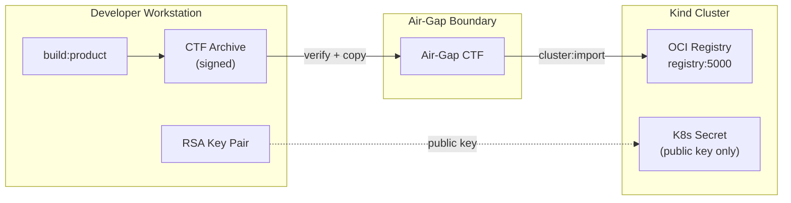
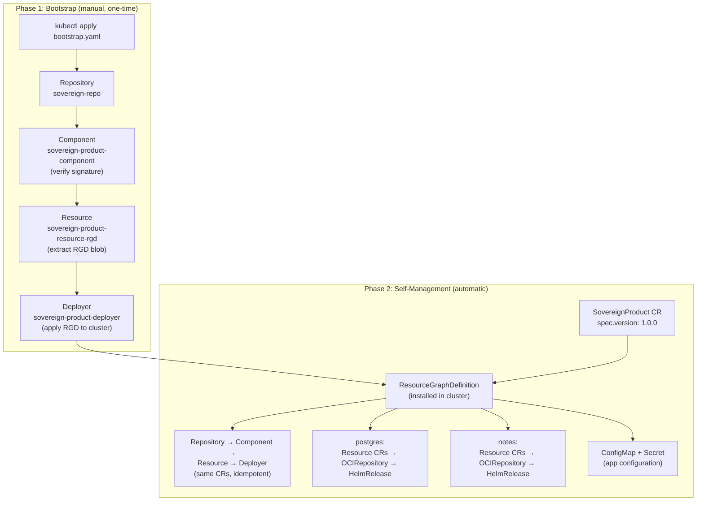
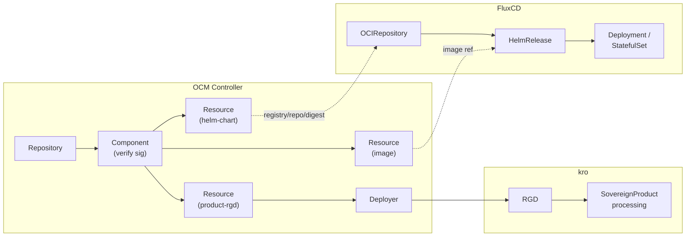

# OCM Conformance Scenario: Sovereign Cloud Delivery

This conformance scenario validates one of our core value statements: **modeling, signing, transporting, and deploying a multi-service product into an air-gapped sovereign cloud environment**.

## Overview

Implements the reference scenario defined in [ADR-0013](../../../docs/adr/0013_sovereign_cloud_reference_scenario.md) to demonstrate:

- Real multi-service application with genuine dependencies
- Component modeling and construction
- Digital signing and verification workflows
- Air-gap transport via CTF (Common Transport Format)
- Deployment on air-gapped infrastructure using OCM Controller + kro + FluxCD

## Architecture

The scenario deploys a minimal notes application with PostgreSQL backend:

- **sovereign-notes**: Go web service with REST API for notes management
- **PostgreSQL**: Official postgres image deployed as StatefulSet
- **sovereign-product**: Meta component that orchestrates both services

### Air-Gap Transport Flow

Artifacts move from the developer workstation across an air-gap boundary into the cluster registry. The developer builds components into a CTF archive and signs them with a private key. The transfer step verifies the signature before copying into a separate air-gap CTF. Only the public key enters the cluster (as a Kubernetes secret) — the private key never leaves the developer workstation.



### Bootstrap and Self-Management Lifecycle

The system has a two-phase lifecycle. In Phase 1, `kubectl apply bootstrap.yaml` creates the OCM CR chain (Repository, Component, Resource, Deployer) which delivers the ResourceGraphDefinition into the cluster. In Phase 2, a user creates a `SovereignProduct` CR. kro processes it via the RGD, which regenerates the same bootstrap CRs (idempotently) plus application resources. The system is now self-managing — changing `spec.version` triggers the full reconciliation chain automatically.



### Controller Reconciliation Chain

Three controllers divide responsibilities across the deployment pipeline. The OCM Controller manages component resolution and signature verification. kro processes the ResourceGraphDefinition to expand `SovereignProduct` CRs into the full resource tree. FluxCD handles the final-mile deployment of Helm charts and container images into the cluster.



## Quick Start

See [USAGE.md](USAGE.md) for prerequisites, configuration options, and step-by-step instructions.

```bash
# Run the complete scenario end-to-end
task run

# Or run each stage independently — see USAGE.md for details
task check && task clean && task prepare
task cluster:setup
task build:product
task transfer:airgap
task cluster:import
task cluster:bootstrap
task verify:deployment
```

## What This Validates

### Core OCM Capabilities

- ✅ Component construction from multiple input types (source code, helm charts, container images)
- ✅ Component dependency modeling via componentReferences  
- ✅ Resource bundling and self-contained transport archives
- ✅ RSA digital signing with RSASSA-PSS algorithm
- ✅ Signature verification during transfer and deployment
- ✅ Cross-registry transport with resource localization

### Air-Gap Deployment

- ✅ CTF-based transport without internet connectivity
- ✅ Local registry integration
- ✅ Image reference rewriting for air-gapped registries
- ✅ Configuration management via ResourceGraphDefinitions (kro)

### Ecosystem Integration

- ✅ OCM Controller for Kubernetes-native component management
- ✅ FluxCD for GitOps-based workload deployment  
- ✅ Helm chart deployment with dynamic values injection
- ✅ Kubernetes resource orchestration and health checking

## Directory Structure

```
sovereign-scenario/
├── README.md                    # This file
├── Taskfile.yml                 # Build and deployment automation
├── components/                  # OCM component definitions
│   ├── notes/                   # Notes application component
│   ├── postgres/                # PostgreSQL component  
│   └── product/                 # Meta component
├── deploy/                      # OCM controller deployment manifests and bootstrap apis
```

## Success Criteria

A successful conformance run validates:

1. **Component Construction**: All three components build without errors
2. **Signing**: Components are signed with RSA-PSS and signatures verify
3. **Transport**: CTF archive transfers to air-gapped registry with resource localization
4. **Deployment**: OCM Controller successfully deploys all components
5. **Integration**: Notes service connects to PostgreSQL and serves traffic
6. **Upgrade**: Version bump triggers automatic rolling update

## Integration Points

This scenario serves as a conformance test for:

- OCM CLI component operations
- OCM Controller Kubernetes integration
- CTF transport format compatibility  
- ResourceGraphDefinition (kro) deployment patterns
- FluxCD source controller integration
- Multi-component dependency resolution
- Air-gap registry workflows

## Contributing

To extend this scenario:

1. Modify components in `components/` directories
2. Update version in `settings.yaml`  
3. Add tests in appropriate `tests/` subdirectory
4. Document changes in this README
5. Verify full conformance run passes

This scenario should remain a complete, working example that new OCM adopters can use as a reference implementation.