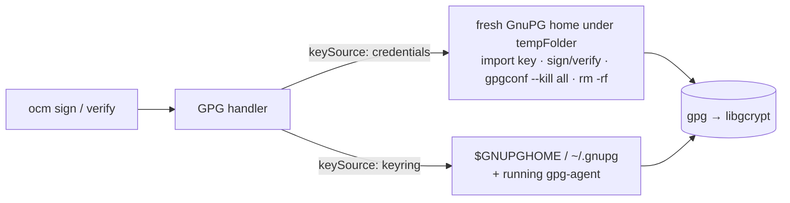

# Demo: GPG signatures through the system `gpg`

Baseline: [#3691](https://github.com/open-component-model/open-component-model/pull/3691)
(`feat(gpg)!: sign and verify GPG signatures with the system gpg binary`), plus its follow-up
[#3755](https://github.com/open-component-model/open-component-model/pull/3755) (GnuPG homes under `tempFolder`,
fingerprints accepted with spaces or `0x`). Context: ADR 0030 / FIPS 140-3 ([#3689](https://github.com/open-component-model/open-component-model/pull/3689)).

## The story in one slide

| Before                                                    | After                                                                          |
|-----------------------------------------------------------|--------------------------------------------------------------------------------|
| OpenPGP crypto in Go (`ProtonMail/go-crypto`)             | `ocm` runs the GnuPG `gpg` binary (>= 2.2.0) for every sign/verify            |
| Not FIPS 140-3 (go-crypto is outside the Go FIPS module)  | All crypto, including passphrase unwrapping, runs in libgcrypt (FIPS-validatable) |
| Keys only from credentials                                | `keySource: credentials` (default) **or** `keySource: keyring`                 |
| No hardware tokens, no agent                              | Keyring mode: gpg-agent, pinentry, passphrase cache, YubiKey/OpenPGP card      |

⚠️ Breaking: no `gpg` on `PATH` → GPG signing fails. There is no Go fallback, not even with `GODEBUG=fips140=off`.



## Prerequisites

- GnuPG >= 2.2 with `gpg`, `gpgconf`, `gpg-connect-agent` on `PATH` (tested: Homebrew GnuPG 2.5.22 / libgcrypt 1.12.4)
- Go (builds `ocm` from this repository)
- Optional, act 8: Docker (pulls `debian:trixie-slim`, installs `gnupg`)

The demo uses its own keyring in `DEMO_DIR/gnupg` (default `/tmp/ocm-gpg-demo`). Your `~/.gnupg` is never touched.

## Running it

```bash
cd demo/gpg-system-signing
./demo.sh setup          # ~1 min: builds ocm, ocm-legacy, the FIPS CLI + image, generates keys
./demo.sh 1 2 3 4 5 6 7 8  # the talk; press Enter to run each command
./demo.sh cleanup
```

- `DEMO_AUTO=1 ./demo.sh` rehearses everything without pauses.
- `DEMO_PINENTRY=1 ./demo.sh 3` lets the real pinentry prompt for the passphrase (`alice-demo-passphrase`)
  instead of presetting it in the agent. Stronger on stage, but needs a GUI pinentry (macOS: `pinentry-mac`).
- Act 7 revokes Alice's key in the demo keyring; run `./demo.sh setup` again before repeating acts 3, 4 and 7.

Keys: **Alice** (RSA-3072, passphrase-protected, the release key) and **Mallory** (Ed25519, also in the keyring).

## Acts and talking points

### 1 · `keySource: credentials` (default) — same config as before, gpg does the crypto

- `.ocmconfig` is unchanged from the go-crypto days: key files + `passphrase` in the GPG consumer.
- The filtered debug log shows each gpg call:
  - `import`, `list-secret-keys`, `sign` and `kill` in a **fresh** `--homedir …/ocm-gpg-NNN` under `tempFolder` (#3755);
  - `--pinentry-mode loopback --passphrase-fd 0`: the passphrase goes over stdin, never argv;
  - `--local-user <full fingerprint>`: the first secret key, or `keyFingerprint` if set.
- `ls tempFolder` is empty afterwards: the agent of that home is killed and the directory removed, even on cancellation.
- Signature format is unchanged: `algorithm: GPG`, `mediaType: application/vnd.ocm.signature.gpg`, ASCII-armored detached signature.
- On macOS one operation takes 1–1.5 s, spent in gpg-agent start-up, signing and shutdown in the fresh home. In the
  Linux box of act 8, a verify in an isolated home takes about 0.09 s.

### 2 · Wrong key

Mallory's public key → `ERRSIG … NO_PUBKEY`. The error includes gpg's stderr and status lines.

### 3 · `keySource: keyring` — your keyring, your agent

- The config holds **no secrets**: no key files, no passphrase. The fingerprint is pasted exactly as `gpg --fingerprint`
  prints it, with spaces (#3755).
- The key is unlocked once in gpg-agent. In the demo `gpg-preset-passphrase` does this; in real use it is pinentry or a token touch.
- No `--homedir`, no `--passphrase-fd`: gpg uses `$GNUPGHOME` and the running agent.
- Measured on macOS: sign **0.2 s** instead of 1.5 s, verify **0.07 s** instead of 0.95 s.
- Verify runs with `--trust-model always --no-auto-key-retrieve`: trust comes from the pinned fingerprint, and gpg never fetches keys over the network.

### 4 · Keyring verification accepts exactly one pinned key

| Config                                     | Result                                                                                              |
|--------------------------------------------|-----------------------------------------------------------------------------------------------------|
| `keyFingerprint: <16-hex long key ID>`     | `verifying with the GnuPG keyring requires the full key fingerprint …`                              |
| `keyFingerprint: <Mallory>` (in keyring)   | `signature was made by key <Alice> … does not match the configured key fingerprint "<Mallory>"`      |
| key file in credentials + `keySource: keyring` | `keySource keyring takes keys from the GnuPG keyring; remove the key material from the GPG credentials` |

The first and third checks fail before gpg runs (≈0.2 ms).

### 5 · Backward compatibility

`ocm-legacy` is the CLI built from the commit before #3691. It signs with `PATH=/nonexistent`, which proves it does not
use gpg. The new CLI verifies that go-crypto signature with gpg. `testdata/gocrypto` pins the same guarantee in the
handler tests.

### 6 · No silent fallback

`PATH=/nonexistent` → `GPG signing requires the GnuPG "gpg" binary (>= 2.2.0) on PATH; …`, and the same error with
`GODEBUG=fips140=off`. A missing gpg is a hard error, never a silent switch to non-FIPS crypto.

### 7 · Revocation

Importing Alice's revocation certificate into the keyring makes keyring verification fail with `REVKEYSIG`
(`EXPKEYSIG` likewise). The parser fails closed and requires exactly one `GOODSIG` and one `VALIDSIG`, so a co-signature
by another trusted key cannot hide a revoked key (review finding on #3691).

Contrast: `keySource: credentials` still verifies. It is hermetic: the trust anchor is the configured public key file,
not your keyring. Choose the mode accordingly.

### 8 · FIPS 140-3

- `go version -m` shows `GOFIPS140=v1.0.0`: the CLI is built against the Go FIPS module.
- `debian:trixie-slim` with `/etc/gcrypt/fips_enabled` makes `gpgconf --show-versions` report `fips-mode:y`
  (GnuPG 2.4.7, libgcrypt 1.11.0).
- Inside the box, the passphrase-protected RSA key signs and verifies. The signature made on the laptop in act 1 also
  verifies. Same artifact, same format: only where the crypto runs has changed.
- Debian's libgcrypt in FIPS mode is a stand-in. Compliance needs a FIPS 140-3 **validated** libgcrypt on a FIPS-mode OS
  (see the FIPS docs and ADR 0030).

## Expected Q&A

- **Why not keep go-crypto as a fallback?** A fallback would quietly leave FIPS mode. Failing hard is auditable.
- **Which GnuPG?** >= 2.2.0, checked at first use. `gpgconf` is needed to stop temporary agents. Without it, ocm warns.
- **CI without a keyring?** Use the default `keySource: credentials`. The key file and passphrase come from secrets as before.
- **Long `$TMPDIR` (sandboxed CI)?** The isolated home moves to `/tmp` if the gpg-agent socket path would exceed the
  ~104-byte limit. If that fails too, the error names the limit.
- **GnuPG 2.5 + RSA keys generated by go-crypto tooling:** about half of them break RFC 4880's `p < q` rule, and gpg 2.5
  rejects them as `Bad secret key`. Signatures made with them still verify. Re-generate such keys with gpg.
- **Key selection:** `keyFingerprint` accepts a 40-hex fingerprint or a 16-hex long key ID (credentials mode), with
  spaces or `0x`. No `!` suffix is added, so gpg picks the key's signing subkey.

## Docs

- How-to: `website/content/docs/how-to/Sign and Verify/sign-component-version.md` (GPG tab, keyring section)
- How-to: `website/content/docs/how-to/Sign and Verify/verify-component-version.md` (keyring + troubleshooting)
- Tutorial: `website/content/docs/tutorials/signing/gpg.md`
