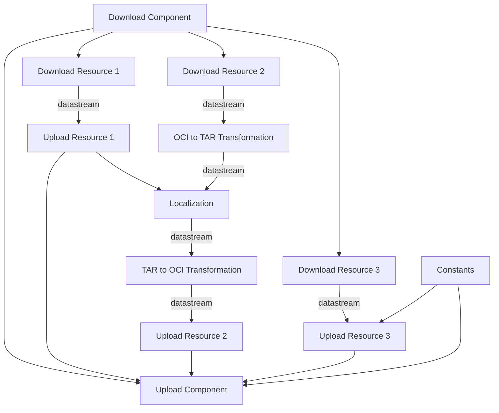
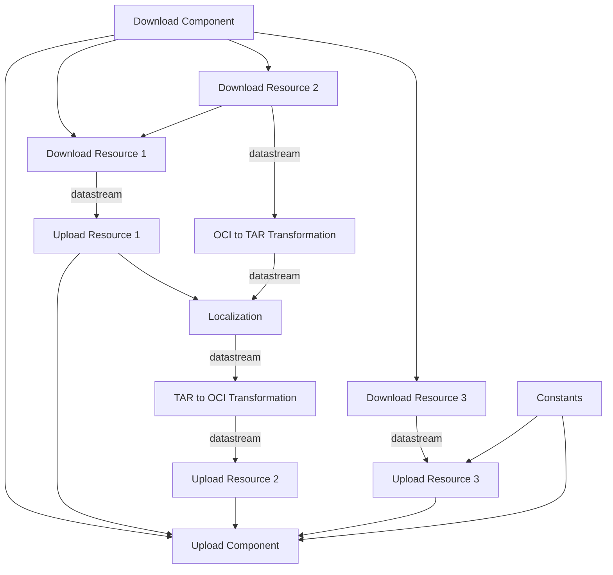

# A Specification for Orchestration of OCM Component Operations

* Status: proposed
* Deciders: Gergely Brautigam, Fabian Burth, Jakob Moeller
* Date: 2025-02-17

Technical Story: Design a specification that enables the orchestration of
arbitrary operations on components and their resources.

> **NOTE:** This proposal essentially introduces **OCM as K8S + KRO for
> SBOMs**.  
> The _operation plugins_ are analogous to _k8s controllers_ (without the
> reconciliation). Their _types and the corresponding configuration schemas_ are
> analogous to the _k8s resource definitions_.   
> The analysis of CEL expressions to build up a directed
> acyclic graph (DAG) of operations is analogous to KROs _resource graph
> definition_.
>
> The ideas in this proposal are heavily inspired by [kro](https://kro.run/).
> The current proof-of-concept implementation even uses big parts of their code!

## Context and Problem Statement

The core use case the specification is designed for is the **transfer of
components and their resources**.

### Requirements

- **Transfer components and their resources from one or multiple source
  repositories to one or multiple target repositories**

  **Example:**
  - root component `ocm.software/root-component:1.0.0` is stored at `ghcr.
    io/ocm-component-model/transfer-source/ocm.software/root-component:1.0.0`
  - root component references `ocm.software/leaf-component:1.0.0`
  - leaf component is stored at
    `quay.io/ocm-component-model/transfer-source/ocm.software/leaf-component:1.0.0`

  Both components should be transferred to
  `ghcr.io/ocm-component-model/transfer-target`
  and `quay.io/ocm-component-model/transfer-target` in a single transfer
  process.


- **Transfer resources between different storage systems**

  **Example:**
  - resource `ocm-cli:1.0.0` is stored as an oci artifact at
    `ghcr.io/ocm-component-model/transfer-source/ocm-cli:1.0.0`

  Resource `ocm-cli:1.0.0` should be transferred to the central maven repository
  `https://repo1.maven.org/maven2` with the `GAV` `software.
  ocm/ocm-cli/1.0.0`. Thereby, the resource has to be transformed to a maven
  artifact.


- **Localize resources that are deployment instructions during transfer**

  **Example:**
  - component `ocm.software/root-component:1.0.0` contains a resource
    `ghcr.io/ocm-component-model/transfer-source/ocm-controller-deployment-manifest:1.0.0`
    and a resource
    `ghcr.io/ocm-component-model/transfer-source/ocm-controller:1.0.0`
  - resource `ocm-controller-deployment-manifest:1.0.0` is a k8s deployment and
    specifies
    `image: ghcr.io/ocm-component-model/transfer-source/ocm-controller:1.0.0`
    in its pod template
  - `ocm.software/root-component:1.0.0` and all its resources are transferred to
    a registry in a private environment to
    `private-registry.com/ocm-component-model/transfer-target/ocm
    -controller-deployment-manifest:1.0.0` and `private-registry.
      com/ocm-component-model/transfer-target/ocm-controller:1.0.0`

  The be able to consume the component in the private environment, the pod
  template in the deployment manifest has to be adjusted from `image: 
  ghcr.io/ocm-component-model/transfer-source/ocm-controller:1.0.0` to `image: 
  private-registry.com/ocm-component-model/transfer-target/ocm-controller:1.0.0`


- **Hash and sign components (during transfer)**

  **Example:**
  - component `ocm.software/root-component:1.0.0` references component
    `ocm.software/leaf-component:1.0.0`
  - therefore, the _hash_ of component `ocm.software/root-component:1.0.0`
    incorporates the _hash_ of component `ocm.software/leaf-component:1.0.0`

  Thus, the hash of `ocm.software/leaf-component:1.0.0` has to be calculated
  before the hash of `ocm.software/root-component:1.0.0` can be calculated.
  Since the hash of the resources content is part of the component hash,
  _cross storage system transfers_ and _localization_ require the hash to be
  recalculated during transfer.


- **Parallelization of transfer operations**

  **Example:**
  - resource `myimageA` and resource `myimageB` both have to be transferred as
    part of a component transfer
  - while the download and upload of each resource depend on each other, there
    are no dependencies between the two resources
  - therefore, the download and upload of `myimageA` and `myimageB` can be
    performed in parallel

### Conclusion

**Extensibility**: The **cross storage system transfer** and the
**localization** require the operations to be performed to be extensible.

- the transformation logic for re-packaging for cross storage system transfers
  depends on the source and target storage system (e.g. oci, maven, npm)
- the transformation logic for localization depends on the deployment
  description format (e.g. manifest, kustomization, helm)

**Ordering**: The **hash and sign** require the operations to be performed in a
specific order (child before parent components). Besides, there are several
other operations that either kind of **implicitly** depend on each other (data
flow between download resource and upload resource) or **explicitly** depend on
each other (localization needs the location of the image after transfer).

**Parallelization**: Operations such as download and upload of resources, but
also hashing and localization of resources can be performed in parallel to
significantly speed up the transfer process.

Also, users might want to incorporate their own operations:

- **filtering** image layers or entire resources based on target location of the
  transfer (e.g. for customer deliveries)

## Solution Proposal

An _ocm orchestration specification_ is a formalized description of operations
that have to be performed on components and their resources. It uses a **CEL
expression syntax** to determine dependencies between operations. Based on the
dependencies, a **directed acyclic graph (DAG)** is built up that determines the
order of operations.

In fact, the description format is currently so generic that it can be used to
orchestrate arbitrary operations on arbitrary data - essentially establishing is
**general purpose CEL based pipeline language**.

This allows to prepare or enrich operations on components and resources with
additional information.

### Example: OCM orchestration specification

Assume, we have the following component stored in
`ghcr.io/fabianburth/source-ocm-repository`:

```yaml
meta:
  schemaVersion: v2
component:
  name: ocm.software/root-component
  version: 1.0.0
  provider: ocm.software
  resources:
    - access:
        imageReference: ghcr.io/fabianburth/source-charts/podinfo:6.7.1
        type: ociArtifact
      name: mychart
      relation: external
      type: helmChart
      version: 6.7.1
    - access:
        imageReference: ghcr.io/fabianburth/source-image/podinfo:6.7.1
        type: ociArtifact
      name: myimage
      relation: external
      type: ociImage
      version: 6.7.1
    - access:
        localReference: sha256:<sha256>
        mediaType: application/yaml
        type: localBlob
      name: mylocalization
      relation: external
      type: localization-rule
      version: 6.7.1
```

We want to transfer the component to
`ghcr.io/fabianburth/target-ocm-repository/*`  and the resources to `ghcr.
io/fabianburth/target-*`. Thereby, we want to localize the helm chart.

```yaml
type: operations.ocm./v1alpha1
transformations:
  - type: attributes.operation/v1alpha1
    id: constants
    attributes:
      targetImageReference: "ghcr.io/fabianburth/target-ocm-repository/ocm.
        software/root-component:1.0.0"

  # component 1
  - type: downloader.component.ctf/v1alpha1
    id: downloadcomponent1
    name: ocm.software/root-component
    version: 1.0.0
    filePath: ghcr.io/fabianburth/source-ocm-repository/ocm.
      software/root-component:1.0.0

  # resource 1
  - type: downloader.resource.oci/v1alpha1
    id: resourcedownload1
    componentDescriptor: ${downloadcomponent1.outputs.descriptor}
    resource:
      name: myimage
  - type: uploader.resource.oci/v1alpha1
    id: resourceupload1
    imageReference: ghcr.io/fabianburth/target-image/myimage:6.7.1
    data: ${resourcedownload1.outputs.data}

  # resource 2
  - type: downloader.resource.oci/v1alpha1
    id: resourcedownload2
    componentDescriptor: ${downloadcomponent1.descriptor}
    resource:
      name: mychart
  - type: oci.to.tar.transformer/v1alpha1
    id: ocitotar1
    data: ${resourcedownload2.outputs.data}
  - type: yaml.engine.localization/v1
    id: localization1
    data: ${ocitotar1.outputs.data}
    file: "*/values.yaml"
    mappings:
      - path: "image.repository"
        value: "${resourceupload1.resource.access.imageReference.parseRef().
      registry}/${resourceupload1.resource.access.imageReference.parseRef().
      repository}"
  - type: tar.to.oci.transformer/v1alpha1
    id: tartooci1
    manifest: ${ocitotar1.outputs.manifest}
    ref: ${ocitotar1.outputs.ref}
    configLayer: ${ocitotar1.outputs.configLayer}
  - type: uploader.resource.oci/v1alpha1
    id: resourceupload2
    imageReference: ghcr.io/fabianburth/target-chart/mychart:6.7.1
    componentDescriptor: ${downloadcomponent1.outputs.descriptor}
    data: ${tartooci1.outputs.data}

  # resource 3
  - type: downloader.localblob.oci/v1alpha1
    id: downloadresource3
    componentDescriptor: ${downloadcomponent1.outputs.descriptor}
    resource:
      name: mylocalization
  - type: uploader.localblob.oci/v1alpha1
    id: uploadresource3
    componentDescriptor: ${downloadcomponent1.outputs.descriptor}
    imageReference: ${constants.spec.attributes.targetImageReference}
    data: ${downloadresource3.outputs.data}

  - type: uploader.component.ctf/v1alpha1
    filePath: ${constants.spec.attributes.targetImageReference}
    componentDescriptor: ${downloadcomponent1.outputs.descriptor}
    dependencies:
      - ${uploadresource1}
      - ${uploadresource2}
      - ${uploadresource3}
```

Internally, this would be represented as the following **directed acyclic graph
(DAG)**:



**This enables efficient parallelization of the operations.**

> **NOTES:** The _constants_ (the operation with the type
`attributes.transformation/v1alpha1`)
> is required to prevent a circular dependency between the upload of the
> local blob (`uploadresource3`) and the upload of the component. To upload
> a `localBlob`, the upload location of the component is required. And the
> component upload has to wait for the upload of the local blob as this
> might change its resource specification in the component descriptor.
>
> Alternatively, the `uploadresource3` could also specify the target location
> itself. The component depends on the upload anyway.

### Contract

- **Operations** provide a **JSON Schema** that defines their input parameters.
  This json schema has to be provided during *operation type registration*
  AND during *plugin registration*. This way, we don’t need an additional
  endpoint at the plugins to validate the types but can do the type checking
  statically with the json schemas.

- **Operations** can use **CEL expressions** to refer to the **input and output
  parameters** of other operations. This references automatically create a
  corresponding dependency in the **DAG**.

**Operations** can optionally either be compiled in as part of the core ocm cli
or can be integrated as plugins.

### Issues

Our current graph traversal requires buffering in between operations. With a
pipes architecture, all operations that are connected to data stream
(so, typically, all operations on a single resource) would block all until the
final transformation in that starts to run. In the graph shown above, i.e.
`Download Resource 2` would block until `Upload Resource 2` starts.

Now, let's assume `Download Resource 1` requires inputs from `Download 
Resource 2`. So, the directed acyclic graph (DAG) would look like this:



With **buffering the data stream**, this is not a problem. We would process in
the following order:

- `Download Resource 2`
- `Download Resource 1`
- ...

But considering **streaming the data stream**, we would be **deadlocked**.

- `Download Resource 2` blocks until `Upload Resource 2` starts
- `Upload Resource 2` transitively depends on `Localization`, and thus, also
  transitively depends on `Download Resource 1`
- `Download Resource 1` blocks until `Download Resource 2` starts

Ideally, we would statically analyze the graph to determine that we have to
buffer before `Localization`. Since that would be quite complex and
time-consuming, we decided to postpone these efforts.

### Backwards Compatibility

Despite the introduction of this `ocm orchestration specification`, the current
commands will still be supported.

Current behaviour such as

```bash
ocm transfer component ...
```

will be preserved.

The commands will be implemented through an **opinionated generation** of a
corresponding **ocm orchestration specifications** representing the behaviour of
the current command.

## Pros and Cons

**Pro**

- **Reusable Graph Orchestration Logic**:  
  As pointed out in the requirements, various operation in ocm require the
  complex graph orchestration logic. The formalization through the **ocm
  orchestration specification** allows to reuse this complex logic for arbitrary
  operations (kind of like crd's and controllers in k8s).


- **Extensibility**:
  The **ocm orchestration specification** allows for incorporating arbitrary
  operations.


- **Uniform Extension Interface**:
  Through the **operations** contract, ocm provides a **single clean interface**
  for its core functionality as well as its extensions. This might also enable
  us to provide additional command line tools or libraries
- (kind of like kubebuilder) to further improve the developer experience.


- **Ecosystem / Community Contributed Operations**:
  The value of ocm as a standard is highly dependent on its ecosystem. This
  extensible system is a great starting point to enable the creation of an
  actual ecosystem.

**Con**

- **Complexity**:
  The generic graph traversal logic introduces significant complexity that might
  be hard to understand and debug.

> Although, the clear separation between algorithm and business logic
> introduced through this formalization is a clear benefit.

- **Hard to Generate**

**Neutral**

- **Generic**:
  - We decided to **omit any kind of implicit dependencies or data flow** in
    this version of the specification.
  - Instead of implicitly creating a dependency between each consecutive
    resource operation and passing a data stram between them, we explicitly
    require the user (or the generator) to specify the dependency through a CEL
    expression.
  - **Pro**:
    - Further improves the separation between algorithm and business logic.
    - Requires less implicit knowledge
  - **Con**:
    - Requires a lot of boilerplate
    - Requires to really understand the dependencies between the operations
    - Manual creation is quite difficult and error-prone

## Conclusion

The concept behind the **ocm orchestration specification** quite clean. The
reusable graph orchestration logic provides significant value.

The main **disadvantage** is the complexity of the manual creation of a
specification. We assume that the manual creation is a rare task. Either, the
current commands which generate the specification will be sufficient for most
users. Or a user will create a specification once and reuse it with different
parametrizations (kind of like the instance specification in KRO). Therefore,
we think this is an acceptable trade-off.

## Links <!-- optional -->
