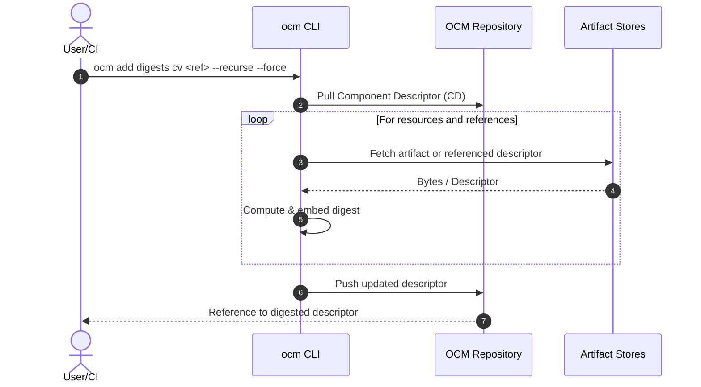
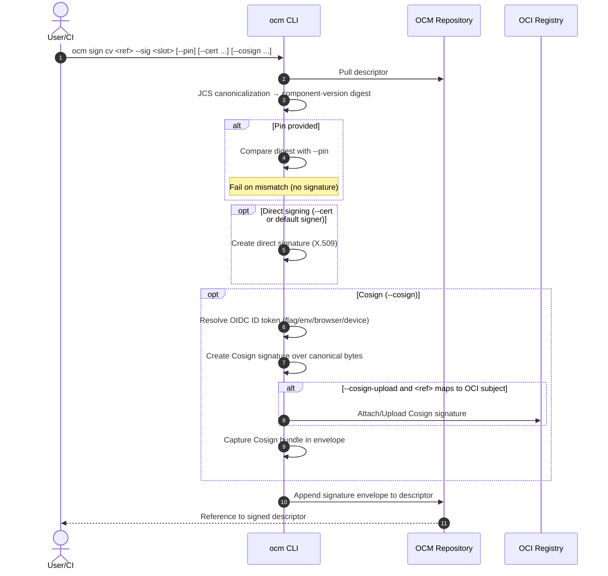

# ADR-0008: Digest Calculation & Signing/Pinning (OCI Cosign Support)

- **Status:** Proposed
- **Deciders:** OCM Maintainers
- **Date:** 2025-08-27
- **Related:** OCM signing specification and examples

---

## Context

Component Descriptors (CDs) are signed without altering digest fields during signing. Digests for resources, component references, and the component version are produced in a dedicated step and embedded into the descriptor. Signing uses fixed canonicalization (JCS, RFC 8785) over the descriptor to compute the component-version digest and create a signature envelope. When a component version references another, the digest of the referenced descriptor is embedded in the parent’s `references[]` and contributes to the parent’s component-version digest.

Some workflows require an additional **OCI Cosign** signature over the same canonical payload, optionally uploaded to an OCI registry and recorded in a transparency log (Rekor).

---

## Decision

### Two-step flow

1. **Digest calculation** mutates the descriptor to embed required digests (resources, component references, component-version).
2. **Signing** appends a signature envelope without computing or embedding digests. Optionally, the same payload may be **cosigned**.

### Commands (verb–noun, long options only, no stdin)

```bash
# Step 1 — Digest calculation (mutates descriptor: digests only)
ocm add digests cv <ref> --recurse --force

# Step 2 — Signing (no digest mutation)
# Direct signing via a single --cert (+ optional password).
# Optional OCI Cosign signing for the same canonical payload.
ocm sign cv <ref> \
  --sig <slot> \
  --pin <sha256:...> \
  --cert <path> \
  --password <pw> \
  --password-prompt \
  --cosign \
  --cosign-upload \
  --cosign-skip-tlog \
  --cosign-annotation <key=value> \
  --cosign-annotation <key=value> \
  --cosign-identity-token <token-or-path>
```

- `<ref>`: descriptor reference (file path or repository reference).
- `--recurse`: calculate digests for referenced component versions.
- `--force`: overwrite existing digest fields.
- `--sig <slot>`: logical signature slot/name (e.g., `mysig@1234`).
- `--pin <sha256:...>`: expected component-version digest; fail on mismatch.
- `--cert <path>`: certificate/key material for direct signing (PEM/PKCS#8/PKCS#12).
- `--password <pw>` / `--password-prompt`: decrypt key material if protected.
- `--cosign`: also produce an OCI Cosign signature for the same canonical payload.
- `--cosign-upload`: if `<ref>` resolves to an OCI subject, attach/upload the Cosign signature to the registry; otherwise, store the Cosign bundle only.
- `--cosign-skip-tlog`: disable Rekor upload.
- `--cosign-annotation`: repeatable `key=value` annotations for the Cosign signature.
- `--cosign-identity-token <token-or-path>`: pass an OIDC ID token directly (alternatively, use `SIGSTORE_ID_TOKEN` env).

### Normalization

- Canonicalization for component-version digest and signature payload is **JCS (RFC 8785)** via the existing `jcs` package.
- No CLI flag to select a different normalization.

---

## Behavior

### Digest calculation (`ocm add digests cv`)

- Computes and **embeds** digests:
  - **Resources**: content digests.
  - **Component references**: digest of the referenced component descriptor.
  - **Component-version**: digest over the canonicalized descriptor.
- May download artifacts and referenced descriptors as needed.
- Writes the updated descriptor back to `<ref>`.

### Signing (`ocm sign cv`)

- Loads the descriptor from `<ref>`.
- Canonicalizes the descriptor using JCS.
- Computes the component-version digest from canonical bytes.
- If `--pin` is provided, compares and fails on mismatch.
- Performs direct signing using `--cert` (or a default signer if available).
- If `--cosign` is set:
  - Obtain an OIDC ID token in this order:
    1. Use `--cosign-identity-token` if provided (token string or `@path` to file).
    2. Else use `SIGSTORE_ID_TOKEN` environment variable if present.
    3. Else, if interactive TTY is available, run an **interactive loopback** browser flow to retrieve the token.
    4. Else, run the **device flow** to retrieve the token.
  - Produce a Cosign signature over the **same canonical bytes**.
  - When `--cosign-upload` is present and `<ref>` maps to an OCI subject (`<name>@<digest>`), attach the Cosign signature to the registry using Cosign conventions.
  - Record the **Cosign bundle** (signature, certs, and optional Rekor inclusion) in the envelope for offline verification.
- Append the signature envelope under `.signatures[]`.
- Do not compute or embed any digests during signing.

---

## CLI Examples

```bash
# Digests
ocm add digests cv ghcr.io/org/app:1.2.3 --recurse --force

# Direct sign
ocm sign cv ghcr.io/org/app:1.2.3 \
  --sig release@2025-08-27 \
  --cert ~/.keys/release.p12 \
  --password-prompt

# Direct sign + embed Cosign bundle (no upload)
ocm sign cv ghcr.io/org/app:1.2.3 \
  --sig release@2025-08-27 \
  --cosign

# Direct sign + Cosign upload to OCI and Rekor (keyless OIDC via browser/device)
ocm sign cv ghcr.io/org/app:1.2.3 \
  --sig release@2025-08-27 \
  --cosign \
  --cosign-upload \
  --cosign-annotation git.sha=deadbeef

# Cosign with pre-fetched ID token (no browser)
ocm sign cv ghcr.io/org/app:1.2.3 \
  --sig rel@2025 \
  --cosign \
  --cosign-identity-token @/run/secure/idtoken \
  --cosign-skip-tlog
```

---

## Code Design

### Normalization

```go
// Using existing package jcs (RFC 8785 canonical JSON)
canon, err := jcs.Normalise(componentDescriptor, nil)
if err != nil { /* handle */ }
```

### Component-version digest

```go
sum := sha256.Sum256(canon)
componentDigest := "sha256:" + hex.EncodeToString(sum[:])
```

### Signature envelope

```go
type CosignBundle struct {
    MediaType   string          `json:"mediaType,omitempty"`  // e.g., application/vnd.dev.sigstore.bundle+json
    Content     json.RawMessage `json:"content,omitempty"`    // Sigstore bundle JSON (signature, certs, tlog)
    UploadedRef string          `json:"uploadedRef,omitempty"`// OCI subject ref if uploaded (e.g., name@digest)
}

type SignatureEnvelope struct {
    Name              string
    MediaType         string // application/vnd.ocm.signature.v1+json
    Algorithm         string // rsa-pss-sha256 | ecdsa-p256-sha256 | ed25519 | cosign
    Value             []byte // direct signature over canonical bytes (when using --cert)

    // X.509 chain for direct signing (optional)
    CertChainPEM      []byte

    // Optional Cosign bundle for the same payload
    Cosign            *CosignBundle

    KeyID             string // generic key identifier (optional)

    // Reproducibility
    NormalizationID   string // "jcs/rfc8785"
    ComponentDigest   string // e.g., "sha256:..."
}
```

### Cosign OIDC token capture (implementation sketch)

```go
func resolveSigstoreIDToken(ctx context.Context, flagToken string) (string, error) {
    // 1) explicit flag: --cosign-identity-token VALUE or "@/path/to/token"
    if flagToken != "" {
        if strings.HasPrefix(flagToken, "@") {
            b, err := os.ReadFile(flagToken[1:])
            if err != nil { return "", err }
            return strings.TrimSpace(string(b)), nil
        }
        return flagToken, nil
    }
    // 2) environment variable
    if tok := os.Getenv("SIGSTORE_ID_TOKEN"); tok != "" {
        return tok, nil
    }
    // 3) interactive loopback, then 4) device flow
    if isInteractive() {
        return runLoopbackBrowserFlow(ctx)
    }
    return runDeviceFlow(ctx)
}
```

### Loopback browser flow (pseudo‑code)

```go
// Opens the user's browser for OIDC auth and captures the redirect locally.
// Returns a Sigstore-compatible OIDC ID token string.
func runLoopbackBrowserFlow(ctx context.Context) (string, error) {
    const issuer   = "https://oauth2.sigstore.dev/auth" // or from config
    const clientID = "sigstore"                         // or configured client

    // 1) Listen on an ephemeral loopback port
    ln, err := net.Listen("tcp", "127.0.0.1:0")
    if err != nil { return "", err }
    defer ln.Close()
    redirectURL := fmt.Sprintf("http://%s/callback", ln.Addr().String())

    // 2) OIDC discovery and PKCE setup
    prov, err := oidc.NewProvider(ctx, issuer)
    if err != nil { return "", err }
    cfg := oauth2.Config{
        ClientID:    clientID,
        Endpoint:    prov.Endpoint(),
        RedirectURL: redirectURL,
        Scopes:      []string{"openid", "email", "profile"},
    }
    codeVerifier, codeChallenge := genPKCE()      // S256
    state := randHex(32)                          // CSRF
    nonce := randHex(32)                          // replay

    // 3) Authorization URL
    authURL := cfg.AuthCodeURL(state,
        oauth2.SetAuthURLParam("code_challenge", codeChallenge),
        oauth2.SetAuthURLParam("code_challenge_method", "S256"),
        oauth2.SetAuthURLParam("nonce", nonce),
    )

    // 4) Open browser (best-effort), also print URL for manual copy
    _ = openBrowser(authURL) 
    fmt.Fprintf(os.Stderr, "If the browser did not open, navigate to:\n%s\n", authURL)

    // 5) Minimal HTTP handler to capture the callback
    codeCh := make(chan string, 1)
    srv := &http.Server{Handler: http.HandlerFunc(func(w http.ResponseWriter, r *http.Request) {
        if r.URL.Path != "/callback" { http.NotFound(w, r); return }
        if r.Method != "GET" { http.Error(w, "method", http.StatusMethodNotAllowed); return }
        if r.Host != ln.Addr().String() { http.Error(w, "host", http.StatusBadRequest); return }
        if r.URL.Query().Get("state") != state { http.Error(w, "state", http.StatusBadRequest); return }
        if errParam := r.URL.Query().Get("error"); errParam != "" {
            http.Error(w, errParam, http.StatusBadRequest); return
        }
        code := r.URL.Query().Get("code")
        if code == "" { http.Error(w, "missing code", http.StatusBadRequest); return }
        // friendly UX page
        _, _ = w.Write([]byte("<html><body>Authentication complete. You may close this window.</body></html>"))
        codeCh <- code
    })}
    go func() { _ = srv.Serve(ln) }()
    defer srv.Shutdown(context.Background())

    // 6) Wait for code with timeout
    var code string
    select {
    case <-time.After(5 * time.Minute):
        return "", context.DeadlineExceeded
    case code = <-codeCh:
    case <-ctx.Done():
        return "", ctx.Err()
    }

    // 7) Exchange code for tokens (with PKCE)
    tok, err := cfg.Exchange(ctx, code, oauth2.SetAuthURLParam("code_verifier", codeVerifier))
    if err != nil { return "", err }
    rawID, _ := tok.Extra("id_token").(string)
    if rawID == "" { return "", fmt.Errorf("no id_token in response") }

    // 8) Validate ID token (issuer, audience, nonce)
    v := oidc.NewVerifier(issuer, prov.Verifier(&oidc.Config{ClientID: clientID}), &oidc.Config{ClientID: clientID})
    idt, err := v.Verify(ctx, rawID)
    if err != nil { return "", err }
    var claims struct{ Nonce string `json:"nonce"` }
    _ = idt.Claims(&claims)
    if claims.Nonce != nonce { return "", fmt.Errorf("nonce mismatch") }

    // Optional: enforce audience policy (e.g., contains "sigstore")
    if !audContains(idt, "sigstore") {
        return "", fmt.Errorf("unexpected audience")
    }
    return rawID, nil
}
```

---

## Sequence Diagrams

### Digest calculation



### Signing (+ optional OCI Cosign)



---

## Security

- Use `--pin` to ensure the descriptor being signed matches the expected component-version digest across environments.
- Prefer `--password-prompt` or secret management over inline `--password` for direct signing.
- Cosign keyless flows depend on OIDC identity; ensure correct OIDC configuration and registry permissions when uploading.
