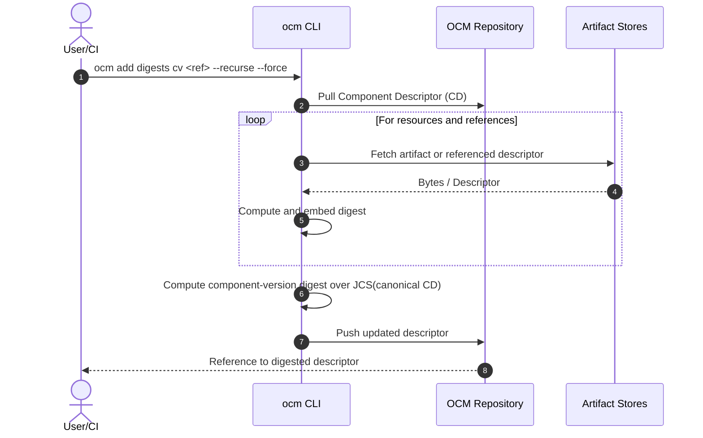
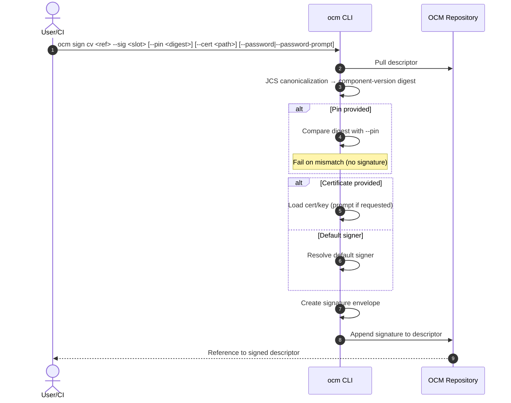

# ADR-0008: Digest Calculation & Signing/Pinning

- **Status:** Proposed
- **Deciders:** OCM Maintainers
- **Date:** 2025-08-26
- **Related:** ocm-spec “Signing” and examples, incl. *Component-Version With Reference*; CLI signing docs

---

## Context

Component Descriptors (CDs) must be signed without altering digest fields during signing. Digests for resources, component references, and the component version are produced in a dedicated step and embedded into the descriptor. Signing uses a fixed canonicalization (JCS, RFC 8785) over the descriptor to compute the component-version digest and create a signature envelope. When a component version references another component version, the digest of the referenced descriptor is embedded in the parent’s `references[]` entry and contributes to the parent’s component-version digest.

---

## Decision

### Two-step flow

1. **Digest calculation** mutates the descriptor to embed required digests (resources, component references, component-version).
2. **Signing** appends a signature envelope without computing or embedding digests.

### Commands (verb–noun, long options only)

```bash
# Step 1 — Digest calculation (mutates descriptor: digests only)
ocm add digests cv <ref> --recurse --force

# Step 2 — Signing (no digest mutation)
ocm sign cv <ref> --sig <slot> --pin <sha256:...> --cert <path> --password <pw> --password-prompt
```

- `<ref>`: addressable descriptor reference (file path or repository reference).
- `--recurse`: calculate digests for referenced component versions.
- `--force`: overwrite existing digest fields.
- `--sig <slot>`: logical signature slot/name, e.g., `mysig@1234`.
- `--pin <sha256:...>`: expected component-version digest; fail on mismatch.
- `--cert <path>`: X.509 certificate (private key resolved by implementation; encrypted keys may require a password).
- `--password <pw>` / `--password-prompt`: key decryption options.

### Normalization

- Canonicalization for component-version digest and signature payload is **JCS (RFC 8785)** via the existing `jcs` package.
- No CLI flag to select a different normalization.

---

## Behavior

### Digest calculation (`ocm add digests cv`)

- Computes and **embeds** digests:
  - **Resources**: content digests.
  - **Component references**: digest of the referenced component descriptor.
  - **Component-version**: digest over the canonicalized descriptor.
- May download artifacts and referenced descriptors as needed.
- Writes the updated descriptor back to `<ref>`.

### Signing (`ocm sign cv`)

- Loads the descriptor from `<ref>`.
- Canonicalizes the descriptor using JCS.
- Computes the component-version digest from those canonical bytes.
- If `--pin` is provided, compares and fails on mismatch (no signature written).
- Creates a signature envelope and appends it under `.signatures[]`.
- Does not compute or embed any digests.

### References

- For each entry in `references[]`, embed the digest of the referenced component descriptor.
- The embedded reference digests are part of the canonicalized parent descriptor and therefore influence the parent’s component-version digest and signature.

---

## Code Design

### Normalization (fixed JCS)

```go
// Using existing package jcs (RFC 8785 canonical JSON)
canon, err := jcs.Normalise(componentDescriptor, nil)
if err != nil { /* handle */ }
```

### Component-version digest

```go
sum := sha256.Sum256(canon)
componentDigest := "sha256:" + hex.EncodeToString(sum[:])
```

### Signature envelope

```go
type SignatureEnvelope struct {
    Name            string
    MediaType       string // application/vnd.ocm.signature.v1+json
    Algorithm       string // rsa-pss-sha256, ecdsa-p256-sha256, ed25519, ...
    Value           []byte // signature over canonical bytes
    CertChainPEM    []byte
    KeyID           string
    NormalizationID string // "jcs/rfc8785"
    ComponentDigest string // e.g., "sha256:..."
}
```

### Signing orchestration (sketch)

```go
cd := must(loadDescriptor(ref))
canon := must(jcs.Normalise(cd, nil))
comp := sha256sum(canon)

if pin != "" && pin != comp { return ErrPinMismatch }

signer := resolveSigner(certPath, password, passwordPrompt) // default or cert-based
env := must(signer.Sign(canon))
env.Name = slot
env.NormalizationID = "jcs/rfc8785"
env.ComponentDigest = comp

must(storeSignature(ref, env))
```

---

## Sequence Diagrams

### Digest calculation



### Signing



---

## Examples Alignment

- **Signing with certificates** and CA-backed chains is supported by passing `--cert` and optional password flags. The signature name is set via `--sig`. The flow conforms to the published signing walkthroughs and examples. [Ref] citeturn6search0
- **Component-Version With Reference**: the parent embeds the digest of referenced component versions and signs the canonicalized descriptor that includes those digests. [Ref] citeturn1view1

---

## Security

- Use `--pin` to ensure the descriptor being signed matches the expected component-version digest in cross-environment workflows.
- Prefer `--password-prompt` or secret management over inline `--password`.
