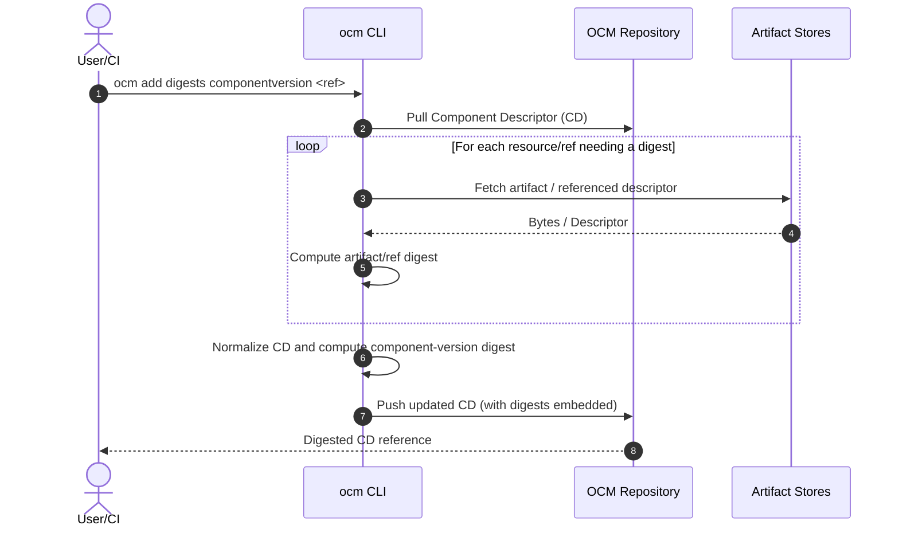
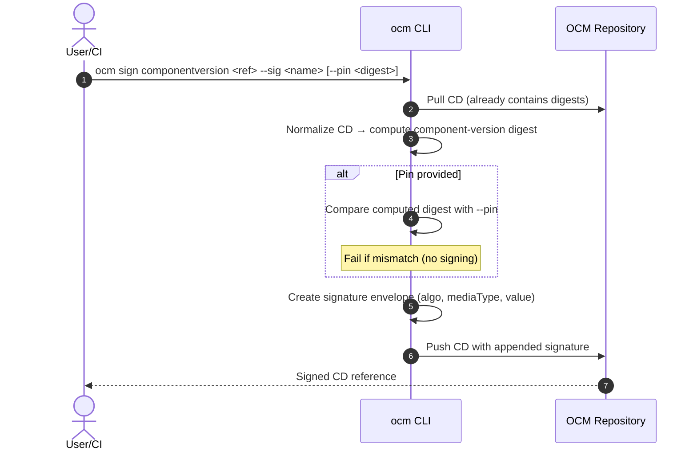

# ADR-0009: Signing & Pinning of Component Descriptors

* **Status**: Proposed
* **Deciders**: OCM Maintainers
* **Date**: 2025-08-21
* **Supersedes**: parts of ADR-0008 (Signing & Verification Handler)
* **Related**: ADR-0010 (Digest Calculation), Issue #579, PR #547

---

## Context

Recent discussions clarified that **signing must not modify a Component Descriptor (CD)** by calculating or mutating digest fields during the signing operation. We also want to avoid a costly double roundtrip (re-downloading artifacts) at sign time merely to re-validate that previously embedded digests are correct.

Therefore we split responsibilities into two steps:

1. **Digest calculation** is an explicit, separate operation that computes all required digests and embeds them into the descriptor.
2. **Signing** operates on a descriptor that already contains digests and **optionally pins** the expected **component-version digest** to avoid re-fetching artifacts.

This ADR focuses on **signing & pinning**. Digest calculation is defined in a companion ADR (ADR-0010) and referenced here.

---

## Decision

### 1) Signing operates on pre-digested descriptors

* `ocm sign componentversion` **MUST NOT** compute or mutate digests of resources, component references, or the CD itself.
* The descriptor **must already contain** the digests (inserted via `ocm add digests` or equivalent tooling).
* Signing merely:
1. Reads the descriptor (by reference or file),
2. Normalizes it,
3. Computes the **component-version digest** from normalized bytes (without fetching artifacts),
4. (Optionally) checks that digest against a **pin** provided by the user,
5. Creates and attaches the cryptographic signature envelope under `.signatures`.

### 2) Optional digest pinning to avoid double roundtrip

* Add `--pin <digest>` to `ocm sign componentversion`.
    * If set, the CLI compares the locally computed **component-version digest** to the given pin **before signing** and **fails** on mismatch.
    * Pinning is **optional** and intended for cross-environment use (e.g., signing a descriptor produced elsewhere). In a single CI pipeline where `ocm add digests` precedes `ocm sign`, the pin can be omitted.

### 3) UX/CLI shape (focus: sign)

```bash
# recommended two-step flow
ocm add digests componentversion <ref> [--recurse] [--normalization <id>] [--force]

# sign without re-downloading artifacts; optionally pin the expected component digest
ocm sign componentversion <ref> \
    --sig <name> \
        [--signer <id-or-config>] \
            [--pin <sha256:...>] \
                [--normalization <id>]  # must match the normalization used to compute the digest
```

* `--normalization` is required when ambiguity exists; otherwise default per config/spec.
* Signature material is resolved from `.ocmconfig` by `--signer` (private key, algorithm, media type, etc.).

---

## Rationale

* **No mutation at sign time** keeps responsibilities clear and prevents hidden network work.
* **Pinning** gives integrity assurances without forcing the signer to re-fetch artifacts to re-validate embedded digests.
* **Determinism**: The digest used for the signature is derived solely from the descriptor bytes and chosen normalization, enabling reproducible signatures.

---

## Consequences

* **Pros**
    * Clear separation of concerns (digest vs. sign).
    * Faster signing (no artifact downloads at sign time).
    * Better CI ergonomics; pinning protects against TOCTOU/"descriptor drift" across environments.

* **Cons**
    * Requires an explicit digesting step in pipelines.
    * If descriptors are tampered with between `add digests` and `sign`, signing fails only when `--pin` is used. Without `--pin`, the signer still signs but verification may fail later.

* **Mitigations**
    * Recommend `--pin` for cross-env signing.
    * Store and transport the digest alongside the CD (artifact metadata, CI outputs, SBOM annotations, etc.).

---

## Open Questions / Follow-ups

* **Spec evolution**: Consider separating digest and signature fields in a future spec release (target: 2026.2), to make the two-phase nature explicit and reduce ambiguity.
* **Policy**: Whether to make `--pin` mandatory when signing remote descriptors (policy-level decision, not CLI default).
* **Multiple normalizations**: Guidance for workflows that pre-compute digests with different normalization algorithms.

---

## Two-step Flow — Sequence Diagrams

### A) `ocm add digests` (produces a pre-digested descriptor)



### B) `ocm sign componentversion` (no digest mutation; optional pin)



---

## Migration & Rollout

1. Introduce `ocm add digests` with clear defaults and documentation.
2. Add `--pin` to `ocm sign componentversion`.
3. Update docs, examples, and CI templates to recommend the two-step flow.

---

## Alternatives Considered

* **Compute digests during signing** (previous behavior): rejected to avoid hidden network I/O, mutation during signing, and poor separation of concerns.

---

## Reference

* PR #547 — original ADR draft for signing/verification handlers.
* Issue #579 — tracking signing/verification ADR work.

---

# ADR-0010: Digest Calculation (Companion)

* **Status**: Proposed
* **Deciders**: OCM Maintainers
* **Date**: 2025-08-21
* **Related**: ADR-0009 (Signing & Pinning)

---

## Summary

Provide an explicit command `ocm add digests` that:

* Computes and embeds digests for:
* all **resources** (artifact digests),
* **component references** (referenced CD digests),
* the **component-version digest** over the normalized CD.
* Writes the updated descriptor back to the repository (or file) without adding signatures.

### CLI (digest phase)

```bash
ocm add digests componentversion <ref> \
    [--recurse]               # compute digests for referenced components
    [--normalization <id>]    # normalization used for CD digest
        [--force]                 # overwrite existing digest fields
        [--dry-run]               # compute and print, do not persist
```

### Guarantees

* All digest values are computed from the actual content at the time of execution.
* Normalization used is recorded such that `ocm sign` can reproduce the same component-version digest without re-downloading artifacts.

### Non-goals

* No signature creation or verification.
* No policy decisions about which digests are mandatory — that remains in spec/docs.

---

## Interplay with Signing

* `ocm sign` consumes the descriptor produced here.
* When `--pin` is used, the value should be the **component-version digest** produced by this step.

---

## Notes for Implementers

* Reuse existing normalization and hashing utilities.
* Minimize repository roundtrips via batching and streaming where possible.
* Ensure deterministic ordering and serialization to keep digests stable across environments.
