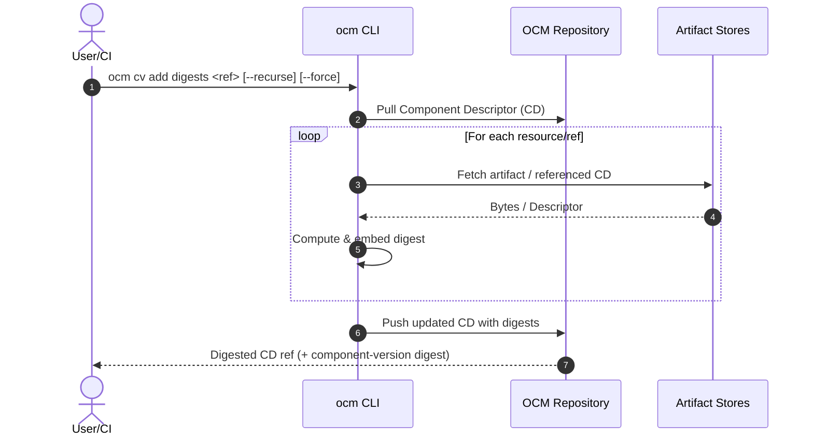
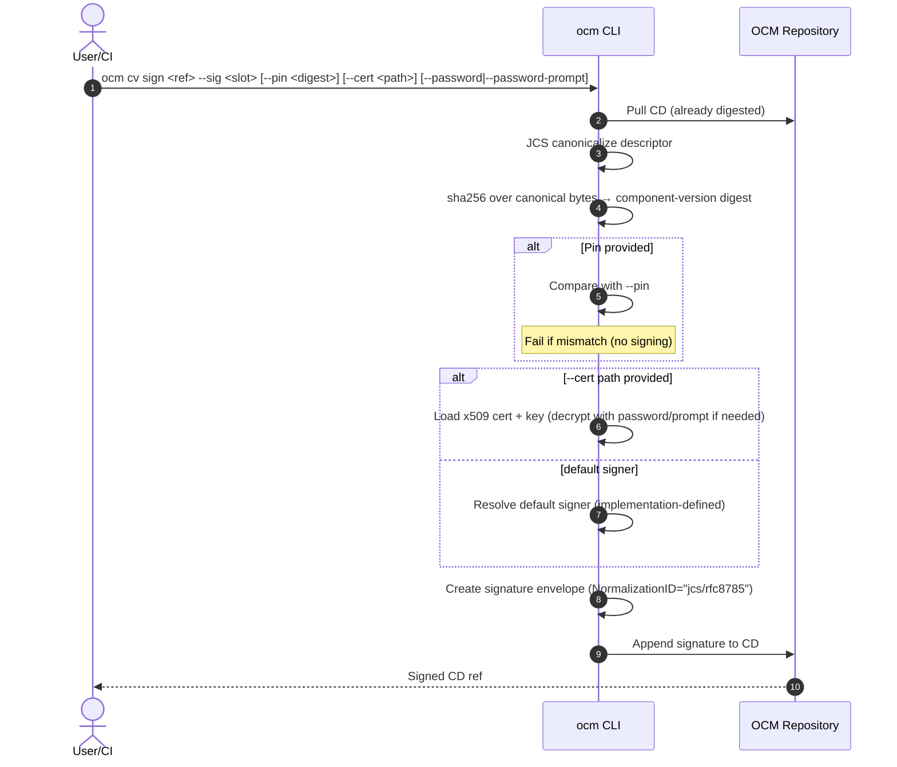

# ADR-0008: Digest Calculation & Signing/Pinning (Unified, Two-Command, Long Options, Fixed JCS Normalization, No stdin)

- **Status:** Proposed  
- **Deciders:** OCM Maintainers  
- **Date:** 2025‑08‑25  
- **Relates to:** Issue #579, PR #547  
- **Supersedes:** earlier ADR‑0008 semantics where `sign` performed digest work or allowed normalization selection

> **Key decisions**
> - **Two explicit steps**: digesting and signing are separate commands (`ocm cv add digests` and `ocm cv sign`).  
> - **No mutation during signing**: `ocm cv sign` MUST NOT compute or embed digests.  
> - **Optional pinning** of the *component‑version digest* on `ocm cv sign`.  
> - **Normalization is fixed to JCS (RFC 8785)** via existing `jcs` package — **no CLI flag** to change it.  
> - **Noun‑first CLI** (`ocm cv <verb>`) and **long options only**.  
> - **No stdin**: `<ref>` must be an addressable descriptor reference (file or repo ref).

---

## 1) Commands

### 1.1 Digest Calculation — **mutates descriptor (digests only)**

```bash
ocm cv add digests <ref> [--recurse] [--force]
```

- `--recurse` — compute digests for referenced components (optional).  
- `--force` — overwrite existing digests.

### 1.2 Signing & Pinning — **no digest mutation**

```bash
ocm cv sign <ref> --sig <slot> [--pin <sha256:...>] [--cert <path>] [--password <pw>] [--password-prompt]
```

- `--sig <slot>` — logical signature slot/name (e.g., `mysig@1234`).  
- `--pin <digest>` — expected **component‑version digest**; **fail** if mismatch (no signature written).  
- `--cert <path>` — use the given **x509** certificate + matching private key (PEM/PKCS#8/P12; exact formats per implementation).  
- `--password <pw>` — password for encrypted key/cert (prefer CI secrets or prompt).  
- `--password-prompt` — interactively prompt for a password (TTY).

> There is **no profile/provider flag** in this ADR. Implementations MAY resolve a **default signer** when `--cert` is absent, but selection is not exposed via CLI flags here.

---

## 2) Behavior

- `ocm cv add digests` may download artifacts/refs and **embeds** resource/ref/CD digests into the descriptor.  
- `ocm cv sign` **does not** fetch artifacts or modify digests. It:
  1. Loads the descriptor from `<ref>`.
  2. Canonicalizes it using **JCS (RFC 8785)** via the existing `jcs` package.
  3. Computes the **component‑version digest** as `sha256(JCS(cvd-bytes))`.
  4. If `--pin` is present, compares and **fails** on mismatch (no signature written).
  5. Creates a signature **envelope** and appends it under `.signatures[]`.

---

## 3) Code Design (aligned to existing `jcs` package)

### 3.1 Normalization (fixed JCS)

Normalization is **not configurable** at runtime. We use the already implemented JCS normalizer:

```go
// Using your existing package:
import "your/module/path/jcs"

// compute canonical bytes (optionally with OCM-specific transformation rules)
normalized, err := jcs.Normalise(componentDescriptor, rules) // RFC 8785 canonical JSON
if err != nil { /* handle */ }
```

### 3.2 Component-Version Digest

```go
import "crypto/sha256"
import "encoding/hex"

func ComponentVersionDigest(canon []byte) string {
    sum := sha256.Sum256(canon)
    return "sha256:" + hex.EncodeToString(sum[:])
}
```

### 3.3 Signature Envelope & Interfaces

```go
package signing

type SignatureEnvelope struct {
    Name            string
    MediaType       string // application/vnd.ocm.signature.v1+json
    Algorithm       string // rsa-pss-sha256, ecdsa-p256-sha256, ed25519, ...
    Value           []byte
    CertChainPEM    []byte
    KeyID           string

    // For reproducibility and verification:
    NormalizationID string // always "jcs/rfc8785"
    ComponentDigest string // e.g., "sha256:..."
}

type Signer interface {
    ID() string
    Sign(ctx context.Context, payload []byte) (SignatureEnvelope, error)
}

type Verifier interface {
    ID() string
    Verify(ctx context.Context, payload []byte, env SignatureEnvelope) error
}
```

### 3.4 Descriptor Access & Signature Store

```go
type DescriptorAccess interface {
    Load(ctx context.Context, ref string) (*ComponentDescriptor, error)
    Save(ctx context.Context, ref string, cd *ComponentDescriptor) error
}

type SignatureStore interface {
    List(ctx context.Context, ref string) ([]signing.SignatureEnvelope, error)
    Put(ctx context.Context, ref string, env signing.SignatureEnvelope) error // append/upsert
}
```

### 3.5 Orchestration (cv sign) — Pseudocode

```go
func CVSign(ctx context.Context, ref string, slot string,
    pin string, certPath string, password string, promptPw bool,
    io DescriptorAccess, store SignatureStore,
    buildDefaultSigner func() (signing.Signer, error),
    buildCertSigner func(path, pw string) (signing.Signer, error)) error {

    cd := must(io.Load(ctx, ref))

    // 1) Fixed normalization: JCS
    canon := must(jcs.Normalise(cd, /* OCM rules */ nil))

    // 2) Compute component-version digest
    comp := ComponentVersionDigest(canon)

    // 3) Optional pin check
    if pin != "" && pin != comp { return ErrPinMismatch }

    // 4) Resolve signer
    var signer signing.Signer
    if certPath != "" {
        if password == "" && promptPw {
            password = promptPassword("Certificate password: ")
        }
        signer = must(buildCertSigner(certPath, password))
    } else {
        signer = must(buildDefaultSigner())
    }

    // 5) Create envelope
    env := must(signer.Sign(ctx, canon))
    env.Name = slot
    env.NormalizationID = "jcs/rfc8785"
    env.ComponentDigest = comp

    // 6) Persist signature
    return store.Put(ctx, ref, env)
}
```

---

## 4) Sequence Diagrams (no stdin)

### 4.1 `ocm cv add digests`



### 4.2 `ocm cv sign`



---

## 5) Examples (no stdin)

```bash
# Step 1: embed digests
ocm cv add digests ghcr.io/org/app:1.2.3 --recurse --force

# Step 2a: sign with default signer (no cert flag)
ocm cv sign ghcr.io/org/app:1.2.3 --sig release@2025-08-25

# Step 2b: sign with explicit certificate (prompt for password)
ocm cv sign ghcr.io/org/app:1.2.3 --sig rel@1 --cert ~/.keys/release.p12 --password-prompt

# Step 2c: sign with explicit certificate (CI: password via env substitution + pin)
ocm cv sign ghcr.io/org/app:1.2.3 --sig rel@1 --cert ~/.keys/release.pem --password "$X509_PASS" --pin "$(cat comp.digest)"
```

---

## 6) Security Notes

- Prefer `--password-prompt` or CI secret envs over inline `--password` values.  
- Use `--pin` across environments to prevent signing drifted descriptors.  
- Envelope includes `NormalizationID="jcs/rfc8785"` and the `ComponentDigest` to support reproducibility.

---

**End of ADR‑0008 (Unified, JCS, No stdin)**
