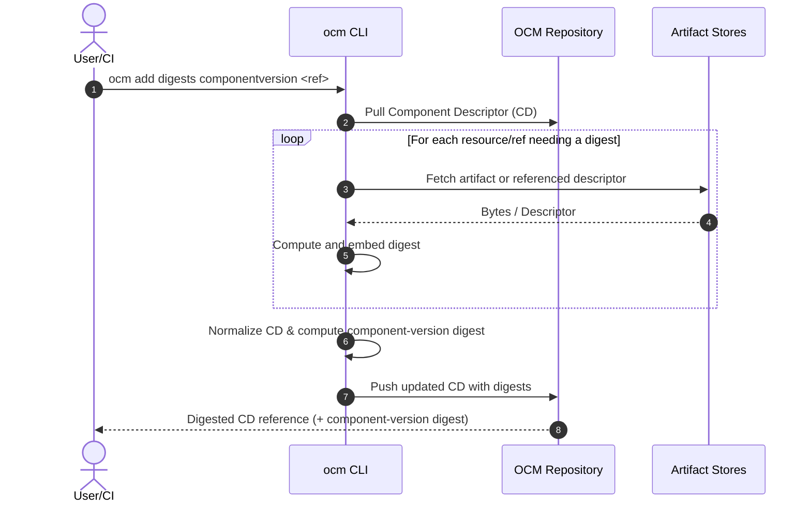
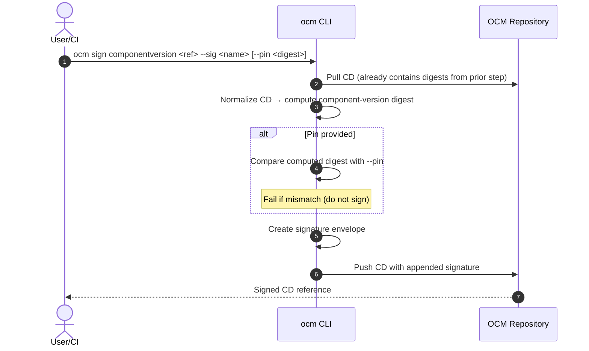

# ADR-0008: Signing & Pinning (with Code Design) — split from Digest Calculation

- **Status:** Proposed
- **Deciders:** OCM Maintainers
- **Date:** 2025‑08‑22
- **Relates to:** Issue #579, PR #547 (successor), *Companion:* ADR‑0009 “Digest Calculation”

> **Meeting outcomes applied**
> - **Signing must not modify** the Component Descriptor (CD).
> - **Digesting and signing are separate steps.**
> - Introduce **optional pinning** of the *component-version digest* during `sign` to avoid redownloading artifacts for re‑validation.
> - Consider **separating digest and signature fields** in a future spec (target 2026.2).

---

## 1) Context & Problem

Historically, the ADR 0008 draft bundled digest calculation and signing logic in a single conceptual “handler,” which led to ambiguous responsibilities and hidden network I/O during `sign`. It also complicated reproducibility and CI ergonomics.

We are **splitting** the flow into two steps:

1. **ADR‑0009: Digest Calculation** (`ocm add digests`): computes and **embeds** digests for resources, component references and the component version.
2. **ADR‑0008: Signing & Pinning** (`ocm sign componentversion`): **does not** compute/mutate digests; signs normalized descriptor bytes and **optionally** checks a *pin* (expected component‑version digest).

This document **focuses on step 2** and **re‑introduces the code‑level design** from the old ADR, adapted to the new split.

---

## 2) Decision

### 2.1 Behavior

- `ocm sign componentversion` **MUST NOT** compute or mutate digests.
- Signing works on the descriptor bytes as pulled (file/ref).
- The **component‑version digest** is computed from **normalized descriptor bytes** (local, no artifact fetch).
- If `--pin <digest>` is provided, the computed digest **MUST equal** the pin; otherwise the command **fails** with `ErrPinMismatch`.
- The resulting signature is stored as a **signature envelope** in `.signatures[ ]` without changing any digest fields.

### 2.2 CLI (shape)

```bash
# Step 1 (in companion ADR‑0009): pre‑digest
ocm add digests componentversion <ref> \
    [--recurse] [--normalization <id>] [--force]

# Step 2: sign (no digest mutation)
```bash
ocm sign componentversion <ref> \
    --sig <name> \
    [--pin <sha256:...>] \
    [--signer <id-or-config>] \
    [--normalization <id>] \
    [--cert <path> --key <path>] \
    [--issuer <path|ref>]
```

### 2.3 Rationale

- **Separation of concerns** → faster, deterministic signing; no hidden network.
- **Optional pin** → cross‑env integrity without forcing artifact fetch in `sign`.
- **Determinism** → signatures cover a stable, normalized byte sequence.

---

## 3) Code Design (carried over & adapted)

> The old ADR specified a plugin/handler approach with clear Go interfaces. We **retain** those ideas but **split** them into two extension points: `DigestCalculator` (ADR‑0009) and `Signer/Verifier` (this ADR).

### 3.1 Key Types

```go
// Package signing provides core signature types and operations.
package signing

// SignatureEnvelope captures everything needed to verify a signature later.
type SignatureEnvelope struct {
// Logical slot/name of this signature in the descriptor (e.g. "mysig@1234").
Name        string

// Media type of the envelope payload (e.g. application/vnd.ocm.signature.v1+json).
MediaType   string

// Algorithm identifier (e.g. "rsa-pss-sha256", "ecdsa-p256-sha256").
Algorithm   string

// Raw signature over the normalized descriptor bytes (or a canonical payload).
Value       []byte

// Optional X.509 certificate chain (PEM) or public key material.
CertChainPEM []byte
KeyID       string // optional, helpful for key rotation/selection

// Normalization & digest context to make verification reproducible.
NormalizationID string // e.g. "ocm/v1"
ComponentDigest string // e.g. "sha256:..." (the digest we signed over)
}
```

```go
// Normalization abstracts how a descriptor is canonicalized to bytes.
package normalization

type ID string

type Normalizer interface {
ID() ID
// Normalize produces deterministic bytes of the component descriptor.
Normalize(cd *ComponentDescriptor) ([]byte, error)
}
```

```go
// Component digester computes the component-version digest from normalized bytes.
package digest

type Algorithm string // e.g. "sha256"

type ComponentDigester interface {
Digest(normalized []byte, algo Algorithm) (string /*"sha256:..."*/, error)
}
```

### 3.2 Signing & Verification Interfaces

```go
// Signer signs a byte payload (normalized descriptor bytes).
type Signer interface {
ID() string
Sign(ctx context.Context, payload []byte) (SignatureEnvelope, error)
}

// Verifier validates a SignatureEnvelope against the given payload.
type Verifier interface {
ID() string
Verify(ctx context.Context, payload []byte, env SignatureEnvelope) error
}
```

> **Adaptation from the old ADR:** What was a monolithic “Signing/Verification Handler” is now expressed as **two small interfaces**. Implementations (plugins) are responsible for algorithms/keys/certs, while the CLI orchestrates normalization and (optional) pin comparison.

### 3.3 Signature Store abstraction

```go
// SignatureStore persists signatures into/out of a descriptor.
type SignatureStore interface {
// Read existing signatures from a descriptor reference or file.
List(ctx context.Context, ref string) ([]signing.SignatureEnvelope, error)

// Append (or upsert) a signature envelope into the descriptor.
Put(ctx context.Context, ref string, env signing.SignatureEnvelope) error
}
```

> **Note:** For current OCM descriptors, `.signatures` is the canonical location. If the future spec separates digest and signature fields, `SignatureStore` remains the single place to adapt persistence without changing signer/verifier logic.

### 3.4 Plugin Registry

```go
// A simple plugin registry decouples discovery from usage.
type SignerFactory func(cfg any) (Signer, error)
type VerifierFactory func(cfg any) (Verifier, error)

type Registry interface {
RegisterSigner(id string, f SignerFactory)
RegisterVerifier(id string, f VerifierFactory)

GetSigner(id string) (SignerFactory, bool)
GetVerifier(id string) (VerifierFactory, bool)
}
```

- Plugins register in `init()` or via explicit `registry.Register*`.
- The CLI resolves `--signer <id-or-config>` to a `(Signer, Verifier)` pair.
- Backends can be HSM, KMS, file‑based keys, certificate‑based, etc.

### 3.5 Orchestration Flow (sign)

```go
func SignComponentVersion(ctx context.Context, ref, sigName string, pin string,
reg Registry, store SignatureStore,
normalizer normalization.Normalizer,
digester digest.ComponentDigester,
signerID string, signerCfg any) error {

cd, err := loadDescriptor(ref) // no artifact fetch
if err != nil { return err }

normBytes, err := normalizer.Normalize(cd)
if err != nil { return err }

compDigest, err := digester.Digest(normBytes, "sha256")
if err != nil { return err }

if pin != "" && pin != compDigest {
return ErrPinMismatch{Expected: pin, Actual: compDigest}
}

sF, ok := reg.GetSigner(signerID)
if !ok { return fmt.Errorf("unknown signer: %s", signerID) }

s, err := sF(signerCfg)
if err != nil { return err }

env, err := s.Sign(ctx, normBytes)
if err != nil { return err }

env.Name = sigName
env.NormalizationID = string(normalizer.ID())
env.ComponentDigest = compDigest

return store.Put(ctx, ref, env) // append without mutating digest fields
}
```

### 3.6 Verification Flow (unchanged in spirit)

```go
func VerifyComponentVersion(ctx context.Context, ref, sigName string,
reg Registry, store SignatureStore,
normalizer normalization.Normalizer,
verifierID string, verifierCfg any) error {

cd, err := loadDescriptor(ref)
if err != nil { return err }

env, err := findSignature(store, ref, sigName)
if err != nil { return err }

// Ensure we're using the same normalization that the signature recorded.
if env.NormalizationID != string(normalizer.ID()) {
return fmt.Errorf("normalization mismatch: have %s, want %s",
normalizer.ID(), env.NormalizationID)
}

normBytes, err := normalizer.Normalize(cd)
if err != nil { return err }

vF, ok := reg.GetVerifier(verifierID)
if !ok { return fmt.Errorf("unknown verifier: %s", verifierID) }

v, err := vF(verifierCfg)
if err != nil { return err }

return v.Verify(ctx, normBytes, env)
}
```

### 3.7 Error Semantics

```go
var (
ErrPinMismatch            = errors.New("pin mismatch")
ErrUnknownSigner          = errors.New("unknown signer")
ErrUnknownVerifier        = errors.New("unknown verifier")
ErrNormalizationMismatch  = errors.New("normalization mismatch")
)
```

- **Pin mismatch** → *fail fast* (no signature stored).
- **No digests present** in the descriptor does **not** block `sign` (by design). The pin is the guard if required by policy.
- Policy (e.g., “require pin for remote refs”) can be enforced in CLI or by an admission webhook.

### 3.8 Envelope Media Types & Algorithms

- Media type default: `application/vnd.ocm.signature.v1+json` (extensible).
- Algorithms: `rsa-pss-sha256`, `ecdsa-p256-sha256`, `ed25519`.
- Certificate chains optional; when present, verification may require trust anchors/issuer policy.

> **Compatibility:** The envelope structure keeps parity with the old ADR while adding `NormalizationID` and `ComponentDigest` to make verification reproducible across environments.

---

## 4) Sequence Diagrams (two‑step flow)

### 4.1 `ocm add digests` (companion step — no signing)



### 4.2 `ocm sign componentversion` (no digest mutation; optional pin)



---

## 5) Backwards Compatibility

- Existing verifier implementations continue to work (payload still normalized bytes).
- Monolithic “handler” plugins can be refactored to expose both `Signer/Verifier` and `DigestCalculator` factories.
- No change to how `.signatures` is embedded today; if future spec separates locations, only `SignatureStore` needs changes.

---

## 6) Migration Plan

1. Implement `DigestCalculator` (ADR‑0009) and `ocm add digests`.
2. Introduce `--pin` in `ocm sign componentversion` and wire the registry/envelope fields.
3. Update docs & CI templates:
- Pipelines: `add digests` → publish component digest → `sign [--pin <digest>]`.
- Recommend `--pin` for cross‑environment signing.

---

## 7) Open Points

- Spec refactor for digest vs. signature locations (target 2026.2).
- Normalization IDs registry and migration strategy if defaults change.
- Policy hooks (e.g., “require pin if source is remote”).

---

# ADR‑0009 (Companion): Digest Calculation

> This section is included here for convenience; formal text lives in ADR‑0009 in the repo.

## Summary

Provide `ocm add digests` that computes and **embeds** digests for:

- **Resources** (artifact digests)
- **Component references** (referenced descriptor digests)
- **Component‑version digest** (over normalized descriptor)

### Interfaces (digest side)

```go
package digest

type Calculator interface {
// Calculates all required digests and mutates the in‑memory descriptor.
CalculateAll(ctx context.Context, cd *ComponentDescriptor, opts Options) error
}

type Options struct {
Recurse        bool
Normalization  normalization.ID // used to compute component‑version digest
Force          bool             // overwrite existing digest fields
}
```

### CLI shape

```bash
ocm add digests componentversion <ref> \
    [--recurse] \
    [--normalization <id>] \
    [--force] \
    [--dry-run]
```

### Guarantees

- Digests reflect actual content at calculation time.
- Normalization used is recorded so `sign` can reproduce the component‑version digest without artifact downloads.

### Non‑Goals

- No signature creation or verification.

---

## Appendix A — Example Signer (file‑key, Ed25519)

```go
type fileSigner struct {
key ed25519.PrivateKey
}

func (s *fileSigner) ID() string { return "file-ed25519" }

func (s *fileSigner) Sign(ctx context.Context, payload []byte) (signing.SignatureEnvelope, error) {
sig := ed25519.Sign(s.key, payload)
return signing.SignatureEnvelope{
MediaType:       "application/vnd.ocm.signature.v1+json",
Algorithm:       "ed25519",
Value:           sig,
CertChainPEM:    nil,
KeyID:           "",
NormalizationID: "ocm/v1",
// ComponentDigest is filled by the orchestrator
}, nil
}
```

## Appendix B — Error & Policy Examples

- `ErrPinMismatch`: returned **before** writing any signature.
- Policy hook: in CI templates, make `--pin` mandatory for non‑local refs.
- Admission policy: reject signed descriptors with unknown `NormalizationID`.
