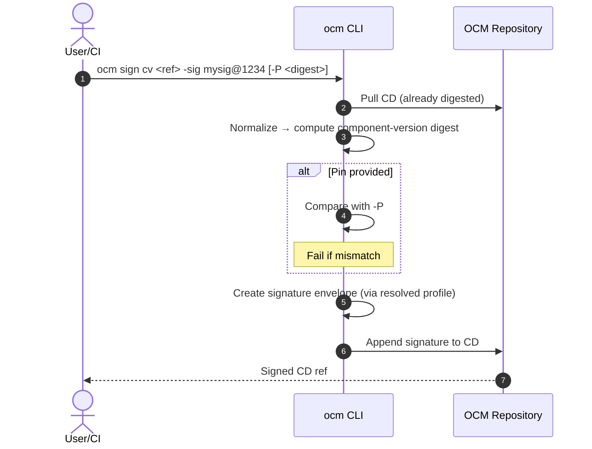

# ADR-0008: Digest Calculation, Signing & Pinning (Unified, Simplified CLI)

- **Status:** Proposed  
- **Deciders:** OCM Maintainers  
- **Date:** 2025‑08‑25  
- **Relates to:** Issue #579, PR #547 (successor of earlier draft)  
- **Supersedes:** previous ADR‑0008 semantics where `sign` mutated digests

> **Meeting outcomes integrated**
> - **Do not modify** the Component Descriptor (CD) during **signing**.  
> - **Digesting** and **signing** are **two distinct steps**.  
> - Add **optional pinning** of the *component‑version digest*.  
> - Consider separating digest/signature fields in a future spec (target **2026.2**).

---

## 1) Summary

We keep digesting and signing as two runtime steps, but we **simplify the CLI** so common cases need **one or two short flags**. Advanced behavior is handled by **profiles** in config, not via long flag lists.

---

## 2) CLI (final shape)

### 2.1 Digest Calculation

```bash
# Mutates the descriptor to embed resource/ref/CD digests
ocm add digests cv <ref> [-R] [-N <id>] [-f]
# stdin supported:
cat cd.yaml | ocm add digests cv - -N ocm/v1
```

- `-R/--recurse`: compute digests for referenced components
- `-N/--normalization <id>`: normalization to use for component-version digest
- `-f/--force`: overwrite existing digests

### 2.2 Signing & Pinning (minimal UX)

```bash
# Minimal forms (pick ONE of -sig or -cert or -profile)
ocm sign cv <ref> -sig <slot>            # uses default signer profile from config
ocm sign cv <ref> -cert <cert.pem>       # x509 cert + key resolved by profile or defaults
ocm sign cv <ref> -profile <name>        # preconfigured signer (gpg, keychain, pkcs11, kms)

# Optional extras when needed:
ocm sign cv <ref> [-P <sha256:...>] [-N <id>]
```

- `-sig/--sig <slot>`: logical signature slot/name, e.g. `mysig@1234`
- `-cert/--cert <path>`: x509 certificate file (private key resolved via profile/defaults)
- `-profile/--profile <name>`: use a named signer profile from config (gpg, keychain, KMS/HSM, etc.)
- `-P/--pin <digest>`: expected **component-version digest** (fail if mismatch)
- `-N/--normalization <id>`: override normalization (defaults from config)

**Stdin:** `ocm sign cv - -sig release@main` signs a descriptor from stdin.

> Rationale: Common cases become `sign cv <ref> -sig <slot>` or `sign cv <ref> -cert cert.pem`. Everything else is discovered from **profiles** in config (see §4).

---

## 3) Behavior

- **No digest mutation during `sign`**.  
- `sign cv` normalizes the descriptor, computes the **component-version digest** locally, compares with `-P` if provided, then appends a **signature envelope** under `.signatures[]`.
- `add digests cv` may fetch artifacts/refs and **mutates only digest fields**.

---

## 4) Configuration: Profiles & Credential Resolution

All advanced signer details live in config (e.g., `~/.ocmconfig`), keeping the CLI clean.

### 4.1 Config Schema (excerpt; YAML)

```yaml
signing:
  default_profile: "local-ed25519"
  normalization: "ocm/v1"

  profiles:
    # File-based ED25519 example
    local-ed25519:
      type: "ed25519-file"
      key_path: "~/.keys/ed25519.key"

    # x509 PEM pair example
    release-x509:
      type: "x509-pem"
      cert_path: "~/.keys/release.crt"
      key_path: "~/.keys/release.key"
      key_pass_env: "X509_KEY_PASS"   # optional

    # GPG example (hardened key via gpg-agent)
    maint-gpg:
      type: "gpg"
      fingerprint: "ABCD1234EF56..."
      require_agent: true

    # macOS Keychain (or OS key store)
    mac-keychain:
      type: "keychain"
      label: "OCM Release Key"
      key_id: "OCM_RELEASE_2025"

    # PKCS#11 / HSM
    hsm-slot1:
      type: "pkcs11"
      module_path: "/usr/local/lib/softhsm/libsofthsm2.so"
      token_label: "OCM-HSM"
      key_label: "release-key"
      pin_env: "PKCS11_PIN"

    # Cloud KMS (examples)
    gcp-kms:
      type: "kms-gcp"
      resource: "projects/p/locations/l/keyRings/r/cryptoKeys/k/cryptoKeyVersions/1"
    aws-kms:
      type: "kms-aws"
      key_arn: "arn:aws:kms:region:acct:key/uuid"
```

### 4.2 Resolution Order

1. **Flags** (`-profile`, `-cert`, `-sig`, `-P`, `-N`)  
2. **Profile** (`signing.profiles[<name>]`)  
3. **Defaults** (`signing.default_profile`, `signing.normalization`)  
4. **Environment** (e.g., `X509_KEY_PASS`, `PKCS11_PIN`)  

This keeps the CLI short while still supporting advanced setups.

---

## 5) Code Design (interfaces)

### 5.1 Normalization & Digest

```go
package normalization
type ID string
type Normalizer interface {
    ID() ID
    Normalize(cd *ComponentDescriptor) ([]byte, error)
}

package digest
type Algorithm string // "sha256"
type ComponentDigester interface {
    Digest(normalized []byte, algo Algorithm) (string, error) // "sha256:..."
}
```

### 5.2 Signing

```go
package signing

type SignatureEnvelope struct {
    Name            string
    MediaType       string // application/vnd.ocm.signature.v1+json
    Algorithm       string // rsa-pss-sha256, ecdsa-p256-sha256, ed25519, ...
    Value           []byte
    CertChainPEM    []byte
    KeyID           string
    NormalizationID string
    ComponentDigest string
}

type Signer interface {
    ID() string
    Sign(ctx context.Context, payload []byte) (SignatureEnvelope, error)
}

type Verifier interface {
    ID() string
    Verify(ctx context.Context, payload []byte, env SignatureEnvelope) error
}
```

### 5.3 Credential Providers & Profiles

```go
// Pluggable key material resolution underlying profiles.
type CredentialProvider interface {
    ID() string // "x509-pem", "gpg", "keychain", "pkcs11", "kms-gcp", "kms-aws", ...
    Load(ctx context.Context, cfg any) (Signer, error)
}

// Profile binds a provider type + its config (from ~/.ocmconfig).
type SignerProfile struct {
    Name     string
    Type     string      // maps to a CredentialProvider
    Config   interface{} // provider-specific fields (e.g., cert_path, key_path, fingerprint, ...)
}
```

### 5.4 Orchestration (CLI pseudocode)

```go
func SignCV(ctx, ref string, slot, pin string, profileName string, certPath string,
    reg Registry, io DescriptorAccess, store SignatureStore,
    normID normalization.ID, algo digest.Algorithm) error {

    cd := must(io.Load(ctx, ref))
    norm := must(reg.Normalizer(normID))
    bytes := must(norm.Normalize(cd))
    comp := must(digest.SHA256.Digest(bytes, "sha256"))

    if pin != "" && pin != comp { return ErrPinMismatch }

    signer := resolveSigner(profileName, certPath /* may be empty -> default profile */)
    env := must(signer.Sign(ctx, bytes))

    env.Name = slot
    env.NormalizationID = string(normID)
    env.ComponentDigest = comp

    return store.Put(ctx, ref, env)
}
```

---

## 6) Sequence (unchanged)



---

## 7) Examples

```bash
# simplest: default profile + slot
ocm sign cv ghcr.io/org/app:1.2.3 -sig ci@20250825

# from stdin (cd.yaml produced earlier)
cat cd.yaml | ocm sign cv - -sig release@main

# x509 pem cert (key resolved by profile/defaults or sibling key)
ocm sign cv ghcr.io/org/app:1.2.3 -cert ~/.keys/release.crt -sig rel@1

# hardened GPG key (via profile)
ocm sign cv ghcr.io/org/app:1.2.3 -profile maint-gpg -sig maint@2025 -P "$(cat comp.digest)"

# macOS keychain / HSM / KMS profile
ocm sign cv ghcr.io/org/app:1.2.3 -profile mac-keychain -sig rel@kc
ocm sign cv ghcr.io/org/app:1.2.3 -profile hsm-slot1 -sig rel@hsm
ocm sign cv ghcr.io/org/app:1.2.3 -profile gcp-kms -sig rel@gcp
```

---

## 8) Security & Policy

- **Pinning** recommended for cross‑environment signing.  
- **Profiles** centralize sensitive configuration and enable hardened backends (GPG with agent, HSM/PKCS#11, KMS).  
- Enforce policy (e.g., *require pin for remote refs*) at CLI or admission layers.

---

**End of ADR‑0008 (Unified, Simplified CLI)**
