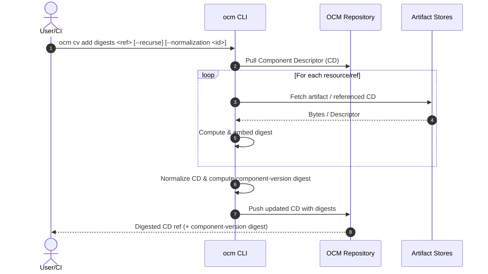
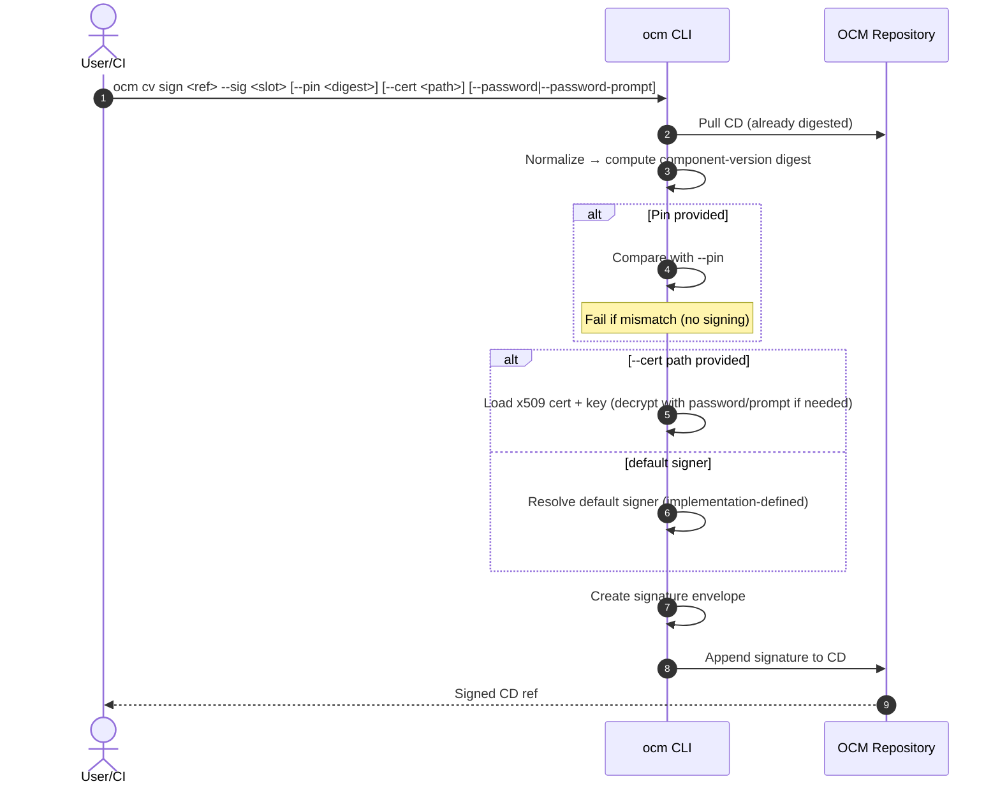

# ADR-0008: Digest Calculation & Signing/Pinning (Unified, Two-Command Flow, Long Options Only, `ocm cv ...`)

- **Status:** Proposed  
- **Deciders:** OCM Maintainers  
- **Date:** 2025‑08‑25  
- **Relates to:** Issue #579, PR #547  
- **Supersedes:** prior ADR‑0008 semantics where `sign` performed digest work

> **Key decisions**
> - **Two explicit steps**: digesting and signing are separate commands.  
> - **No mutation during signing**: `cv sign` MUST NOT compute or embed digests.  
> - **Optional pinning** of the *component‑version digest* on `cv sign`.  
> - Future spec may separate digest vs. signature fields (target 2026.2).  
> - **Consistent CLI order**: **noun‑first** — `ocm cv <verb>`, not mixed with `ocm <verb> cv`.

---

## 1) Commands (noun‑first style)

### 1.1 Digest Calculation — **mutates descriptor (digests only)**

```bash
ocm cv add digests <ref> [--recurse] [--normalization <id>] [--force]
# stdin:
cat cd.yaml | ocm cv add digests - --normalization ocm/v1
```

- `--recurse` — compute digests for referenced components (optional).  
- `--normalization <id>` — normalization used for the **component‑version** digest.  
- `--force` — overwrite existing digests.

### 1.2 Signing & Pinning — **no digest mutation**

```bash
ocm cv sign <ref> --sig <slot> [--pin <sha256:...>] [--normalization <id>] [--cert <path>] [--password <pw>] [--password-prompt]
```

- `--sig <slot>` — logical signature slot/name (e.g., `mysig@1234`).  
- `--pin <digest>` — expected component‑version digest; **fail** if mismatch (no signature written).  
- `--normalization <id>` — override normalization if needed (must match the one used to compute the digest).  
- `--cert <path>` — use the given **x509** certificate + matching private key (PEM/PKCS#8/P12; see implementation notes).  
- `--password <pw>` — password for encrypted key/cert (prefer CI secrets or `--password-prompt`).  
- `--password-prompt` — interactively prompt for a password (TTY).

> There is **no profile/provider flag** in this ADR. Implementations MAY resolve a **default signer** when `--cert` is absent, but that selection is outside the CLI scope here.

---

## 2) Behavior

- `ocm cv add digests` may download artifacts/refs and **embeds** resource/ref/CD digests into the descriptor.  
- `ocm cv sign` **does not** fetch artifacts or modify digests. It:
  1. Loads the descriptor (from `<ref>` or stdin).
  2. Normalizes it to deterministic bytes.
  3. Computes the **component‑version digest** locally.
  4. If `--pin` is present, compares and **fails** on mismatch (no signature written).
  5. Creates a signature **envelope** and appends it under `.signatures[]`.

---

## 3) Code Design (interfaces — adapted from original ADR)

### 3.1 Normalization & Digest

```go
package normalization

type ID string

type Normalizer interface {
    ID() ID
    Normalize(cd *ComponentDescriptor) ([]byte, error)
}
```
```go
package digest

type Algorithm string // e.g., "sha256"

type ComponentDigester interface {
    Digest(normalized []byte, algo Algorithm) (string /*"sha256:..."*/, error)
}
```

### 3.2 Signing

```go
package signing

type SignatureEnvelope struct {
    Name            string
    MediaType       string // application/vnd.ocm.signature.v1+json
    Algorithm       string // rsa-pss-sha256, ecdsa-p256-sha256, ed25519, ...
    Value           []byte
    CertChainPEM    []byte
    KeyID           string
    NormalizationID string
    ComponentDigest string
}

type Signer interface {
    ID() string
    Sign(ctx context.Context, payload []byte) (SignatureEnvelope, error)
}

type Verifier interface {
    ID() string
    Verify(ctx context.Context, payload []byte, env SignatureEnvelope) error
}
```

### 3.3 Descriptor Access & Signature Store

```go
type DescriptorAccess interface {
    Load(ctx context.Context, ref string) (*ComponentDescriptor, error)
    Save(ctx context.Context, ref string, cd *ComponentDescriptor) error
}

type SignatureStore interface {
    List(ctx context.Context, ref string) ([]signing.SignatureEnvelope, error)
    Put(ctx context.Context, ref string, env signing.SignatureEnvelope) error // append/upsert
}
```

### 3.4 Orchestration (cv sign) — Pseudocode

```go
func CVSign(ctx context.Context, ref string, slot string,
    pin string, certPath string, password string, promptPw bool,
    io DescriptorAccess, store SignatureStore,
    normalizer normalization.Normalizer,
    digester digest.ComponentDigester,
    buildDefaultSigner func() (signing.Signer, error),
    buildCertSigner func(path, pw string) (signing.Signer, error)) error {

    cd := must(io.Load(ctx, ref))
    bytes := must(normalizer.Normalize(cd))
    comp := must(digester.Digest(bytes, "sha256"))

    if pin != "" && pin != comp { return ErrPinMismatch }

    var signer signing.Signer
    if certPath != "" {
        if password == "" && promptPw {
            password = promptPassword("Certificate password: ")
        }
        signer = must(buildCertSigner(certPath, password))
    } else {
        signer = must(buildDefaultSigner())
    }

    env := must(signer.Sign(ctx, bytes))
    env.Name = slot
    env.NormalizationID = string(normalizer.ID())
    env.ComponentDigest = comp

    return store.Put(ctx, ref, env)
}
```

---

## 4) Sequence Diagrams

### 4.1 `ocm cv add digests`



### 4.2 `ocm cv sign`



---

## 5) Examples

```bash
# Step 1: embed digests
ocm cv add digests ghcr.io/org/app:1.2.3 --normalization ocm/v1

# Step 2a: sign with default signer (no cert flag)
ocm cv sign ghcr.io/org/app:1.2.3 --sig release@2025-08-25

# Step 2b: sign with explicit certificate (prompt for password)
ocm cv sign ghcr.io/org/app:1.2.3 --sig rel@1 --cert ~/.keys/release.p12 --password-prompt

# Step 2c: sign with explicit certificate (CI: password via env substitution)
ocm cv sign ghcr.io/org/app:1.2.3 --sig rel@1 --cert ~/.keys/release.pem --password "$X509_PASS" --pin "$(cat comp.digest)"
```

---

## 6) Security Notes

- Prefer `--password-prompt` or CI secret envs over inline `--password` values.  
- Use `--pin` across environments to prevent signing drifted descriptors.  
- Changing normalization alters the signed bytes; the envelope stores `NormalizationID` and `ComponentDigest` for reproducibility.

---

**End of ADR‑0008 (Unified, Two‑Command, Long Options Only, noun‑first `ocm cv ...`)**
