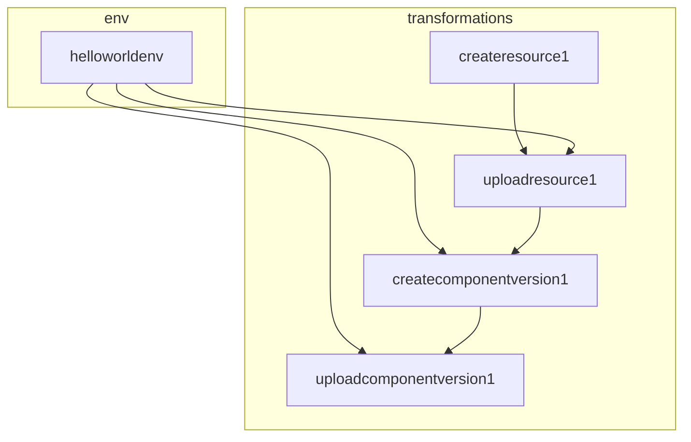

# A OCM Transformation Specification

* **Status**: proposed
* **Deciders**: Gergely Brautigam, Fabian Burth, Jakob Moeller
* **Date**: 2025-10-14

**Technical Story:** Unify the technical foundation of 
[transformation](0005_transformation.md) and 
[component constructors](0006_component_constructors.md).


## Context and Problem Statement

The original transformation specification proposed in the
[transformation ADR](0005_transformation.md) was primarily designed 
for the requirements of **transferring of components and their resources**. 
However, we noticed a significant overlap of the **transfer requirements** with 
the **component constructors** requirements. A detailed comparison of shared 
requirements is provided in [Requirements](#requirements).

With the **transformation specification**, this ADR proposes a unified solution 
for transferring and constructing component versions.

## Value Proposition of the Transformation Specification

### Flexible Composability of Extensible Transformations

The CEL-based expression syntax provides a **unified foundation for all component modifications** in OCM:

- **Uniform Codebase**: Single consistent framework for all transformations, 
  reducing fragmentation and maintenance burden.
- **Plugin Extensibility**: Open type system allows domain-specific 
  transformations without core code changes.
- **Low-Level Primitive Language**: Maps high-level operations (`construct`, 
  `transfer`) to an extensible atomic set of composable transformations.

### Transparency into Transformation Composition

The **serializable specification** enables validation before execution:

- **Static Analysis**: Inspect the complete transformation graph without running anything
- **Pre-Execution Type Checking**: Catch type mismatches at specification time, not runtime
- **Early Failure Detection**: Immediate feedback, especially critical for large multi-component transfers
- **Debug Ability**: Addresses the **core OCM pain point**—opaque transfer 
  failures. Explicit specifications make troubleshooting straightforward with clear visibility into what failed and why.

For complex operations, validating the transformation graph before 
execution is **mission-critical** for operational confidence and efficiency.

### Size of a Transformation Graph
A serializable transformation specification makes complexity and the 
number of atomic transformations involved in an operation such as transfer 
visible and tangible.  
With the legacy ocm cli, we have use cases including:
- **~ 100 components**
- **~ 1500 resources**

In the most basic of transfer use cases (source resource format matches target 
resource format, no resigning required, no custom modifications of upload 
locations, ...),
we have
- download transformation per component version
- upload transformation per component version
and 
- download transformation per resource
- upload transformation per resource

This results in a transformation graph with (100 + 1500) * 2 = **3200 atomic 
transformations**.

> [!NOTE] The serialized version of such a transformation specification is 
> rather large.


## Requirements

The table below lists the requirements shared by the **transfer** and 
**constructor** use cases.

This serves as:
- a rationale for unifying transfer and constructor under a single 
  implementation

### Shared Requirements of Transfer and Constructor Requirements

| Requirement                    | Transfer                                                                                      | Constructor                                                                                               |
|--------------------------------|-----------------------------------------------------------------------------------------------|-----------------------------------------------------------------------------------------------------------|
| Upload of Component Versions   | Upload component versions downloaded from a source repository to a target repository          | Upload constructed component versions to a target repository                                              |
| Download of Component Versions | Download component version from a source repository to be uploaded to a target repository     | Download referenced component versions to be uploaded to a target repository (`--recursive`)              |
| Download resources             | Download resources based on access type specifications                                        | Download resources based on access and input type specifications                                          |
| Upload resources               | Upload resources based on uploader specification                                              | Upload resources based on access and input type specifications                                            |
| Resource format conversion     | Convert resources downloaded based on one access type to be uploaded with another access type | Convert resources based on the requirements of the input type (e.g. helm input type allows upload to oci) |
| Topological graph processing   | Topological order required for hashing, signing and localization                              | Topological order required for hashing                                                                    |
| Parallelization of operations  |                                                                                               |                                                                                                           |

### Conclusion

The functional requirements of both use cases are almost identical - they 
both build on a common set of atomic transformations. The 
difference between the use cases is currently the **user interface**:

- for **ocm transfer component**, the plan is to offer a backwards compatible 
  high-level command (`ocm transfer component`) that generates the 
  transformation specification based on the provided parameters.
- for **ocm add component** (constructor), the established user interface is the
  constructor file.

## Solution Proposal

**Unified Engine**:
We propose to specify a **unified transformation specification** and 
implement a corresponding **unified transformation engine** 
that is powerful enough to model both, **transfer** and **construct**.

**Distinct User Interfaces**:
We propose to keep the existing distinct **user interfaces** of transfer and 
construct. 

- **transfer**: `ocm transfer component ...` with the parameters 
  determining the transfer behavior specified on the command line as option.
- **construct**: `ocm add component ...` with the parameters 
  determining the construction behavior specified in the constructor file.

**Intermediate Mapping Layer**:
Both commands will generate a transformation specification based on their 
respective input parameters (command line options or constructor file). 

**The proposed solution will not affect the user interfaces**.

**Additional Command**: We also propose to add a command and options that 
allow to 
directly interact with and execute a transformation specification file:

- `ocm transform --file <transformation-spec.yaml>`: 
  This command will directly take a transformation specification file and 
  execute it using the unified transformation engine.
- `--dry-run` option for `ocm transfer component` and 
  `ocm add component` commands to output the generated transformation 
  specification without executing it.

### High-Level Solution Diagram


## Transformation Specification

The following code snippet outlines a sample transformation specification.
It is not intended to be complete. It is brief, contains explanatory comments 
and serves to illustrate the general structure and concept of transformations.

Detailed samples for specific use cases are provided in [Mapping From 
Constructor to Transformation Specification](#mapping-from-constructor-to-transformation-specification) and [Mapping 
From Transfer to Transformation Specification](#mapping-from-transfer-command-to-transformation-specification).

The sample shows the exemplary `output` as a comment under each transformation.
This is purely for illustration purposes. In reality, each transformation 
exposes a `specification` and an `output` schema against which the 
transformations can be programmed.

### Conceptual Example: Constructing a Component Version with a Local File Resource

```yaml
type: transformations.ocm.config.software/v1alpha1
# env is an initial environment context. It can specify variables for static
# information that is used throughout the transformation specification.
env:
  componentIdentity:
    name: ocm.software/example
    version: 1.0.0
  repositorySpec:
    type: ociRegistry
    baseUrl: ghcr.io
    subPath: /open-component-model/target-ocm-repository
transformations: 
  # resource.creator calls the current input implementations to get the data
  # blob and either localblob access OR external access which can be used by
  # the resource.uploader as target location.
  - type: resource.creator
    id: createresource1
    spec:
      resource:
        name: localtext
        type: blob
        relation: local
        input:
          type: file
          filePath: ./testdata/text.txt
      # output:
      #   resource:
      #     name: localtext
      #     type: blob
      #     relation: local
      #     access:
      #       type: localblob
      #       localReference: sha256:<hash>
      #     data: <binary data>
    
  # resource.uploader calls either a resource repository's upload-resource-method
  # or a local resource repository's add-local-resource-method, depending on 
  # the access type.
  # If `spec.resource.access.type == localblob`, the spec has to contain the
  # component's identity as whose localblob the blob has to be uploaded and the 
  # repository where the component will also be uploaded to.
  - type: resource.uploader
    id: uploadresource1
    spec:
      # the repository and the component have to match with the component 
      # to which the resource is added and the repository where the component 
      # is uploaded
      repository: ${env.example.repositorySpec}
      component: ${env.example.componentIdentity}
      resource: ${downloadresource1.output.resource}
    # output:
    #   resource:
    #     name: localtext
    #     type: blob
    #     relation: local
    #     access:
    #       type: localblob
    #       localReference: <reference in target repo>
    
  - type: component.creator
    id: createcomponentversion1
    spec:
      name: ${env.example.componentIdentity.name} 
      version: ${env.example.componentIdentity.version}
      provider:
        name: internal
      resources:
        - ${uploadresource1.output.resource}
    # output:
    #   descriptor:
    #     meta: ...
    #     component: ...

  # component.uploader calls the component repository's add component version 
  # method to add the component version created in the previous step to the 
  # target repository.
  - type: component.uploader
    id: uploadcomponentversion1
    spec:
      repositorySpec: ${env.example.repositorySpec}
      componentDescriptor: ${createcomponentversion1.outputs.descriptor}
```

> [!NOTE] Comparison with Transformation ADR
> - Instead of expecting a component descriptor as a starting point for all
>   operations that is consecutively modified and then merged (to detect
>   conflicts), we create a new component descriptor to be uploaded
>   with the resources created in the previous operations.
> - This simplifies the operations, as we do not have to deal with
>   merging and conflict detection.
> - This would also be adopted for the transfer use case. Here, the component
>   to be uploaded at the target location would be created from scratch and 
   > filled
>   with information from the original component descriptor through `cel` 
   > expressions.

### Graph Topology

The specification in [Conceptual Example](#conceptual-example-constructing-a-component-version-with-a-local-file-resource)
results in the graph topology illustrated below.



> [!NOTE]
> 
> An intuitive idea is to NOT define the `componentIdentity` and the 
> `repositorySpec` in an `env` section and rather define them in place in the
> (1) `component.creator` and `component.uploader` transformations or 
> alternatively in the (2) `resource.uploader`.
> 
> 1) Defining them in the `component.creator` and `component.uploader` and 
>    creating a cel dependency from `resource.uploader` to
>    `component.creator` would create a cycle in the graph, as 
>    `component.creator` depends on `resource.uploader` for the resource 
>    specification.
> 2) Defining them in the `resource.uploader` and creating a cel 
>    dependency from `component.creator` to `resource.uploader` 
>    technically works, as `component.creator` depends on 
>    `resource.uploader` anyway. However, to consistently avoid cycles, 
>    the generation step would have to understand the whole graph topology in 
>    order to determine in which step to define those variables. Even then, this 
>    might add unnecessary dependencies that could be avoided by defining them 
>    in an `env` section.
> 
> To avoid such complications and to keep the generation logic simple, the 
> generator will include such static variables as literal in both places.


## Mapping From Constructor to Transformation Specification

**We still lack a prototype here to validate the concept.**

This section lists the use cases currently available in the **constructor**. 
This corresponds to the list provided in the constructor [ADR](https://github.com/open-component-model/open-component-model/blob/main/docs/adr/0006_component_constructors.md). It provides 
examples of how these **constructor** use cases can be mapped to the 
**transformation specification**.

**Input Types**
- **By Value**: `resource.creator` and 
  `resource.uploader`. 
  
  **Constructor**:
  ```yaml
  components:
  - name: ocm.software/example/input/byvalue
    version: 1.0.0
    provider:
      name: ocm.software
    resources:
    - name: mychart
      type: helmChart
      input:
        type: helm
        path: ./podinfo
  ```
  
  **Transformation Specification**
  ```yaml
  type: transformations.ocm.config.software/v1alpha1
  # ...
  transformations:
  - type: resource.creator
    id: createresource1
    spec:
      resource:
        name: mychart
        type: helmChart
        relation: local
        input:
          type: helm
          filePath: ./podinfo
    # output:
    #   resource:
    #     name: mychart
    #     type: helmChart
    #     relation: local
    #     access:
    #       type: helm
    #       localReference: sha256:<hash>
    #     data: <binary data>
  
  - type: resource.uploader
    id: uploadresource1
    spec:
      repository: ${env.byvalue.repositorySpec}
      component: ${env.byvalue.componentIdentity}
      resource: ${downloadresource1.output.resource}
    # output:
    #   resource:
    #     name: mychart
    #     type: helmChart
    #     relation: local
    #     access:
    #       type: helm
    #       localReference: sha256:<hash>
  
  # ...
  ```
  
- **By Reference**: `resource.creator` and 
  `resource.uploader`.

  **Constructor**
  ```yaml
  components:
  - name: ocm.software/example/input/byreference
    version: 1.0.0
    provider:
      name: ocm.software
    resources:
    - name: mychart
      type: helmChart
      input:
        type: helm
        path: ./podinfo
        repository: ghcr.io/open-component-model/podinfo:1.0.0
  ```
  
  **Transformation Specification**
  ```yaml
  type: transformations.ocm.config.software/v1alpha1
  # ...
  transformations:
  - type: resource.creator
    id: createresource1
    spec:
      resource:
        name: mychart
        type: helmChart
        relation: local
        input:
          type: file
          filePath: ./podinfo.tgz
          repository: ghcr.io/open-component-model/podinfo:1.0.0
    # output:
    #   resource:
    #     name: mychart
    #     type: helmChart
    #     relation: local
    #     access:
    #       type: ociRegistry
    #       imageReference: ghcr.io/open-component-model/podinfo:1.0.0
    #     blob: <binary data>
  
  - type: resource.uploader
    id: uploadresource1
    spec:
      resource: ${createresource1.output.resource}
    # output:
    #   resource:
    #     name: mychart
    #     type: helmChart
    #     relation: local
    #     access:
    #       type: ociRegistry
    #       imageReference: ghcr.io/open-component-model/podinfo:1.0.0
  
   # ...
   ```

**Access Types**
- **By Value**: `resource.creator` and `resource.uploader`
  
  **Constructor**
  ```yaml
  components:
  - name: ocm.software/example/access/byvalue
    version: 1.0.0
    provider:
      name: ocm.software
    resources:
    - name: mychart
      type: helmChart
      relation: local
      copyPolicy: byValue
      access:
        type: ociRegistry
        imageReference: ghcr.io/open-component-model/podinfo:1.0.0
  ```
  
  **Transformation Specification**
  ```yaml
  type: transformations.ocm.config.software/v1alpha1
  # ...
  transformations:
  - type: resource.creator
    id: createresource1
    spec:
      resource:
        name: mychart
        type: helmChart
        relation: local
        copyPolicy: byValue
        access:
          type: ociRegistry
          imageReference: ghcr.io/open-component-model/podinfo:1.0.0
    # output:
    #   resource:
    #     name: mychart
    #     type: helmChart
    #     relation: local
    #     access:
    #       type: localblob
    #       localReference: sha256:<hash>
    #     blob: <binary data>
  
  - type: resource.uploader
    id: uploadresource1
    spec:
      resource: ${createresource1.output.resource}
    # output:
    #   resource:
    #     name: mychart
    #     type: helmChart
    #     relation: local
    #     access:
    #       type: localblob
    #       imageReference: sha256:<hash>
  
   # ...
   ```
  
- **By Reference**: `resource creator`

  **Constructor**
  ```yaml
  components:
  - name: ocm.software/example/access/byreference
    version: 1.0.0
    provider:
      name: ocm.software
    resources:
    - name: mychart
      type: helmChart
      relation: local
      copyPolicy: byReference
      access:
        type: ociRegistry
        imageReference: ghcr.io/open-component-model/podinfo:1.0.0
  ```

  **Transformation Specification**
  ```yaml
  type: transformations.ocm.config.software/v1alpha1
  # ...
  transformations:
  - type: resource.creator
    id: createresource1
    spec:
      resource:
        name: mychart
        type: helmChart
        relation: local
        copyPolicy: byReference
        access:
          type: ociRegistry
          imageReference: ghcr.io/open-component-model/podinfo:1.0.0
    # output:
    #   resource:
    #     name: mychart
    #     type: helmChart
    #     relation: local
    #     access:
    #       type: ociRegistry
    #       imageReference: ghcr.io/open-component-model/podinfo:1.0.0
  
    # <no uploader needed here, can be added to the component just like this>
  
   # ...
   ```

**Component References**
- **Internal Component Reference** (referenced component is also part of the 
  constructor):

**Constructor**
```yaml
components:
- name: ocm.software/example/references/root
  version: 1.0.0
  provider:
    name: ocm.software
  componentReferences:
    - name: internal-leaf
      componentName: ocm.software/example/references/leaf
      version: 1.0.0
- name: ocm.software/example/references/leaf
  version: 1.0.0
  provider:
    name: ocm.software
```

**Transformation Specification**
```yaml
type: transformations.ocm.config.software/v1alpha1
env:
  - id: common
    repositorySpec:
      type: ociRegistry
      baseUrl: ghcr.io
      subPath: /open-component-model/target-ocm-repository
transformations: 
  - type: component.creator
    id: createcomponentversion1
    spec:
      name: ocm.software/example/references/leaf
      version: 1.0.0
      provider:
        name: ocm.software
    # output:
    #   descriptor:
    #     meta: ...
    #     component: ...
  
  - type: component.uploader
    id: uploadcomponentversion1
    spec:
      repository: ${env.common.repositorySpec}
      componentDescriptor: ${createcomponentversion1.output.descriptor}
    # output:
    #   descriptor:
    #     meta: ...
    #     component: ...
    
  - type: component.digester
    id: digestcomponentversion1
    spec:
      descriptor: ${createcomponentversion.output.descriptor}
      hashAlgorithm: SHA-256
      normalisationAlgorithm: jsonNormalisation/v4
    # output:
    #   digest:
    #     hashAlgorithm: SHA-256
    #     normalisationAlgorithm: jsonNormalisation/v4
    #     value: <hash>
  
  - type: component.creator
    id: createcomponentversion2
    spec:
      name: ocm.software/example/references/root
      version: 1.0.0
      provider:
        name: ocm.software
      componentReferences:
        - name: leaf
          componentName: ${uploadcomponentversion1.output.descriptor.name}
          version: ${uploadcomponentversion1.output.descriptor.version}
          digest: ${digestcomponentversion1.output.digest}
    # output:
    #   descriptor:
    #     meta: ...
    #     component: ...

  - type: component.uploader
    id: uploadcomponentversion2
    spec:
      repositorySpec: ${env.common.repositorySpec}
      componentDescriptor: ${createcomponentversion2.outputs.descriptor}
    # output:
    #   descriptor:
    #     meta: ...
    #     component: ...
```

- **External Component Reference** (referenced component already exist in a ocm 
  repository):

**Constructor**
```yaml
components:
- name: ocm.software/example/references/root
  version: 1.0.0
  provider:
    name: ocm.software
  componentReferences:
    - name: external-leaf
      componentName: ocm.software/example/references/leaf
      version: 1.0.0
```

**Transformation Specification**
```yaml
type: transformations.ocm.config.software/v1alpha1
transformations: 
  - type: component.downloader
    id: downloadcomponentversion1
    spec:
      repositorySpec:
        type: ociRegistry
        baseUrl: ghcr.io
        subPath: /open-component-model/external-ocm-repository
      component: ocm.software/example/references/leaf
      version: 1.0.0
    # output:
    #   descriptor:
    #     meta: ...
    #     component: ...
  
  - type: component.verifier
    id: verifycomponentversion1
    spec:
      signature: ${downloadcomponentversion1.output.descriptor}
    # output:
    #   descriptor:
    #     meta: ...
    #     component: ...
    
  - type: component.digester
    id: digestcomponentversion1
    spec:
      descriptor: ${verifycomponentversion.output.descriptor}
      hashAlgorithm: SHA-256
      normalisationAlgorithm: jsonNormalisation/v4
    # output:
    #   digest:
    #     hashAlgorithm: SHA-256
    #     normalisationAlgorithm: jsonNormalisation/v4
    #     value: <hash>
  
  - type: component.creator
    id: createcomponentversion2
    spec:
      name: ocm.software/example/references/root
      version: 1.0.0
      provider:
        name: ocm.software
      componentReferences:
        - name: leaf
          componentName: ${verifycomponentversion1.output.descriptor.name}
          version: ${verifycomponentversion1.output.descriptor.version}
          digest: ${digestcomponentversion1.output.digest}
    # output:
    #   descriptor:
    #     meta: ...
    #     component: ...

  - type: component.uploader
    id: uploadcomponentversion2
    spec:
      repositorySpec:
        type: ociRegistry
        baseUrl: ghcr.io
        subPath: /open-component-model/target-ocm-repository
      componentDescriptor: ${createcomponentversion2.outputs.descriptor}
    # output:
    #   descriptor:
    #     meta: ...
    #     component: ...
```

So, based on the current constructors logic, the cases map as follows:

1. **Parse the component constructor file.**
2. **Process Resources and Sources**  
   For each component version, the constructor handles all resources and sources:

- **Input Method Specified**  
  If an input method is defined for resources:
  - If it would have returned `ResourceInputMethodResult.ProcessedBlobData`,
    it is mapped to:
    - `resource.creator` with the input type and with creator returning a
      localblob access
    - `resource.uploader`
      (if this is the case, the resource is automatically marked as `by value`)
  - If it would have returned `ResourceInputMethodResult.ProcessedAccess`,
    it is mapped to:
    - `resource.creator` with the input type and with creator returning a
      remote access (such as `ociArtifact`)
    - `resource.uploader`
      (if this is the case, the resource is automatically marked as `by reference`)
  - If it returns `ResourceInputMethodResult.ProcessedResource`, the
    constructor applies the resource directly to the component descriptor
    candidate.
    (if this is the case, the resource is automatically marked as `by reference`)
    _Sources are processed in the same way with `SourceInputMethodResult._

- **Access Method Specified**  
  For access methods, the mapping depends on whether the resource is marked
  as `by value` or `by reference`:

  - **"By Value" Resources / Sources**  
    If the resource is marked to be processed "by value", it is mapped to:
    - `resource.creator` with the access type and with creator returning a
      localblob access
    - `resource.uploader`

  - **"By Reference" Resources**
    If the resource is marked to be processed "by reference", it is mapped to:
    - `resource.creator` (with the access type)
    - (conditional) `resource.digester` - here, the mapping function has to
      check, if the resource has a digest set. If not, it has to add a
      `resource.digester` transformation.
    - (no uploader needed, as the resource is added by reference)
      _Note: Sources do not have digest information and will not get processed like this._

- **Component Reference Specified**
  For component references, the behavior depends on:
  - whether the referenced component is part of the constructor file itself or
    whether it is an external component stored in an ocm repository.
    - **Internal Component Reference**
      If the referenced component is part of the constructor file itself, it
      is mapped to:
      - `component.digester` (to calculate the digest of the referenced component)
    - **External Component Reference**
      If the referenced component is an external component stored in an ocm
      repository, it is mapped to:
      - `component.downloader`
      - `component.verifier`
      - `component.digester`
      - depending on whether `--recursive` is set:
        - If `--recursive` is set, the referenced component is also added to
          the target repository. Therefore, it is mapped to:
          - `component.uploader`
        - If `--recursive` is NOT set, the referenced component is only added
          by reference. Therefore, no `component.uploader` transformation is
          needed.

The result of the last transformation step (so, currently, either a
`digester`, `verifier` of `uploader` is used to create the component
version). This then has to be uploaded with a `component.uploader`
transformation.

## Mapping From Transfer Command to Transformation Specification

**We still lack a prototype here to validate the concept.**

We do not want to go into detail here. This section alone warrants an entire 
ADR. However, the rough general idea here is:
1) **Pre-Fetch:** Download the entire component graph of the component to be 
   transferred.
2) **Deduce and Generate Transformations:** Analyze each component in the 
   component graph and deduce the necessary transformations.
3) **Perform the Transfer:** Execute the generated 
   transformation specification.

## Resource as Atomic Unit in OCM
- The atomic unit in ocm is **resource** NOT A PLAIN BLOB or ACCESS, kind of
  like the atomic unit in kubernetes are pods not containers.
- While this takes the operations to a higher abstraction level, offering each
  operation the ability to add or modify the metadata of a resource.

> [!NOTE]
> In ocm v1, several interfaces were built against plain blobs or access as
> the atomic unit. This led to issues, as
> - several operations had to be performed twice (digest calculation of a blob)
>   or the metadata could not be passed along.
> - several extension points were not flexible enough (resource uploader could
>   not provide the digest of the uploaded blob, as it only returned a blob)


## Integration with Plugin System
- The transformation specification implementation is aware of the supported 
  capabilities. So, depending on the *capability* 
  (such as `type: resource.
  uploader`), the implementation will use the corresponding *Provider* 
  API (e.g. `ResourcePluginProvider`).
  ```go
  func (t *Transformer) ProcessTransformation(transformation 
  Transformation) 
  (any, err) {
    switch transformation.type:
    case "resource.uploader":
      var resource Resource
      err := yaml.Unmarshal(transformation.spec, &resource)
      if err != nil {
        return nil, err
      }
      resource := transformation.spec.resource
      switch resource.access.type:
      case "localblob":
      default:
       resourceUploader := t.resourcePluginProvider.GetResourcePlugin(access)
       if err := resourceUploader.UploadResource(resource); err != nil {
         return nil, err
       }
  }
  ```
  
- For a *capability* (such as `resource.uploader`), all its types share a 
  common `spec` schema. The `type` information has to be contained in this 
  common portion.
  ```yaml
  - type: resource.uploader
    id: uploadresource1
    spec:
      # <may have additional spec properties>
      resource:
        name: <name>
        version: <version>
        relation: <relation>
        access:
          type: <type>
          # <may have varying access properties>
  ```

> [!NOTE] 
> Look back at the initial conceptual example. There, we combine both,
> localblob upload and remote resource upload by saying:
> > If `spec.resource.access.type == localblob`, the spec has to contain the
> > component's identity as whose localblob the blob has to be uploaded and the
> > repository where the component will also be uploaded to.

**Advantages**
- We have a single uniform plugin system.
- *Capabilities* can define a schema of common fields all *types* have to 
  provide.

**Disadvantages**
- Additional indirection adds complexity. We have to first select a plugin 
  registry based on the *capability* and then select the actual plugin based 
  on the *type*.
- It is harder to introduce arbitrary plugins as a plugin registry for the
  corresponding *capability* has to be available.

**Conclusion** 
- Generally, this additional layer of indirection adds 
flexibility at the cost of complexity. This is especially visible in simple use 
cases (capability with a single type). 
- However, since we already have this 
plugin system in place, the complexity of maintaining two different plugin 
systems is even higher.

**It is not possible - and an explicit non goal - to add additional 
capabilities and therefore, transformers, at runtime.**

## Versioning of Transformations
- The examples currently omit versioning of transformations for brevity.
- We assume that transformations will be versioned similar to plugins to be 
  able to introduce non-backwards compatible changes in the future.

## Static Type Analysis

**Prerequisite**
- Each plugin (internal and external) has to provide a JSON schema for both, 
  its input type and its output type.

**Current State**
- Only external plugins provide JSON schemas and only for their input types.
- The schemas are only available on the low-level external plugin data 
  structure.

```go
type Plugin struct {
  ID     string
  Path   string
  Config Config
  Types  map[PluginType][]Type
  
  Cmd *exec.Cmd
  Stderr io.ReadCloser
  Stdout io.ReadCloser
}

type Type struct {
  Type runtime.Type `json:"type"`
  JSONSchema []byte `json:"jsonSchema"`
}
```

**Proposed Solution**
- Implement a JSON schema generator to generate JSON schemas for go types.
  - A generator is more suitable than a runtime generation of JSON schemas 
    as the schemas are static.
- Extend the plugin interface to provide JSON schemas for `runtime.Type` for 
  the `runtime.Typed` (fully specified schema) input and the entire output.
- Register:
  - **Statically**: Internal plugins register through explicit 
    `mapper.Register(...)` calls.
  - **Dynamically**: External plugins are registered by the plugins managers 
    discovery process (analyzing a filesystem for plugins).
- Each transformation defines a static spec schema. It merges its statically 
  defined spec schema with the concrete input type schemas of the plugins it 
  uses (see code snippet below for details).

```yaml
env:
  repositorySpec:
    type: ociRegistry
    baseUrl: ghcr.io
    subPath: /open-component-model/target-ocm-repository
transformations:
  - type: component.uploader
    id: uploadcomponentversion1
    spec:
      # The "component.uploader" only knows that it expects a `runtime.Type` 
      # repository specification here. We use the CEL type name of 
      # the "repositorySpec" variable in the CEL expression to ask a type 
      # provider (this part is kind of an implementation detail) for the JSON
      # schema of that CEL type. We then check the "type" property of the provided
      # JSON schema. This provides an Enum or Const with the concrete type 
      # (e.g. oci). We use this type to query a 
      # ComponentVersionRepositoryProvider for the JSON schema for the type.
      repository: ${env.common.repositorySpec}
      # The "component.uploader" transformation knows that it expects a 
      # component descriptor. It will provide a corresponding component 
      # descriptor JSON schema for this field.
      componentDescriptor: ${createcomponentversion1.output.descriptor}
```

**Static Type Analysis Implementation**
- We translate the JSON schemas of input and output types to CEL types. 
- **JSON schema to CEL:** Kubernetes API server has an implementation to 
  translate OpenAPI schemas to CEL types. With slight modifications, this 
  can be used to translate our JSON schemas to CEL types.
- **Expected Types:** To deduct the expected CEL type for a field in a 
  transformation specification (e.g. `resource` field in `resource.uploader`),
  with slight modifications, we can reuse the `ParseResource` 
  and `setExpectedTypeOnDescriptor` implementation of
  KRO.
- Switching from JSON schema to OpenAPI schema was also considered. 
  However, the OpenAPI schema generator of kubernetes as well as the OpenAPI schema 
  implementation is tailored for kubernetes resources. Therefore, we would 
  also have to make adjustments to make it work for our use cases.

- The [example](#conceptual-example-constructing-a-component-version-with-a-local-file-resource)
  shows the *outputs* of each transformation as comments. This
  is purely for illustration purposes. In the actual implementation, every
  transformation has to define its *specification* and *output* schema.

### Program Flow

We propose a 3-step program flow for the transformation engine:
1. **Discover**: 
   - Parse the transformations without knowledge of the schemas 
     (reuse KROs `ParseSchemalessResource` ). This process discovers all 
     the CEL expressions in a transformation.
     > [!NOTE] We DO NOT have knowledge about the complete schemas yet, as - for 
     typed fields - the concrete schema depends on the schema of the input cel
     variable (e.g. `repositorySpec` in the example above). Therefore, we
     have to respect the order determined by the dependencies in the cel
     expressions.
   - Create a node per transformation. The node `id` is the transformation 
     `id`.
   - Inspect the CEL expressions to determine the 
     dependencies between the transformations (reuse KROs `inspector`).
   - Create an edge for each dependency (add edge always does a cycle check).

2. **Static Type Analysis**:
   - Set up a CEL environment initialized with constants for the `env` 
     section of the transformation specification and a corresponding type 
     provider.
     - To set up the CEL constants for the `env`, we infer a JSON schema and a
       corresponding CEL type for the `env` section. The CEL type assumes 
       the specified `env` data is a structure and not a map. 
     - Thereby, we also add the value of each primitive type field as a 
       `constant` to the JSON schema. This allows us to determine the `runtime.Type` 
       based on the schema (this could eventually be improved).
     - For custom types (such as the ones we set up here), CEL needs a 
       custom type provider. Such a type provider essentially tells CEL what 
       fields are available on a particular type. 
   - Process the transformation by traversing graph nodes in topological 
     order (reuse our `GraphProcessor`).
   - For each transformation:
     - Compile (we DO NOT evaluate yet) all CEL expressions.
     - Determine the JSON schema and the corresponding CEL type for the 
       transformation.
       - This includes introspecting the JSON schema of a CEL variable to 
         determine the `runtime.Type` of a type field base on its constant 
         value.
     - Add the determined CEL type to the CEL environment. This allows 
       consecutive transformations to refer to this transformation.
     - Validate the spec field of the current transformation against the 
       determined JSON schema (reuse KROs `ParseResource`).

3. **Runtime Evaluation**:
    - Process the transformation by traversing graph nodes in topological 
      order (reuse our `GraphProcessor`).
    - For each transformation:
      - Evaluate all CEL expressions.
        - Each evaluation receives the previously evaluated transformations 
          as input.
      - Replace the CEL expressions in the spec with the evaluated values.
      - Call the corresponding transformation logic.
      - Store the evaluated transformation (spec and output) for consecutive 
        transformations to refer to.