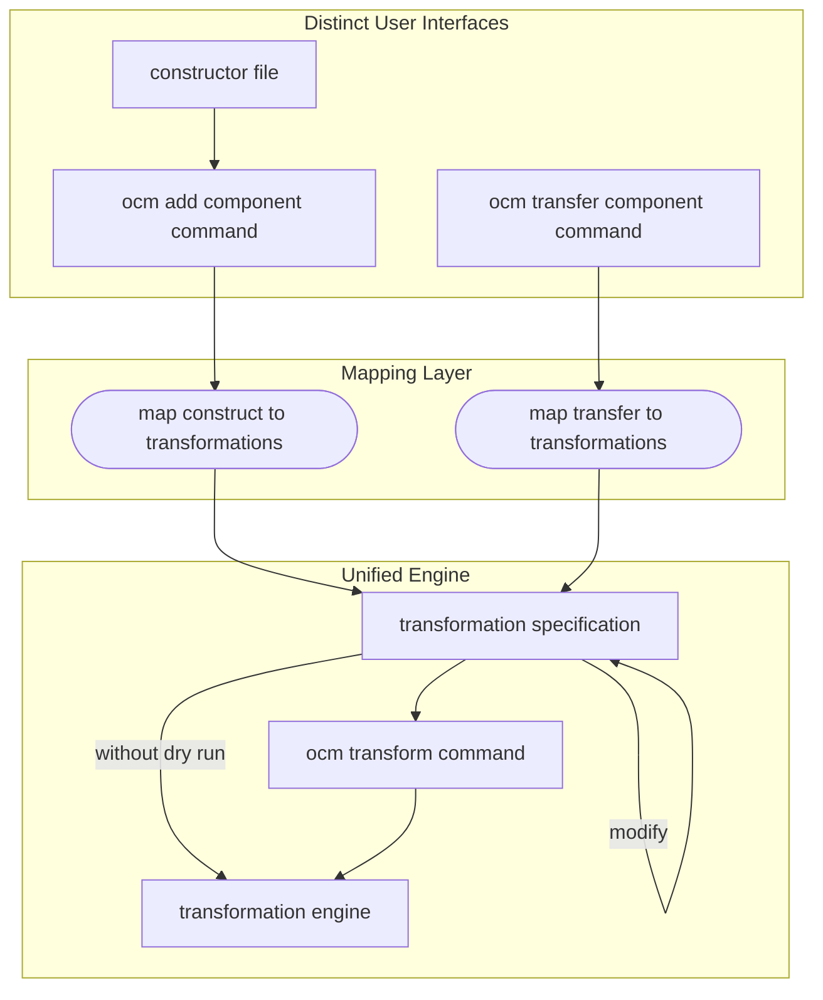
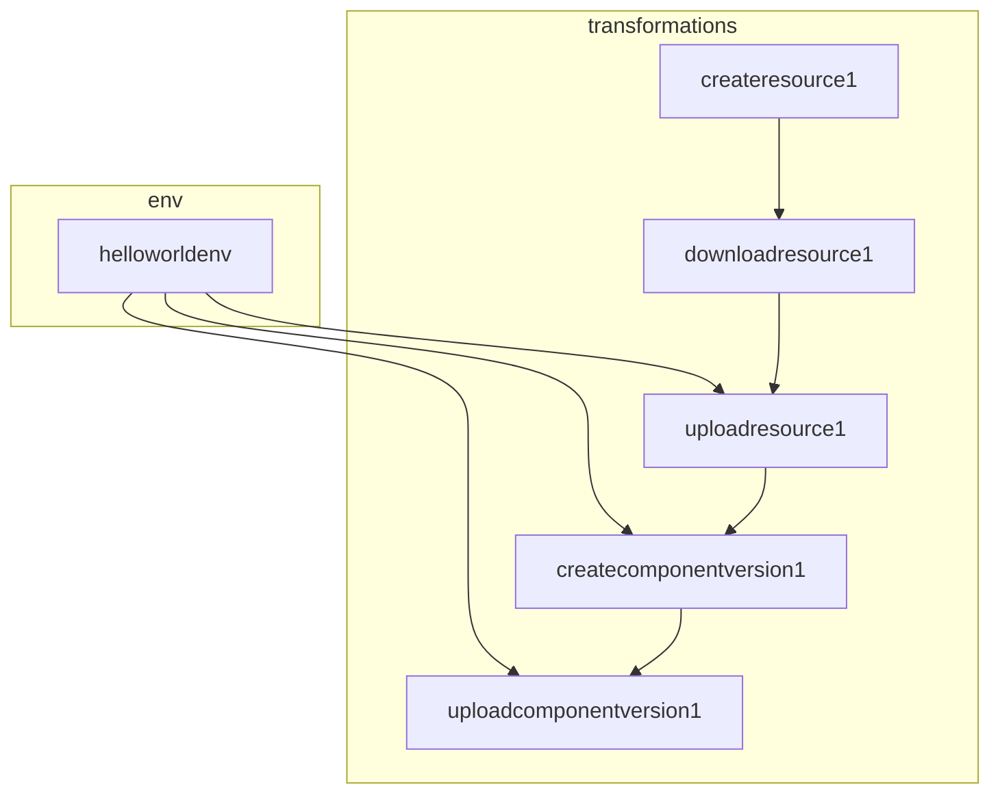

# A OCM Transformation Specification

* **Status**: proposed
* **Deciders**: Gergely Brautigam, Fabian Burth, Jakob Moeller
* **Date**: 2025-10-14

**Technical Story:** Unify the technical foundation of 
[transformation](0005_transformation.md) and 
[component constructors](0006_component_constructors.md).


## Context and Problem Statement

The original transformation specification proposed in the
[transformation ADR](0005_transformation.md) was primarily designed 
for the requirements of **transferring of components and their resources**. 
However, we noticed a significant overlap of the **transfer requirements** with 
the **component constructors** requirements. A detailed comparison of shared 
requirements is provided in [Requirements](#requirements).

This ADR proposes a unified solution for transferring and constructing 
component versions. The goal behind this unification is:

- **Maintainability**: By having a unified engine / unified code paths for both 
  use cases, we reduce code duplication and maintenance efforts. It is also 
  easier to keep both use cases in sync with new features and bug fixes.
- **Extensibility**: The transformation specification is designed to be 
  extensible. By reusing it for component construction, we gain flexibility 
  to extend the component construction capabilities.


## Requirements

The table below list the requirements shared by the **transfer** and 
**constructor** use cases.

This serves as:
- a rationale for unifying transfer and constructor under a single 
  implementation

### Shared Requirements of Transfer and Constructor Requirements

| Requirement                    | Transfer                                                                                      | Constructor                                                                                               |
|--------------------------------|-----------------------------------------------------------------------------------------------|-----------------------------------------------------------------------------------------------------------|
| Upload of Component Versions   | Upload component versions downloaded from a source repository to a target repository          | Upload constructed component versions to a target repository                                              |
| Download of Component Versions | Download component version from a source repository to be uploaded to a target repository     | Download referenced component versions to be uploaded to a target repository (`--recursive`)              |
| Download resources             | Download resources based on access type specifications                                        | Download resources based on access and input type specifications                                          |
| Upload resources               | Upload resources based on uploader specification                                              | Upload resources based on access and input type specifications                                            |
| Resource format conversion     | Convert resources downloaded based on one access type to be uploaded with another access type | Convert resources based on the requirements of the input type (e.g. helm input type allows upload to oci) |
| Topological graph processing   | Topological order required for hashing, signing and localization                              | Topological order required for hashing                                                                    |
| Parallelization of operations  |                                                                                               |                                                                                                           |

### Conclusion

The functional requirements of both use cases are almost identical. The 
difference between the use cases is currently the **user interface**:

- for **ocm transfer component**, the plan is to offer a backwards compatible 
  high-level command (`ocm transfer component`) that generates the 
  transformation specification based on the provided parameters.
- for **ocm add component** (constructor), the established user interface is the
  constructor file.

## Solution Proposal

**Unified Engine**:
We propose to specify a **unified transformation specification** and 
implement a corresponding **unified transformation engine** 
that is powerful enough to model both, **transfer** and **construct**.

**Distinct User Interfaces**:
We propose to keep the existing distinct **user interfaces** of transfer and 
construct. 

- **transfer**: `ocm transfer component ...` with the parameters 
  determining the transfer behavior specified on the command line as option.
- **construct**: `ocm add component ...` with the parameters 
  determining the construction behavior specified in the constructor file.

**Intermediate Mapping Layer**:
Both commands will generate a transformation specification based on their 
respective input parameters (command line options or constructor file). 

**The proposed solution will not affect the user interfaces**.

**Additional Command**: We also propose to add a command and options that 
allow to 
directly interact with and execute a transformation specification file:

- `ocm transform --file <transformation-spec.yaml>`: 
  This command will directly take a transformation specification file and 
  execute it using the unified transformation engine.
- `--dry-run` option for `ocm transfer component` and 
  `ocm add component` commands to output the generated transformation 
  specification without executing it.

### High-Level Solution Diagram




## Transformation Specification

The following code snippet outlines a sample transformation specification.
It is not intended to be complete. It is brief, contains explanatory comments 
and serves to illustrate the general structure and concept of transformations.

Detailed samples for specific use cases are provided in [Mapping From 
Constructor to Transformation Specification](#mapping-constructor-file-to-transformation-specification) 
and in [Mapping From Transfer to Transformation Specification](#mapping-from-transfer-to-transformation-specification).

**Conceptual Example: Constructing a Component Version with a Local File Resource**
```yaml
type: transformations.ocm.config.software/v1alpha1
# env is an initial environment context. It can specify variables for static
# information that is used throughout the transformation specification.
env:
  # We define id`s here, instead of making componentIdentity and repositorySpec
  # top-level fields, to allow defining componentIdentity and repositorySpec for
  # multiple different components in the same transformation specification 
  # without collision. 
  - id: helloworldenv
    componentIdentity:
      name: github.com/acme.org/helloworld
      version: 1.0.0
    repositorySpec: 
      type: ociRegistry
      baseUrl: ghcr.io
      subPath: /open-component-model/target-ocm-repository
transformations: 
  # resource.creator is no-op. It is NOT an env because its config has a 
  # type (resource) that can be statically validated, and it may contain cel
  # expressions that create dependencies and have to be evaluated at process 
  # time.
  - type: resource.creator
    id: createresource1
    config:
      resource:
        name: localtext
        type: blob
        relation: local
        access:
          type: file
          filePath: ./testdata/text.txt
    # output: <does not need output, as it is already fully specified - creator is a no-op>
    
  # resource.downloader calls the resource repository's download resource 
  # method to read the data from the specified location.
  - type: resource.downloader
    id: downloadresource1
    config:
      resource: ${createresource1.resource} 
    # output:
    #   resource:
    #     name: localtext
    #     type: blob
    #     relation: local
    #     access:
    #       type: file
    #       filePath: ./testdata/text.txt
    #     data: <binary data>
    
  # local.resource.uploader calls the local resource repository's add local 
  # resource method to add the resource data to the specified target repository.
  - type: local.resource.uploader
    id: uploadresource1
    config:
      resource: ${downloadresource1.resource}
      # the repository and the component have to match with the component 
      # to which the resource is added and the repository where the component 
      # is uploaded
      repository: ${env.helloworldenv.repositorySpec}
      component: ${env.helloworldenv.componentIdentity}
    # output:
    #   resource:
    #     name: localtext
    #     type: blob
    #     relation: local
    #     access:
    #       type: localblob
    #       localReference: <reference in target repo>
    
  # component.creator is similar to resource.creator - it is a no-op. 
  - type: component.creator
    id: createcomponentversion1
    name: ${env.helloworldenv.componentIdentity.name} 
    version: ${env.helloworldev.componentIdentity.version}
    provider:
      name: internal
    resources:
      - ${uploadresource1.resource}
    # output:
    #   descriptor:
    #     meta: ...
    #     component: ...

  # component.uploader calls the component repository's add component version 
  # method to add the component version created in the previous step to the 
  # target repository.
  - type: component.uploader
    id: uploadcomponentversion1
    repository: ${env.helloworldenv.repositorySpec}
    componentDescriptor: ${createcomponentversion1.outputs.descriptor}
```

### Graph Representation



> [!NOTE]
> 
> An intuitive idea is to NOT define the `componentIdentity` and the 
> `repositorySpec` in an `env` section and rather define them in place in the
> (1) `component.creator` and `component.uploader` transformations or 
> alternatively in the (2) `local.resource.uploader`.
> 
> 1) Defining them in the `component.creator` and `component.uploader` and 
>    creating a cel dependency from `local.resource.uploader` to
>    `component.creator` would create a cycle in the graph, as 
>    `component.creator` depends on `local.resource.uploader` for the resource 
>    specification.
> 2) Defining them in the `local.resource.uploader` and creating a cel 
>    dependency from `component.creator` to `local.resource.uploader` 
>    technically work, as `component.creator` depends on 
>    `local.resource.uploader` anyway. However, to consistently avoid cycles, 
>    the generation step would have to understand the whole graph topology in 
>    order to determine in which step to define those variables. Even then, this 
>    might add unnecessary dependencies that could be avoided by defining them 
>    in an `env` section.


### Notes

#### Mapping From Constructor to Transformation Specification

**Input and Access Types**
- **Input types** (as used in constructors) are mapped to a combination of
  `resource.creator`, `resource.downloader` and `local.resource.uploader` 
  (*By Value*) OR `resource.uploader` (e.g. `helm` input with specified 
  `repository`) (*By Reference*) transformations.
  - In the `resource.creator` transformation, the `input` field is mapped
    to a corresponding access type (e.g. `file`, `ociArtifact`).
- **Access types** (as used in component constructors) depend on whether
  they are marked as `by value` or `by reference`.
  - **by value** access types are mapped to a combination of
    `resource.creator`, `resource.downloader` and `local.resource.uploader`
    (emphasis on **local**) transformations.
  - **by reference** access types are mapped to a single
    `resource.creator` transformation.

**Conclusion**
- The current `input type` implementation need to be broken up into:
  - additional `access types` (for `file`, `dir`, ...)
  - `resource.uploader` transformations (for `helm`)

#### Mapping From Transfer to Transformation Specification

#### Plugin Type System Reuse
- The transformation specification implementation is aware of the supported 
  capabilities. So, depending on the *capability* (such as `type: resource.
  downloader`), the implementation will use the corresponding *Provider* (e.
  g. resource repository provider).
- All types of a particular *capability* share a single common output schema.

**Advantages**
- We have a single uniform plugin system.
- *Capabilities* can define a schema of common fields all *types* have to 
  provide.

**Disadvantages**
- Additional indirection adds complexity. We have to first select a plugin 
  registry based on the *capability* and then select the actual plugin based 
  on the *type*.
- It is harder to introduce arbitrary plugins as a plugin registry for the
  corresponding *capability* has to be available.

**Conclusion** 
- Generally, this additional layer of indirection adds 
flexibility at the cost of complexity. This is especially visible in simple use 
cases (capability with a single type). 
- However, since we already have this 
plugin system in place, the complexity of maintaining two different plugin 
systems is even higher.

#### Resource as Atomic Unit in OCM
- The atomic unit in ocm is **resource** NOT A PLAIN BLOB or ACCESS, kind of 
  like the atomic unit in kubernetes are pods not containers.
- While this takes the operations to a higher abstraction level, offering each
  operation the ability to add or modify the metadata of a resource.

> [!NOTE]
> In ocm v1, several interfaces were built against plain blobs or access as 
> the atomic unit. This led to issues, as 
> - several operations had to be performed twice (digest calculation of a blob) 
>   or as the metadata could not be passed along.
> - several extension points were not flexible enough (resource uploader could
>   not provide the digest of the uploaded blob, as it only returned a blob)

#### Static Typing
- The example above shows the *outputs* of each transformation as comments. This
  is purely for illustration purposes. In the actual implementation, every
  capability has to define a static output schema (kind of like kubernetes 
  resource status).
- The transformation specification is statically typed. This means that
  everything that we programmatically write into MUST be typed
  (e.g. `repository: ${attributes.repositorySpec}`, here we have to be able to
  match the type of `repositorySpec` with the expected type of `repository`).
- This is required to enable static type analysis, which will be important to
  avoid problems in complex graphs.

## Comparison with Transformation ADR
- Instead of expecting a component descriptor as a starting point for all 
  operations that is consecutively modified and then merged (to detect 
  conflicts), we create a new component descriptor to be uploaded 
  with the resources created in the previous operations.
- This simplifies the operations, as we do not have to deal with 
  merging and conflict detection.
- This would also be adopted for the transfer use case. Here, the component 
  to be uploaded at the target location would be created from scratch and filled
  with information from the original component descriptor through `cel` expressions.

## Implementation

### Input to Access Types

As mentioned above, there will no longer be an implementation for each input 
type. Instead, we want new `access types` (e.g. `file`, `dir`, ...) and 
`uploaders`.

### Plugin Registries

To keep the complexity in check, we assume the transformation implementation 
is aware of the available *capabilities*, their interfaces and their 
types (or rather, schemas). This means, new *capabilities* can only be added by 
extending the code.

### Program Flow
So, the logic will be heavily inspired by the current construct implementation.
The overall flow will roughly be as follows:

**1. Discover**
- Discover loops over the entries in the (already parsed) transformation 
  specification go struct. We do 2 iterations:
  - **First Iteration**
    - For each item in the `transformations` list:
      - We create a vertex with the transformation `id` as the vertex `id`.
  - **Second Iteration**
    - For each item in the `transformations` list:
      - We parse the cel expressions in the transformation `config` (without 
        evaluating them yet). 
      - We add edges based on the cel expressions in the `config` (add edge 
        always does a cycle check). Here, we can error if the vertex with 
        the `id` referenced in the cel expression does not exist because of 
        the first iteration.
      - We unmarshal the `config` into its corresponding go type. As 
        mentioned above, we do not want an additional registry level. So, we 
        do a switch case on the transformation `type` and perform the 
        unmarshalling. Doing this here, instead of during process time,
        allows us to error early if the config is invalid.
      - We add the transformation with the unmarshalled `config` as an 
        attribute to the vertex.

**2. Process**
- Process loops over the graph in topological order. For each vertex:
  - We get the transformation with the typed `config` from the vertex attribute.
  - We evaluate all cel expressions in the `config`, using the outputs of 
    the predecessor vertices as input.
  - We do another switch case statement on the transformation type to call the
    corresponding transformation logic, passing in the `config`.
  - We store the processed transformations with their outputs in the vertex 
    as an attribute (can be used for rendering) and additionally in a map with
    the vertex `id` as key (can be used for cel expression evaluation of 
    successor vertices).

### Mapping Constructor File to Transformation Specification
1. **Parse the component constructor file.**
2. **Process Resources and Sources**  
   For each component version, the constructor handles all resources and sources:

  - **Input Method Specified**  
    If an input method is defined for resources:
    - If it would have returned `ResourceInputMethodResult.ProcessedBlobData`, 
      it is mapped to:
      - `resource.creator` (with the input access type)
      - `resource.downloader`
      - `local.resource.uploader`
      (if this is the case, the resource is automatically marked as `by value`)
    - If it would have returned `ResourceInputMethodResult.ProcessedAccess`,
      it is mapped to:
      - `resource.creator` (with the input access type)
      - `resource.downloader`
      - `resource.uploader`
      (if this is the case, the resource is automatically marked as `by reference`)
    - If it returns `ResourceInputMethodResult.ProcessedResource`, the constructor applies the resource directly to the component descriptor candidate.
      (if this is the case, the resource is automatically marked as `by reference`)
      _Sources are processed in the same way with `SourceInputMethodResult._

  - **Access Method Specified**  
    For access methods, the mapping depends on whether the resource is marked 
    as `by value` or `by reference`:

    - **"By Value" Resources / Sources**  
      If the resource is marked to be processed "by value", it is mapped to:
      - `resource.creator` (with the access type)
      - `resource.downloader`
      - `local.resource.uploader`

    - **"By Reference" Resources**
      If the resource is marked to be processed "by reference", it is mapped to:
      - `resource.creator` (with the access type)
      - (conditional) `resource.digester` - here, the mapping function has to 
        check, if the resource has a digest set. If not, it has to add a 
        `resource.digester` transformation.
      - (no uploader needed, as the resource is added by reference)
        _Note: Sources do not have digest information and will not get processed like this._

  - **Component Reference Specified**
    For component references, the behavior depends on:
    - whether the referenced component is part of the constructor file itself or 
      whether it is an external component stored in an ocm repository.
      - **Internal Component Reference**
        If the referenced component is part of the constructor file itself, it 
        is mapped to:
        - `component.digester` (to calculate the digest of the referenced component)
      - **External Component Reference**
        If the referenced component is an external component stored in an ocm 
        repository, it is mapped to:
        - `component.downloader`
        - `component.digester`
        - depending on whether `--recursive` is set:
          - If `--recursive` is set, the referenced component is also added to 
            the target repository. Therefore, it is mapped to:
            - `component.uploader`
          - If `--recursive` is NOT set, the referenced component is only added 
            by reference. Therefore, no `component.uploader` transformation is 
            needed.

 The result of the last transformation step (so, currently, either a 
 `digester` of `uploader` is used to create the component 
 version). This then has to be uploaded with a `component.uploader` 
 transformation.
