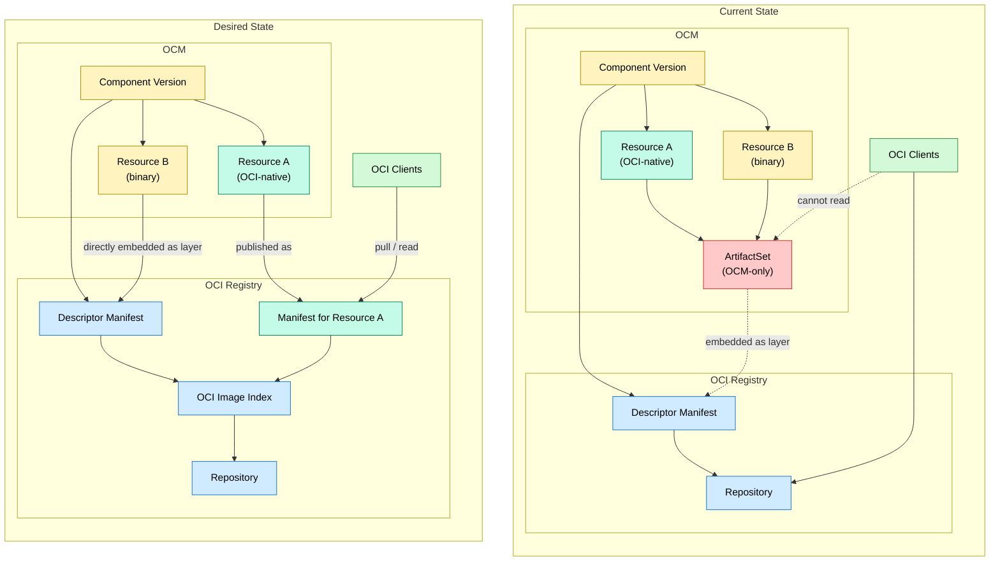

# Future Format Considerations for OCM Component Versions in OCI Repositories

* **Status**: proposed
* **Deciders**: OCM Technical Steering Committee
* **Date**: 2025.10.15

**Technical Story**:

Provide a way to discover, read and update component versions from OCI Artifacts that have a top level OCI Image Index manifest instead of the descriptor manifest.

---

## Context and Problem Statement

Right now, when creating a component version in OCI, we follow the [extension description](https://github.com/open-component-model/ocm-spec/blob/main/doc/04-extensions/03-storage-backends/oci.md) of the OCM Specification.
This specification works well when interacting with OCI registries and resources that have arbitrary binary content.

Imagining a component such as 

```yaml
component:
  name: github.com/open-component-model/spec-example
    version: 1.0.0
    provider:
      name: ocm.software
  resources:
    - access:
        localReference: sha256:7acd701465611ed8a45d7889b4f3f6ed5e1450ca446f90fd6406cc59ea2baea8
        mediaType: text/plain
        type: localBlob
      name: resource
      relation: local
      type: blob
      version: 1.0.0
meta:
  schemaVersion: v2
```

it would currently get mapped to a single OCI manifest (approximately) such as

```json
{
  "schemaVersion": 2,
  "mediaType": "application/vnd.oci.image.manifest.v1+json",
  "config": {
    "mediaType": "application/vnd.ocm.software.component.config.v1+json",
    "digest": "sha256:e63f662a4b600705ed975af69e23fd61d6d68ae1b38d3d3feefbd4df14ce4448",
    "size": 201
  },
  "layers": [
    {
      "mediaType": "application/vnd.ocm.software.component-descriptor.v2+yaml+tar",
      "digest": "sha256:0e75813f479e5486985747d6f741ee63d824097c8ee7e48b558bac608bded669",
      "size": 3072
    },
    {
      "mediaType": "text/plain",
      "digest": "sha256:7acd701465611ed8a45d7889b4f3f6ed5e1450ca446f90fd6406cc59ea2baea8",
      "size": 26,
      "annotations": {
        "software.ocm.artifact": "[{\"identity\":{\"name\":\"resource\",\"version\":\"1.0.0\"},\"kind\":\"resource\"}]"
      }
    },
  ]
}
```

However, this is not ideal for natively supported types such as OCI Artifacts itself. For example, imagine a component constructor as follows:

```yaml
components:
- name: github.com/open-component-model/spec-example
  version: 1.0.1
  provider:
    name: acme.org
  resources:
    - name: myHelmChart
      type: helmChart
      version: 6.9.2
      input:
        type: file
        mediaType: application/vnd.oci.image.manifest.v1+tar+gzip # media type to represent an OCI Image Layout as per https://github.com/opencontainers/image-spec/blob/main/image-layout.md
        path: ./busybox.tar # oci layout
    - name: busybox
      type: ociImage
      version: 1.36.1
      input:
        type: file
        mediaType: application/vnd.ocm.software.oci.layout.v1+tar # alternative media type to represent an OCI Image Layout as per https://github.com/opencontainers/image-spec/blob/main/image-layout.md
        path: ./busybox.tar # oci layout
    - name: image
      type: ociImage
      version: 1.0.0
      access:
        type: ociArtifact
        imageReference: gcr.io/google_containers/echoserver:1.1
```

Even though there are two resources of type `ociImage`, only one of them (`image`) can be easily used by OCI-native tooling.
For `busybox`, we need a pre-processor.

It cannot be copied natively with the existing OCM infrastructure because the top-level artifact is a manifest, 
and manifests are not allowed to reference other artifacts contained within the same layout. 
Consequently, `ocm` currently transports the resource as an [OCM Artifact Set](https://github.com/open-component-model/ocm-spec/blob/main/doc/04-extensions/common/formatspec.md#artifact-set-archive-format).

This enables transport but prevents using the resource as an OCI artifact. Even if it is a valid OCI image, it must be exported from the registry, converted by OCM into an OCI Image Layout, and then uploaded or used.

---

## Decision Drivers

Using artifact sets effectively prevents local blobs from being used directly as OCI artifacts. This leads to several issues:

1. Even native OCI formats like OCI Image Layouts can no longer be referenced by OCI-compatible tools (e.g., `docker pull` or [Helm OCI support](https://helm.sh/docs/topics/registries/#using-an-oci-based-registry)). **A resource with a `localBlob` access should be usable by any OCI-compliant tool if the blob itself is an OCI-compliant artifact.**
2. Transporting OCI artifacts becomes inefficient because all layers must first be converted into an `ArtifactSet`, archived as a `tar`, and then uploaded as a single manifest layer. This prevents the use of OCI’s native concurrent layer uploads.
3. Transporting `localBlob` artifacts requires deep knowledge of OCM’s internal artifact set mechanics.

Any solution should therefore:

1. Make sure that the OCI Artifacts can be referenced by OCI compatible tooling
2. Make sure that the transport of OCI Artifacts is efficient and uses existing CAS ([Content Addressable Storage](https://en.wikipedia.org/wiki/Content-addressable_storage)) Graph Transport mechanisms (by working on manifest level, not binary level)
3. Make sure that the transport of localBlob artifacts is efficient

To solve this, **we propose to change the OCM OCI Repository Mapping to allow referencing the descriptor via an [OCI Image Index Specification](https://github.com/opencontainers/image-spec/blob/main/image-index.md) to allow native references to OCI Manifests as local blobs**.

---

## Format Change Proposal

The current OCM format forces all resource access through an **Artifact Set**, an OCM-specific packaging format. 
Since Artifact Sets are not native OCI media types, standard OCI tooling (Docker, Helm, Kubernetes) cannot read them.

To support a backwards-compatible upgraded format safely we propose the following changes:

1. Fetch the component version reference from the OCI registry.
2. If the top-level manifest is an **OCI Image Index**, search for a manifest with matching component name + version.
3. If such a manifest exists, use it as the component version descriptor.
4. Otherwise, fall back to interpreting the top-level manifest as the component version (legacy behavior).

This approach enables native OCI access while preserving backward compatibility.

This diagram illustrates the current situation and what we want to achieve.



Whenever we now have a `localBlob` access within a resource we can now distinguish between the following 2 cases:

1. The resource is a native OCI Artifact (e.g. OCI Image, OCI Artifact, OCI Image Layout). This happens when the `mediaType` property is one of `application/vnd.oci.image.manifest.v1+json` or `application/vnd.oci.image.index.v1+json`. In this case `access.localReference` points to the manifest in the top level index, and not to a layer in the descriptor's manifest.
2. The resource is a local blob that is not an OCI Artifact (e.g. a local tar file). In this case `access.localReference` points to a layer.

We can now access the resource via the `access.localReference` property natively. This makes it possible to store localBlobs with a `globalAccess` value that can be externally used by other tools.

```yaml
components:
- name: github.com/open-component-model/spec-example
  version: 1.0.1
  provider:
    name: acme.org
  resources:
    - access:
      globalAccess:
        imageReference: ghcr.io/open-component-model/spec-example/component-descriptors/github.com/open-component-model/spec-example@sha256:7acd701465611ed8a45d7889b4f3f6ed5e1450ca446f90fd6406cc59ea2baea8
        type: ociArtifact
      localReference: sha256:7acd701465611ed8a45d7889b4f3f6ed5e1450ca446f90fd6406cc59ea2baea8
      mediaType: application/vnd.oci.image.manifest.v1+json
      type: localBlob
    name: mychart
    relation: local
    type: blob
    version: 1.0.0
```

Assuming that the resource `mychart` now contains a valid OCI Artifact with a HELM Chart, one could pull and use the HELM chart with 

`helm pull oci://ghcr.io/open-component-model/spec-example/component-descriptors/github.com/open-component-model/spec-example@sha256:7acd701465611ed8a45d7889b4f3f6ed5e1450ca446f90fd6406cc59ea2baea8`

Similarly, this can be also used by other external systems and tools such as flux for natively accessing artifacts colocated with the component version.

## User Workflow for creating resources that are natively supported by OCI

When creating new components, we can now use various workflows that were previously impossible due to the abstraction of the ArtifactSet.

### `localBlob` Resources based on OCI Image Layouts

We now can allow to create a fully native OCI CAS based on an Image Layout. One can use this to pull artifacts from registries with other tooling and then import them separately into OCM.

```shell
oras backup --output busybox --insecure docker.io/library/busybox:1.36.1
tar cf busybox.tar busybox
```

```yaml
components:
  - name: github.com/acme.org/helloworld
    # version needs to follow "relaxed" SemVer
    version: 1.0.1
    provider:
      name: acme.org
    resources:
      - name: busybox
        type: ociImage
        version: 1.36.1
        input:
          type: file
          mediaType: application/vnd.ocm.software.oci.layout.v1+tar
          # mediaType: application/vnd.oci.image.manifest.v1+tar+gzip old format in OCM
          path: ./busybox.tar
```

```shell
ocm add componentversion --repository ghcr.io/jakobmoellerdev/compat --constructor component-constructor.yaml
```

```yaml
component:
  name: github.com/acme.org/helloworld
  provider: acme.org
  resources:
  - access:
      globalAccess:
        imageReference: ghcr.io/jakobmoellerdev/compat/component-descriptors/github.com/acme.org/helloworld:1.0.1@sha256:842dc2c806b9f40402584518da8731913c1e92e48d92a9f9e95a96e32443be56
        type: ociArtifact
      localReference: sha256:842dc2c806b9f40402584518da8731913c1e92e48d92a9f9e95a96e32443be56
      mediaType: application/vnd.oci.image.index.v1+json
      type: localBlob/v1
    digest:
      hashAlgorithm: SHA-256
      normalisationAlgorithm: genericBlobDigest/v1
      value: 842dc2c806b9f40402584518da8731913c1e92e48d92a9f9e95a96e32443be56
    name: busybox
    relation: local
    type: ociImage
    version: 1.36.1
  version: 1.0.1
meta:
  schemaVersion: v2
```

One can now pull the image with

```shell
oras manifest fetch ghcr.io/jakobmoellerdev/compat/component-descriptors/github.com/acme.org/helloworld:1.0.1@sha256:842dc2c806b9f40402584518da8731913c1e92e48d92a9f9e95a96e32443be56
```

or even use it in a native OCI Runtime

```shell
docker pull ghcr.io/jakobmoellerdev/compat/component-descriptors/github.com/acme.org/helloworld:1.0.1@sha256:842dc2c806b9f40402584518da8731913c1e92e48d92a9f9e95a96e32443be56
```

### OCI Image Layouts as base for other Input Methods - Example `helmChart`

Not only can we import OCI Image Layouts natively but we can also make input methods return OCI Layouts. For example, we can make the `helmChart` input method return an OCI Image Layout:

```yaml
components:
  - name: github.com/acme.org/helloworld
    # version needs to follow "relaxed" SemVer
    version: 1.0.1
    provider:
      name: acme.org
    resources:
      - name: busybox
        type: ociImage
        input:
          type: helm
          path: ./path-to-chart
```

In this case, the input method will always return an OCI Image Layout. This OCI Image Layout can then either be read as a native HELM Chart via `helm pull` or as a resource via `ocm download resource`. In both cases we will then be able to store helm charts natively and make them accessible via the specification outlined via [HIP 6](https://github.com/helm/community/blob/main/hips/hip-0006.md)

## Ensuring compatibility with existing OCM Infrastructure

To ensure compatibility with existing OCM infrastructure we do not only want to add support for building component versions in this way, but also extend the old OCM CLI to support reading from this index based infrastructure.

To do this we can offer support via [api/ocm/extensions/repositories/genericocireg](https://github.com/open-component-model/ocm/tree/2b06ef574c001e26ca900602831e4a8c85456e87/api/ocm/extensions/repositories/genericocireg), which implements the OCI repository specification extension for OCM within the old CLI.

We do this by proxying the namespace access that usually would register the manifest directly with an optional index based lookup.

The conceptional proposal is presented as a [Pull Request to OCM](https://github.com/open-component-model/ocm/pull/1646). We ensure that resources are read the same way as before by [synthesizing them into an artifact set](https://github.com/open-component-model/ocm/pull/1646/files) when the blob is read, which ensures that they interact with the rest of the OCM library as before.

In the beginning, the existing `ocm` CLI will only able to read from such component versions and cannot write to them, but we can extend the write of this specification form depending on the adoption of the new CLI.

## Pros and Cons

### Pros

1. Allows native access to localBlobs in OCI Registries if they themselves are of OCI compatible format. This will allow native pulling of OCI Images, Helm Charts and other OCI Artifacts (currently the most applied use case of OCM in the Cloud Native Ecosystem)
2. Allows to stay fully compatible with existing OCM component versions and even storage formats, so long as an index indirection is used when encountered. This is not a full form of backwards-compatibility, but it is a good start.
3. Allows to use existing OCM infrastructure for storing and managing component versions.

### Cons

1. Requires tooling to be able to read from the new format, namely by being aware of the top level descriptor being an index.
2. Requires tooling to be able to either synthesize an artifact set or change the way resources are read from local blobs stored in native OCI registries.
3. Requires at least 1 more resolution to the index manifest per component version stored within the registry. This may impact performance, but should be negligible for larger component versions or images with more than 10 layers (<10% performance impact). We will maintain linear scalability for larger components.

## Comparison Table of Formats

| Aspect                            | Old Format                  | New Format                                     |
|-----------------------------------|-----------------------------|------------------------------------------------|
| Top-level object                  | Manifest                    | Image Index                                    |
| Resource storage                  | OCM Artifact Set AND Layers | Native OCI Manifest OR Layers                  |
| Tool compatibility                | OCM-only                    | OCI + OCM                                      |
| Transport efficiency              | Low (tar encapsulation)     | High (manifest/layer CAS)                      |
| Backward compatibility in OLD CLI | ✅ Read/Write                | ✅ Read (Write TBD, depends on migration period |
| Backward compatibility in NEW CLI | ✅ Read                      | ✅   Read/Write                                 |
