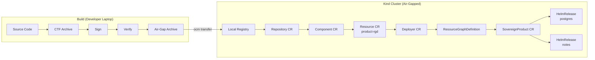
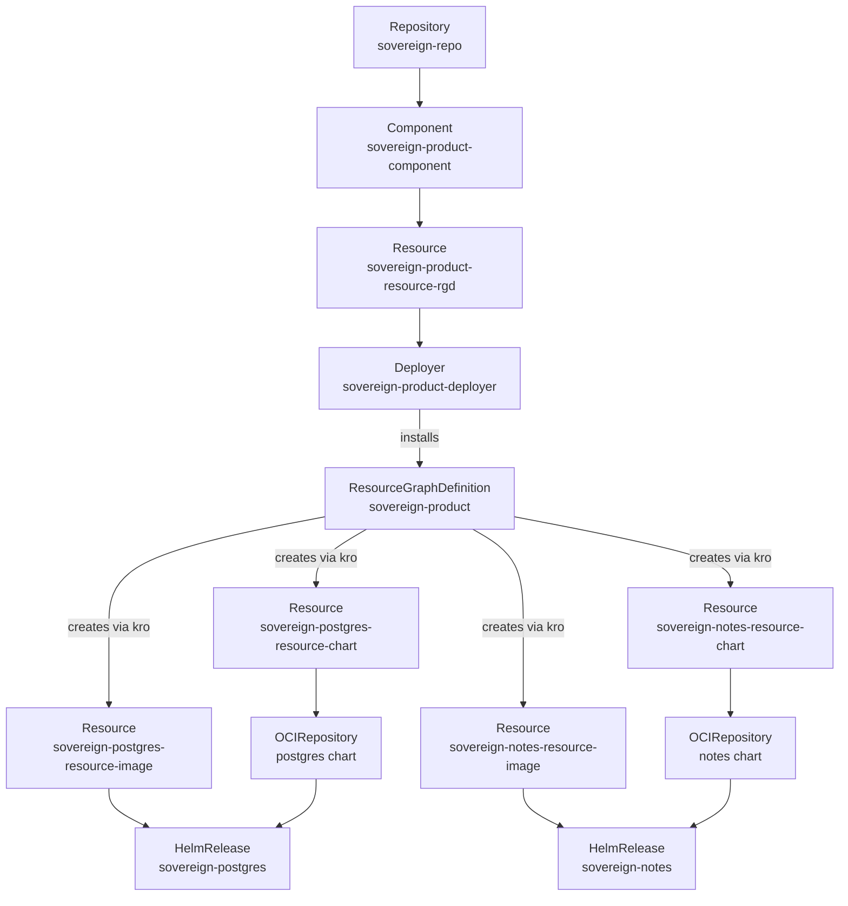
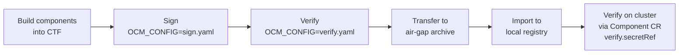
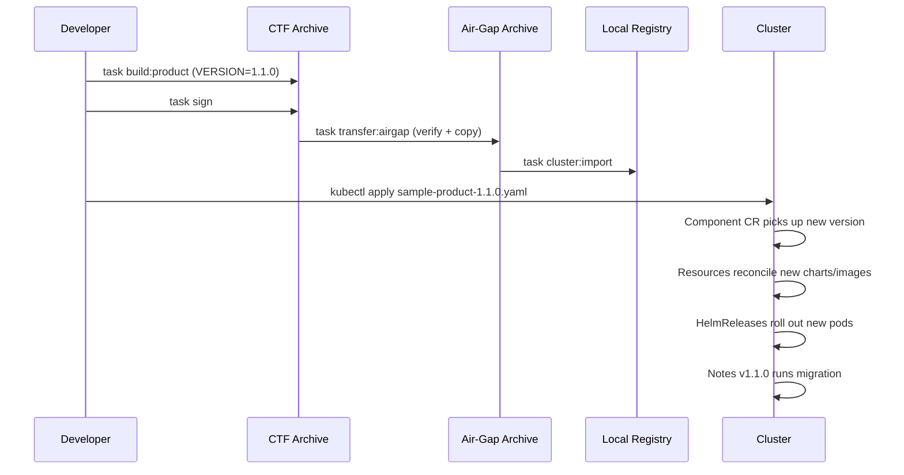

# Design: Reference Scenario — Sovereign Cloud Delivery with Open Component Model

* **Status**: draft
* **Deciders**: OCM TSC
* **Date**: 2025-02-06

**Issue:** [ocm-project#842](https://github.com/open-component-model/ocm-project/issues/842)
**Parent Epic:** [ocm-project#424 — OCM Reference Scenario / Golden Path](https://github.com/open-component-model/ocm-project/issues/424)
**Related:** [ocm-project#843 — Document and Describe Reference Scenario](https://github.com/open-component-model/ocm-project/issues/843)

---

## Table of Contents

<!-- TOC -->
* [Design: Reference Scenario — Sovereign Cloud Delivery with Open Component Model](#design-reference-scenario--sovereign-cloud-delivery-with-open-component-model)
  * [Table of Contents](#table-of-contents)
  * [1. Overview](#1-overview)
    * [1.1 What This Scenario Covers](#11-what-this-scenario-covers)
    * [1.2 Integration Landscape](#12-integration-landscape)
    * [1.3 Prerequisites](#13-prerequisites)
  * [2. Architecture](#2-architecture)
    * [2.1 End-to-End Flow](#21-end-to-end-flow)
    * [2.2 Controller Reconciliation Detail](#22-controller-reconciliation-detail)
  * [3. Service Design](#3-service-design)
    * [3.1 sovereign-notes (Web Service)](#31-sovereign-notes-web-service)
    * [3.2 PostgreSQL (Database)](#32-postgresql-database)
  * [4. Component Modeling](#4-component-modeling)
    * [4.0 Component Structure](#40-component-structure)
    * [4.1 Component: `acme.org/sovereign/notes`](#41-component-acmeorgsovereignnotes)
    * [4.2 Component: `acme.org/sovereign/postgres`](#42-component-acmeorgsovereignpostgres)
    * [4.3 Meta-Component: `acme.org/sovereign/product`](#43-meta-component-acmeorgsovereignproduct)
  * [5. Signing Workflow](#5-signing-workflow)
    * [5.1 Key Generation](#51-key-generation)
    * [5.2 Signing and Verification via OCM_CONFIG](#52-signing-and-verification-via-ocm_config)
    * [5.3 Signing Flow](#53-signing-flow)
  * [6. Configuration via ResourceGraphDefinition](#6-configuration-via-resourcegraphdefinition)
    * [6.1 RGD Structure](#61-rgd-structure)
    * [6.2 What the RGD Creates](#62-what-the-rgd-creates)
    * [6.3 RGD Instance](#63-rgd-instance)
  * [7. Build & Publish Pipeline](#7-build--publish-pipeline)
    * [7.1 Build Steps](#71-build-steps)
    * [7.2 Taskfile](#72-taskfile)
  * [8. Deployment Manifests (Bootstrap)](#8-deployment-manifests-bootstrap)
    * [8.1 Bootstrap Pattern](#81-bootstrap-pattern)
    * [8.2 Bootstrap Resources](#82-bootstrap-resources)
  * [9. Upgrade Scenario](#9-upgrade-scenario)
    * [9.1 What Changes in v1.1.0](#91-what-changes-in-v110)
    * [9.2 Upgrade Flow](#92-upgrade-flow)
  * [10. Repository Layout](#10-repository-layout)
  * [11. Local Development & Testing](#11-local-development--testing)
    * [11.1 Quick Start](#111-quick-start)
    * [11.2 Testing Strategy](#112-testing-strategy)
  * [12. Deployment Extensibility](#12-deployment-extensibility)
  * [13. Key Design Decisions](#13-key-design-decisions)
  * [14. Future Work](#14-future-work)
<!-- TOC -->

---

## 1. Overview

This document designs a reference scenario demonstrating one of our core value propositioning statements: **modeling, signing, transporting, and deploying a multi-service product into an air-gapped sovereign cloud environment**.

The implementation lives in [`conformance/scenarios/sovereign/`](../../conformance/scenarios/sovereign).

### 1.1 What This Scenario Covers

Two genuinely interdependent services:

- **sovereign-notes** — a minimal Go web service that stores notes in PostgreSQL
- **PostgreSQL** — the official postgres image, deployed via Helm

Both are packaged as OCM components, signed, transferred through an air-gap via CTF, and deployed on a local kind cluster using the OCM Kubernetes controllers with FluxCD.

**Key principles:**

- Real codependency (not contrived)
- Configuration delivered as OCM resources (not hardcoded)
- Signed components with verification on deployment
- Upgrade flow as first-class concern
- Fully reproducible on a developer laptop

### 1.2 Integration Landscape

| Integration         | Role                                                        | Status                                 |
|---------------------|-------------------------------------------------------------|----------------------------------------|
| **OCM CLI**         | Build, sign, verify, transfer components                    | Implemented (containerized via Docker) |
| **OCM K8s Toolkit** | Reconcile Repository/Component/Resource/Deployer CRs        | Implemented                            |
| **kro**             | ResourceGraphDefinition controller                          | Implemented                            |
| **FluxCD**          | Helm chart deployment (source-controller + helm-controller) | Implemented                            |
| **kind**            | Local air-gapped Kubernetes cluster                         | Implemented                            |

### 1.3 Prerequisites

| Tool                     | Purpose                                                 |
|--------------------------|---------------------------------------------------------|
| `docker` (with `buildx`) | Build images, run containerized OCM CLI, local registry |
| `kubectl`                | Cluster interaction                                     |
| `kind`                   | Local Kubernetes cluster                                |
| `helm`                   | Install OCM toolkit, kro                                |
| `flux`                   | Install FluxCD controllers                              |
| `openssl`                | Generate RSA signing keys                               |
| `task`                   | [Taskfile](https://taskfile.dev/) build orchestration   |

> **Note:** The OCM CLI is not installed locally. It runs as a Docker container (`ghcr.io/open-component-model/cli:main`) with the repository mounted as a volume. See the `ocm` variable in the [Taskfile](../../conformance/scenarios/sovereign/Taskfile.yml).

---

## 2. Architecture

### 2.1 End-to-End Flow


```mermaid
flowchart LR
    subgraph Build ["Build (Developer Laptop)"]
        SRC[Source Code] --> CTF[CTF Archive]
        CTF --> SIGN[Sign]
        SIGN --> VERIFY[Verify]
        VERIFY --> AIRGAP[Air-Gap Archive]
    end

    subgraph Cluster ["Kind Cluster (Air-Gapped)"]
        REG[Local Registry]
        REPO[Repository CR] --> COMP[Component CR]
        COMP --> RES_RGD[Resource CR<br/>product-rgd]
        RES_RGD --> DEPLOYER[Deployer CR]
        DEPLOYER --> RGD[ResourceGraphDefinition]
        RGD --> INSTANCE[SovereignProduct CR]
        INSTANCE --> PG_HR[HelmRelease<br/>postgres]
        INSTANCE --> NOTES_HR[HelmRelease<br/>notes]
    end

    AIRGAP -->|"ocm transfer"| REG
    REG --> REPO
```

The flow is entirely local — there is no push to any remote registry (e.g. ghcr.io). Components go from CTF archive to air-gap archive to the cluster's local Docker registry.

### 2.2 Controller Reconciliation Detail


```mermaid
flowchart TD
    REPO[Repository<br/>sovereign-repo] --> COMP[Component<br/>sovereign-product-component]
    COMP --> RGD_RES[Resource<br/>sovereign-product-resource-rgd]
    RGD_RES --> DEPLOYER[Deployer<br/>sovereign-product-deployer]
    DEPLOYER -->|installs| RGD[ResourceGraphDefinition<br/>sovereign-product]

    RGD -->|creates via kro| PG_CHART_RES[Resource<br/>sovereign-postgres-resource-chart]
    RGD -->|creates via kro| PG_IMG_RES[Resource<br/>sovereign-postgres-resource-image]
    RGD -->|creates via kro| NOTES_CHART_RES[Resource<br/>sovereign-notes-resource-chart]
    RGD -->|creates via kro| NOTES_IMG_RES[Resource<br/>sovereign-notes-resource-image]

    PG_CHART_RES --> PG_OCI[OCIRepository<br/>postgres chart]
    PG_IMG_RES --> PG_HR[HelmRelease<br/>sovereign-postgres]
    PG_OCI --> PG_HR

    NOTES_CHART_RES --> NOTES_OCI[OCIRepository<br/>notes chart]
    NOTES_IMG_RES --> NOTES_HR[HelmRelease<br/>sovereign-notes]
    NOTES_OCI --> NOTES_HR
```

The bootstrap pipeline (Repository → Component → Resource → Deployer) is applied manually. Everything below the Deployer — the RGD and all resources it creates — is managed declaratively by the controllers.

---

## 3. Service Design

### 3.1 sovereign-notes (Web Service)

A Go HTTP service backed by PostgreSQL. Two versions exist to demonstrate the upgrade scenario:

| Aspect     | v1.0.0                                                                                                                       | v1.1.0                                                                                                                 |
|------------|------------------------------------------------------------------------------------------------------------------------------|------------------------------------------------------------------------------------------------------------------------|
| Source     | [`cmd/sovereign-notes-v1/main.go`](../../conformance/scenarios/sovereign/components/notes/cmd/sovereign-notes-v1/main.go) | [`cmd/sovereign-notes/main.go`](../../conformance/scenarios/sovereign/components/notes/cmd/sovereign-notes/main.go) |
| Schema     | `notes(id, content, created_at)`                                                                                             | Adds `title` column via migration                                                                                      |
| Migrations | Direct `CREATE TABLE IF NOT EXISTS` + records migration #1                                                                   | Advisory-locked incremental migrations                                                                                 |

**Endpoints** (both versions):

| Method   | Path                                   | Description                 |
|----------|----------------------------------------|-----------------------------|
| `GET`    | `/healthz`                             | Liveness probe              |
| `GET`    | `/readyz`                              | Readiness probe (checks DB) |
| `GET`    | `/version`                             | JSON version info           |
| `GET`    | `/notes`                               | List all notes              |
| `POST`   | `/notes`                               | Create a note               |
| `GET`    | `/notes/{id}`                          | Get a note                  |
| `DELETE` | `/notes/{id}`                          | Delete a note               |
| `GET`    | `/.well-known/open-resource-discovery` | ORD configuration           |
| `GET`    | `/ord/v1/document`                     | ORD document                |
| `GET`    | `/`                                    | Simple HTML UI              |

The [Dockerfile](../../conformance/scenarios/sovereign/components/notes/Dockerfile) selects the build target based on `VERSION`: v1.0.0 builds `cmd/sovereign-notes-v1`, everything else builds `cmd/sovereign-notes`.

### 3.2 PostgreSQL (Database)

The official `postgres` image (default version 18, configurable via `POSTGRES_VERSION`). Deployed as a StatefulSet via a **custom Helm chart** included in the scenario at [`components/postgres/deploy/chart/`](../../conformance/scenarios/sovereign/components/postgres/deploy/chart) (not the Bitnami chart). This chart creates a minimal StatefulSet and Service tailored to the scenario's needs.

---

## 4. Component Modeling

### 4.0 Component Structure

```text
acme.org/sovereign/product (meta-component)
├── componentRef: notes → acme.org/sovereign/notes
├── componentRef: postgres → acme.org/sovereign/postgres
└── resource: product-rgd (ResourceGraphDefinition)

acme.org/sovereign/notes
├── resource: image (OCI image, built from source)
├── resource: helm-chart (Kubernetes deployment chart)
├── resource: openapi-spec (API specification)
└── resource: ord-document (Open Resource Discovery metadata)

acme.org/sovereign/postgres
├── resource: image (docker.io/library/postgres, external reference)
└── resource: helm-chart (StatefulSet deployment chart)
```

The product component is a **meta-component** that references notes and postgres as children and carries only the unified product RGD. There are no per-component RGDs.

### 4.1 Component: `acme.org/sovereign/notes`

See [`components/notes/component-constructor.yaml`](../../conformance/scenarios/sovereign/components/notes/component-constructor.yaml).

Key details:

- Provider: `ocm.software/sovereign`
- The container image uses `input.type: file` with an OCI layout tarball (`application/vnd.ocm.software.oci.layout.v1+tar+gzip`), built by `docker buildx --output type=oci`
- Helm chart uses `input.type: helm` with a local chart directory
- Includes `openapi-spec` and `ord-document` blob resources

### 4.2 Component: `acme.org/sovereign/postgres`

See [`components/postgres/component-constructor.yaml`](../../conformance/scenarios/sovereign/components/postgres/component-constructor.yaml).

Key details:

- Provider: `ocm.software/sovereign`
- The postgres image is an **external reference** (`access.type: ociArtifact` pointing to `docker.io/library/postgres:${POSTGRES_VERSION}`)
- Helm chart uses `input.type: helm` with a local chart directory

### 4.3 Meta-Component: `acme.org/sovereign/product`

See [`components/product/component-constructor.yaml`](../../conformance/scenarios/sovereign/components/product/component-constructor.yaml).

Key details:

- Provider: `ocm.software/sovereign`
- References `acme.org/sovereign/notes` and `acme.org/sovereign/postgres` as child components
- Carries a single resource: `product-rgd` — the unified ResourceGraphDefinition that orchestrates the entire deployment

---

## 5. Signing Workflow

### 5.1 Key Generation

RSA 4096-bit key pair, generated once via `openssl` into `tmp/keys/`:

```bash
openssl genpkey -algorithm RSA -out acme-private.pem -pkeyopt rsa_keygen_bits:4096
openssl rsa -pubout -in acme-private.pem -out acme-public.pem
```

The Taskfile's `product:keys` task handles this with a status check to avoid regeneration.

### 5.2 Signing and Verification via OCM_CONFIG

Signing and verification use the `OCM_CONFIG` environment variable pointing to config files:

- **Sign config:** [`components/product/config/sign.yaml`](../../conformance/scenarios/sovereign/components/product/config/sign.yaml) — references `private_key_pem_file` (the **private key** is used to create signatures)
- **Verify config:** [`components/product/config/verify.yaml`](../../conformance/scenarios/sovereign/components/product/config/verify.yaml) — references `public_key_pem_file` (the **public key** is used to verify signatures)

Both use the credential consumer pattern:

```yaml
type: generic.config.ocm.software/v1
configurations:
- type: credentials.config.ocm.software
  consumers:
    - identity:
        type: RSA/v1alpha1
        algorithm: RSASSA-PSS
        signature: default
      credentials:
        - type: Credentials/v1
          properties:
            private_key_pem_file: ../../tmp/keys/acme-private.pem  # or public_key_pem_file
```

### 5.3 Signing Flow


```mermaid
flowchart LR
    BUILD[Build components<br/>into CTF] --> SIGN[Sign<br/>OCM_CONFIG=sign.yaml]
    SIGN --> VERIFY_PRE[Verify<br/>OCM_CONFIG=verify.yaml]
    VERIFY_PRE --> TRANSFER[Transfer to<br/>air-gap archive]
    TRANSFER --> IMPORT[Import to<br/>local registry]
    IMPORT --> VERIFY_CLUSTER[Verify on cluster<br/>via Component CR<br/>verify.secretRef]
```

Signing happens against the CTF archive after all components are built. Verification runs before transfer (CLI-side) and again on the cluster (the Component CR references the public key as a Kubernetes Secret).

---

## 6. Configuration via ResourceGraphDefinition

The scenario uses a **single unified product RGD** that creates the entire deployment pipeline from a single `SovereignProduct` custom resource instance.

### 6.1 RGD Structure

See [`components/product/deploy/rgd.yaml`](../../conformance/scenarios/sovereign/components/product/deploy/rgd.yaml) for the full definition.

The RGD defines a `SovereignProduct` CRD with this schema:

| Field                             | Type    | Default               | Description                                    |
|-----------------------------------|---------|-----------------------|------------------------------------------------|
| `spec.version`                    | string  | `"1.0.0"`             | Product version (maps to OCM component semver) |
| `spec.prefix`                     | string  | `"sovereign-product"` | Naming prefix for resources                    |
| `spec.repository`                 | object  | —                     | OCM repository spec (baseUrl, type)            |
| `spec.notes.replicas`             | integer | `2`                   | Notes service replica count                    |
| `spec.notes.resources`            | object  | —                     | CPU/memory requests and limits                 |
| `spec.postgres.database.name`     | string  | `"sovereign_notes"`   | Database name                                  |
| `spec.postgres.database.username` | string  | `"sovereign_user"`    | Database user                                  |
| `spec.postgres.database.password` | string  | `"changeme"`          | Database password                              |
| `spec.postgres.persistence.size`  | string  | `"8Gi"`               | PVC size                                       |
| `spec.postgres.resources`         | object  | —                     | CPU/memory requests and limits                 |

### 6.2 What the RGD Creates

The RGD's `resources` array creates these objects in dependency order:

1. **Bootstrap (self-managed)** — Namespace, Repository, Component, Resource (product-rgd), Deployer. These duplicate the bootstrap manifests; kro reconciles idempotently so the RGD takes over management.
2. **Application config** — ConfigMap and Secret with database connection details.
3. **PostgreSQL pipeline** — Resource CRs for chart + image (via `referencePath: [{name: postgres}]`) → FluxCD OCIRepository → HelmRelease.
4. **Notes pipeline** — Same pattern as postgres, using `referencePath: [{name: notes}]`.

Key patterns used in the RGD:

- **`referencePath`** to access child component resources through the product component:
  ```yaml
  resource:
    byReference:
      referencePath:
        - name: postgres
      resource:
        name: helm-chart
  ```

- **`additionalStatusFields`** with CEL expressions to extract OCI coordinates:
  ```yaml
  additionalStatusFields:
    oci: resource.access.toOCI()
  ```

- **`readyWhen`** conditions using CEL to gate resource ordering:
  ```yaml
  readyWhen:
    - ${resource.status.conditions.exists(c, c.type == "Ready" && c.status == "True")}
  ```

- **`chartRef`** on HelmRelease (not `chart.spec.sourceRef`) pointing to the OCIRepository:
  ```yaml
  chartRef:
    kind: OCIRepository
    name: ${notesOciRepository.metadata.name}
  ```

### 6.3 RGD Instance

Environment-specific configuration is applied by creating a `SovereignProduct` CR. See the sample instances:

- [`deploy/sample-product-1.0.0.yaml`](../../conformance/scenarios/sovereign/deploy/sample-product-1.0.0.yaml) — initial deployment
- [`deploy/sample-product-1.1.0.yaml`](../../conformance/scenarios/sovereign/deploy/sample-product-1.1.0.yaml) — upgrade (only `spec.version` changes)

---

## 7. Build & Publish Pipeline

### 7.1 Build Steps

The build pipeline performs the following:

1. **Build container images** — `docker buildx build --output type=oci` produces OCI layout tarballs for the notes service (postgres uses the official image as an external reference)
2. **Construct OCM components** — `ocm add componentversion --constructor component-constructor.yaml` packages images, Helm charts, and metadata into a CTF archive
3. **Sign** — `ocm sign componentversion` signs the product component (and transitively its references) using the private key
4. **Verify** — `ocm verify componentversion` confirms signatures before transfer
5. **Transfer** — `ocm transfer cv --copy-resources --recursive` copies the signed archive to an air-gap CTF, then imports into the cluster registry

For step-by-step instructions, see the [README](../../conformance/scenarios/sovereign/README.md). For the full implementation, see the [Taskfile](../../conformance/scenarios/sovereign/Taskfile.yml).

### 7.2 Taskfile

All build, sign, transfer, and cluster operations are driven by a single [Taskfile](../../conformance/scenarios/sovereign/Taskfile.yml).

**Containerized OCM CLI:** The OCM CLI runs as a Docker container on the `kind` network, with the working directory bind-mounted. Environment variables (`NAME`, `VERSION`, `POSTGRES_VERSION`, `OCI_LAYOUT`, `OCM_CONFIG`) are passed through to the container.

**Key tasks:**

| Task                | Description                                                                           |
|---------------------|---------------------------------------------------------------------------------------|
| `run`               | Full end-to-end: setup cluster → build → transfer → bootstrap                         |
| `upgrade`           | Rebuild at v1.1.0 → transfer → import → apply new instance                            |

---

## 8. Deployment Manifests (Bootstrap)

> **Prerequisites:** The cluster must have the [OCM Kubernetes Toolkit](https://github.com/open-component-model/ocm-k8s-toolkit), [kro](https://kro.run), and [FluxCD](https://fluxcd.io/) installed. The `task cluster:setup` command handles all of this — it creates the kind cluster with an in-cluster registry, then installs the OCM controllers, kro, and FluxCD. See the [README](../../conformance/scenarios/sovereign/README.md) for details.

The cluster-side deployment uses a minimal bootstrap pattern. Only four files are needed in [`deploy/`](../../conformance/scenarios/sovereign/deploy):

| File                                                                            | Purpose                                                        |
|---------------------------------------------------------------------------------|----------------------------------------------------------------|
| [`namespace.yaml`](../../conformance/scenarios/sovereign/deploy/namespace.yaml) | Creates the `sovereign-product` namespace                      |
| [`bootstrap.yaml`](../../conformance/scenarios/sovereign/deploy/bootstrap.yaml) | Minimal pipeline: Repository → Component → Resource → Deployer |

### 8.1 Bootstrap Pattern

The bootstrap creates the absolute minimum needed to deliver the product RGD into the cluster. The `task cluster:bootstrap` command runs these steps (see the [Taskfile](../../conformance/scenarios/sovereign/Taskfile.yml) for implementation):

```bash
kubectl apply -f deploy/rbac.yaml                      # RBAC for cross-namespace access
kubectl apply -f deploy/namespace.yaml                  # Create namespace
kubectl create secret generic acme-signing-key -n sovereign-product \
  --from-file=default=tmp/keys/acme-public.pem          # Public signing key for verification
kubectl apply -f deploy/bootstrap.yaml                  # Repository + Component + Resource + Deployer
kubectl wait --for=condition=Ready deployer/...          # RGD is now installed by the Deployer
kubectl wait --for=condition=Ready ResourceGraphDefinition/...
kubectl apply -f deploy/sample-product-1.0.0.yaml       # Create SovereignProduct instance
kubectl wait --for=condition=Ready sovereignproduct/...  # Wait for full deployment
```

Once the Deployer installs the RGD, the RGD takes over: it recreates the same Repository/Component/Resource/Deployer objects (kro reconciles idempotently) and adds all the sub-component pipelines, config, and HelmReleases.

### 8.2 Bootstrap Resources

The [`bootstrap.yaml`](../../conformance/scenarios/sovereign/deploy/bootstrap.yaml) contains four resources in a single file:

1. **Repository** (`sovereign-repo`) — points to the local registry at `http://registry:5000`
2. **Component** (`sovereign-product-component`) — references `acme.org/sovereign/product`, semver `1.0.0`, with signature verification via the `acme-signing-key` Secret
3. **Resource** (`sovereign-product-resource-rgd`) — extracts the `product-rgd` resource from the component
4. **Deployer** (`sovereign-product-deployer`) — deploys the RGD resource as a kro ResourceGraphDefinition

All resources live in the `sovereign-product` namespace.

---

## 9. Upgrade Scenario

The upgrade from v1.0.0 to v1.1.0 demonstrates the ability to handle version bumps including schema migrations.
It also shows how to fully self-manage an upgrade.

### 9.1 What Changes in v1.1.0

- **Notes service**: Builds from `cmd/sovereign-notes/` (migration-based), adds `title` column via advisory-locked migration
- **All components**: Rebuilt at version `1.1.0`
- **Product instance**: `spec.version` changes from `"1.0.0"` to `"1.1.0"`

### 9.2 Upgrade Flow


```mermaid
sequenceDiagram
    participant Dev as Developer
    participant CTF as CTF Archive
    participant Airgap as Air-Gap Archive
    participant Reg as Local Registry
    participant K8s as Cluster

    Dev->>CTF: task build:product (VERSION=1.1.0)
    Dev->>CTF: task sign
    CTF->>Airgap: task transfer:airgap (verify + copy)
    Airgap->>Reg: task cluster:import
    Dev->>K8s: kubectl apply sample-product-1.1.0.yaml
    K8s->>K8s: Component CR picks up new version
    K8s->>K8s: Resources reconcile new charts/images
    K8s->>K8s: HelmReleases roll out new pods
    K8s->>K8s: Notes v1.1.0 runs migration #2 (add title column)
```

The actual `task upgrade` implementation:

1. Delete old archives (`rm -rf` CTF and airgap)
2. `build:product` with `VERSION=1.1.0`
3. `transfer:airgap` with `VERSION=1.1.0`
4. `cluster:import` with `VERSION=1.1.0`
5. `kubectl apply -f deploy/sample-product-1.1.0.yaml`
6. Wait for `SovereignProduct` to be Ready

---

## 10. Repository Layout

```text
conformance/scenarios/sovereign/
├── Taskfile.yml                          # Build orchestration (all tasks)
├── components/
│   ├── notes/
│   │   ├── component-constructor.yaml    # OCM component definition
│   │   ├── Dockerfile                    # Multi-stage build (v1 vs v1.1 target selection)
│   │   ├── go.mod / go.sum
│   │   ├── cmd/
│   │   │   ├── sovereign-notes-v1/main.go   # v1.0.0 (initial schema)
│   │   │   └── sovereign-notes/main.go      # v1.1.0+ (migration-based)
│   │   └── deploy/
│   │       ├── chart/                    # Helm chart (Deployment, Service, SA)
│   │       ├── openapi/spec.yaml         # OpenAPI specification
│   │       └── ord/document.json         # ORD metadata
│   ├── postgres/
│   │   ├── component-constructor.yaml    # OCM component definition
│   │   └── deploy/chart/                 # Helm chart (StatefulSet, Service)
│   └── product/
│       ├── component-constructor.yaml    # Meta-component (references notes + postgres)
│       ├── config/
│       │   ├── sign.yaml                 # OCM_CONFIG for signing
│       │   └── verify.yaml               # OCM_CONFIG for verification
│       └── deploy/
│           └── rgd.yaml                  # Unified product ResourceGraphDefinition
├── deploy/
│   ├── namespace.yaml                    # sovereign-product namespace
│   ├── bootstrap.yaml                    # Repository + Component + Resource + Deployer
│   ├── sample-product-1.0.0.yaml         # SovereignProduct instance (initial)
│   └── sample-product-1.1.0.yaml         # SovereignProduct instance (upgrade)
└── tmp/                                  # Generated at runtime (not committed)
    ├── keys/                             # RSA key pair
    ├── transport-archive/                # CTF build output
    ├── airgap-archive/                   # Air-gap transfer output
    └── credentials.yaml                  # Docker credential config
```

---

## 11. Local Development & Testing

### 11.1 Quick Start

```bash
cd conformance/scenarios/sovereign

# Full end-to-end (cluster setup + build + deploy)
task run

# Upgrade to v1.1.0
task upgrade

# Verify everything works
task verify:deployment

# Clean up
task clean
```

### 11.2 Testing Strategy

Testing is Taskfile-driven end-to-end only. There are no unit tests or Go integration tests in the conformance directory.

| Command | What It Tests |
|---|---|
| `task run` | Full lifecycle: build → sign → transfer → deploy |
| `task upgrade` | Version upgrade with schema migration |
| `task verify:deployment` | Component readiness + connectivity |
| `task test:connectivity` | Port-forward + curl `/readyz` and `/notes` |

The CI workflow (`.github/workflows/conformance.yml`) runs `task run` → `task upgrade` → `task verify:deployment` on PRs that modify `conformance/**` or the workflow file.

---

## 12. Deployment Extensibility

The current implementation uses **FluxCD** (source-controller + helm-controller) as the deployment target. The architecture supports alternative deployers:

| Deployer | Status | Notes |
|---|---|---|
| FluxCD (Helm) | Implemented | HelmRelease via OCIRepository |
| ArgoCD | Theoretical | Would replace FluxCD HelmRelease with ArgoCD Application |
| Raw manifests | Theoretical | Would use kustomize or plain YAML instead of Helm |

The OCM layer (Repository → Component → Resource → Deployer) is deployer-agnostic. Only the RGD's HelmRelease/OCIRepository resources are FluxCD-specific.

---

## 13. Key Design Decisions

| Decision | Choice | Rationale |
|---|---|---|
| Unified product RGD | Single RGD for entire product | Simpler bootstrapping, single instance CR for all config, atomic deployment |
| Containerized OCM CLI | Docker-based CLI instead of local install | Reproducible builds, no version skew, works in CI without install step |
| Local-only flow | CTF → air-gap archive → local registry | Demonstrates true air-gap; no dependency on external registries |
| Meta-component pattern | Product references notes + postgres | Clean separation of concerns; `referencePath` accesses child resources |
| Helm for all deployments | Both notes and postgres use Helm charts | Consistent deployment pattern; FluxCD HelmRelease handles rollouts |
| Advisory-locked migrations | `pg_advisory_lock(1)` in notes service | Safe for multiple replicas starting simultaneously |
| Two version binaries | Separate `cmd/` dirs for v1.0.0 and v1.1.0 | Clean demonstration of schema evolution without complex build logic |
| `chartRef` pattern | HelmRelease uses `chartRef` not `chart.spec.sourceRef` | Modern FluxCD v2 pattern for OCIRepository sources |

---

## 14. Future Work

- **OpenMCP** — multi-cluster orchestration across sovereign environments
- **Platform Mesh** — cross-cluster service networking
- **External Secrets Operator** — pull secrets from external vaults instead of inline Kubernetes Secrets
- **Per-component RGDs** — evolve the monolithic product RGD into per-component RGDs for independent lifecycle management
- **ArgoCD deployer** — alternative to FluxCD for GitOps-native environments
