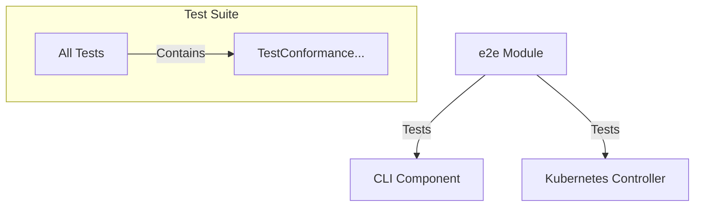

# ADR 0014: Conformance Test Suite

* **Status**: proposed
* **Deciders**: Maintainers
* **Date**: 2026-02-04

**Technical Story**: We need a robust conformance test suite to ensure our 
tooling (CLI and Kubernetes controllers) behaves as expected and adheres to 
a standard specification. This suite should be inspired by the Kubernetes 
conformance test suite but adapted to be more lightweight and integrated 
with our workflow.

## Context and Problem Statement

We are a platform engineering team developing tooling including a CLI and a 
Kubernetes controller. We need to ensure that released versions of our 
tooling are compatible with each other. Therefore, we need to establish a 
conformance test suite to validate our components.

Currently, our `kubernetes/controller` component has end-to-end (e2e) tests 
located in `kubernetes/controller/test/e2e`. 
These tests use [Ginkgo](https://onsi.github.io/ginkgo/) and [Gomega](https://onsi.github.io/gomega/).

However, we face several challenges and requirements:
1.  **Conformance Definition**: We need to clearly define which tests 
    constitute our "conformance profile".
2.  **Versioning**: We need to version our conformance tests to track 
    stability and compatibility over time.
3.  **Promotion Workflow**: We need a clear path to promote standard e2e
    tests to conformance tests.
4.  **Tooling Complexity**: Kubernetes uses an elaborate Ginkgo setup with 
    complex labeling for conformance. We need to weigh the added 
    functionality of complex tooling against the additional complexity.

## Decision Drivers

*   **Simplicity**: Preference for standard Go tooling over complex 
    frameworks where possible.
*   **Maintainability**: Easy to write, read, and debug tests.
*   **Discoverability**: Easy to identify which tests are conformance tests.
*   **Automation**: Easy to run specific subsets of tests (e.g., only 
    conformance tests) in CI/CD.

## Considered Options

Standalone e2e Module with:

*   **Option 1**: Ginkgo/Gomega with Labels (Kubernetes style)
    *   *Description*: Continue using Ginkgo and 
        adopt its Label feature to mark tests as `[Conformance]`. Use 
        Ginkgo's CLI to filter tests.
*   **Option 2**: Standard Go Testing + Testify with
    * **Option 2.1**: Name-Based Labeling (Simple)
      * *Description* Use test function names (e.g.,
      `TestConformance_...`) to identify conformance tests and standard Go
      test filtering (`-run regexp`).
    * **Option 2.2**: Functional Labeling (Go style)
      * *Description*: Use `if strings.Contains(os.Getenv("OCM_TEST_LABEL"), 
      labels) { t.Skip() }` in test code to indentify conformance 
      tests (see https://github.com/golang/go/blob/master/src/internal/testenv/testenv.go).

## Decision Outcome

Chosen **Option 2.2**: "Standalone e2e Module with Standard Go Testing + 
Testify with Functional Labeling (Go style)".

**Justification**:
*   **Lightweight**: Avoids the "DSL" overhead of Ginkgo. Our CLI is already
    entirely based on standard Go testing with testify. In the past, our 
    developers struggled with Ginkgo's implicit behaviors and its IDE integration.
*   **Functionality**: Functional labeling allows for a similar level of 
    flexibility as Ginkgo labels while being explicit.
*   **Native Tooling**: Leveraging `go test -run` is standard and
    well-understood by Go developers.
*   **Clear Separation**: A dedicated `e2e` module avoids circular 
    dependencies and keeps the test suite distinct from the component code.

### Option 2.2: Standalone e2e Module with Standard Go Testing + Testify with Functional Labeling (Go style)

#### Description

We will introduce a new top-level `e2e` Go module in the repository. 
This module will contain our end-to-end tests, a subset of which will 
serve as conformance tests.

**Key changes:**
1.  **New `e2e` Module**: A dedicated place for integration and conformance tests.
2.  **Framework**: Migration (for new/conformance tests) to `stretchr/testify` for assertions and standard `testing.T`.
3.  **Identification**: Conformance tests will be identified by the prefix `TestConformance`.
4.  **Promotion**: A test is promoted from a standard e2e test to a conformance test by renaming it to start with `TestConformance`. This is done via Pull Request.

#### High-level Architecture

#### Contract

*   **Naming**: All conformance tests must start with `TestConformance`.
*   **Location**: All conformance tests must reside in the `e2e` module.
*   **Versioning**: Tests will be versioned alongside the codebase. 
*   **Execution**: Conformance tests are executed via `go test ./... -run ^TestConformance`.

## Pros and Cons of the Options

### [Option 1] Ginkgo with Labels

Pros:
*   Rich BDD style (Given/When/Then).
*   Powerful tooling (generators, parallel execution).
*   Familiarity for those coming from Kubernetes development.

Cons:
*   Steep learning curve for the DSL.
*   Magic behavior (global state, complex bootstrapping).
*   Filtering requires specific Ginkgo CLI flags or label expressions.

### [Option 2] Standard Go + Testify (Chosen)

Pros:
*   Standard Go testing patterns (no DSL to learn).
*   Simple regex filtering built into `go test`.
*   `stretchr/testify` provides familiar assertions.
*   easier debugging (just a standard go binary).

Cons:
*   Less "readable" for non-developers (BDD style is sometimes preferred for specs).
*   Must enforce naming conventions manually (though linters can help).

## Discovery and Distribution

*   The decision will be implemented by creating the `e2e` folder and migrating initial tests.
*   CI pipelines will be updated to run the conformance suite using the `-run ^TestConformance` filter.
*   Documentation will be added to `CONTRIBUTING.md` regarding how to write and promote tests.

## Conclusion

By adopting standard Go testing with a strict naming convention in a dedicated `e2e` module, we establish a robust, maintainable, and verifiable conformance test suite. This simplifies our tooling stack while meeting the requirement for a rigid conformance definition and promotion workflow.
