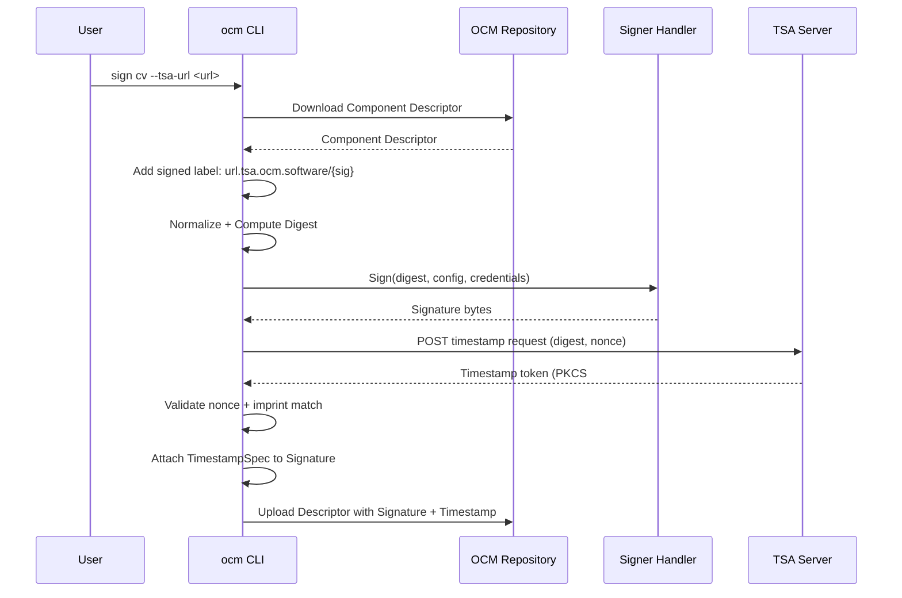
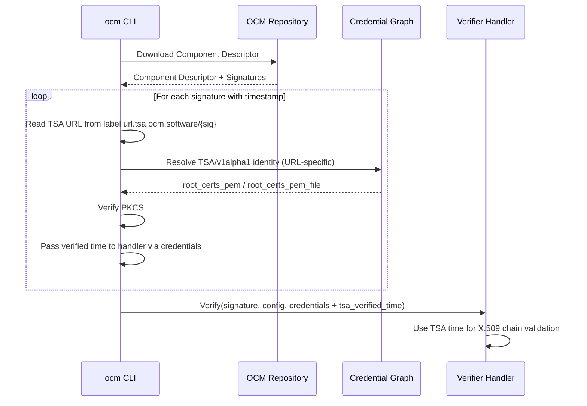

# RFC 3161 Timestamping Authority (TSA) Support for OCM Signatures

* **Status**: proposed
* **Deciders**: OCM Technical Steering Committee
* **Date**: 2026.04.03

**Technical Story**: Add optional RFC 3161 timestamping to OCM signing/verification so that signatures can be validated after the signing certificate expires, as long as the timestamp proves the signature was created while the certificate was valid.

---

## Context and Problem Statement

OCM component version signatures prove provenance and integrity. When PEM-encoded signatures embed an X.509 certificate chain, the verifier validates that chain against trust anchors. If the signing certificate expires between signing and verification, the signature is rejected even though it was valid when created.

This is a well-known problem in code signing. The industry-standard solution is RFC 3161 timestamping: at signing time, a trusted Timestamping Authority (TSA) counter-signs the digest with a timestamp token, proving when the signature was created. At verification time, the timestamp token is checked, and the certificate chain is validated against the TSA-attested time rather than the current time.

Without timestamping:
- Signatures become unverifiable after certificate expiry
- Short-lived certificates (common with OIDC-based flows like Sigstore) have a narrow verification window
- Long-lived certificates must be used to avoid verification failures, increasing key compromise risk

---

## Decision Drivers

* **Certificate lifecycle**: Allow verification of signatures after the signing certificate expires
* **Standards compliance**: Use RFC 3161, the widely adopted timestamping standard (used by Authenticode, Java jarsigner, Sigstore)
* **Credential graph integration**: TSA root certificates should be managed through the existing OCM credential graph, not ad-hoc CLI flags
* **Minimal surface**: Introduce TSA support with the smallest possible API surface while remaining useful
* **Backward compatibility**: Timestamps are optional; unsigned or timestamp-free signatures continue to work unchanged

---

## Considered Options

### Option 1: Embed timestamp in signature PEM block

Store the timestamp token inside the PEM-encoded signature block as an additional section or header.

**Pros:**
- Self-contained: everything lives in the signature value
- Mirrors how some code-signing formats (e.g. Authenticode) embed countersignatures

**Cons:**
- Only works with PEM encoding — Plain (hex) signatures have no structure to embed into
- Complicates PEM parsing; every consumer of the signature PEM must understand the timestamp extension
- Tightly couples the timestamp format to the signature encoding

### Option 2: Store timestamp as a separate field in the signature spec

Add a dedicated `Timestamp *TimestampSpec` field to the `Signature` type in the component descriptor.

**Pros:**
- Encoding-agnostic: works with Plain hex, PEM, and any future signature format
- Clean separation of concerns: signature handlers do not need to know about timestamps
- Straightforward to add/remove timestamps without touching the signature value
- The descriptor schema naturally evolves with an optional field

**Cons:**
- Requires schema changes to the descriptor types (v2 and runtime)
- The timestamp is visible in the serialized descriptor (though this is also a feature — transparency)

### Option 3: Store timestamp externally (out-of-band)

Store the timestamp token in a transparency log (e.g. Rekor) or a separate metadata repository, referenced by a pointer in the descriptor.

**Pros:**
- No descriptor schema changes needed
- Transparency log provides additional auditability

**Cons:**
- Introduces an external dependency for verification (the log must be reachable)
- Breaks the self-contained property of OCM descriptors
- Significantly more complex to implement and operate
- Not all environments have access to transparency logs

---

## Decision Outcome

Chosen Option 2: store the timestamp as a dedicated `timestamp` field on the `Signature` type, independent of the signature encoding (Plain or PEM).

Justification:

* Works with all signature encodings (Plain hex, PEM, future formats)
* The timestamp is stored alongside the signature in the component descriptor, keeping everything self-contained
* The TSA URL is preserved in a signed label for verifier-side credential resolution
* Backward-compatible: the `timestamp` field is optional and omitted when empty

---

## Trust Model

### Parties and Their Roles

An OCM signature with an RFC 3161 timestamp involves three independent trust domains:

| Party        | Trust role                             | What it controls                                                                                                |
|--------------|----------------------------------------|-----------------------------------------------------------------------------------------------------------------|
| **Signer**   | Creates the signature; chooses the TSA | Private signing key; the `--tsa-url` flag; the component descriptor content                                     |
| **TSA**      | Attests the time of signing            | PKCS#7 signature over the TSTInfo; its own certificate chain                                                    |
| **Verifier** | Decides what to trust                  | Root CA pool for the signing certificate; root CA pool for the TSA certificate; whether to accept the timestamp |

The fundamental security property is **separation of trust**: the signer proves *who* signed, the TSA proves *when* it was signed, and the verifier independently validates both claims using trust anchors that only the verifier controls.

### What the Timestamp Proves

An RFC 3161 timestamp token is a PKCS#7 SignedData structure that wraps a TSTInfo containing:

1. **MessageImprint** — the hash algorithm and digest value that was timestamped (must match the component descriptor digest)
2. **GenTime** — the TSA-attested generation time
3. **Nonce** — a caller-generated random value to prevent replay
4. **SerialNumber** — TSA-assigned serial for uniqueness
5. **Policy OID** — the TSA's timestamping policy

The PKCS#7 wrapper provides a cryptographic signature from the TSA's certificate over the TSTInfo. This proves:

- **The digest existed at GenTime**: the TSA saw the exact digest value at the attested time
- **The token is fresh**: the nonce matches the client's random challenge (checked at request time)
- **The token is authentic**: the PKCS#7 signature chains to a TSA root the verifier trusts (checked at verify time)

Crucially, the timestamp does **not** prove that the signing certificate was valid at GenTime — it only proves the digest existed. The certificate validity check is performed separately by the RSA handler using the TSA-attested time as the reference point.

### Trust Anchor Separation

The design enforces strict separation between who controls trust material at each stage:

**Signer-controlled** (embedded in the descriptor):
- The signature itself (Plain hex or PEM-encoded with cert chain)
- The TSA URL label (`url.tsa.ocm.software/{signatureName}`) — signed content, tamper-evident
- The PEM-encoded timestamp token (stored in `Signature.Timestamp.Value`)

**Verifier-controlled** (resolved from the credential graph):
- RSA public key or root CA for signature verification
- TSA root CA certificates for timestamp chain verification

This separation prevents the signer from asserting their own trust — the signer cannot embed a self-signed TSA root certificate and have it trusted. The verifier must independently configure which TSA roots to trust via their `.ocmconfig` credential graph.

### Verification Levels

The implementation supports three verification levels based on trust material availability:

| Level            | TSA root certs configured? | Timestamp present? | What is verified                                                                              |
|------------------|----------------------------|--------------------|-----------------------------------------------------------------------------------------------|
| **No timestamp** | N/A                        | No                 | Standard signature verification only                                                          |
| **Structural**   | No                         | Yes                | PKCS#7 parsing + imprint match; no chain verification; warning emitted                        |
| **Full**         | Yes                        | Yes                | PKCS#7 chain verification against root pool + imprint match + TSA time used for cert validity |

The structural level provides defense in depth: even without root certificates, the verifier confirms that the timestamp token is well-formed and references the correct digest. A tampered or fabricated token with a wrong imprint is rejected regardless of root certificate configuration.

### TSA URL as Signed Content

The TSA URL is stored as a **signed label** on the component descriptor. This means:

1. The label is added **before** digest computation, so it is included in the normalised descriptor hash
2. Any modification to the TSA URL after signing invalidates the descriptor digest
3. The verifier can trust that the TSA URL it reads from the descriptor is the one the signer intended

This prevents an attacker from replacing the TSA URL with one pointing to a TSA they control (which could issue backdated timestamps), because doing so would break the signature over the descriptor.

However, the TSA URL is only a **hint** for credential resolution — it tells the verifier which TSA root certificate to look up. The verifier's credential graph is the authoritative source of trust. If the credential graph does not have a matching entry for the TSA URL, verification falls back to structural-only mode.

### Threat Analysis

| Threat                                                | Mitigation                                                                                                                                                                                                                                        |
|-------------------------------------------------------|---------------------------------------------------------------------------------------------------------------------------------------------------------------------------------------------------------------------------------------------------|
| **Signer fabricates a timestamp**                     | The timestamp is a PKCS#7 structure signed by the TSA's key, not the signer's. A fabricated token fails PKCS#7 chain verification against the verifier's TSA root pool.                                                                           |
| **Signer embeds a self-signed TSA root**              | TSA roots come exclusively from the verifier's credential graph. Embedded roots are not trusted.                                                                                                                                                  |
| **Signer replaces the TSA URL**                       | The TSA URL is a signed label. Changing it invalidates the component descriptor digest and breaks the signature.                                                                                                                                  |
| **TSA issues a backdated timestamp**                  | A compromised TSA is a fundamental trust violation — the same risk exists in all timestamping systems. Mitigated by choosing reputable TSAs and configuring per-TSA root certificates (if TSA-A is compromised, TSA-B's signatures remain valid). |
| **TSA response replay**                               | Each request includes a 128-bit cryptographic nonce. The response nonce is validated at request time.                                                                                                                                             |
| **Attacker tampers with the token in the descriptor** | The token is stored in the `Signature.Timestamp` field. A modified token fails PKCS#7 signature verification. The imprint in the token must match the descriptor digest.                                                                          |
| **Expired signing certificate**                       | With a valid TSA timestamp, the X.509 chain is validated at the TSA-attested time instead of `time.Now()`, so an expired certificate is accepted if it was valid when the timestamp was created.                                                  |
| **Missing TSA root certificates**                     | Verification falls back to structural-only mode with a warning. The signature itself is still verified normally; only the timestamp lacks full chain verification.                                                                                |
| **Unbounded TSA response**                            | Response bodies are limited to 10 MB to prevent memory exhaustion from malicious/misconfigured servers.                                                                                                                                           |

---

## Architecture

### New Package: `bindings/go/signing/tsa`

A standalone TSA client library with no dependency on the RSA handler or CLI packages. It provides:

| File             | Purpose                                                                                                                                                                                                            |
|------------------|--------------------------------------------------------------------------------------------------------------------------------------------------------------------------------------------------------------------|
| `oid.go`         | OID constants and hash-to-OID mappings for SHA-256/384/512                                                                                                                                                         |
| `asn1.go`        | ASN.1 types (`Request`, `Response`, `Info`, `MessageImprint`, `PKIStatusInfo`, `Accuracy`) and nonce generation                                                                                                    |
| `tsa.go`         | `RequestTimestamp()` — sends an RFC 3161 request and validates the response; `Verify()` — verifies a DER-encoded token against a digest and optional root pool; PEM encoding/decoding for `TIMESTAMP TOKEN` blocks |
| `credentials.go` | `TSAConsumerIdentity()` — builds credential graph identities for TSA servers; `RootCertPoolFromCredentials()` — loads root CA pool from credential properties                                                      |
| `tsa_test.go`    | 49 unit tests covering request/response round-trips, nonce/imprint validation, wrong-digest rejection, wrong-root rejection, PEM encoding, structural-only verification                                            |

### Descriptor Changes

New types added to both `descriptor/runtime` and `descriptor/v2`:

```go
// TimestampSpec provides an RFC 3161 timestamp token and the parsed generation time.
type TimestampSpec struct {
    Value string    // PEM-encoded RFC 3161 timestamp token
    Time  time.Time // parsed generation time (informational)
}
```

The `Signature` type gains an optional `Timestamp *TimestampSpec` field. Conversion functions (`ConvertToV2TimestampSpec`, `ConvertFromV2TimestampSpec`) handle the runtime/v2 boundary. Deep copy generators are updated.

### Signing Flow

```
ocm sign cv <ref> --tsa-url <url>
```



Key details:
1. A signed label `url.tsa.ocm.software/{signatureName}` is added to the component **before** digest computation, so the TSA URL becomes part of the signed content
2. The label value is a plain JSON string (e.g., `"http://timestamp.digicert.com"`)
3. The TSA request is made **after** signing, using the same digest that was signed
4. The `--tsa` flag uses a default public TSA (`http://timestamp.digicert.com`); `--tsa-url` overrides it
5. Dry-run mode skips both the label addition and the TSA request

### Verification Flow

```
ocm verify cv <ref>
```



Key details:
1. If the signature has a `Timestamp`, the verifier extracts the TSA URL from the descriptor label
2. The URL is used to build a `TSA/v1alpha1` identity with `hostname`, `port`, and `scheme` attributes for URL-specific credential matching
3. Root certificates are loaded from the credential graph (`root_certs_pem` or `root_certs_pem_file`)
4. If no root certs are found, verification falls back to structural-only (PKCS#7 parsing + imprint match, no chain verification) with a warning
5. The verified TSA time is passed to the signing handler via the `tsa_verified_time` credential key
6. The RSA handler uses this time instead of `time.Now()` for X.509 chain validation, allowing verification of signatures with expired certificates

### Credential Graph Integration

TSA root certificates are managed through the standard OCM credential graph, not CLI flags.

**Signing side** — no credential graph interaction for TSA; the URL is provided via `--tsa` / `--tsa-url` flags.

**Verification side** — root certificates are resolved from the credential graph using a `TSA/v1alpha1` consumer identity:

```yaml
# URL-specific TSA root certificates
- identity:
    type: TSA/v1alpha1
    hostname: timestamp.digicert.com
    scheme: http
  credentials:
  - type: Credentials/v1
    properties:
      root_certs_pem_file: /path/to/digicert-tsa-root.pem
```

The URL-specific identity enables different root certificates for different TSA servers, matched using the standard `runtime.ParseURLToIdentity` mechanism (scheme, hostname, port, path).

### Cross-Module Boundary

The RSA handler (`bindings/go/rsa`) cannot import `bindings/go/signing/tsa` due to Go module boundaries. The verified TSA time is passed through the credentials map using the well-known key `tsa_verified_time`. The canonical constant `tsa.VerifiedTimeKey` lives in the TSA package; the RSA handler uses the string literal with a comment referencing it.

---

## CLI Flags

| Flag        | Command   | Description                                                |
|-------------|-----------|------------------------------------------------------------|
| `--tsa`     | `sign cv` | Request RFC 3161 timestamp from the default TSA (DigiCert) |
| `--tsa-url` | `sign cv` | Custom TSA server URL (implies `--tsa`)                    |

No new flags on `verify cv` — TSA verification is automatic when a timestamp is present, and root certificates come from the credential graph.

---

## Files Changed

| File                                                      | Change                                                                          |
|-----------------------------------------------------------|---------------------------------------------------------------------------------|
| `bindings/go/signing/tsa/oid.go`                          | New: OID constants and hash mappings                                            |
| `bindings/go/signing/tsa/asn1.go`                         | New: ASN.1 types, nonce generation, status parsing                              |
| `bindings/go/signing/tsa/tsa.go`                          | New: TSA client (`RequestTimestamp`, `Verify`, PEM encoding)                    |
| `bindings/go/signing/tsa/credentials.go`                  | New: `TSAConsumerIdentity`, `RootCertPoolFromCredentials`, credential constants |
| `bindings/go/signing/tsa/tsa_test.go`                     | New: 49 unit tests with mock TSA server                                         |
| `bindings/go/descriptor/runtime/descriptor.go`            | Add `TimestampSpec` type and `Timestamp` field to `Signature`                   |
| `bindings/go/descriptor/v2/descriptor.go`                 | Add `TimestampSpec` type and `Timestamp` field to `Signature`                   |
| `bindings/go/descriptor/runtime/convert_v2.go`            | Add `ConvertToV2TimestampSpec` / `ConvertFromV2TimestampSpec`                   |
| `bindings/go/descriptor/runtime/zz_generated.deepcopy.go` | Generated deep copy for `TimestampSpec`                                         |
| `bindings/go/descriptor/v2/zz_generated.deepcopy.go`      | Generated deep copy for `TimestampSpec`                                         |
| `bindings/go/rsa/signing/handler/handler.go`              | Use `tsa_verified_time` from credentials for X.509 chain validation time        |
| `bindings/go/signing/digest.go`                           | Export `GetSupportedHash` helper                                                |
| `cli/cmd/sign/component-version/cmd.go`                   | Add `--tsa` / `--tsa-url` flags, TSA URL label, timestamp request               |
| `cli/cmd/verify/component-version/cmd.go`                 | Per-signature TSA verification with URL-specific credential lookup              |
| `cli/integration/signing_tsa_integration_test.go`         | New: integration tests for TSA sign+verify flow                                 |

---

## Pros and Cons

### Pros

* **Long-lived signature validity** — signatures remain verifiable after signing certificate expiry, eliminating the tension between short-lived certificates (better security) and long verification windows (better usability)
* **Fully backward-compatible** — no changes required for users who do not use TSA; existing signatures without timestamps continue to verify as before; the `timestamp` field is `omitempty`
* **Tamper-evident TSA URL** — the TSA URL is a signed label included in the normalised descriptor hash, so an attacker cannot redirect the verifier to a different TSA without breaking the signature
* **Verifier-controlled trust** — TSA root certificates live exclusively in the verifier's credential graph; the signer cannot embed or assert TSA trust anchors
* **Per-TSA root certificate management** — URL-specific identity matching allows different root CAs for different TSA servers, so a compromise of one TSA does not affect trust in others
* **Standards-based** — uses RFC 3161 and PKCS#7 (CMS), interoperable with existing TSA infrastructure (DigiCert, Sectigo, SSL.com, etc.)
* **Graceful degradation** — if no root certs are configured, structural verification (PKCS#7 parsing + imprint match) still runs, with a clear warning; this provides defense-in-depth even without full trust configuration
* **Nonce-protected requests** — 128-bit cryptographic nonces prevent response replay attacks at request time

### Cons

* **Network dependency at signing time** — the TSA server must be reachable; signing fails if the TSA is unavailable (mitigated: TSA is optional, disabled by default)
* **Timestamp verification latency** — PKCS#7 parsing and optional chain validation add compute overhead to the verify path (typically <10ms for a single token)
* **Signing flow ordering** — the TSA URL label must be added before digest computation, coupling the timestamp decision to an early point in the signing flow; this is an inherent consequence of making the URL tamper-evident
* **Cross-module string key** — the RSA handler cannot import `signing/tsa` due to Go module boundaries, so the verified time is passed via a string credential key (`tsa_verified_time`) rather than a typed interface; this is documented but not compiler-enforced
* **Trust in the TSA** — a compromised TSA can issue backdated timestamps; this is a fundamental limitation of all timestamping systems, mitigated by choosing reputable TSAs and the per-TSA root certificate isolation

---

## Future Work

* **TSA certificate chain verification time** — currently, the TSA's own PKCS#7 chain is verified at the current time. In a future iteration, the TSA certificate's validity could be checked against a separate trust policy.
* **Multiple timestamps per signature** — the current design stores a single timestamp per signature. Multiple timestamps from different TSAs could provide redundancy if one TSA is later compromised.
* **Timestamping for Sigstore plugin** — the Sigstore signing handler (ADR 0008) uses Rekor for transparency; a future integration could combine Rekor entries with RFC 3161 timestamps for defense-in-depth.
* **TSA URL from credential graph for signing** — currently, the TSA URL is only provided via CLI flags. A future enhancement could also resolve the TSA URL from the credential graph during signing, enabling fully config-driven workflows.

---

## Conclusion

RFC 3161 timestamping extends OCM signing with a proven, standards-based mechanism for long-lived signature validity. The trust model enforces strict separation between signer-controlled content (the signature and timestamp token) and verifier-controlled trust anchors (root certificates in the credential graph), preventing signers from asserting their own trust. The implementation is self-contained in `bindings/go/signing/tsa`, integrates with the existing credential graph for trust material, and preserves full backward compatibility. Timestamps are optional and transparent to users who do not need them, while providing a meaningful security improvement — the ability to use short-lived certificates without sacrificing long-term verifiability — for those who do.
