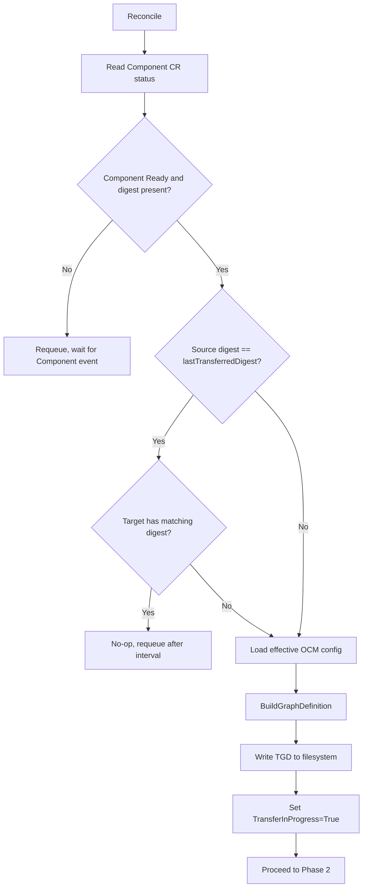
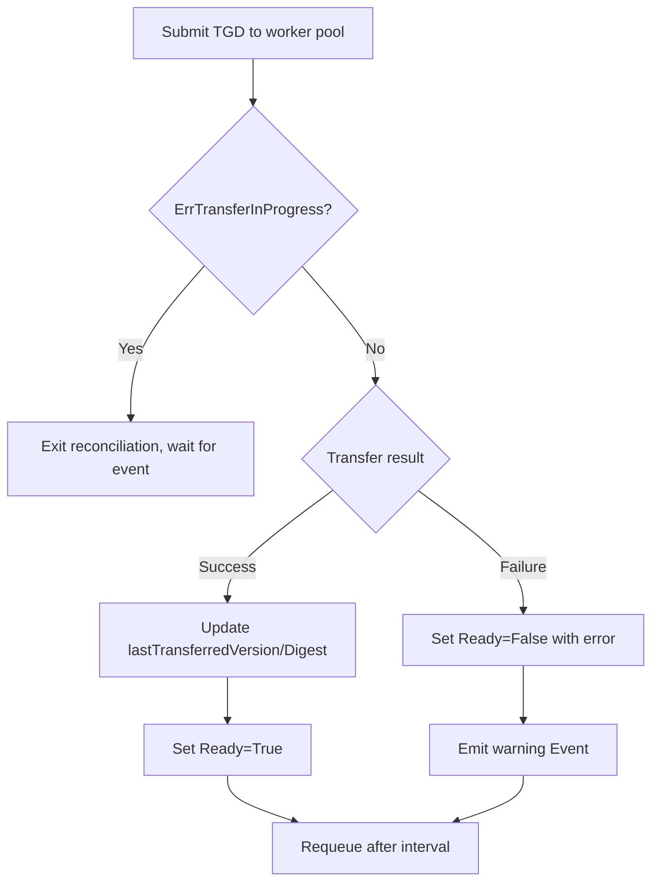

# Replication Controller

* Status: proposed
* Deciders: @frewilhelm @Skarlso @fabianburth @jakobmoellerdev
* Date: 2026-04-16

Technical Story: [ocm-project#953](https://github.com/open-component-model/ocm-project/issues/953)

Supersedes: [previous replication ADR](../../kubernetes/controller/docs/adr/replication.md)

## Context and Problem Statement

The replication controller transfers component versions from a source to a target
repository. The previous ADR stored replication history in the CR status, which caused
etcd size pressure for unclear value. The library now provides Transformation Graph
Definitions for transfers, already used by the CLI via `bindings/go/transfer/`.

### Constraints

* TGDs for large component trees can approach or exceed Kubernetes storage practical limits due to etcd's default 1.5 MiB max request size.
* Only the latest resolved component version is replicated for now.

## Decision Drivers

* The controller should introduce as few new CRDs as possible.
* The design must allow splitting into separate CRDs later without breaking existing users.
* Transfer detection should be digest-based rather than version string comparisons.
* Transfer specs must remain inspectable for debugging without bloating etcd.

## Considered Options

* [Option 1: Single Replication CRD](#option-1-single-replication-crd)
* [Option 2: Replication + Transfer CRDs](#option-2-replication--transfer-crds)
* [Option 3: Replication + Job](#option-3-replication--job)

## Decision Outcome

Chosen option: **Option 1 (Single Replication CRD)**. Follows the existing async
resolution service pattern (worker pool + `ErrResolutionInProgress`). TGD building
and TGD execution are separated internally, so a future CRD split requires no
spec changes.

### CRD Design

```yaml
apiVersion: delivery.ocm.software/v1alpha1
kind: Replication
metadata:
  name: replicate-podinfo
  namespace: default
spec:
  componentRef:
    name: podinfo-component
    namespace: default

  targetRef:
    name: target-repository

  transferConfig:
    recursive: false
    copyMode: localBlob     # localBlob | allResources

  ocmConfig:
    - name: my-ocm-config
      kind: Secret
      policy: Propagate

  suspend: false
```

`copyMode`:

* `localBlob`: inline resource blobs into the component descriptor at the target. Default.
* `allResources`: transfer every resource as a standalone artifact; keep external references intact.

`recursive` controls whether referenced component versions are transferred alongside the root.

Source and target credentials are resolved through `ocmConfig`; no separate credential fields on the CR.

### Status Design

```yaml
status:
  conditions:
    - type: Ready
      status: "True"
      reason: TransferComplete
      message: "Successfully transferred component version 1.2.3"
    - type: TransferInProgress
      status: "False"
      reason: Idle

  lastTransferredVersion: "1.2.3"
  lastTransferredDigest: "sha256:abc123..."

  componentInfo:
    component: ocm.software/podinfo
    version: "1.2.3"
    digest: "sha256:abc123..."

  effectiveOCMConfig:
    - name: my-ocm-config
      kind: Secret
      policy: Propagate

  observedGeneration: 3
```

`componentInfo` reflects the currently observed source; `lastTransferredVersion`/`lastTransferredDigest` record the
last successful transfer. A mismatch between them indicates a pending transfer.

### Reconciliation Flow

Similar to the resolution service, this is the two-phase process for transfer.
Following the existing `ErrResolutionInProgress` pattern, phase 2 introduces a
transfer-specific in-progress sentinel error named `ErrTransferInProgress`.

#### Phase 1: Plan (build TGD)



The reconciler gates on Component CR readiness: if the Component is not `Ready` or `status.componentInfo.digest` is absent, the Replication requeues and waits for a Component event rather than acting on incomplete source state.

#### Phase 2: Execute (run TGD)



### Trigger Conditions

* Component CR digest differs from `status.lastTransferredDigest`.
* Target repository does not contain the expected component version.
* Replication CR spec changes (via `observedGeneration`).

### Worker Pool

Dedicated transfer worker pool, separate from resolution. Non-blocking submission.
On completion, emits an event to retrigger the reconciler. Results cached by
composite key (source digest + target spec hash + config hash); default TTL 1h,
tunable via controller flag.

Transient source/target errors (network, 5xx, rate limit) retry with exponential
backoff inside the worker; terminal errors surface immediately as `Ready=False`.

### Transfer Spec Storage

TGDs are written to a scratch volume:

* Default: `emptyDir`. TGDs regenerate cheaply on pod restart.
* Optional: PVC for operators who need persistence across restarts.
* Path: `/var/run/ocm/transfer-specs/{namespace}-{name}-{version}.json`.
* GC on CR deletion (finalizer) or version supersession.

Compressed inline storage on the CR and ConfigMap-backed storage were considered and rejected: 
both still hit Kubernetes object size limits and shift, rather than remove, the etcd pressure.

### Watches

* **Component CR**: field index on `spec.componentRef`.
* **Worker pool event source**: retriggers on async completion.
* **Finalizer**: `delivery.ocm.software/replication-finalizer` for cleanup.

### Deletion Semantics

When a Replication CR is deleted:

1. Finalizer blocks removal; reconciler observes `deletionTimestamp`.
2. In-flight transfer is canceled via a per-item context keyed by CR UID. The worker canceled as soon as possible.
3. Bounded drain (default 30s, controller flag) waits for worker acknowledgement.
4. GC: remove TGD file, drop cache entry, unregister event source.
5. Finalizer removed, CR deleted.

If the drain times out, the finalizer is force-removed and a warning is logged; the in-flight goroutine is reclaimed on pod restart.

_**Note**_: A canceled transfer may leave partial or corrupted blobs at the target. This is expected since we are cancelling
a stream and is reconciled by the next replication run, which is digest-idempotent.

### Pros

* Minimal complexity for users.
* Resolution service already works.
* Filesystem negates the limit from etcd.
* Internal plan/execute split enables future CRD separation.

### Cons

* Long transfers block a worker pool slot. Mitigated by configurable pool size.
* Filesystem TGD storage lost on pod restart. Acceptable since TGDs regenerate
  on next reconciliation.
* If filesystem isn't available because of read-only disks, this does not work.
* Transfer not independently observable as a K8s resource.
* A pod crash between TGD write and status update can leave an orphan file;
  reclaimed on the next reconcile or finalizer run.

## Pros and Cons of the Options

### Option 1: Single Replication CRD

#### Pro

* Minimal surface area.
* Follows resolution service pattern.
* Fastest to implement.
* Internal separation allows future split.

#### Con

* Transfer not independently trackable.
* Debugging needs filesystem access.

### Option 2: Replication + Transfer CRDs

#### Pro

* Clean separation of concerns.
* Transfer CRs are independently observable and retryable.

#### Con

* TGDs can exceed Kubernetes/etcd object size constraints, so external storage is still needed.
* Two CRDs from day one with no user demand.

### Option 3: Replication + Job

#### Pro

* Built-in retry, timeout, resource limits.
* Isolated execution.

#### Con

* Requires separate transfer executor image.
* State sharing adds complexity.
* Job lifecycle management is non-trivial.

## Future Evolution

1. **Multi-version replication**: extend `spec` with `versionConstraint`.
2. **CRD split**: internal phases map directly to Replication/Transfer CRDs.
3. **Transfer policies**: `replaceIfPresent`, `skipExisting`, etc.
4. **Multiple targets**: `ReplicationSet` CRD for fan-out.

## Links

* [ocm-project#953](https://github.com/open-component-model/ocm-project/issues/953)
* [Previous replication ADR](../../kubernetes/controller/docs/adr/replication.md)
* [Transfer CLI](../../cli/cmd/transfer/)
* [Resolution service](../../kubernetes/controller/internal/resolution/)
