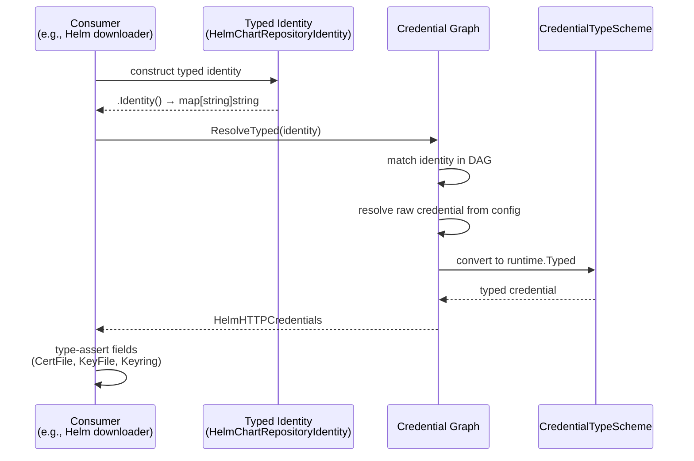
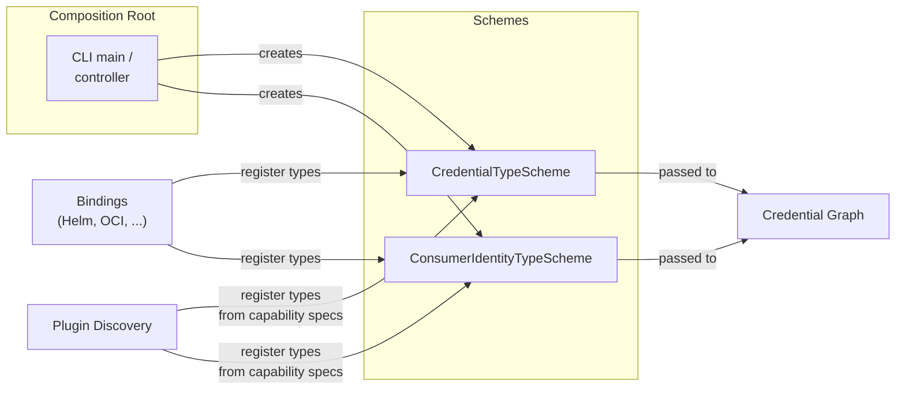

# Typed Credentials and Consumer Identity Types

* **Status**: proposed
* **Deciders**: OCM Technical Steering Committee
* **Date**: 2026-04-15

Technical Story: Evolve the OCM credential system from untyped `map[string]string` credentials into a type-safe,
self-documenting system that validates credential and identity types at both configuration time and consumption time.

## Context and Problem Statement

The credential graph (see [ADR 0002](0002_credentials.md)) resolves credentials for consumer identities through a DAG.
The resolution model is sound, but credentials and identities are untyped:

- **Credentials are `map[string]string`** — key names like `username`, `password`, `accessToken` are scattered string
  constants with no compile-time guarantees.
  A real bug exists where OCI resource downloads used `access_token` (snake_case) while docker config resolution used
  `accessToken` (camelCase), causing silent auth failures
  ([ocm-project#985](https://github.com/open-component-model/ocm-project/issues/985)).

- **Consumer identity types are scattered strings** — `"OCIRegistry"`, `"HelmChartRepository"`, `"RSA/v1alpha1"` defined
  independently per binding with no central registry, inconsistent versioning, and no way to enumerate them.

- **No validation of identity ↔ credential compatibility** — configuring RSA credentials for a Helm identity produces no
  warning. Users have no way to discover what credentials each identity type accepts.

- **No credential type specialization** — a Helm HTTP repository needs `certFile`/`keyFile`/`keyring`, while an
  OCI-backed Helm repository needs `username`/`password`/`accessToken`. Both use the same generic map today, making
  invalid combinations representable.

## Decision Drivers

1. **Type safety** — Invalid credential fields caught at compile time, not runtime
2. **Validation** — Mismatched identity/credential pairs detected at configuration time
3. **Discoverability** — Users and tooling can enumerate identity types, their accepted credential types, and required
   fields
4. **Backward compatibility** — Existing `.ocmconfig` files continue to work unchanged
5. **Gradual migration** — Multi-module monorepo requires non-blocking, per-binding migration
6. **Extensibility** — Plugins can register custom types without collisions

## Decision Outcome

> **Composition root** — the single place near the application entry point (CLI `main`, controller setup) where all
> components are assembled, configured, and wired together. In OCM, this is where schemes are created, binding
> registration functions are called, and the populated schemes are passed to the graph. The term is used throughout this
> ADR.

### Typed Credential and Identity Specs

Each binding defines typed Go structs for its credentials and identities, registered in `runtime.Scheme` registries. The
type system enforces valid credential shapes — for example, Helm HTTP credentials have `CertFile`/`KeyFile`/`Keyring`
fields, while OCI credentials have `AccessToken`/`RefreshToken`. Invalid combinations are unrepresentable.

Where a single consumer supports multiple credential shapes (e.g., Helm supports both HTTP and OCI repositories),
separate credential types are defined per access mode rather than one type with all fields.

### Identity → Credential Type Validation

Typed identity structs declare which credential types they accept:

```go
type CredentialAcceptor interface {
AcceptedCredentialTypes() []runtime.Type
}
```

The graph validates during ingestion that configured credential types are compatible with the identity type.
Incompatible pairs produce **warnings, not errors** — ingestion continues and the credentials are still stored. This is
deliberate: during migration, not all types will be registered in the scheme, and plugins loaded after ingestion may
introduce types unknown at ingestion time. Rejecting eagerly would break valid configs. Instead, consumers reject
credentials of the wrong type at resolution time with clear errors.

### Resolver Evolution

The existing `Resolver` interface gains a `ResolveTyped` method that returns `runtime.Typed` instead of
`map[string]string`. The graph stores credentials as `runtime.Typed` internally and resolves typed credentials from
config when a `CredentialTypeScheme` is provided. `DirectCredentials/v1` serves as the fallback for old configurations.

Adding a method to an interface breaks implementors (all in our codebase), not consumers. Each binding migrates from
`Resolve` to `ResolveTyped` independently, with no changes to function signatures, context wiring, or intermediate
layers that thread the resolver through.

A separate `TypedResolver` interface was considered and prototyped. It creates cascading signature changes: every
intermediate layer (context, builder, transformers) must carry and pass both interfaces during migration. A single
interface with two methods avoids this — bindings change only the method they call, not what they accept. A generic
interface (`TypedResolver[T any]`) was also tested; it does not work because the graph returns `runtime.Typed`
(type-erased) and Go generics are invariant, so `TypedResolver[runtime.Typed]` cannot satisfy
`TypedResolver[*HelmHTTPCredentials]`.

```go
// Pseudocode — updated Resolver interface
type Resolver interface {
    Resolve(ctx context.Context, identity runtime.Identity) (map[string]string, error)  // existing
    ResolveTyped(ctx context.Context, identity runtime.Identity) (runtime.Typed, error) // new
}

// Pseudocode — consumer usage
identity := HelmChartRepositoryIdentity{Host: "charts.example.com", Path: "/stable"}
typed, err := resolver.ResolveTyped(ctx, identity.Identity())
creds := typed.(*HelmHTTPCredentials) // type-safe access
fmt.Println(creds.CertFile, creds.KeyFile)
```

#### `ResolveAs[T]` — optional generic helper

A free-standing generic function provides compile-time type safety at call sites without requiring generic interfaces
(Go does not support type parameters on interface methods —
[golang/go#49085](https://github.com/golang/go/issues/49085)). Consumers MAY use this helper instead of manual
type assertions after `ResolveTyped`.

```go
func ResolveAs[T runtime.Typed](ctx context.Context, r Resolver, id runtime.Identity) (T, error) {
    var zero T
    typed, err := r.ResolveTyped(ctx, id)
    if err != nil {
        return zero, err
    }
    out, ok := typed.(T)
    if !ok {
        return zero, fmt.Errorf("credential type mismatch: want %T, got %T", zero, typed)
    }
    return out, nil
}

// Consumer usage with ResolveAs
creds, err := credentials.ResolveAs[*HelmHTTPCredentials](ctx, resolver, identity.ToIdentity())
```



### Typed Identity Structs

Typed identity structs implement `IdentityProvider` to produce `runtime.Identity` maps for graph lookup. They provide
structured construction and validation while remaining compatible with the graph's existing matching system.

### Scheme Wiring and Graph Independence

The credential graph must remain independent of binding-specific types. It accepts two optional schemes via its
configuration:

- **`CredentialTypeScheme`** — knows how to create typed credential objects (e.g., `HelmHTTPCredentials/v1`)
- **`ConsumerIdentityTypeScheme`** — knows how to create typed identity objects for validation (e.g.,
  `HelmChartRepository/v1`)

The schemes are the **single unified mechanism** for type registration. Both internal bindings and external plugins
register through the same schemes — the graph never knows or cares where a type came from. Internal bindings register
Go structs directly; external plugins register as `runtime.Raw` from their capability specs. The composition root
aggregates both sources into the same scheme instances and passes them to the graph.

This is deliberate: one registration path means less conceptual load, no "is this internal or external?" distinction,
and a single place to debug type registration issues. Routing type registration through the plugin system was
considered and rejected — it would actually create two paths (internal bindings registering through plugins vs.
plugins declaring capabilities), which is the opposite of simplification.

The schemes serve a fundamentally different purpose than the credential plugins. The `CredentialPlugin` interface
resolves credentials from external sources (Vault, AWS) at **query time**. The schemes deserialize typed credentials
from `.ocmconfig` at **ingestion time** — before any plugin is called. Inline typed credentials configured directly by
the user (e.g., `type: HelmHTTPCredentials/v1` with `username`/`certFile` fields) do not involve a plugin at all; only
the scheme is needed to turn the config JSON into a Go struct.

Each binding provides a `MustRegisterCredentialType(scheme)` and `MustRegisterIdentityType(scheme)` function. The
application entry point (CLI, controller) creates the schemes, calls each binding's registration function, and passes
the populated schemes to the graph via options. The graph never imports binding packages — it only works with
`runtime.Typed` and `runtime.Scheme`.



External plugins declare their produced types in their capability spec. After plugin discovery, the composition root
reads the capabilities and registers types into the schemes. Consumers that need typed access to plugin credentials can
register their own Go struct for the same type — `scheme.Convert` handles the `Raw` → struct conversion.

**Plugin type naming convention — for coexistence, not collision prevention:** External plugin type names are prefixed
with the plugin's reverse-domain ID (e.g., `com.hashicorp.vault.VaultCredentials/v1`); built-ins use short names (e.g.,
`HelmHTTPCredentials/v1`). This is a *naming convention*, not a safety mechanism — uniqueness is already enforced
mechanically by `runtime.Scheme.TypeAlreadyRegisteredError`, which rejects duplicate registrations at startup.

The convention exists to **let two independent plugin authors coexist** when they independently pick the same short
name. Without namespacing, two plugins both declaring `OCICredentials/v1` collide at startup and the user has to drop
one. With reverse-domain prefixes, `com.vendora.OCICredentials/v1` and `com.vendorb.OCICredentials/v1` load side by
side. This follows the same idea as Jenkins plugin identifiers.

This means:

- Adding a new binding or plugin does not modify the credential graph
- The graph validates and resolves types generically through the scheme
- Built-in types are registered as Go structs, external plugin types as `runtime.Raw` — consumers use `scheme.Convert`
  to get typed structs
- Built-ins register first (at startup), plugins register after (at discovery) — duplicate registrations error out
  via `runtime.Scheme.TypeAlreadyRegisteredError`; there is no silent override or precedence
- Both schemes are optional (nil-safe) — the graph degrades to `DirectCredentials` behavior when no scheme is provided

### Backward Compatibility

- `.ocmconfig` format is unchanged — `Credentials/v1` with `properties` continues to work
- `DirectCredentials/v1` is the universal fallback, registered with all aliases
- Bindings MAY expose a `FromDirectCredentials` helper to lift legacy `Credentials/v1` configs
  (nested `properties` map) into their typed struct (flat fields). It is **not required by the framework** and the
  graph never calls it; it is an optional per-binding convenience at legacy-map boundaries (plugin binary receiving
  a map, or a consumer still holding an old `Credentials/v1` config). Generic `scheme.Convert` cannot do this lift
  because the JSON shapes differ (nested vs flat).
- Unversioned identity types work through `runtime.Scheme` alias resolution

### External Plugin Integration

External plugins (separate binaries) communicate with the plugin manager over HTTP carrying JSON. The transport is
unchanged. Today the contract signature is `credentials map[string]string`; Phase 3 changes the **Go contract
signature** to `credentials runtime.Typed`, with `scheme.Convert(typed, *runtime.Raw)` /
`scheme.Convert(*runtime.Raw, typed)` handling serialization at the sender and receiver. The HTTP bytes are JSON either
way — only the Go API shape changes.

**At discovery time:** The plugin manager runs each plugin binary with `capabilities` and reads the capability JSON.
Each `SupportedConsumerIdentityType` in the capability spec includes an `AcceptedCredentialTypes` field — the JSON
equivalent of the Go `CredentialAcceptor` interface. This allows plugins written in any language to declare the
identity → credential type mapping. The composition root reads these declarations and builds the identity/credential
schemes for the graph.

**At the plugin boundary (post Phase 3):** The graph hands the resolved `runtime.Typed` directly to the plugin
contract; the plugin transport marshals it to canonical JSON via the scheme and the plugin-side handler unmarshals
back into its typed struct. No per-type `FromDirectCredentials` call is needed on this path.

**Type naming for plugins:** See *Plugin type naming convention* above — reverse-domain prefixes are a naming
convention that lets two independent plugins coexist; `runtime.Scheme` still enforces uniqueness.

**Consumer-side conversion:** Consumers that need to work with plugin-declared credential types can either register
their own Go struct in the credential type scheme (giving direct type-assertion support) or use `scheme.Convert` to
convert from `*runtime.Raw` to a typed struct after resolution.

## Migration Path

The OCM codebase is a multi-module Go monorepo where each binding has its own `go.mod`. Interface changes cascade across
module boundaries. Without `go.work`, modules resolve from the proxy — so changes must be published in dependency order.

### Phase 1: Foundation

Add `ResolveTyped` to `Resolver`, the `ResolveAs[T]` generic helper, typed credential/identity scheme support to the
graph, and `IdentityProvider`/`CredentialAcceptor` interfaces to runtime. No downstream breakage — all existing code
continues to work.

### Phase 2: Binding migration (parallelizable)

Each binding creates its typed credential and identity specs, migrates internal code to use `ResolveTyped` (or
`ResolveAs[T]` for type-safe call sites), and rejects incompatible credential types. Bindings can be migrated
independently in separate PRs.

### Phase 3: Plugin interfaces

Update `CredentialPlugin` and `RepositoryPlugin` interfaces to accept and return `runtime.Typed`. Plugin HTTP transport
converts at the wire boundary.

### Phase 4: Repository interfaces

Once all bindings work with typed credentials, update `ResourceRepository`, `ComponentVersionRepositoryProvider`,
`ResourceDigestProcessor`, `Signer`/`Verifier`, and constructor interfaces to accept `runtime.Typed`.

### Phase 5: Consumer migration

CLI commands, K8s controller, and remaining consumers switch from `Resolve` to `ResolveTyped`.

### Phase 6: Cleanup

Deprecate `Resolve` method. Remove internal map conversion helpers and legacy credential key constants.

### Key Constraints

- Module publish order matters — each phase must be merged and published before downstream phases.
- Phase 2 PRs can run in parallel across bindings.
- Phase 4 blocks on Phase 2 completion.
- Phase 6 is the only step that removes backward compatibility.
- Old `.ocmconfig` files work at every stage.

## Conclusion

The typed credential system makes invalid credential configurations unrepresentable through Go's type system. Each
binding owns its credential and identity types. The graph validates and stores typed credentials natively. The gradual
migration path ensures no development blocking while transitioning the multi-module monorepo.
