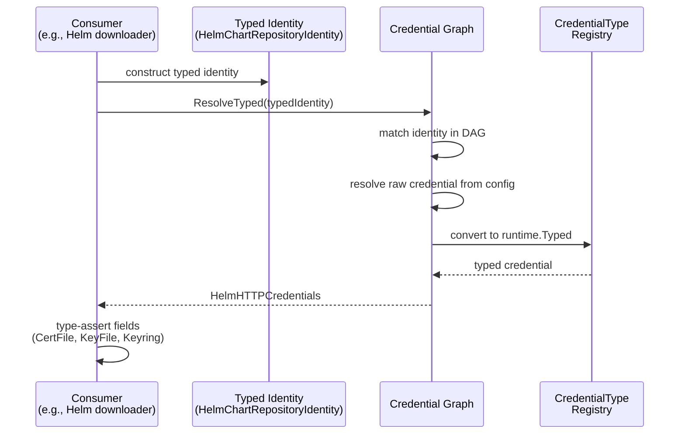

# Typed Credentials and Consumer Identity Types

* **Status**: proposed
* **Deciders**: OCM Technical Steering Committee
* **Date**: 2026-04-15

Technical Story: Evolve the OCM credential system from untyped `map[string]string` credentials into a type-safe,
self-documenting system that validates credential and identity types at both configuration time and consumption time.

## Context and Problem Statement

The credential graph (see [ADR 0002](0002_credentials.md)) resolves credentials for consumer identities through a DAG.
The resolution model is sound, but credentials and identities are untyped:

- **Credentials are `map[string]string`** — key names like `username`, `password`, `accessToken` are scattered string
  constants with no compile-time guarantees.
  A real bug exists where OCI resource downloads used `access_token` (snake_case) while docker config resolution used
  `accessToken` (camelCase), causing silent auth failures
  ([ocm-project#985](https://github.com/open-component-model/ocm-project/issues/985)).

- **Consumer identity types are scattered strings** — `"OCIRegistry"`, `"HelmChartRepository"`, `"RSA/v1alpha1"` defined
  independently per binding with no central registry, inconsistent versioning, and no way to enumerate them.

- **No validation of identity ↔ credential compatibility** — configuring RSA credentials for a Helm identity produces no
  warning. Users have no way to discover what credentials each identity type accepts.

- **No credential type specialization** — a Helm HTTP repository needs `certFile`/`keyFile`/`keyring`, while an
  OCI-backed Helm repository needs `username`/`password`/`accessToken`. Both use the same generic map today, making
  invalid combinations representable.

## Decision Drivers

1. **Type safety** — Invalid credential fields caught at compile time, not runtime
2. **Validation** — Mismatched identity/credential pairs detected at configuration time
3. **Discoverability** — Users and tooling can enumerate identity types, their accepted credential types, and required
   fields
4. **Backward compatibility** — Existing `.ocmconfig` files continue to work unchanged
5. **Gradual migration** — Multi-module monorepo requires non-blocking, per-binding migration
6. **Extensibility** — Plugins can register custom types without collisions

## Decision Outcome

### Typed Credential and Identity Specs

Each binding defines typed Go structs for its credentials and identities, registered in `runtime.Scheme` registries. The
type system enforces valid credential shapes — for example, Helm HTTP credentials have `CertFile`/`KeyFile`/`Keyring`
fields, while OCI credentials have `AccessToken`/`RefreshToken`. Invalid combinations are unrepresentable.

Where a single consumer supports multiple credential shapes (e.g., Helm supports both HTTP and OCI repositories),
separate credential types are defined per access mode rather than one type with all fields.

### Identity → Credential Type Validation

The `IdentityTypeRegistry` stores which credential types each identity type accepts. This mapping is declarative — it
is provided at registration time, not implemented as an interface on the identity struct. This keeps identity structs
free of credential-type imports and aligns built-in bindings with the same registration model used by external plugins
(which declare `AcceptedCredentialTypes` in their capability JSON).

```go
// Registration — each binding declares the mapping at startup
identityTypeRegistry.RegisterWithAcceptedCredentials(
    &HelmChartRepositoryIdentity{},
    []runtime.Type{VersionedType, Type},                    // identity types (default + aliases)
    []runtime.Type{helmcredsv1.HelmHTTPCredentialsVersionedType}, // accepted credential types
)

// Query — the graph validates during ingestion
accepted, ok := identityTypeRegistry.AcceptedCredentialTypes(identityType)
```

The graph validates during ingestion that configured credential types are compatible with the identity type.
Incompatible pairs produce **warnings, not errors** — ingestion continues and the credentials are still stored. This is
deliberate: during migration, not all types will be registered in the scheme, and plugins loaded after ingestion may
introduce types unknown at ingestion time. Rejecting eagerly would break valid configs. Instead, consumers reject
credentials of the wrong type at resolution time with clear errors.

### Resolver Evolution

The existing `Resolver` interface gains a `ResolveTyped` method that returns `runtime.Typed` instead of
`map[string]string`. `ResolveTyped` accepts `runtime.Typed` as its identity parameter — not `runtime.Identity`. This
means consumers can pass typed identity structs directly. The only remaining uses of `runtime.Identity` are at the
plugin interface boundary (`CredentialPlugin`, `RepositoryPlugin`) which Phase 3 will migrate to `runtime.Typed`.

The graph stores credentials as `runtime.Typed` internally and resolves typed credentials from config when a
`CredentialTypeSchemeProvider` is configured. `DirectCredentials/v1` serves as the fallback for old configurations.

Adding a method to an interface breaks implementors (all in our codebase), not consumers. Each binding migrates from
`Resolve` to `ResolveTyped` independently, with no changes to function signatures, context wiring, or intermediate
layers that thread the resolver through.

A separate `TypedResolver` interface was considered and prototyped. It creates cascading signature changes: every
intermediate layer (context, builder, transformers) must carry and pass both interfaces during migration. A single
interface with two methods avoids this — bindings change only the method they call, not what they accept. A generic
interface (`TypedResolver[T any]`) was also tested; it does not work because the graph returns `runtime.Typed`
(type-erased) and Go generics are invariant, so `TypedResolver[runtime.Typed]` cannot satisfy
`TypedResolver[*HelmHTTPCredentials]`.

```go
// Pseudocode — updated Resolver interface
type Resolver interface {
    Resolve(ctx context.Context, identity runtime.Identity) (map[string]string, error)  // deprecated
    ResolveTyped(ctx context.Context, identity runtime.Typed) (runtime.Typed, error)    // new
}

// Pseudocode — consumer usage (Phase 2+)
identity := &HelmChartRepositoryIdentity{Hostname: "charts.example.com", Path: "/stable"}
typed, err := resolver.ResolveTyped(ctx, identity)
creds := typed.(*HelmHTTPCredentials) // type-safe access
fmt.Println(creds.CertFile, creds.KeyFile)
```



### Typed Identity Structs

Typed identity structs are `runtime.Typed` objects that represent consumer identities with structured fields instead of
untyped maps. Consumers pass them directly to `ResolveTyped` — the graph handles matching internally.

```go
// Consumer usage — pass typed identity directly
identity := &HelmChartRepositoryIdentity{Hostname: "charts.example.com"}
typed, err := resolver.ResolveTyped(ctx, identity)
```

The graph internally works with `runtime.Typed` for identities throughout. The only place where `runtime.Identity` is
still used is at the boundary to `CredentialPlugin` and `RepositoryPlugin` interfaces, which still accept
`runtime.Identity` in their signatures. This conversion is migration scaffolding that Phase 3 removes when those
plugin interfaces migrate to `runtime.Typed`.

### Type Registries and Graph Independence

The credential graph must remain independent of binding-specific types. It receives two registries via its
configuration:

- **`CredentialTypeSchemeProvider`** — provides a `runtime.Scheme` that can create typed credential objects (e.g.,
  `HelmHTTPCredentials/v1`)
- **`IdentityTypeRegistry`** — wraps a `runtime.Scheme` for identity type deserialization and stores the mapping of
  identity types to their accepted credential types. This replaces the earlier `IdentityTypeSchemeProvider` concept.

The `PluginManager` owns these registries. Both built-in bindings and external plugins register their types into them.
The graph never knows or cares where a type came from — it reads from the registries through their interfaces.

#### Registration

Each binding's `Register` function receives the registries and registers its types — following the same
self-registration pattern used by all other plugin types (OCI, signing, etc.):

```go
// Pseudocode — builtin Helm registration
func Register(credentialTypeScheme *runtime.Scheme, identityTypeRegistry *credentials.IdentityTypeRegistry) {
    credentialTypeScheme.MustRegisterWithAlias(&HelmHTTPCredentials{}, HelmHTTPCredentialsVersionedType, HelmHTTPCredentialsType)

    identityTypeRegistry.RegisterWithAcceptedCredentials(
        &HelmChartRepositoryIdentity{},
        []runtime.Type{HelmChartRepositoryVersionedType, HelmChartRepositoryType},
        []runtime.Type{HelmHTTPCredentialsVersionedType},
    )
}
```

External plugins (separate binaries) declare their types in their JSON capability spec via
`SupportedConsumerIdentityTypes` with `AcceptedCredentialTypes`. The `PluginManager` registers these into the
registries during plugin discovery — no manual CLI aggregation needed.

#### Graph Consumption

The graph reads from the registries through their interfaces:

- `CredentialTypeSchemeProvider.Scheme()` — returns the `runtime.Scheme` for credential type deserialization
- `IdentityTypeRegistry.Scheme()` — returns the `runtime.Scheme` for identity type validation
- `IdentityTypeRegistry.AcceptedCredentialTypes(identityType)` — returns the accepted credential types for validation

This separation means the graph depends only on the registry interfaces, never on the binding packages.

```mermaid
flowchart LR
    subgraph PluginManager
        CTR["CredentialType<br/>SchemeProvider"]
        ITR["IdentityType<br/>Registry"]
    end

    Bindings["Bindings<br/>(Helm, OCI, ...)"] -->|Register| CTR
    Bindings -->|RegisterWithAcceptedCredentials| ITR
    Plugins["Plugin Discovery"] -->|RegisterFromPlugin<br/>from capability specs| CTR
    Plugins -->|RegisterFromPlugin<br/>from capability specs| ITR

    CTR -->|Scheme()| Graph["Credential Graph"]
    ITR -->|Scheme() + AcceptedCredentialTypes()| Graph
```

The schemes serve a fundamentally different purpose than the credential plugins. The `CredentialPlugin` interface
resolves credentials from external sources (Vault, AWS) at **query time**. The registries deserialize typed credentials
from `.ocmconfig` at **ingestion time** — before any plugin is called. Inline typed credentials configured directly by
the user (e.g., `type: HelmHTTPCredentials/v1` with `username`/`certFile` fields) do not involve a plugin at all; only
the registry's scheme is needed to turn the config JSON into a Go struct.

**Plugin type naming convention — for coexistence, not collision prevention:** External plugin type names are prefixed
with the plugin's reverse-domain ID (e.g., `com.hashicorp.vault.VaultCredentials/v1`); built-ins use short names (e.g.,
`HelmHTTPCredentials/v1`). This is a *naming convention*, not a safety mechanism — uniqueness is already enforced
mechanically by `runtime.Scheme.TypeAlreadyRegisteredError`, which rejects duplicate registrations at startup.

The convention exists to **let two independent plugin authors coexist** when they independently pick the same short
name. Without namespacing, two plugins both declaring `OCICredentials/v1` collide at startup and the user has to drop
one. With reverse-domain prefixes, `com.vendora.OCICredentials/v1` and `com.vendorb.OCICredentials/v1` load side by
side. This follows the same idea as Jenkins plugin identifiers.

This means:

- Adding a new binding or plugin does not modify the credential graph
- The graph validates and resolves types generically through the scheme provider interfaces
- Built-in types are registered as Go structs via `RegisterProvider`, external plugin types as `runtime.Raw` via
  `RegisterFromPlugin` — consumers use `scheme.Convert` to get typed structs
- Built-ins register first (at startup), plugins register after (at discovery) — duplicate registrations error out
  via `runtime.Scheme.TypeAlreadyRegisteredError`; there is no silent override or precedence
- Both registries are optional (nil-safe) — the graph degrades to `DirectCredentials` behavior when no registry
  is configured

### Backward Compatibility

- `.ocmconfig` format is unchanged — `Credentials/v1` with `properties` continues to work
- `DirectCredentials/v1` is the universal fallback, registered with all aliases
- Bindings MUST provide a `FromDirectCredentials` helper to lift legacy `Credentials/v1` configs
  (nested `properties` map) into their typed struct (flat fields). The graph never calls it — consumers call it when
  `ResolveTyped` returns `*DirectCredentials` instead of the expected typed struct. Without this helper, the legacy
  fallback path fails because generic `scheme.Convert` cannot do this lift (the JSON shapes differ: nested `properties`
  map vs flat fields). This is not enforced by a framework interface, but every binding that supports legacy configs
  needs it for the `DirectCredentials` → typed struct conversion at the consumer level.
- Unversioned identity types work through `runtime.Scheme` alias resolution

### External Plugin Integration

External plugins (separate binaries) communicate with the plugin manager over HTTP carrying JSON. The transport is
unchanged. Today the contract signature is `credentials map[string]string`; Phase 3 changes the **Go contract
signature** to `credentials runtime.Typed`, with `scheme.Convert(typed, *runtime.Raw)` /
`scheme.Convert(*runtime.Raw, typed)` handling serialization at the sender and receiver. The HTTP bytes are JSON either
way — only the Go API shape changes.

**At discovery time:** The plugin manager runs each plugin binary with `capabilities` and reads the capability JSON.
Each `SupportedConsumerIdentityType` in the capability spec includes an `AcceptedCredentialTypes` field. This allows
plugins written in any language to declare the identity → credential type mapping. The plugin manager registers these
types into the `IdentityTypeRegistry` (with accepted credential types) and the credential type scheme during plugin
discovery — no manual aggregation is needed.

**At the plugin boundary (post Phase 3):** The graph hands the resolved `runtime.Typed` directly to the plugin
contract; the plugin transport marshals it to canonical JSON via the scheme and the plugin-side handler unmarshals
back into its typed struct. No per-type `FromDirectCredentials` call is needed on this path.

**Type naming for plugins:** See *Plugin type naming convention* above — reverse-domain prefixes are a naming
convention that lets two independent plugins coexist; `runtime.Scheme` still enforces uniqueness.

**Consumer-side conversion:** Consumers that need to work with plugin-declared credential types can either register
their own Go struct in the credential type scheme (giving direct type-assertion support) or use `scheme.Convert` to
convert from `*runtime.Raw` to a typed struct after resolution.

## Migration Path

The OCM codebase is a multi-module Go monorepo where each binding has its own `go.mod`. Interface changes cascade across
module boundaries. Without `go.work`, modules resolve from the proxy — so changes must be published in dependency order.

### Phase 1: Foundation

Add `ResolveTyped(ctx, runtime.Typed)` to `Resolver`, `IdentityTypeRegistry` (with accepted credential types mapping)
and `CredentialTypeSchemeProvider` for graph consumption, and `runtime.Scheme.ResolveCanonicalType` for alias resolution.
The graph internally works with `runtime.Typed` throughout — `runtime.Identity` is only accepted at the deprecated
`Resolve` signature boundary. No downstream breakage — all existing code continues to work.

### Phase 2: Binding migration (parallelizable)

Each binding creates its typed credential and identity specs, migrates internal code to use `ResolveTyped`
with type assertions, and rejects incompatible credential types. Bindings can be migrated independently in separate PRs.

### Phase 3: Plugin interfaces

Update `CredentialPlugin` and `RepositoryPlugin` interfaces to accept and return `runtime.Typed`. Plugin HTTP transport
converts at the wire boundary.

### Phase 4: Repository interfaces

Once all bindings work with typed credentials, update `ResourceRepository`, `ComponentVersionRepositoryProvider`,
`ResourceDigestProcessor`, `Signer`/`Verifier`, and constructor interfaces to accept `runtime.Typed`.

### Phase 5: Consumer migration

CLI commands, K8s controller, and remaining consumers switch from `Resolve` to `ResolveTyped`.

### Phase 6: Cleanup

Deprecate `Resolve` method. Remove internal map conversion helpers and legacy credential key constants.

### Key Constraints

- Module publish order matters — each phase must be merged and published before downstream phases.
- Phase 2 PRs can run in parallel across bindings.
- Phase 4 blocks on Phase 2 completion.
- Phase 6 is the only step that removes backward compatibility.
- Old `.ocmconfig` files work at every stage.

## Conclusion

The typed credential system makes invalid credential configurations unrepresentable through Go's type system. Each
binding owns its credential and identity types. The graph validates and stores typed credentials natively. The gradual
migration path ensures no development blocking while transitioning the multi-module monorepo.

## Changelog

### 2026-04-25 — Phase 1 implementation refinements

- **`ResolveTyped` accepts `runtime.Typed`**, not `runtime.Identity`. The graph internally works with `runtime.Typed`
  throughout. `runtime.Identity` is only accepted at the deprecated `Resolve` method boundary. Typed identity structs
  can be passed directly to `ResolveTyped`.
- **`runtime.Scheme.ResolveCanonicalType`** added — resolves alias types to their canonical default type. Used by `isAccepted`
  for identity → credential type validation, replacing the previous `reflect.TypeOf` + `NewObject` comparison.
- **`CredentialAcceptor` interface replaced by `IdentityTypeRegistry`**. The accepted credential types mapping is now
  declarative (stored at registration time via `RegisterWithAcceptedCredentials`) rather than behavioral (implemented
  as an interface on identity structs). This removes the cross-package import coupling between identity and credential
  type packages and aligns built-in bindings with the same registration model used by external plugins.
- **`IdentityTypeSchemeProvider` replaced by `IdentityTypeRegistry`**. The registry wraps a `runtime.Scheme` and adds
  the accepted credential types mapping. The graph receives it via `Options.IdentityTypeRegistry`.
- **`toIdentity` bridge function** added as private migration scaffolding in the credentials package. It exists because
  `CredentialPlugin` and `RepositoryPlugin` interfaces still accept `runtime.Identity` (Phase 3 removes this).
