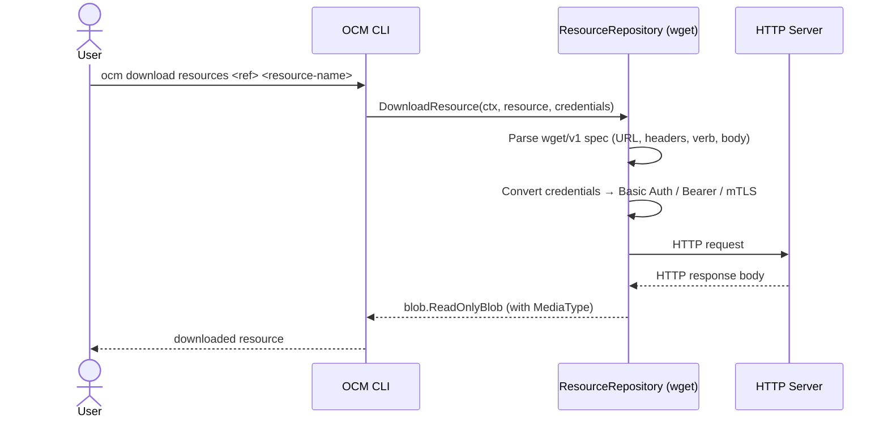

# wget Access Type — HTTP-Based Resource Downloading

* Status: proposed
* Deciders: OCM Technical Steering Committee
* Date: 2026.05.19

Technical Story: Enable OCM components to reference resources served over plain HTTP/HTTPS without requiring OCI, Git, or any other registry-specific protocol — implementing the wget access type defined in the OCM specification as a standalone Go binding module.

---

## Context and Problem Statement

OCM's access type system is specification-defined and intentionally technology-agnostic: it describes *where* and *how* a resource can be fetched, independent of the transport protocol. The specification includes a `wget` access type for plain HTTP/HTTPS downloads, but until this decision no Go binding existed for it.

Many real-world artifacts are distributed exclusively over plain HTTP/HTTPS: release binaries from GitHub/GitLab, vendor-hosted SDKs, package mirror files, internal Nexus/Artifactory raw repositories, and upstream configuration bundles. None of these fit naturally into the `ociArtifact`, `gitHub`, or other existing access types — they are plain URL downloads.

Without a `wget` binding, OCM users are forced to either re-host such artifacts in an OCI registry (adding operational overhead) or leave the dependency absent from the component version (losing provenance and reproducibility).

---

## Decision Drivers

* **OCM spec compliance**: `wget` is an already-specified access type; the Go ecosystem should have a matching binding.
* **Real-world prevalence**: HTTP/HTTPS is the most common artifact distribution mechanism outside of container registries — the gap is felt immediately in practice.
* **Module isolation**: The `bindings/go/` architecture encourages one self-contained Go module per access type to avoid monolithic import graphs.
* **Extensibility demonstration**: A clean, minimal wget implementation validates that OCM's module boundaries are simple enough to extend — including by AI-assisted tooling.

---

## Considered Options

* [Option 1](#option-1-standalone-bindingsgowget-module): Standalone `bindings/go/wget` Go module
* [Option 2](#option-2-defer-to-user-provided-plugins): Defer to user-provided plugins only

---

## Decision Outcome

Chosen [Option 1](#option-1-standalone-bindingsgowget-module): "Standalone `bindings/go/wget` module".

Justification:

* Consistent with the established pattern of other `bindings/go/` access type modules
* Self-contained module = no cross-module coupling, no import bloat for users who do not need wget
* Makes the wget access type available as both a first-class builtin and a reference implementation for community bindings
* Download-only semantics are simple and well-scoped — intentionally no upload support

---

### Option 1: Standalone `bindings/go/wget` Module

#### Description

A new, self-contained Go module at `bindings/go/wget/` that implements:

* **Access spec v1** — typed struct matching the OCM spec fields, with JSON schema and generated deepcopy/type helpers
* **Scheme registration** — registers both versioned (`wget/v1`) and unversioned (`wget`) type identifiers
* **ResourceRepository** — implements `DownloadResource` by issuing an HTTP request built from the access spec; upload intentionally returns an error
* **Credential consumer identity** — resolves credentials from URL components (scheme, hostname, port, path) and maps them to Basic Auth or Bearer token

#### Access Spec v1 Contract

```go
// bindings/go/wget/spec/access/v1
type Wget struct {
    URL        string              `json:"url"`
    MediaType  string              `json:"mediaType,omitempty"`
    Header     map[string][]string `json:"header,omitempty"`
    Verb       string              `json:"verb,omitempty"`
    Body       []byte              `json:"body,omitempty"`
    NoRedirect bool                `json:"noRedirect,omitempty"`
}
```

`URL` is required and must use `http` or `https`. All other fields are optional:

- `mediaType` overrides the `Content-Type` returned by the server
- `header` injects custom HTTP request headers (e.g., `Accept`, `X-Api-Token`)
- `verb` selects the HTTP method (default: `GET`)
- `body` provides a request body for `POST`/`PUT` operations
- `noRedirect` disables automatic HTTP redirect following

#### Credential Mapping

Credential identities are resolved from URL components (scheme, hostname, port, path), consistent with how other access types derive consumer identities. The consumer type is set to `wget`.

Credentials are passed as a typed `WgetCredentials/v1` struct (see `bindings/go/wget/spec/credentials/v1`), aligned with the typed credential system from [ADR 0021](0021_typed_credentials.md). Legacy `DirectCredentials/v1` (key-value map) is also accepted for backwards compatibility via automatic conversion.

The following credential fields are supported, applied in priority order (highest first):

| Priority | Credential field(s)                          | HTTP mapping                              |
|----------|----------------------------------------------|-------------------------------------------|
| 1 (high) | `username` + `password`                      | `Authorization: Basic <base64>`           |
| 2        | `identityToken`                              | `Authorization: Bearer <token>`           |
| 3 (low)  | `certificate` + `privateKey` (+ optional `certificateAuthority`) | mTLS client certificate |

Only the highest-priority non-empty credential is applied; lower-priority fields are ignored when a higher-priority one is present.

#### High-level Architecture



#### Use Cases — wget Only

The following scenarios require the wget access type because the source is a plain HTTP/HTTPS URL with no OCI registry, no Git repository, and no other OCM-native transport:

1. **GitHub / GitLab release binaries**: Reference `https://github.com/org/repo/releases/download/v1.0.0/binary-linux-amd64` directly. The binary is published as a release asset, not pushed to an OCI registry. The `ociArtifact` and `gitHub` access types cannot address this URL.

2. **Vendor package mirrors (APT, YUM, HashiCorp, etc.)**: Terraform provider zips (`https://releases.hashicorp.com/terraform/1.8.0/...`), Debian `.deb` packages, and RPM files are served from plain HTTP endpoints — not OCI.

3. **Vendor SDK and toolchain downloads**: JDK builds from Adoptium, Go toolchains from `dl.google.com`, LLVM packages from `apt.llvm.org` — all plain HTTPS, no registry.

4. **ML model weights and datasets via presigned URLs**: Hugging Face and similar platforms expose model blobs as presigned HTTPS URLs, sometimes requiring custom headers. The `header` field covers this; no other OCM access type does.

5. **Internal Nexus / Artifactory raw repositories**: Enterprise artifact stores commonly expose binaries over HTTP(S) raw-file endpoints rather than OCI. `wget` handles these where `ociArtifact` cannot.

6. **Upstream Kubernetes manifests, CRDs, and operator bundles**: Projects like cert-manager, Istio, and Crossplane publish versioned install YAMLs at well-known HTTPS URLs. Pinning these in a component version provides an audit trail without re-hosting.

7. **Compliance artifacts at canonical URLs**: SBOMs, NOTICE files, and license texts at authoritative upstream URLs (SPDX, FSF, vendor sites) can be referenced directly, preserving provenance without duplication.

8. **POST-based artifact generation APIs**: Some internal services require a `POST` with a JSON body to trigger artifact generation and return a binary stream. The `verb` and `body` fields support this — no other OCM access type models request bodies.

9. **Air-gapped environment pre-seeding**: Before transferring a component version into an air-gapped network, an operator describes all external HTTP dependencies via wget access specs. A transfer plugin reads and re-hosts them. Without wget specs in the component descriptor, the external dependencies are invisible to the transfer pipeline.

---

## Pros and Cons of the Options

### Option 1: Standalone `bindings/go/wget` Module

Pros:

* Spec-compliant: directly implements the access type the OCM spec already defines
* Zero coupling to OCM core — importable independently
* Composable with the BlobTransformer system (ADR 0007) for post-download extraction
* Isolated, fully testable — integration tests use `httptest.Server` with no external deps

Cons:

* No upload support (intentional, but asymmetric with other access types)
* HTTP (non-TLS) is allowed — consumers bear responsibility for URL trust evaluation
* No partial download / range request support in v1

### Option 2: Defer to User-Provided Plugins

Pros:

* No new builtin code; maximum flexibility for users

Cons:

* Users must reimplement the same HTTP download logic repeatedly
* The OCM spec defines wget — leaving it unimplemented signals incomplete spec coverage
* No reference implementation makes it harder for the community to build compatible implementations

---

## Discovery and Distribution

The module is published as `bindings/go/wget` within the monorepo. It can be:

* Registered as a builtin by calling `access.MustAddToScheme(scheme)` in any OCM application
* Wired into the OCM CLI via `go.work` for immediate `ocm download resources` support
* Used as a reference implementation for community wget-compatible bindings in other languages

---

## Conclusion

The `wget` access type fills a concrete gap in OCM's Go bindings: without it, component versions cannot faithfully describe the majority of publicly distributed artifacts (release binaries, package files, upstream manifests). The standalone module approach keeps the implementation isolated, consistently with the rest of the `bindings/go/` ecosystem, and leaves the door open for future enhancements (e.g., Range request support). As a secondary outcome, the AI-generated first implementation (PR #2063) demonstrates that OCM's modular architecture has the right separation of concerns for community and automated extension.
