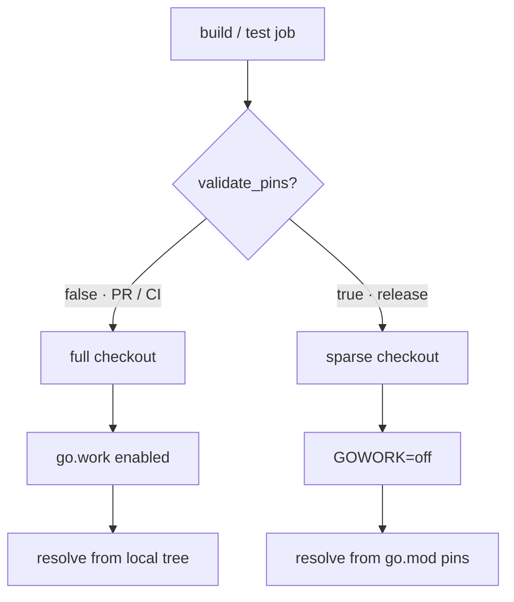
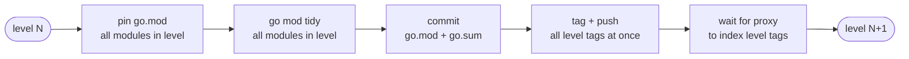

# ADR: Bindings CI and Release Strategy

* **Status**: proposed
* **Deciders**: OCM Technical Steering Committee
* **Date**: 2026-06-30

---

## Contents

* [Context](#context)
* [Decisions](#decisions)
* [PR vs release builds](#pr-vs-release-builds)
* [The go.work model](#the-gowork-model)
    * [Why go.work is committed](#why-gowork-is-committed)
    * [Verifying go.work in PRs](#verifying-gowork-in-prs)
    * [Checkout strategy](#checkout-strategy)
    * [go.sum correctness and the one known gap](#gosum-correctness-and-the-one-known-gap)
    * [Renovate pin-validation](#renovate-pin-validation)
* [Change-based CI](#change-based-ci)
    * [Module discovery and the affected set](#module-discovery-and-the-affected-set)
    * [Why graph-change-based, not path-change-based](#why-graph-change-based-not-path-change-based)
    * [Consumer trigger](#consumer-trigger)
* [Release pipeline](#release-pipeline)
    * [Phased bulk release](#phased-bulk-release)
    * [Dependency graph and topological sort](#dependency-graph-and-topological-sort)
    * [Change detection](#change-detection)
    * [Why one dependency level at a time](#why-one-dependency-level-at-a-time)
    * [New binding lifecycle](#new-binding-lifecycle)
    * [Manual release and its consistency window](#manual-release-and-its-consistency-window)
* [Alternatives considered](#alternatives-considered)

---

## Context

The OCM monorepo maintains 20+ independently versioned Go binding modules under `bindings/go/*` (CEL, Helm, OCI,
sigstore, …). They depend on each other (many import `bindings/go/credentials` or `bindings/go/runtime`) and are
consumed
by the top-level `cli` and `kubernetes/controller` modules.

Treating each binding as its own module is correct for external consumers — they can pin a single binding at a specific
version — but the tooling around that boundary creates friction we want to remove. There are four problems to solve:

1. **Cross-module PRs.** A change spanning several bindings requires a sequential chain: merge and release the base
   binding, then open a PR pinning it in the next binding, and so on. Reviewers see each step out of context.
2. **Cross-module regressions.** A change to `bindings/go/credentials` can break `bindings/go/helm` or `cli`. Testing
   only the changed module misses this.
3. **Workspace consistency.** The repo-wide `go.work` must reflect the checked-out tree so workspace-aware commands
   resolve every dependency locally.
4. **Coordinated releases.** Bindings must be released in dependency order. Releasing them ad-hoc leaves dependents
   pinned to stale versions.

**Out of scope:** per-component release versioning (see [ADR 0010](0010_release_strategy.md)).

---

## Decisions

### Module structure

Keep a per-binding `go.mod` and add a **committed `go.work`** as the source of truth for local
and CI resolution. The rejected option was folding all bindings into one shared library. A shared library would remove
independent versioning, so external consumers could no longer take only the bindings they need at a specific version.
The binding boundary has value. The friction was in the tooling around it, not in the model, and `go.work` removes the
multi-PR chain without giving up the boundary.

### CI test selection

Use graph-aware change-based filtering. On each PR we test the changed modules plus all of their
direct and indirect dependents. The rejected option was testing every binding on every PR. The dependency graph derived
from `go.mod` gives an exact affected set. Cross-module regressions are still caught, and an unrelated module is skipped
only when the graph proves it cannot be affected.

### Release

Use an automated phased bulk release as the canonical path: plan, test, gate, and release, in dependency
order. The rejected option was making manual per-module release the primary path.
The phased release guarantees dependency ordering, gates on human review before any tag is pushed, and pins consumers in
one step. Manual per-module release cannot guarantee ordering and leaves a consistency window open. It is kept only as
an
escape hatch for isolated fixes and for bootstrapping new bindings.

### Consequence

With these decisions, a change spanning several bindings becomes one PR whose affected tests run
against the local workspace, instead of a chain of PRs each with its own CI and release run in between. The phased
release provides the ordering and consistency guarantees the manual path cannot.

---

## PR vs release builds

The same workflows run in two modes, switched by a single `validate_pins` input.

### PR / CI build (`validate_pins=false`)

Runs on `pull_request` and pushes to `main`. It checks out every module and
keeps `go.work` **enabled**, so dependencies resolve from the local module tree. The `go.mod` pins may be stale here,
because the workspace shadows them. This mode proves that in-flight cross-binding changes compile and test together,
without needing any tags.

### Release build (`validate_pins=true`).

Runs from the tagged release workflow. It checks out only the module or
scenario being built and sets **`GOWORK=off`**, so dependencies resolve from the `go.mod`/`go.sum` pins instead of the
workspace. Here the pins are authoritative, and this build is what validates them. This mode proves that a `go get`
consumer gets a correct, complete build.

---

## The go.work model

### Why go.work is committed

`go.work` and `go.work.sum` are committed and are the source of truth for cross-module resolution in local development
and CI. On `main` and feature branches the binding `go.mod` files do not necessarily pin each other consistently. The
workspace redirects every internal import to the local tree, so the committed `go.work` is what makes the monorepo build
coherently. The `go.mod` pins only become authoritative at release time.

When a module is added or removed, the committed `go.work` must be updated in the same change (`go work use ./<module>`).
The `task init/go.work` task regenerates it from scratch, but it is only a local bootstrap helper. CI never needs it,
because the committed file is already present after checkout.

### Verifying go.work in PRs

Workspace-mode jobs already fail if `go.work` is missing a module, but only indirectly: a forgotten `go work use`
surfaces as an unrelated build error downstream. To catch drift directly, the module-discovery job runs
`task verify/go.work` first. It regenerates the workspace from scratch and fails on any `git diff`, so a PR that adds or
removes a module without updating `go.work` is rejected up front instead of failing confusingly three jobs later.

The guard covers `go.work` only, not `go.work.sum`. The `use` list is the human-edited part and the source of the drift
this guards against. `go.work.sum` is machine-maintained checksum bookkeeping, like `go.sum`, and the workspace-mode
test jobs validate it implicitly: a missing checksum fails their build. We also do not run `go work sync` (which would
refresh `go.work.sum`), because it rewrites member `go.mod` files and so is not safe as a read-only check. It is the
natural place to add further workspace-consistency checks later, such as the periodic `GOWORK=off` `go mod tidy` for the
*go.mod consistency on `main`* gap below.

### Checkout strategy

Workspace-mode jobs use a **full** checkout, because the committed `go.work` references every module directory and Go
fails on missing paths. Sparse checkout is used only by **pin-validation** jobs (`GOWORK=off`). They resolve from
the `go.mod`/`go.sum` pins, so they only need the target module present.

| Job                                | Checkout                  | Workspace                    |
|------------------------------------|---------------------------|------------------------------|
| lint                               | full                      | committed `go.work`          |
| binding unit tests                 | full                      | committed `go.work`          |
| binding unit tests (pin-validate)  | full                      | `GOWORK=off` (Renovate PRs)  |
| binding integration tests          | full                      | committed `go.work`          |
| `cli` / controller build           | full                      | committed `go.work`          |
| `cli` / controller build (release) | sparse (module + scripts) | `GOWORK=off` (validate pins) |
| `e2e`, `conformance`               | full                      | committed `go.work`          |
| `e2e`, `conformance` (release)     | sparse (scenario only)    | `GOWORK=off` (validate pins) |

### go.sum correctness and the one known gap

Because the workspace is authoritative, `go.mod`/`go.sum` pins are **not** required to be standalone-consistent on
every commit, since `go.work` shadows them. Standalone correctness (a pure `go get` resolution) is enforced at exactly
two points:

* **Release tags** — the release build runs `GOWORK=off`, so a binding tag can only be cut from a commit whose
  `go.mod`/`go.sum` are complete.
* **Renovate `ocm-monorepo` PRs** — run `GOWORK=off` so a bad pin fails before merge.

> **Known gap — `go.mod` consistency on `main`.** Between those two points, `go.work` masks stale pins: a drift
> introduced on an ordinary feature PR is invisible until the next release or Renovate PR. There is no general
> `GOWORK=off` check on `main` today. If it becomes a problem, add a periodic or push-to-`main` job that runs
> `go mod tidy` with `GOWORK=off` across all modules and fails on a diff. (Open question from the 29.06.2026 design
> discussion.)

### Renovate pin-validation

Releases run on a `releases/X.Y` branch and are never merged back (see [ADR 0010](0010_release_strategy.md)), so they do
not advance `main`'s internal `go.mod` pins. `go.work` hides this locally, but the published pins are what an external
`go get` consumer resolves. Renovate's `ocm-monorepo` group keeps them current, bumping the internal binding pins to
their latest released tags between releases. These PRs run with `GOWORK=off` (otherwise `go.work` resolves bindings from
disk and the new pin is never exercised), which compiles `main`'s source against the pinned tags — exactly what a
`go get` consumer sees — so an incompatible bump fails before merge.

> **Open question: do we want this check at all?** Because the pins point at *released* tags, the PR fails whenever
> `main` has moved ahead of the latest release, which between releases can be most of the time, so a frequently-failing
> and often-not-actionable PR may not be worth gating on. Alternatives: make the group **non-gating** (still bumps the
> pins, but a failure is informational), or pin pseudo-versions of `main`'s tip (never fails, but makes the check
> pointless and churns every `go.mod`). **Decision for now:** keep it gating; revisit toward non-gating if it proves
> noisy.

---

## Change-based CI

### Module discovery and the affected set

A module-discovery pre-job runs on every push and PR:

1. enumerate all Go modules in the workspace;
2. build the full dependency graph across all modules (`go mod edit -json`) — bindings, `cli`,
   `kubernetes/controller`, and anything else in the workspace;
3. detect changed modules from `git diff --name-only origin/main...HEAD`;
4. walk the graph forward (dependents direction) to get the **affected set** = changed modules ∪ their transitive
   dependents;
5. filter to binding modules for the unit/integration matrices (`cli` and `kubernetes/controller` have their own
   workflows and are excluded);
6. emit the affected sets for unit tests, integration tests, and lint.

### Why graph-change-based, not path-change-based

A path filter (`dorny/paths-filter`) only knows *which files changed*, not *which modules those changes can break*.
Catching cross-module regressions with it would mean hand-maintaining expansion rules that mirror the import graph,
which is exactly the set of dependency relationships `go.mod` already declares. Now that a single PR can change a
binding and its dependents together, the set of modules a change touches is no longer just "the directory the diff lands
in." So we derive the affected set from the actual dependency graph instead. A new edge or a new binding is then picked
up automatically, with no rule to keep in sync.

### Consumer trigger

The affected set drives the binding test matrices and lint. The `cli` and `kubernetes/controller` build, conformance,
and e2e pipeline is gated differently: it runs on a static path filter (a change under `bindings/**`, `cli/**`,
`kubernetes/controller/**`, `conformance/**`, or the consumer workflow files), not the graph. The consumers are
coarse-grained leaf modules, so a path filter that occasionally rebuilds them for a binding they do not import is
simpler and safer than threading the affected set across two workflows: it never misses a real consumer break, and the
only cost is an occasional extra build. Graph-gating them is a possible later refinement if those builds become
expensive enough to matter.

---

## Release pipeline

### Phased bulk release

The phased bulk release runs four ordered phases:

1. **Plan** — discover all binding modules, topologically sort them by the `go mod edit -json` dependency graph, run
   change detection per module, compute next semver tags, and flag breaking changes from Conventional Commit markers
   (`feat!:`, `BREAKING CHANGE:`).
2. **Test** — run unit tests for every binding module and integration tests for the changed modules, in parallel.
3. **Gate** — environment approval: a reviewer sees the full plan (changed modules, next tags, bump kinds, changelogs)
   and test results before any tag is pushed.
4. **Release** — process one dependency level at a time (below), then pin and tidy `cli` and `kubernetes/controller`
   in a final commit.

### Dependency graph and topological sort

The dependency graph is derived from each module's `go.mod` using the Go toolchain (`go mod edit -json`), not by parsing
the file as text. Reading the toolchain's own view means replace directives, indirect markers, and multi-line require
blocks are all handled correctly. From that graph the modules are topologically sorted so that every dependency comes
before its dependents, which gives the level-by-level release order described below.

### Change detection

A binding is scheduled for release when at least one commit touched its directory since its last semver tag
(`git log <lastTag>..HEAD -- bindings/go/<module>`). `lastTag` is the highest `bindings/go/<module>/v*` tag in the repo
(including tags fetched from upstream). A module with no prior tag is never auto-released — see *New binding lifecycle*.

### Why one dependency level at a time

There is a hard ordering constraint. To write `blob/go.sum`'s checksum for `runtime@v0.0.9`, the toolchain must fetch
`runtime@v0.0.9` from the proxy, but the proxy only serves it after `runtime/v0.0.9` is tagged and pushed. Tagging a
version and consuming it cannot happen in one step. So the release walks the graph level by level:

Modules within one level do not depend on each other, so they are pinned, tidied, committed, and tagged together. Each
level only runs once the levels below it are already on the proxy. After all binding levels, `cli` and
`kubernetes/controller` are pinned and tidied in a final commit.

When pinning, each internal dependency is resolved the same way regardless of whether it was released in this run:

* released this run → use the new tag from the plan phase;
* unchanged but previously tagged → use its current latest tag (stays current with out-of-band releases);
* never tagged → skip (*New binding lifecycle*).

### New binding lifecycle

A never-tagged binding is skipped by the plan phase (shown as `no prior tag; skipped` in the gate summary) and gets no
tag. It
is still usable in the meantime: dependents reference it by Go pseudo-version (`v0.0.0-<timestamp>-<commit>`), which the
workspace makes transparent locally. To promote it:

1. merge its implementation to `main`;
2. manually trigger the single-module release to cut its initial tag (e.g. `bindings/go/newbinding/v0.0.1`);
3. from the next bulk release on, the plan phase manages it normally.

Promotion is therefore an explicit act, not a side-effect of the first bulk release that touches the binding.

### Manual release and its consistency window

The manual per-module release stays available for isolated fixes and bootstrapping. It has
one limitation. If `bindings/go/helm` depends on `bindings/go/credentials` and you manually release
`credentials@v1.2.0`,
then `helm`'s `go.mod` still pins the old version until a follow-up PR. Locally `go.work` hides this, but a `go get`
consumer gets a mixed build until the pin is updated. A concurrency guard keeps two releases from racing, but it does
not close this window. That is why the phased bulk release is the canonical path.

> **Possible improvement — auto-open a pin-bump PR after a manual release.** When a manual release cuts a tag, a
> follow-up job could open a PR that pins the new tag in every direct dependent and runs `go mod tidy` (a scoped version
> of the Renovate bump, validated the same way with `GOWORK=off`). That shrinks the window to "until that PR merges."
> Left out for now because Renovate already advances the pins on its next run; add it if the window proves painful.

---

## Alternatives considered

Two established multi-module release toolchains were evaluated and rejected — Kubernetes `publishing-bot`
(separate-repo mirroring plus a hand-maintained DAG; institutional baggage we don't share) and OpenTelemetry
`multimod`/`crosslink` (regex `go.mod` rewriting and a `versions.yaml` that needs operator edits every release).
`crosslink`'s `go.mod`-derived topo-sort is the same approach we take, confirming the direction.
