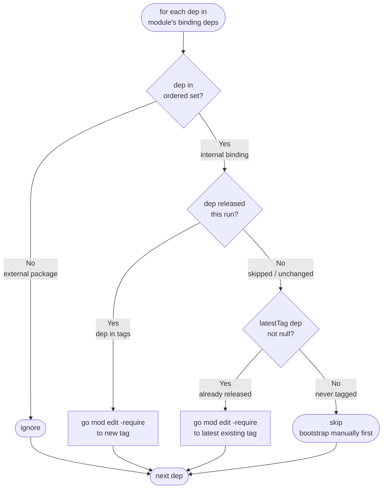
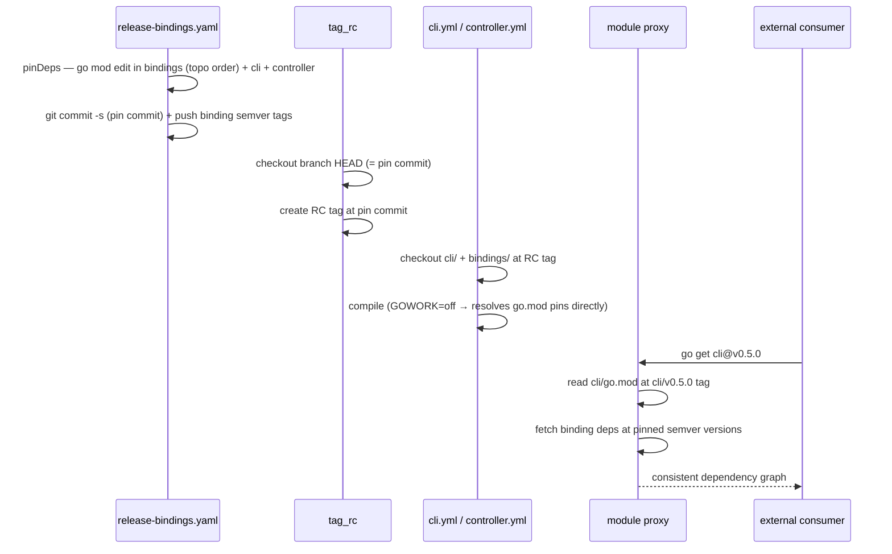

# ADR: Bindings CI and Release Strategy

* **Status**: proposed
* **Deciders**: OCM Technical Steering Committee
* **Date**: 2026-06-22

---

## Technical Story

The OCM monorepo maintains 20+ Go binding modules (`bindings/go/*`), small independently versioned Go modules that
wrap OCM capabilities for specific consumers (CEL, Helm, OCI, sigstore, …). These modules are interdependent (many
import `bindings/go/credentials` or `bindings/go/oci`) and also consumed by top-level modules (`cli`,
`kubernetes/controller`).

The independent-module setup was creating significant friction across the team:

* **PR overhead**: a single logical change (e.g., adding a new credential type that spans multiple bindings) required
  a strict sequential chain: merge a PR for the base binding, release it, then open the next PR for the dependent
  binding combining the `go.mod` pin update with the functional changes, merge it, release it, and repeat for every
  binding in the dependency chain. Reviewers saw each PR in isolation without the context of the broader change, making
  review harder and slower.
* **CI complexity**: the initial CI design used change-based filtering to avoid running all binding tests on every PR.
  This required `dorny/paths-filter`, separate signals for `.env` and CI workflow changes, and special-cased expansion
  rules to catch cross-module regressions. Each correctness gap discovered required another exception. Adding a new
  binding also required a CI config change.
* **Release friction**: releasing a set of related bindings required manually triggering one workflow per binding in the
  correct dependency order. After each release, every dependent binding needed a follow-up PR to update its `go.mod`
  pin to the new version before the next binding could be released. There was no automated guard against out-of-order
  releases or against a manual release conflicting with an ongoing bulk release.

The friction was in the tooling around the module boundary model, not in the model itself. This ADR documents the three
candidate directions evaluated and explains how the chosen approach resolves each pain point.

### Context and Problem Statement

Four concrete problems had to be solved:

1. **Scalable CI enrollment**: the binding set grows over time; CI must cover all bindings without requiring a config
   change each time one is added.
2. **Cross-module regressions**: a change to `bindings/go/credentials` can silently break `bindings/go/helm` or `cli` if
   only the changed module is tested.
3. **Workspace management**: the repo-wide `go.work` at the root is always present; it must reflect the checked-out
   tree so that workspace-aware commands resolve all dependencies locally during development and CI.
4. **Coordinated releases**: bindings must be released in dependency order; a manual per-module release can leave
   dependent modules in an inconsistent state.

### Out of scope

* Per-component release versioning (covered by [ADR 0010](0010_release_strategy.md)).

---

## Decision Drivers

* CI must catch cross-module regressions, not just single-module failures.
* Adding a new binding must not require a CI config change.
* `cli` and `kubernetes/controller` have dedicated build/release workflows and must not be polluted by binding CI.
* Binding releases must respect dependency order and leave consumers (`cli`, `kubernetes/controller`) in a consistent
  pinned state.

---

## Options

### Structural direction

* **Keep Go modules, improve tooling**: retain independent `go.mod` per binding; use `go.work` (gitignored,
  generated in CI and locally via `task init/go.work`) and fix CI to use it. Reduces PR friction without changing
  the module boundary model.
* **Ditch Go modules, shared library**: remove per-binding `go.mod` files; fold all bindings into a single shared
  library consumed directly by `cli` and `kubernetes/controller`. Eliminates the boundary model entirely.

### CI strategy

* **Change-based filtering**: discover all modules dynamically; on PR, test only the modules that changed.
* **Always test all bindings**: discover all modules dynamically; test every binding on every PR.

### Sparse-checkout strategy

* **Full checkout for lint/unit, sparse for integration**: lint and unit tests check out the full repository so
  `go.work` covers all modules. Integration tests use sparse-checkout per module since they are I/O-bound and
  parallelism helps.
* **Per-module matrix with sparse-checkout everywhere**: each CI job checks out only its module.

### Release strategy

* **Manual per-module release** via `release-go-submodule.yaml`.
* **Automated phased bulk release** via `release-bindings.yaml` (plan, test, gate, release).

---

## Decision Outcome

Keep Go modules with a committed `go.work`, always test all bindings in CI, and use the automated phased bulk release
as the canonical path. The manual per-module release is retained for isolated fixes and for bootstrapping new
bindings. Lint and unit tests use a full checkout; integration tests use sparse-checkout in a parallel matrix.

**Why keep Go modules over a shared library:** Ditching Go modules would eliminate independent versioning, making it
impossible for external consumers to take only the bindings they need at a specific version. The binding boundary model
has value; the friction was in the tooling around it, not in the model itself. Adding `go.work` recovers the
developer-experience benefit without sacrificing the boundary model.

**Why always test all bindings over change-based filtering:** Unit tests for all bindings run as a single
`go test ./bindings/go/...` invocation — one job, one runner, shared build cache. The cost is low enough
that graph-aware change filtering adds complexity without meaningful benefit. Always testing everything
also gives a stronger correctness guarantee with no filtering logic to maintain.

**Why the phased bulk release over manual per-module releases:** A phased bulk release computes next tags in dependency
order, runs tests, requires human review of the plan before any tags are pushed, and pins consumer `go.mod` files
(`cli`, `kubernetes/controller`) atomically in the same release commit. Manual per-module releases cannot guarantee
dependency ordering and create a consistency window (see *Release Strategy* below). The manual workflow is kept as an
escape hatch for genuine single-module fixes with no consumers to update, and as the mechanism for initially
releasing new bindings.

---

## Pros and Cons

### Structural direction

**Keep Go modules with go.work (selected)**

* **Pros:** Preserves independent versioning; external consumers can depend on specific binding versions.
  `go.work` eliminates multi-PR sequential chains during development.
* **Cons:** Still requires a release workflow that understands dependency order; `go.work` must be regenerated
  when modules are added or removed.

**Ditch Go modules, shared library (not selected)**

* **Pros:** Zero release friction; no dependency ordering; single `go.mod` for the whole codebase.
* **Cons:** Loses independent versioning entirely. External consumers must take the entire library at a single version.
  Breaking changes affect all consumers simultaneously with no opt-in period. Contradicts the binding design goal of
  composability.

### CI strategy

**Always test all bindings (selected)**

* **Pros:** Always catches cross-module regressions. Zero-config enrollment for new bindings — adding a module
  under `bindings/go/` is sufficient. Unit tests run in a single job via `task bindings/test`
  (`go test ./bindings/go/...`): one runner, one Go setup, shared build cache. Docs-only PRs are excluded
  via `paths-ignore`.
* **Cons:** All binding unit tests run on every code-touching PR. Integration tests run as a parallel matrix
  because they are I/O-bound (testcontainers, live network calls) and `sigstore/integration` requires a
  different runner architecture.

**Change-based filtering (not selected)**

* **Pros:** Faster PR feedback; lower CI cost on repositories with frequent small changes.
* **Cons:** Misses cross-module regressions by design. Requires `dorny/paths-filter`, separate `ciChanged`/`envChanged`
  signals, and special-cased expansion rules. Complexity grows with every new correctness gap discovered.

### Sparse-checkout strategy

**Full checkout for lint and unit tests, sparse for integration (selected)**

* **Pros:** `task lint` runs `golangci-lint` across all modules in one pass via `go work edit -json`.
  `task bindings/test` runs `go test ./bindings/go/...` — one compiler invocation, shared build cache,
  one runner. Integration tests run as a sparse-checkout matrix where parallelism genuinely helps
  (I/O-bound, `sigstore/integration` needs a different runner). Sparse-checkout remains for
  `kubernetes/controller` and `e2e`/`conformance` which have no reason to pull all of `bindings/`.
* **Cons:** Lint and unit jobs download the full repository. Acceptable given the monorepo size and the
  simplicity gained.

**Per-module matrix with sparse-checkout (not selected)**

* **Pros:** Each job downloads only its module + `bindings/`.
* **Cons:** Each GitHub Actions matrix job gets its own runner. With 20+ modules every job pays for OS boot,
  checkout, Go install, and tool install independently. For fast operations like lint and unit tests the
  per-runner setup cost dominates actual work time, making the matrix slower wall-clock than a single job.

### Release strategy

**Phased bulk release (selected as canonical path)**

* **Pros:** Dependency order guaranteed; human review gate before any tags pushed; consumers pinned atomically.
* **Cons:** More complex workflow; requires a plan step that probes the dependency graph.

**Manual per-module release (kept for isolated fixes and bootstrapping)**

* **Pros:** Simple; developer controls exactly which version and when.
* **Cons:** No dependency ordering; creates a consistency window between dependent modules (see below).

---

## go.work Management

### Why go.work is not committed

`go.work` is listed in `.gitignore` and generated in CI via `task init/go.work`. This avoids the problem of a
committed `go.work` referencing all 20+ modules while a sparse checkout only has a subset — Go tooling would fail
on missing paths. By generating `go.work` after checkout, the workspace is automatically scoped to the checked-out
tree.

`discoverModules()` in `.github/scripts/release-bindings.js` reads the workspace via `go work edit -json` to
enumerate all binding modules without any hardcoded list.

The authoritative Go version is stored in `.go-version` (repo root). All CI jobs that need a workspace use:

```sh
# 1. actions/setup-go with go-version-file: .go-version
# 2. arduino/setup-task
# 3. task init/go.work   # go work init + go work use for all checked-out go.mod files
```

`task init/go.work` uses `status: find go.work` so it is a no-op if the file already exists, but since it is
gitignored it will never be present after a fresh checkout.

### Where sparse-checkout is used

| Job                           | Sparse checkout                               | Workspace               |
|-------------------------------|-----------------------------------------------|-------------------------|
| `golangci_lint`               | full checkout                                 | `task init/go.work`     |
| `test-bindings` unit          | `bindings/`                                   | `task init/go.work`     |
| `test-bindings` integration   | `bindings/<module>/integration` (per-matrix)  | `task init/go.work`     |
| `kubernetes-controller` build | `kubernetes/controller/ + bindings/ + config` | `task init/go.work`     |
| `e2e`, `conformance`          | module-specific + config                      | none                    |

---

## Release Strategy

### Consistency window in manual per-module releases

If `bindings/go/helm` depends on `bindings/go/credentials` and a developer manually releases
`bindings/go/credentials@v1.2.0`, the `go.mod` of `bindings/go/helm` still pins the old version until a follow-up
PR updates it. During that window, `bindings/go/helm` is internally consistent via `go.work` in local development,
but its published `go.mod` references the old API. Any consumer resolving via `go get` (not `go.work`) gets a mixed
build. The `concurrency: group: binding-release` guard prevents concurrent releases from racing but does not close
this window.

### Phased bulk release

`release-bindings.yaml` runs four ordered phases:

1. **Plan**: discover all binding modules; topologically sort by the dependency graph derived from
   `go mod edit -json`; compute next semver tags for modules with unreleased commits; detect breaking
   changes from Conventional Commit markers (`feat!:`, `BREAKING CHANGE:`).
2. **Test**: run unit and integration tests for every changed module in parallel.
3. **Gate**: environment approval — a reviewer sees the full plan (changed modules, next tags, bump kinds,
   changelogs) and test results before any tags are pushed.
4. **Release**: pin `go.mod` files; commit the pin updates; create and push unsigned annotated tags;
   pin `cli` and `kubernetes/controller` `go.mod` files.

This ensures dependency order is respected and consumers are pinned in the same operation, closing the consistency
window present in manual releases.

### Dependency pinning (`pinDeps`)

After publishing new tags, `pinDeps` updates every binding's and every consumer's `go.mod` to the authoritative
version of each internal binding dep:



- **Released this run**: `go mod edit -require` to the new tag computed by `planRelease`.
- **Skipped/unchanged with an existing tag**: `go mod edit -require` to `latestTag()`, ensuring consumers stay
  current with upstream releases that happened outside the current run.
- **Never tagged**: skipped; see *New binding lifecycle* below.

`pinDeps` applies the result with `go mod edit -require` — a pure file edit, no network access. `go.sum` is not
updated during the release; it is computed on the first standalone (non-workspace) build after the proxy has indexed
the new tags.

### go.work in the release build

PR and CI builds use `go.work` throughout so that in-flight binding changes resolve against the local tree without
requiring published tags.

Release builds (`cli.yml`, `kubernetes-controller.yml` called from `release.yml`) run with `GOWORK=off`. By the time
these builds run, `release-bindings.yaml` has already pushed all binding semver tags and committed the `go.mod` pins.
Disabling the workspace forces the build to resolve dependencies exclusively from those pins — exactly the dependency
graph external consumers will get via `go get`. This validates that the pins are correct and catches any MVS or
graph-pruning divergence between workspace and standalone resolution before the RC tag is created.



### New binding lifecycle

A binding that has never been tagged is skipped by `planRelease` — it appears in the gate summary as
`(no prior tag; skipped)` and receives no semver tag in the bulk release. To enrol a new binding:

1. Merge the binding's implementation to `main`.
2. Manually trigger `release-go-submodule.yaml` targeting the new binding to create its initial tag
   (e.g., `bindings/go/newbinding/v0.0.1`).
3. From the next bulk release onwards, `planRelease` picks it up normally and `pinDeps` manages its consumers.

This makes the promotion of a new binding an explicit, intentional act rather than an automatic side-effect of the
first bulk release that touches it.

---

## Implementation

### Module discovery

`ci.yml` runs a `discover_modules` pre-job on every push and PR:

1. `discoverModules()` enumerates all Go modules by inspecting `go.work` via `go work edit -json`.
2. Each binding's Taskfile is probed for a `test/integration` target to build the integration matrix.
3. Outputs: `modules_json` (all modules, for `golangci_lint`) and `integration_test_modules_json`
   (bindings with an integration test target, for `test-bindings.yaml`).

Lint (`task lint`) and unit tests (`task bindings/test`) run in single jobs with no discovery input —
they operate across the full workspace. Integration tests use a matrix since each module is I/O-bound
and `sigstore/integration` requires a different runner. Non-binding modules (`cli`, `kubernetes/controller`)
are excluded and have dedicated workflows. Adding a new binding under `bindings/go/` automatically
enrolls it in lint, unit tests, and — if it has a `test/integration` target — the integration matrix,
with no config change required.

### Dependency graph and topological sort

`buildGraph` in `.github/scripts/release-bindings.js` derives the dependency graph from `go.mod` files:

```js
// For each binding module:
internalDeps = go mod edit -json | Require[]
    .filter(path => path.startsWith("ocm.software/open-component-model/bindings/go/"))

// Topological sort (Kahn's algorithm) — deps precede their dependents
ordered = topoSort(modules, depsMap)
```

Using `go mod edit -json` (toolchain-authoritative) rather than regex parsing ensures all `go.mod` syntax
(replace directives, indirect markers, multi-line blocks) is handled correctly.

### Consumer trigger

`pipeline.yml` includes `bindings/**` in its `paths` filter so that `cli` and `kubernetes/controller` are rebuilt
and tested whenever any binding changes, catching API breakage in consumers before a release.

---

## External Alternatives Evaluated

Two established multi-module release toolchains were reviewed and rejected:

**Kubernetes `publishing-bot`** mirrors staging modules to separate read-only repos via `git filter-branch`;
dependency ordering is declared in a hand-maintained `rules.yaml` DAG per module. Not applicable: the
separate-repo mirroring exists because Kubernetes module paths don't match their monorepo layout — institutional
baggage irrelevant to us. Their manually maintained DAG is strictly worse than our auto-derived ordering from
`go mod edit -json`.

**OpenTelemetry `multimod` + `crosslink`** — `multimod` bumps versions from a declarative `versions.yaml` and
rewrites `go.mod` files via regex; `crosslink` derives the topo-sort from `go.mod` parsing. Not adopted:
regex `go.mod` rewriting mishandles edge cases silently; `versions.yaml` requires operator edits on every
release; `multimod tag` is non-idempotent (open upstream bug). `crosslink`'s `go.mod`-derived topo-sort is
exactly what `buildGraph` does — it confirms our approach is correct prior art. We use `go mod edit -json`
(toolchain-authoritative) instead of regex.

---

## Conclusion

The chosen approach directly addresses each identified pain point:

* **PR overhead**: `go.work` (gitignored, generated in CI and locally via `task init/go.work`) allows developers
  to make cross-binding changes in a single PR. The workspace ensures all interdependent modules resolve against
  the current tree, not published versions, so a change spanning `bindings/go/credentials` and `bindings/go/helm`
  can be reviewed and merged together.
* **CI complexity**: module discovery is two steps with no filtering logic. New bindings enroll automatically. All
  binding tests always run, eliminating the correctness gaps that came with change-based filtering.
* **Release friction**: the phased bulk release computes dependency order, runs tests, gates on human approval, and
  pins all consumers atomically. Developers no longer need to know or manually enforce the release sequence.

The approach trades a small amount of CI compute (running all binding tests on every PR) for correctness and
simplicity. The phased bulk release with a human gate provides the ordering and consistency guarantees that manual
per-module releases cannot, while keeping the escape hatch for isolated fixes and new binding bootstrapping.
