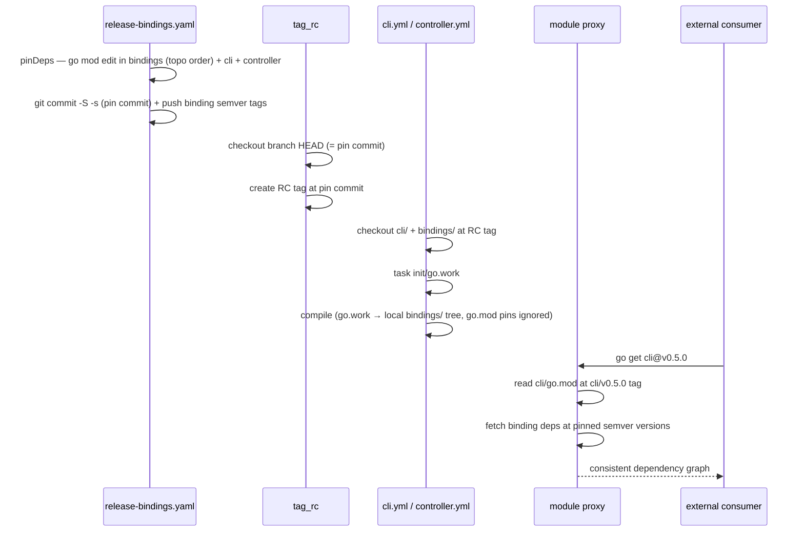

# ADR: Bindings CI and Release Strategy

* **Status**: proposed
* **Deciders**: OCM Technical Steering Committee
* **Date**: 2026-06-22

---

## Technical Story

The OCM monorepo maintains 31+ Go binding modules (`bindings/go/*`), small independently versioned Go modules that
wrap OCM capabilities for specific consumers (CEL, Helm, OCI, sigstore, …). These modules are interdependent (many
import `bindings/go/core` or `bindings/go/oci`) and also consumed by top-level modules (`cli`, `kubernetes/controller`).

The independent-module setup was creating significant friction across the team:

* **PR overhead**: a single logical change (e.g., adding a new credential type that spans multiple bindings) required
  a strict sequential chain: merge a PR for the base binding, release it, then open the next PR for the dependent
  binding combining the `go.mod` pin update with the functional changes, merge it, release it, and repeat for every
  binding in the dependency chain. Reviewers saw each PR in isolation without the context of the broader change, making
  review harder and slower.
* **CI complexity**: the initial CI design used change-based filtering to avoid running all binding tests on every PR.
  This required `dorny/paths-filter`, separate signals for `.env` and CI workflow changes, and special-cased expansion
  rules to catch cross-module regressions. Each correctness gap discovered required another exception. Adding a new
  binding also required a CI config change.
* **Release friction**: releasing a set of related bindings required manually triggering one workflow per binding in the
  correct dependency order. After each release, every dependent binding needed a follow-up PR to update its `go.mod`
  pin to the new version before the next binding could be released. There was no automated guard against out-of-order
  releases or against a manual release conflicting with an ongoing bulk release.

The friction was in the tooling around the module boundary model, not in the model itself. This ADR documents the three
candidate directions evaluated and explains how the chosen approach resolves each pain point.

### Context and Problem Statement

Four concrete problems had to be solved:

1. **Scalable CI enrollment**: the binding set grows over time; CI must cover all bindings without requiring a config change each time one is added.
2. **Cross-module regressions**: a change to `bindings/go/core` can silently break `bindings/go/helm` or `cli` if only
   the changed module is tested.
3. **Workspace management**: the repo-wide `go.work` at the root is always present in sparse-checkout;
   root-level files cannot be excluded and `go.work` can conflict with module-specific CI jobs that check out only a
   subset of the tree.
4. **Coordinated releases**: bindings must be released in dependency order; a manual per-module release can leave
   dependent modules in an inconsistent state.

### Out of scope

* Per-component release versioning (covered by [ADR 0010](0010_release_strategy.md)).

---

## Decision Drivers

* CI must catch cross-module regressions, not just intra-module failures.
* Adding a new binding must not require a CI config change.
* `cli` and `kubernetes/controller` have dedicated build/release workflows and must not be polluted by binding CI.
* Binding releases must respect dependency order and leave consumers (`cli`, `kubernetes/controller`) in a consistent
  pinned state.

---

## Options

### Structural direction

* **Keep Go modules, improve tooling**: retain independent `go.mod` per binding; add `go.work` (gitignored,
  generated in CI) and fix CI to use it. Reduces PR friction without changing the module boundary model.
* **Ditch Go modules, shared library**: remove per-binding `go.mod` files; fold all bindings into a single shared
  library consumed directly by `cli` and `kubernetes/controller`. Eliminates the boundary model entirely.

### CI strategy

* **Change-based filtering**: discover all modules dynamically; on PR, test only the modules that changed.
* **Always test all bindings**: discover all modules dynamically; test every binding on every PR.

### Sparse-checkout strategy

* **Keep sparse-checkout**: each CI job checks out only what it needs (e.g., `bindings/` for unit tests, one module + `bindings/` for lint). Requires `rm go.work && task init/go.work` after checkout to produce a scoped workspace matching the checked-out tree.
* **Full checkout everywhere**: every CI job checks out the entire repository. `task init/go.work` always produces a correct workspace since the full tree is present; no sparse-checkout scoping is needed.

### Release strategy

* **Manual per-module release** via `release-go-submodule.yaml`.
* **Automated phased bulk release** via `release-bindings.yaml` (plan, test, gate, release).

---

## Decision Outcome

Keep Go modules with `go.work`, always test all bindings in CI, and use the automated phased bulk release as the
canonical path. The manual per-module release is retained for isolated hotfixes. The sparse-checkout strategy is an
open decision (see *Pros and Cons* below).

**Why keep Go modules over a shared library:** Ditching Go modules would eliminate independent versioning, making it
impossible for external consumers to take only the bindings they need at a specific version. The binding boundary model
has value; the friction was in the tooling around it, not in the model itself. Adding `go.work` (gitignored, generated
in CI from the checked-out tree) recovers the developer-experience benefit without sacrificing the boundary model.

**Why always test all bindings over change-based filtering:** Bindings are interdependent via `go.work`. Testing only
changed modules misses the case where an API change in module A silently breaks module B (not touched in the PR). The
filtering logic to handle this correctly is complex and has multiple reachable gaps; every correctness gap discovered
requires another exception rule. All binding source is already checked out in full (`bindings/`) during the unit test
job, so testing all bindings costs only runner time, not checkout overhead.

**Why the phased bulk release over manual per-module releases:** A phased bulk release computes next tags in dependency
order, runs tests, requires human review of the plan before any tags are pushed, and pins consumer `go.mod` files
(`cli`, `kubernetes/controller`) atomically in the same release commit. Manual per-module releases cannot guarantee
dependency ordering and create a consistency window (see *Release Strategy* below). The manual workflow is kept as an
escape hatch for genuine single-module hotfixes with no consumers to update.

---

## Pros and Cons

### Structural direction

**Keep Go modules with go.work (selected)**

* **Pros:** Preserves independent versioning; external consumers can depend on specific binding versions; the friction
  was in tooling, not the model. `go.work` eliminates multi-PR sequential chains during development.
* **Cons:** Still requires a release workflow that understands dependency order; `go.work` complicates CI
  sparse-checkout (see *Sparse-Checkout and go.work Management*).

**Ditch Go modules, shared library (not selected)**

* **Pros:** Zero release friction; no dependency ordering; single `go.mod` for the whole codebase.
* **Cons:** Loses independent versioning entirely. External consumers must take the entire library at a single version.
  Breaking changes affect all consumers simultaneously with no opt-in period. Contradicts the binding design goal of
  composability.

### CI strategy

**Always test all bindings (selected)**

* **Pros:** Always catches cross-module regressions; zero-config enrollment for new bindings; `discover_modules` is two
  steps (discover + split by testability) with no filtering logic.
* **Cons:** All binding tests run on every PR, including PRs that touch only docs or conformance. Some modules
  in the unit matrix make live network calls (Helm repo fetches, OCI registry calls) and are not strictly fast;
  these should be moved to the `/integration` sub-module. Docs-only PRs running the full matrix is a known
  cost; `paths-ignore` filtering is a deferred improvement (see *Known Limitations*).

**Change-based filtering (not selected)**

* **Pros:** Faster PR feedback; lower CI cost on repositories with frequent small changes.
* **Cons:** Misses cross-module regressions by design. Requires `dorny/paths-filter`, separate `ciChanged`/`envChanged`
  signals, and special-cased expansion rules. Complexity grows with every new correctness gap discovered.

### Sparse-checkout strategy

**Keep sparse-checkout + gitignore go.work (selected)**

* **Pros:** Each job downloads only what it needs. Clearly worthwhile for `golangci_lint` (35 parallel jobs, each scoped to one module + `bindings/`) and for controller/e2e/conformance jobs (avoid pulling all binding source for builds that don't need it). `go.work` is not committed — it is generated in CI via `task init/go.work` after checkout, producing a workspace scoped to the checked-out tree automatically.
* **Cons:** Every CI job must run `task init/go.work` before Go tooling; requires `arduino/setup-task` (or equivalent) before `setup-go`. The authoritative Go version is stored in `.go-version` rather than `go.work`.

**Full checkout everywhere (not selected)**

* **Pros:** Simpler; fewer moving parts; easier to reason about.
* **Cons:** Every job downloads the full repository. For jobs that only need `bindings/`, this pulls in `cli/`, `kubernetes/controller/`, `website/`, `conformance/` source unnecessarily. For the `golangci_lint` matrix (35 parallel jobs), this overhead multiplies.

### Release strategy

**Phased bulk release (selected as canonical path)**

* **Pros:** Dependency order guaranteed; human review gate before any tags pushed; consumers pinned atomically.
* **Cons:** More complex workflow; requires a plan step that probes the dependency graph.

**Manual per-module release (kept for hotfixes only)**

* **Pros:** Simple; developer controls exactly which version and when.
* **Cons:** No dependency ordering; creates a consistency window between dependent modules (see below).

---

## Sparse-Checkout and go.work Management

### Why go.work is not committed

`go.work` is listed in `.gitignore` and generated in CI via `task init/go.work`. This avoids the problem of a committed
`go.work` referencing all 35 modules while a sparse checkout only has a subset — Go tooling would fail on missing paths.
By generating `go.work` after checkout, the workspace is automatically scoped to the checked-out tree.

The authoritative Go version is stored in `.go-version` (repo root). All CI jobs use `go-version-file: .go-version` for
`actions/setup-go`, then run `task init/go.work` to produce the workspace. The task uses `status: find go.work` to skip
re-generation if the file already exists, but since the file is gitignored it will never be present after a fresh checkout.

**CI step order for jobs that need a workspace:**

```sh
# 1. Install Task (arduino/setup-task — no Go dependency)
# 2. setup-go with go-version-file: .go-version
# 3. task init/go.work  (go work init + go work use for all checked-out go.mod files)
```

### Why all binding source must be checked out together

If the unit test job checked out only the changed binding, `task init/go.work` would produce a workspace with only that
module, and compilation would fail or silently use stale cached builds of its dependencies. Checking out all of
`bindings/` ensures every dependency is present and the workspace reflects the current tree.

### Where sparse-checkout is still used

| Job                           | Sparse checkout                             | Workspace                    |
|-------------------------------|---------------------------------------------|------------------------------|
| `golangci_lint` per module    | `${{ matrix.module }} + bindings/ + config`    | `task init/go.work`          |
| `kubernetes-controller` build | `kubernetes/controller/ + bindings/ + config`  | `task init/go.work`          |
| `e2e`, `conformance`          | module-specific + config                       | none (no workspace needed)   |
| `test-bindings` unit          | `bindings/`                                    | `task init/go.work`          |
| `test-bindings` integration   | full checkout                                  | `task init/go.work`          |

---

## Release Strategy

### Consistency window in manual per-module releases

If `bindings/go/helm` depends on `bindings/go/core` and a developer manually releases `bindings/go/core@v1.2.0`, the
`go.mod` of `bindings/go/helm` still pins the old version until a follow-up PR updates it. During that window,
`bindings/go/helm` is internally consistent via `go.work` in local development, but its published `go.mod` references
the old API. Any consumer resolving via `go get` (not `go.work`) gets a mixed build. The
`concurrency: group: binding-release` guard prevents concurrent releases from racing but does not close this window.

### Open issue: manual release on a release branch

If a release branch (`releases/X.Y`) is cut and a developer manually triggers `release-go-submodule.yaml` for a binding
in the meantime, the new tag is based on `main`, not the release branch. The release branch would then use a tag that
includes commits not present on the branch, or miss the tag entirely. The shared concurrency group prevents concurrent
workflow runs but does not prevent this conceptual ordering conflict. This remains an open problem; the interim guidance
is to avoid manual releases after a release branch is cut and coordinate with the release manager.

### Phased bulk release

`release-bindings.yaml` runs four ordered phases:

1. **Plan**: compute next tags for every binding with unreleased commits; determine bump kind (patch/minor/major) from
   commit messages; detect breaking changes; topologically sort by the dependency graph.
2. **Test**: run unit and integration tests for every module to be released.
3. **Gate**: environment approval where a reviewer sees the full plan and test results before any tags are pushed.
4. **Release**: pin `go.mod` files in dependent bindings to the exact new tags of their dependencies; commit the pin
   updates; create GPG-signed tags; push; pin `cli` and `kubernetes/controller` `go.mod` files to the new binding
   versions.

This ensures dependency order is respected, `go.mod` files in dependent bindings are updated atomically in the same
release commit, and consumers are pinned in the same operation, closing the consistency window.

### go.work in the release build

`go.work` is used throughout — PR CI, the release build, and everything in between. The release build (`cli.yml`,
`kubernetes-controller.yml`) checks out `bindings/` at the RC tag ref and runs `task init/go.work`, so the build
resolves bindings from the local tree, not from the module proxy. The `go.mod` pins written by `pinDeps` are never
exercised during the release build itself.

The pins serve a different audience: **external consumers** who `go get` `cli` or `controller` outside the monorepo.
They have no `go.work`, so Go falls through to `go.mod`, which must reference the correct binding versions for the
module proxy to assemble the right dependency graph.

The build and the pins are consistent because they both point to the same commit: `release-bindings.yaml` pushes the
pin commit, `tag_rc` creates the RC tag at that commit, and the release build checks out at that tag. `go.work` and
`go.mod` resolve to identical code; they just serve different consumers.



---

## Implementation

### Module discovery

`ci.yml` runs a `discover_modules` pre-job on every push and PR:

1. `task go_modules` enumerates all Go modules in the tree.
2. Each binding's Taskfile is probed (`task -d <module> -aj`) for `test` and `test/integration` targets to split the
   matrix.
3. Outputs: `modules_json` (all modules, for `golangci_lint` matrix) and `unit_test_modules_json` /
   `integration_test_modules_json` (binding subsets, for `test-bindings.yaml`).

Non-binding modules (`cli`, `kubernetes/controller`, `conformance/scenarios/sovereign/components/notes`) are excluded
from the binding test matrix since they have dedicated CI workflows. Adding a new binding under `bindings/go/` with a
`test` task in its `Taskfile.yml` is sufficient to enroll it in CI.

### Consumer trigger

`pipeline.yml` (which calls `cli.yml` and `kubernetes-controller.yml`) includes `bindings/**` in its `paths` filter so
that `cli` and `kubernetes/controller` are rebuilt and tested whenever any binding changes, catching API breakage in
consumers.

---

## Known Limitations and Open Items

The following gaps were identified during implementation and adversarial review. Items marked **deferred** are
tracked as follow-up work; items marked **in-progress** have a fix ready but not yet merged.

### Release pipeline (`release-bindings.js`)

* **Version bump misclassification (known risk):** `detectBump` scans commit subjects and bodies for
  `feat!:` / `BREAKING CHANGE`. A breaking API change committed as `fix:` or `refactor:` produces a silent
  patch bump. The human gate shows a plausible plan and cannot detect this. Gate reviewers must verify the bump
  kind against semantic content, not just commit subjects. A `bump_override` workflow input is a deferred
  improvement.

* **`GOPROXY=direct` race window (deferred fix):** For untagged modules, `pinDeps` runs
  `GOPROXY=direct go get <module>@<headCommit>`. If the commit has not yet propagated to the VCS CDN,
  or if `go mod tidy` runs before the pseudo-version appears in the proxy cache, the step fails. A retry loop
  (3×, 10 s backoff) around these calls is the planned fix.

* **`pinDeps` not idempotent (deferred fix):** If `pinDeps` fails partway through, re-running the workflow
  re-processes already-pinned modules. This is harmless in the common case but can produce a different result
  from a clean run if a partial state conflicts. A pre-check to skip already-pinned modules is the planned fix.

* **Pseudo-versions are unretractable (design constraint):** Once a dependent's `go.mod` is tagged with a
  commit pseudo-version (`v0.0.0-<ts>-<sha>`), Go's `retract` directive cannot remove it. Recovery requires a
  full new release of the dependent. This is inherent to the "untagged module pinned by commit" design and is
  the motivation for bootstrapping new modules with a `v0.0.1` tag before their first bulk release.

* **New binding bootstrap gap (deferred):** Adding a new binding and consuming it in the same PR works
  correctly during development and CI — `task init/go.work` discovers the new `go.mod` automatically, and
  any consumer (another binding, `cli`, `kubernetes/controller`) that adds a `require` for it resolves via
  `go.work` against the local tree. The Go sentinel placeholder version
  (`v0.0.0-00010101000000-000000000000`) is safe in `go.mod` while `go.work` is present.

  The gap is at **release time**. `planRelease` finds no previous tag for the new binding, so
  `computeNextTag` returns `null` and the module falls through to the `commitPins` path: `pinDeps` runs
  `GOPROXY=direct go get <module>@<headCommit>`, replacing the sentinel with a real pseudo-version
  (`v0.0.0-<ts>-<sha>`) in every dependent's `go.mod`. That pseudo-version then appears in the published
  `go.mod` of all consumers (including `cli`), visible to external `go get` users.

  This path **does work** — by the time a release runs the code is merged to the release branch, so the
  commit is publicly accessible and `GOPROXY=direct` can resolve it. The `GOPROXY=direct` race window
  (a transient timing risk documented above) applies, but is not a fundamental blocker. The real concerns
  are cosmetic and long-term: external consumers see an opaque `v0.0.0-<ts>-<sha>` instead of a meaningful
  semver, and the pseudo-version is permanently published and unretractable — recovery requires a full new
  release of every dependent.

  **Fix:** manually tag a new binding (`bindings/go/newbinding/v0.0.1`) before triggering the first bulk
  release. With a tag present, `planRelease` takes the normal semver path, `pinDeps` uses
  `go mod edit -require` instead of `go get @commit`, and no pseudo-version reaches a published `go.mod`.
  A bootstrap path in `planRelease` (auto-assign `v0.0.1` for untagged modules) is a deferred improvement.

### CI

* **Stale `go.work` on self-hosted runners (deferred fix):** `task init/go.work` skips generation if `go.work`
  exists (`status: find go.work`). On reused self-hosted runners, a stale file from a previous checkout causes
  Go tooling to resolve against the wrong module graph silently. Fix: prefix all CI `task init/go.work` calls
  with `rm -f go.work go.work.sum`.

* **Flaky integration tests block unrelated PRs (deferred):** `check-completion` blocks merge on any failure in
  `run_tests`. A flaky testcontainer timeout in one binding blocks a PR that only touches another. Per-job
  `timeout-minutes` and non-blocking integration status checks are the planned mitigation.

* **Docs-only PRs run the full binding matrix (deferred):** `ci.yml` has no `paths-ignore` filter. A PR
  touching only `docs/*.md` or `website/` runs the full 31-module lint and test matrix. Adding
  `paths-ignore: ['docs/**', '*.md', 'website/**']` to the `pull_request` trigger is a planned improvement.

* **Developer onboarding:** New contributors must run `task init/go.work` after cloning before their IDE
  workspace resolves cross-module imports. This is documented in `bindings/go/CONTRIBUTING.md` but not yet
  linked from the root `README.md`.

External tooling evaluated (OpenTelemetry `multimod`, Kubernetes release process) is summarised in
*External Alternatives Evaluated* above.

---

## External Alternatives Evaluated

Two established multi-module release toolchains were reviewed and rejected:

**Kubernetes `publishing-bot`** mirrors staging modules to separate read-only repos via `git filter-branch`;
dependency ordering is declared in a hand-maintained `rules.yaml` DAG per module. Not applicable: the
separate-repo mirroring exists because Kubernetes module paths don't match their monorepo layout — institutional
baggage irrelevant to us. Their manually maintained DAG is strictly worse than our auto-derived ordering from
`go mod edit -json`.

**OpenTelemetry `multimod` + `crosslink`** — `multimod` bumps versions from a declarative `versions.yaml` and
rewrites `go.mod` files via regex; `crosslink` derives the topo-sort from `go.mod` parsing. Not adopted:
regex `go.mod` rewriting mishandles edge cases silently; `versions.yaml` requires operator edits on every
release; `multimod tag` is non-idempotent (open upstream bug). `crosslink`'s `go.mod`-derived topo-sort is
exactly what `buildGraph` does — it confirms our approach is correct prior art. We use `go mod edit -json`
(toolchain-authoritative) instead of regex.

Neither tool uses `go mod graph` for dependency ordering. Parsing direct requires via `go mod edit -json` per
module is the established pattern; topological sort is always implemented separately.

---

## Conclusion

The chosen approach directly addresses each identified pain point:

* **PR overhead**: `go.work` (generated in CI and locally via `task init/go.work`) allows developers to make
  cross-binding changes in a single PR. The workspace ensures all interdependent modules resolve against the current
  tree, not published versions, so a change spanning `bindings/go/core` and `bindings/go/helm` can be reviewed and
  merged together.
* **CI complexity**: module discovery is two steps with no filtering logic. New bindings enroll automatically. All
  binding tests always run, eliminating the correctness gaps that came with change-based filtering.
* **Release friction**: the phased bulk release computes dependency order, runs tests, gates on human approval, and pins
  all consumers atomically. Developers no longer need to know or manually enforce the release sequence.

The approach trades a small amount of CI compute (running all binding tests on every PR) for correctness and simplicity.
The phased bulk release with a human gate provides the ordering and consistency guarantees that manual per-module
releases cannot, while keeping the escape hatch for isolated hotfixes.
