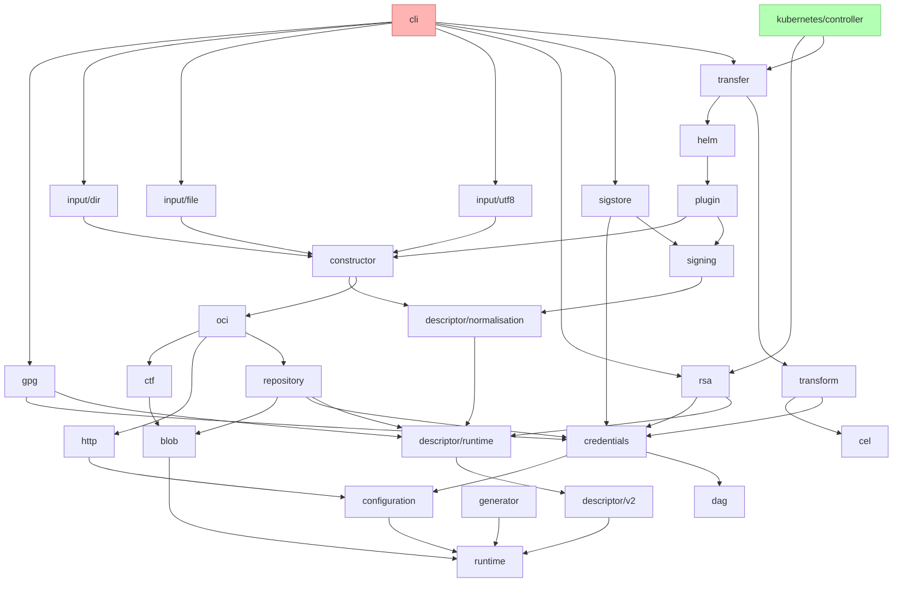

# ADR Template

* **Status**: draft
* **Deciders**: OCM Technical Steering Committee
* **Date**: 2026-07-06

## Context and Problem Statement
This is the approximate dependency structure of the go modules stored inside the monorepo at time of writing:

Each module has its own semver and to propagate e.g. a change in `runtime`, `dag`, or `cel` we have to release (release module(s), bump `go.mod` & `go.sum` files in next layer, loop) in at least 10 layers:

#### Release layers (bottom-up)

| Layer | Modules | Notes |
|-------|---------|-------|
| 0 | runtime, dag, cel | Foundation — no internal deps |
| 1 | descriptor/v2, configuration, blob, generator | Only depend on runtime |
| 2 | descriptor/runtime, credentials, http, ctf | Core infra |
| 3 | descriptor/normalisation, repository, transform, gpg, rsa | Mid-level |
| 4 | signing, oci | Storage + signing |
| 5 | constructor, sigstore | Build + verify |
| 6 | plugin, input/dir, input/file, input/utf8 | Extensions |
| 7 | helm | Chart support |
| 8 | transfer | High-level orchestration |
| 9 | cli, kubernetes/controller | Top-level consumers |

This complexity is currently managed by the developers and can get particularly challening when logic has to be adjust across multiple modules at once.
This ADR is concerned with the possible ways the developer experience could be optimized with regards to development of the bindings.

## Decision Drivers

* <Driver 1>
* <Driver 2>
* <Driver 3>

## Considered Options

* Option 1 <Brief description>
* Option 2 <Brief description>
* Option 3 <Brief description>

## Decision Outcome

Chosen [Option X](#option-x): "<Chosen Option>".

Justification:

* <Justification point 1>
* <Justification point 2>
* <Justification point 3>

### Option X

#### Description

<Explain why this option was chosen and its benefits.>

#### High-level Architecture

<Provide a diagram or sequence flow if applicable.>

#### Contract

<Define the interfaces, protocols, and agreements needed for this decision.>

## Pros and Cons of the Options

### [Option 1] <Option Name>

Pros:

* <Pro 1>
* <Pro 2>

Cons:

* <Con 1>
* <Con 2>

### [Option 2] <Option Name>

Pros:

* <Pro 1>
* <Pro 2>

Cons:

* <Con 1>
* <Con 2>

### [Option 3] <Option Name>

Pros:

* <Pro 1>
* <Pro 2>

Cons:

* <Con 1>
* <Con 2>

## Discovery and Distribution

<Explain how the decision will be implemented, distributed, and maintained.>

## Conclusion

<Summarize the decision and its expected impact.>
