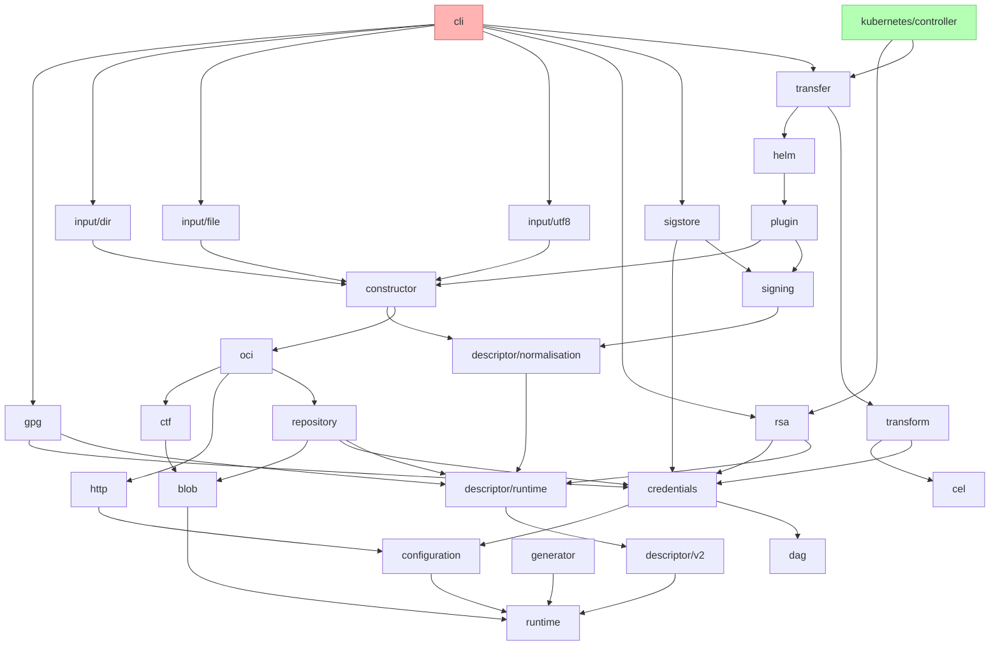

# ADR: Bindings CI and Release Strategy

* **Status**: draft
* **Deciders**: OCM Technical Steering Committee
* **Date**: 2026-07-06

## Context and Problem Statement

This is the approximate dependency structure of the go modules stored inside the monorepo at time of writing:

Each module has its own semantic version and release process. To propagate a change in e.g. `runtime` we have to:

1. release the module(s) 
2. bump `go.mod` & `go.sum` files in modules that depend on it (i.e. the next layer) 
3. Start again at `1.` for any module modified

On a central module like `runtime` this would entail releasing step by step in at least 10 layers:

### Release layers (bottom-up)

| Layer | Module | Direct internal dependencies |
|-------|--------|------------------------------|
| 0 | `cel`, `dag`, `runtime` | — |
| 1 | `blob`, `configuration`, `descriptor/v2`, `generator` | `runtime` |
| 2 | `credentials` | `configuration`, `dag`, `runtime` |
| 2 | `ctf` | `blob` |
| 2 | `descriptor/runtime` | `descriptor/v2`, `runtime` |
| 2 | `http` | `configuration`, `runtime` |
| 3 | `descriptor/normalisation` | `descriptor/runtime`, `descriptor/v2`, `runtime` |
| 3 | `gpg`, `rsa` | `credentials`, `descriptor/runtime`, `runtime` |
| 3 | `repository` | `blob`, `configuration`, `credentials`, `descriptor/runtime`, `runtime` |
| 3 | `transform` | `cel`, `credentials`, `dag`, `runtime` |
| 4 | `oci` | `blob`, `configuration`, `credentials`, `ctf`, `descriptor/runtime`, `descriptor/v2`, `http`, `repository`, `runtime` |
| 4 | `signing` | `descriptor/normalisation`, `descriptor/runtime`, `runtime` |
| 5 | `constructor` | `blob`, `credentials`, `dag`, `descriptor/normalisation`, `descriptor/runtime`, `descriptor/v2`, `oci`, `repository`, `runtime` |
| 5 | `sigstore` | `credentials`, `descriptor/runtime`, `runtime`, `signing` |
| 6 | `input/dir`, `input/file`, `input/utf8` | `blob`, `constructor`, `runtime` |
| 6 | `plugin` | `blob`, `configuration`, `constructor`, `credentials`, `descriptor/runtime`, `descriptor/v2`, `repository`, `runtime`, `signing` |
| 7 | `helm` | `blob`, `configuration`, `constructor`, `credentials`, `descriptor/runtime`, `descriptor/v2`, `http`, `oci`, `plugin`, `repository`, `runtime` |
| 8 | `transfer` | `blob`, `configuration`, `credentials`, `dag`, `descriptor/runtime`, `descriptor/v2`, `helm`, `oci`, `repository`, `runtime`, `signing`, `transform` |
| 9 | `cli` | `blob`, `cel`, `configuration`, `constructor`, `credentials`, `ctf`, `dag`, `descriptor/normalisation`, `descriptor/runtime`, `descriptor/v2`, `gpg`, `helm`, `http`, `input/dir`, `input/file`, `input/utf8`, `oci`, `plugin`, `repository`, `rsa`, `runtime`, `signing`, `sigstore`, `transfer`, `transform` |
| 9 | `kubernetes/controller` | `blob`, `configuration`, `credentials`, `ctf`, `descriptor/normalisation`, `descriptor/runtime`, `descriptor/v2`, `helm`, `oci`, `plugin`, `repository`, `rsa`, `runtime`, `signing`, `transfer`, `transform` |

This complexity is currently managed by the developers and can get particularly challenging when logic has to be adjusted across multiple modules at once.
This ADR is concerned with the possible ways the developer experience could be optimized with regards to development of the bindings and which tradeoffs we want to make.

## Decision Drivers

* **Inter-module development friction**: A conceptually single change that spans multiple modules requires multiple PRs and releases to be implemented end-to-end.
* **Inter-module regressions**: If a breaking change in a module is not caught by reviewers or existing tests (within that module), the release process can get blocked down the line. Inter-module integration is currently not automatically tested in PRs and thus there is no guarantee that the CI catches errors like this.
* **Release process complexity**: Presently, the release process is done manually and reflects the underlying complexity of the dependencies between modules.
* **CI complexity and scalability**: As with the release, the underlying complexity manifests in the CI. But currently each module can be tested independently and changes have to be introduced one module at a time. This automatically limits the scope of what has to be built per single PR.
* **External consumer ease of use**: The modularization gives consumers fine-granular control over what (transitive) dependencies they want to introduce into their projects.
* **Project-wide high impact**: Any change made to the development and/or release process has project-wide implications. Mistakes here can block the entire team, not just single developers. But the same can be true for uncaught inter-module regressions.

## Considered Options

* Option 1: `go.work` approach in CI - We add `go.work` files to always test all bindings against each other's bleeding edge versions.
* Option 2: Monolithic binding library(ies) - We bundle multiple (or all) bindings into a smaller set of larger libraries.
* Option 3: Accept status quo - it's mostly in a working state without having to invest additional development time.
* Option 4: Partial solutions - Perhaps there is a decent trade-off somewhere in between the all-or-nothing approaches above.

## Decision Outcome

Chosen [Option 3](#option-3-accept-status-quo): "Accept status quo", 
> maybe option 4 if we can find something worth cherry-picking

Justification:

* The cost of option 1 and 2 are unacceptably high at the moment.
* It is unclear if the newly introduced problems in Option 1 or 2 would outweigh the reduced friction in development

### Option 1: `go.work`

This was the initially preferred solution. An [ADR](https://github.com/open-component-model/open-component-model/pull/2930) for adopting it was written and [prototype for the CI](https://github.com/matthiasbruns/open-component-model/pull/115) was implemented.

This proved that several of the development hindrances could be solved with this approach:

* Multi-module changes in a single PR: The core friction of inter-module development can be alleviated this way.
* Guarding against regressions: All libraries run with all the newest version for their sibling libraries. Many - maybe most - inter-module regressions could be caught this way.
* Dependency-graph-aware CI execution and release PoC: The potential impact of code changes as well as the release process depend on tool-support that is aware of the dependency chain.

But while working on it, it also became clear that there were several unexpected complications and side effects of this approach, that made the trade-off unfavorable.

#### Release automation for sequential tagging would be mandatory

We **cannot** tag all bindings at once. To write e.g. `blob/go.sum`'s checksum for `runtime@v0.0.9`, the Go toolchain must fetch `runtime@v0.0.9` from the proxy, but the proxy only serves it after the tag is pushed. This forces a "layer-by-layer" release design.

This on its own is not different from the current release process. But `go.work` flips the equation: Currently every version is pinned and every semver explicit - with `go.work` no version is pinned and all semvers are implicit (as in implicitly always on the next version).

Consequently, what would be tested on main and in PRs would always be different from the actual currently released library behavior. Releases have to happen with `go.work` disabled. 
An individual hotfix for one library is suddenly not necessarily safe to execute, because the tested behavior is always on the bleeding edge of all libraries. Thus, a release of **any** binding would require a release of **every** binding, because the `go.mod` file would only become the source of truth during the release process. 

> Technically, this could be avoided, but the only way to avoid it would be to implement a separate release process just for hotfix versions. This process would have to pin layers below the change and test all layers above. It seems unlikely that this effort would be worth the investment and rather a hotfix would simply trigger a release of all bindings.

The regular release of all bindings would require automation, hence we would have to build this layered release process. Since Go releases are effectively eternal any mistake or edge-case in this automation could have cumbersome and high-impact ramifications.

#### Conditional test execution and release depend on an evaluated dependency tree

Without additional tooling all PRs would run all test suites on every build. Turn-around time and CI load would increase significantly. 

This comes with the territory, as the goal is that more inter-module interaction is tested, more test executions in PRs is a desired outcome. 
But this is only true for features that actually span multiple modules. For any single-module change the number of tests executed would increase significantly. Especially when everything runs on every commit.

> One relevant caveat about visible test scope: When thinking about a feature implementation end-to-end running all the tests once can actually be fewer test runs than the alternative - because either way all bumped libraries would have to be tested as well, it would just happen in individual PRs.

To optimize this the CI would have to consider the dependency tree of the modules and (as for the layered release process above) would have to use it to determine which tests to run. While this is feasible to implement, it would likely again be tooling that we have to implement and maintain ourselves. 

#### Modularity & Dependency Tree Stability

Due to the current design the CI enforces a strict modularity between the modules and a staged rollout. If a developer mistakenly includes a file from another module this fails in the CI without any additional logic (due to the sparse checkout). Since we would still need to enforce the modular design - and would require it to be able to release - we would now have to guard against it in another way.

#### `go.work` masks inconsistent `go.mod`

When `go.work` is active, Go resolves all internal imports from the local tree, **never consulting `go.mod` pins**. Hence, `go.mod` and `go.sum` can vary arbitrarily, be inconsistent, or reference non-existent versions. 

Resolution via MVS can also be inconsistent with the consumer experience, as resolution with `go.work` enabled can differ from the `go.mod` based resolution consumers would get.

### Option 2: Monolithic binding library(ies)

Instead of managing each module as an independent library we could merge some or even all bindings into a singular library. This approach would not rely on `go.work` and thus would sidestep some of the associated downsides. 

The release process and CI setup would also be simple, but irreversible. Once consumers depend on the monolithic module path, splitting it back out is a breaking change everywhere. The other presented options are reversible experiments; this one isn't.

Modularity could still be enforced, but it would have to be done through additional tooling, similar to the `go.work` approach.

Most tests would run on every commit, a shared downside with the `go.work` approach, though harder to optimize since there's no module-level dependency graph to derive an affected set from.

Consumers could still choose to consume only individual modules of the bundled library and in principle Go would optimize the unused parts away. 

#### Security scans and reflection

This approach could be feasible, except that it breaks the consumer experience in two key ways:

* Due to our internally used reflection, Go cannot optimize away the unused libraries. Consumers would receive all our (transitive) dependencies into their BOM.
* Security scans will trigger on anything inside of our entire dependency tree. This was and is a big painpoint in OCM v1. With this approach a consumer that e.g. only needs `descriptor/v2` would now also receive the entire helm SDK and thus be impacted by any security vulnerabilities discovered within.

### Option 3: Accept status quo

There were reasons behind most of the decisions that led to the current repository structure and many of the reasons are still valid today:

* Forced intentionality: It's a lot of work to introduce an inter-module change, this should force a mindful approach when working on such an issue. Potentially hot-take: The process is a feature, not a bug.
* Separation of concerns: One or multiple of the modules could be taken over by other teams and developed independently. While speculative and long-term, coupling the modules closer together would likely eliminate that possibility.
* Learnings from v1: OCM v1 was not designed in a modular way which contributed to the overall state of being unmaintainable. Maybe the v2 design overshot the modularity goal, but the driving decisions behind it were the right ones for long-term success of the product.
* Partial automation via Renovate: For non-breaking changes, the layer-by-layer version bumping can be automated through Renovate's dependency update PRs, already reducing the manual overhead without requiring custom tooling.
* `go.work` can be used (and already is) for local development of features that cross module boundaries. Getting the changes merged still requires individual PRs, but local development is already friction-less in this regard.
* Over time the expectation is that especially lower layers stabilize and that inter-module implementation efforts are the exception, not the norm.

### Option 4: Partial solutions

None of the above options are optimal, each has its own undesirable tradeoffs. It's still an open question whether we can find a compromise that brings us some of the benefits of one of the options without all the associated costs.

#### Scheduled `go.work`-based builds on main

With a generated `go.work` file we could run all tests on a schedule for main. This would make inter-module regressions more discoverable (though only after a PR is already merged) without affecting the release process or requiring extensive tooling. Via the schedule we would also have direct control over how much additional CI overhead we generate.

This would only make sense if we react to a failure of the scheduled build though, so it would be something additional for the entire team to pay attention to.

#### Selective `go.work`-based builds in PRs
Similar to the idea above, a complete test-suite run like this could also be executed on PRs e.g. for anything layer 2 or lower.

#### Incremental migration to `go.work`

One way to make option 1 more feasible could be to gradually migrate to it over time. E.g. by going top-down through the layers a first iteration could include only `transfer` and `helm` in a committed `go.work` file. The CI and release process could then be built up iteratively over time and the initial impact on the release process would be minimal.

The downsides of option 1 still all apply, but the investment would not have to be made in a big-bang and the risk would be more manageable. It would also be easier to revert a single step of this migration individually.

#### Automated PR impact analysis

We have the dependency tree logic in the PoC, we could use it to automatically comment the PR with its impact on higher layers, nudging developers to double check their changes. Or prompt one of the review AI agents with that specific information.

//TODO other ideas

## Pros and Cons of the Options

### Option 1: `go.work`

Pros:

* Solves inter-module development friction & inter-module regressions
* Relies on builtin Go feature (at least partially)

Cons:

* Shifts complexity from development time to release time, but does not reduce complexity
* Increases CI complexity; what the CI tests is not what consumers receive
* Would require a large time investment

### Option 2: Monolithic binding library(ies)

Pros:

* Solves inter-module development friction & inter-module regressions
* Simple to implement, simple release process

Cons:

* Breaks consumer experience
* Danger of diluting the design and creating new forms of tech debt (e.g. by re-introducing the coupling problems that made OCM v1 unmaintainable)

### Option 3: Accept status quo

Pros:

* No additional time investment required 
* No risk of introducing instability

Cons:

* Inter-module development friction & inter-module regressions remain unaddressed
* Questionable scaling for newly added modules

### Option 4: Partial solutions
// TODO
Pros:

* <Pro 1>
* <Pro 2>

Cons:

* <Con 1>
* <Con 2>

## Conclusion

<Summarize the decision and its expected impact.>
