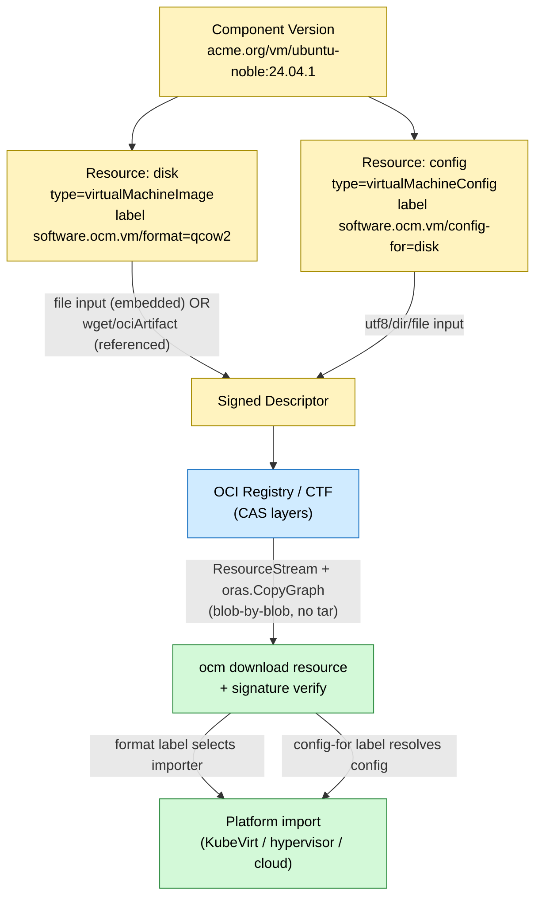

# Packaging and Shipping Virtual Machine Images and Configuration

* **Status**: proposed
* **Deciders**: OCM Technical Steering Committee
* **Date**: 2026-09-09

**Technical Story**:
Define how the Open Component Model packages, transports, and delivers Virtual Machine (VM) disk images — `raw`, `qcow2`, `vmdk`, `vhd`, `iso`, and OVA — together with their deployment configuration (cloud-init, ignition, OVF envelopes, sizing/placement metadata) as signed, self-describing, air-gap-capable component versions. This ADR settles the resource-type, media-type, access, and image↔config binding conventions for VM images whose blob fits within registry limits, and selects the large-blob splitting representation for 40 GiB+ images (an OCI Image Index of chunks), whose implementation and remaining configuration questions are deferred to EPIC [`open-component-model/ocm-project#1290`](https://github.com/open-component-model/ocm-project/issues/1290).

---

## Context and Problem Statement

OCM models every artifact as a component-version `resource` that carries a free-form `type` string, either an `input` (content added at construction time) or an `access` (a reference to externally stored content), and a media type describing the byte stream. The construction and resource model is documented in `bindings/go/constructor/doc.go`; resources are assembled by the constructor and stored either as OCI layers (embedded local blobs) or as external references.

VM images differ materially from container images:

* They are **single, large, opaque disk blobs** — not layered filesystems. A `qcow2` or `raw` disk is one file, routinely 2–40 GiB.
* They come in **multiple mutually incompatible formats** (`raw`, `qcow2`, `vmdk`, `vhd`, `iso`, OVA), and the consuming platform must know the format to import the image correctly.
* They ship with **out-of-band configuration** — cloud-init user-data, ignition configs, OVF envelopes, sizing/placement metadata — that is meaningless as bytes inside the disk but must travel with it.

Today there is no documented convention for:

* **(a)** which resource `type` and media types to use for VM images and their configuration,
* **(b)** whether to embed the image in the component version or reference it externally,
* **(c)** how to bind configuration to its image so the pairing survives transport and signing,
* **(d)** how to move multi-GiB blobs between repositories without exhausting memory or `/tmp`.

Absent a convention, a VM image would naively be modeled as a resource of `type: blob` with `mediaType: application/octet-stream` — losing both the disk-format information a consumer needs to import it and any structured link to its configuration.

Separately, images that exceed a registry's per-push / per-layer size limit (e.g. Google Artifact Registry's ~10 GiB layer cap) cannot be pushed at all as a single blob. OCM v1 solved this by transparently splitting large blobs into chunk layers and reassembling them on download; OCM v2 does not yet have this capability. EPIC [#1290](https://github.com/open-component-model/ocm-project/issues/1290) and its predecessor [#12](https://github.com/open-component-model/ocm-project/issues/12) track this and explicitly request "an ADR first to settle the representation and open questions." This ADR provides the VM-image packaging baseline now and settles the split representation; the implementation and the remaining open questions land in that EPIC.

---

## Decision Drivers

* **Multi-GiB blob transport without OOM** — VM images must stream, never fully materialize in memory or on disk (see [ADR-0022](0022_streaming_resource_content.md)).
* **Registry per-push / per-layer size limits** that block 40 GiB+ single-blob images (EPIC [#1290](https://github.com/open-component-model/ocm-project/issues/1290), [#12](https://github.com/open-component-model/ocm-project/issues/12)).
* **Air-gap portability** — a component version should be a single self-contained transport unit when required.
* **Self-describing format metadata** — consuming platforms must discover the disk format from the artifact, not out of band.
* **Cryptographic binding of image ↔ configuration** — the pairing must be tamper-evident.
* **Reuse of existing OCM machinery** — no new binding module or descriptor schema change for the baseline path.
* **OCI-native transport efficiency** — leverage content-addressable storage (CAS) layer deduplication where the image is already OCI-packaged.
* **Media-type dispatch** — consumer/download tooling should route on the media type (see [ADR-0007](0007_resource_download.md)).

---

## Considered Options

* **Option 1 — Resource-typed convention with a media-type registry and label binding.** VM images are ordinary resources with dedicated `type` strings and namespaced media types; embedded via the `file` input or referenced via `wget` / `ociArtifact` access; configuration is a sibling resource bound to the image with signing-relevant labels. *Chosen.*
* **Option 2 — New first-class descriptor kind `virtualMachine`** with dedicated schema fields for disk and configuration. *Rejected* — introduces component-descriptor schema churn, breaks all existing OCM tooling that only understands resources, and contradicts the model's core principle that resources are the universal artifact abstraction.
* **Option 3 — Single OVA-only tarball resource** bundling disk + OVF + configuration as one opaque blob of `type: blob`. *Rejected* — the bundle is opaque, so it defeats per-artifact digests, per-artifact signing granularity, and media-type dispatch, and forces a full download before any part can be inspected.

---

## Decision Outcome

Chosen **Option 1**: a resource-typed convention with a media-type registry and label binding. The following is the normative specification (decisions 1–9). Decision 9 settles the large-blob splitting **representation** only; its implementation and the remaining configuration questions are tracked in EPIC #1290.

### 1. VM images are ordinary resources

A VM image is a component-version `resource`, not a new first-class descriptor kind. There is **no change to the component descriptor structure**. This keeps every existing OCM tool — transfer, signing, download, transport — working unchanged.

### 2. Resource type strings

`blob` remains the generic fallback. This ADR defines two domain-specific artifact `type` strings:

| Resource `type`        | Meaning                                                                           |
|------------------------|-----------------------------------------------------------------------------------|
| `virtualMachineImage`  | A bootable VM disk image.                                                         |
| `virtualMachineConfig` | Machine-readable VM deployment configuration (cloud-init, ignition, OVF, sizing). |

Resource `type` values are free-form strings in the component descriptor (like the existing `ociImage`, `helmChart`, `blob`, `git`); they are **not** Go constants, and none is required here — this matches current practice.

### 3. Disk-image media types

The media type identifies the disk format. For an embedded image it is carried in `localBlob.mediaType`; for an external image it is carried in the access spec (`wget.mediaType`) or implied by the referenced OCI artifact. The normative mapping:

| Disk format            | mediaType                                          |
|------------------------|----------------------------------------------------|
| raw                    | `application/vnd.ocm.software.vm.disk.raw.v1`      |
| qcow2                  | `application/vnd.ocm.software.vm.disk.qcow2.v1`    |
| vmdk                   | `application/vnd.ocm.software.vm.disk.vmdk.v1`     |
| vhd / vhdx             | `application/vnd.ocm.software.vm.disk.vhd.v1`      |
| ISO (installer / live) | `application/vnd.ocm.software.vm.disk.iso.v1`      |
| OVA (tar of OVF+disks) | `application/vnd.ocm.software.vm.ova.v1+tar`       |

The reverse-DNS `application/vnd.ocm.software.vm.*` namespace keeps VM media types self-describing and consistent with the existing OCM layout media type `application/vnd.ocm.software.oci.layout.v1+tar` (`bindings/go/oci/spec/layout/media_type.go`), so `BlobTransformer` and download tooling ([ADR-0007](0007_resource_download.md)) can dispatch on them.

When the `file`/`dir` input sets `compress: true`, the existing compression path (`bindings/go/blob/compression/blob.go`, `MediaTypeGzipSuffix`) appends a `+gzip` suffix to the media type. **Recommendation:** enable compression for `raw` images (highly compressible, sparse), and leave it off for already-compressed formats such as `qcow2`.

### 4. Packaging (build-time)

Three supported flows. The embedded flow is the recommended default for portability and air-gap.

#### Packaging Flow A — embedded local blob via `file` input (recommended)

The disk is added into the component version at construction time. The constructor produces an `InputFileBlob` (`bindings/go/input/file/blob.go`); the media type flows into `v2.LocalBlob.MediaType` (`bindings/go/constructor/construct.go`, `addColocatedResourceLocalBlob`); the blob is stored as an OCI layer in the descriptor manifest. This colocates the image with the component version as one signed, self-contained transport unit.

```yaml
components:
  - name: acme.org/vm/ubuntu-noble
    version: 24.04.1
    provider:
      name: acme.org
    resources:
      - name: disk
        type: virtualMachineImage
        version: 24.04.1
        labels:
          - name: software.ocm.vm/format
            value: qcow2
            signing: true
        input:
          type: file
          path: ./noble-server-cloudimg-amd64.qcow2
          mediaType: application/vnd.ocm.software.vm.disk.qcow2.v1
```

The resulting descriptor resource (embedded local blob) looks like:

```yaml
resources:
  - name: disk
    version: 24.04.1
    relation: local
    type: virtualMachineImage
    labels:
      - name: software.ocm.vm/format
        value: qcow2
        signing: true
    access:
      type: LocalBlob/v1
      localReference: sha256:842dc2c806b9f40402584518da8731913c1e92e48d92a9f9e95a96e32443be56
      mediaType: application/vnd.ocm.software.vm.disk.qcow2.v1
    digest:
      hashAlgorithm: SHA-256
      normalisationAlgorithm: genericBlobDigest/v1
      value: 842dc2c806b9f40402584518da8731913c1e92e48d92a9f9e95a96e32443be56
```

#### Packaging Flow B — external reference via `wget` access

For images already published to an HTTP endpoint or object store; avoids duplicating the bytes into the component version.

```yaml
resources:
  - name: disk
    type: virtualMachineImage
    version: 24.04.1
    labels:
      - name: software.ocm.vm/format
        value: qcow2
        signing: true
    access:
      type: wget/v1
      url: https://cloud-images.acme.org/noble/noble-server-cloudimg-amd64.qcow2
      mediaType: application/vnd.ocm.software.vm.disk.qcow2.v1
```

Tradeoff: not air-gap-portable; the URL must remain reachable at consume time. The resource still records a `digest` for integrity.

#### Packaging Flow C — external reference via `ociArtifact` access

When the image is already an OCI-packaged artifact (e.g. published with ORAS), reference it natively for CAS layer deduplication and native OCI transport.

```yaml
resources:
  - name: disk
    type: virtualMachineImage
    version: 24.04.1
    labels:
      - name: software.ocm.vm/format
        value: qcow2
        signing: true
    access:
      type: ociArtifact
      imageReference: ghcr.io/acme/vm-images/ubuntu:24.04
```

### 5. Shipping configuration alongside the image

Configuration is a **separate resource** of `type: virtualMachineConfig` — never embedded inside the disk blob. Two patterns:

**Small inline config** (cloud-init / ignition / sizing). The `utf8` input (`bindings/go/input/utf8`) produces `application/x-yaml` or `application/json` media types — it does **not** allow setting an arbitrary media type. If the VM-specific config media type `application/vnd.ocm.software.vm.config.v1+yaml` is required, use the `file` input pointing at a YAML/JSON file with an explicit `mediaType`. Use `utf8` when the generic `application/x-yaml` suffices.

**Bundle of config files** (kickstart + templates + scripts): the `dir` input (`bindings/go/input/dir`) tar-packs the directory.

```yaml
resources:
  - name: config
    type: virtualMachineConfig
    version: 24.04.1
    labels:
      - name: software.ocm.vm/config-for
        value:
          name: disk
          version: 24.04.1
        signing: true
    input:
      type: dir
      path: ./config
      mediaType: application/vnd.ocm.software.vm.config.v1+tar
```

**Association (image ↔ config binding).** OCM has no typed resource→resource link; the only schema-native relation is `srcRefs` (source→resource). Resource→resource association is therefore expressed with labels, and this ADR mandates two **signing-relevant** labels (`Label` struct in `bindings/go/constructor/spec/v1/constructor.go` — fields `name`, `value`, `signing`, `version`):

* `software.ocm.vm/format` on the image resource — value is the disk-format enum: `raw | qcow2 | vmdk | vhd | iso | ova`.
* `software.ocm.vm/config-for` on the config resource — value is the bound image resource identity `{ name, version }`.

Both labels set `signing: true`, so the pairing and the declared format are covered by the component signature and cannot be tampered with independently of the signed component version.

### 6. Transport of large images

VM images are routinely 2–40 GiB. Transport MUST use the streaming path from [ADR-0022](0022_streaming_resource_content.md) (`bindings/go/oci/stream`, `ResourceStream`, `oras.CopyGraph`), which moves content blob-by-blob with existence checks (layer deduplication) and never fully materializes the image in memory or `/tmp`. Both OCI-registry and CTF backends benefit — CTF stores blobs as individual files.

Anti-pattern: do **not** rely on `Materialize()` for VM images. `Materialize()` is the sole path that builds a tar of the whole artifact and is the exact behavior that caused OOM on large images (ADR-0022); it exists only as a legacy fallback for consumers that still require a `blob.ReadOnlyBlob`.

For `wget` and `ociArtifact` external access, transport moves only the reference; the bytes are fetched lazily at download time.

### 7. Integrity and signing

Every VM image resource records a `digest` (computed automatically at construction — `genericBlobDigest/v1` for raw blobs, as in [ADR-0013](0013_oci_format_compatibility.md)). The component version is signed with the existing signing machinery ([ADR-0008](0008_signing_verification.md), [ADR-0023](0023_gpg_signing.md)). Because the `software.ocm.vm/format` and `software.ocm.vm/config-for` labels are `signing: true`, the image, its configuration, and their association are all covered by a single component signature. No new signing work is required.

### 8. Consumption (deploy-time)

Retrieval reuses existing tooling; no new download handler is required for the baseline:

* `ocm download resource <component-version> <resource>` streams the disk blob to disk. The default no-transform path ([ADR-0007](0007_resource_download.md)) writes the raw stream, using the media type to choose a file suffix.
* For OVA (`+tar`) or dir-packed configuration, the extract transformer / tar-extraction path (ADR-0007) unpacks into a directory.
* The deploying platform (a hypervisor driver, Kubernetes CDI/KubeVirt, or a cloud image importer) reads the `software.ocm.vm/format` label to select the import routine and resolves the paired `virtualMachineConfig` resource via `software.ocm.vm/config-for`.

OCM's responsibility ends at delivering verified bytes plus typed metadata. Actually booting or importing the VM is out of OCM scope and belongs to the consuming platform — OCM makes no assumptions about how the content is finally deployed.



### 9. Large-Blob Splitting (representation chosen — implementation deferred to EPIC #1290)

> This subsection records the problem and the candidate solutions for images that exceed a registry's push/layer size limit, and **selects the representation**: an OCI Image Index of chunks. The split trigger, the chunk metadata, and the implementation are left to EPIC [#1290](https://github.com/open-component-model/ocm-project/issues/1290).

**Problem.** OCI registries impose per-push / per-layer size limits (e.g. Google's ~10 GiB layer cap). A VM disk larger than that cannot be pushed as a single blob layer. OCM v1 transparently split large blobs into multiple chunk layers on upload and reassembled them on download; OCM v2 lacks this. This blocks the 40 GiB+ artefact use case that motivates [#1290](https://github.com/open-component-model/ocm-project/issues/1290) and the predecessor discussion in [#12](https://github.com/open-component-model/ocm-project/issues/12).

**Candidate representations.**

1. **Split-manifest indirection.** `localBlob.localReference` points to a small split-descriptor blob with a dedicated media type (proposed `application/vnd.ocm.software.blob.split.v1+json`) that lists the ordered child-layer digests, per-chunk sizes, and the total reassembled digest. Reassembly reads the descriptor, then streams the chunk layers.
   * *Pro:* keeps `LocalReference` single-valued (matches today's `v2.LocalBlob.LocalReference string` in `bindings/go/descriptor/v2/local_access.go`); minimal reader impact; whole-blob digest lives in the descriptor. This is #12's "blob descriptor with a dedicated media type" variant.
   * *Con:* one extra fetch to read the split descriptor; introduces a new media type.
2. **Digest list in `localReference`.** Overload `LocalReference` to carry an ordered list of chunk-layer digests directly (the variant mandelsoft favored in #12).
   * *Pro:* no extra descriptor fetch.
   * *Con:* reinterprets the `LocalReference string` field semantics; touches every `localBlob` reader; least backward-compatible.
3. **OCI Image Index of chunks.** Reuse the [ADR-0013](0013_oci_format_compatibility.md) index path: `localReference` points at an OCI Image Index (`application/vnd.oci.image.index.v1+json`) whose child manifests/layers are the chunks.
   * *Pro:* maximally OCI-native; reuses ADR-0013 machinery.
   * *Con:* overloads "index" for pure byte-chunking; risks confusing OCI-native consumers that interpret an index as a multi-arch image; complicates non-OCI/CTF handling.

**Decision — representation 3, an OCI Image Index of chunks.** The #1290 discussion asked for a *technology-specific* solution rather than a general one, on the grounds that blob storages have no problem with large files and only registries impose the limit. Representation 3 is exactly that: the splitting lives in the OCI layer, reuses the ADR-0013 index machinery, and leaves every non-OCI backend untouched. Representations 1 and 2 invent an OCM-level construct for what is a registry-specific constraint.

Its con is mitigated rather than accepted: the index carries an OCM-specific artifact type / annotation so a consumer can tell a chunk index from a platform index, and the CTF path stores the chunk layers as individual files exactly as it already does for any other blob.

**Open — should splitting be offered at all?** #1290 raises this explicitly. The alternative is to reject over-limit pushes with a clear error and require the publisher to use a backend without the limit. Settled in the EPIC.

**Open — the split trigger.** #1290 requires sharding to be configurable, with `maxLayerSize` as the value. Where that configuration lives is undecided:

* **(a) Explicit per-resource directive** on the `file` input, e.g. `input: { type: File/v1, split: { maxLayerSize: 1Gi } }` — would add a `Split` field to `bindings/go/input/file/spec/v1.File`. Deterministic and self-documenting.
* **(b) Implicit** via an `.ocmconfig` default max-layer-size and/or auto-detected registry limits (OCM v1 behavior). Transparent but environment-dependent.

**Open — per-chunk metadata.** #1290 suggests each index entry optionally defines `size`, `digest`, and `chunkIndex` beyond what an OCI descriptor already provides. The exact annotation set is settled in the EPIC.

**Invariants any split solution MUST preserve** (from #1290's "Out of Scope" and #12):

* **No component-descriptor structure change** — splitting is a storage/transport detail.
* The resource's recorded `digest` remains the digest of the **whole reassembled blob**, so signatures (decision 7) stay valid regardless of chunking.
* Reassembled bytes are **byte-identical** to the original.
* **CTF and OCI backends** both supported (CTF stores chunks as individual files via `oras.CopyGraph`, per ADR-0022).
* Every chunk is **individually digest-verified** on reassembly, so a corrupted chunk is detected before the whole blob is rebuilt.
* Consumers using `ocm download resource` receive the **reassembled stream transparently** — chunking is invisible above the storage layer.

---

## Pros and Cons of the Options

### Option 1 — Resource-typed convention with media-type registry + label binding (chosen)

Pros:

* No component-descriptor schema change; every existing OCM tool keeps working.
* Reuses the existing input/access/streaming/signing machinery — no new binding module for the baseline.
* Media-type registry enables format-aware download and import dispatch.
* Supports both air-gap (embedded) and OCI-native (referenced) delivery.
* Granular per-artifact digests and independent signing coverage for image and config.

Cons:

* The image↔config binding relies on a label convention (a soft link), not a schema-enforced relation. *Schema-native fallback:* if reviewers judge labels too weak, model the config as a `source` of the image resource and link it with `srcRefs` (the only schema-native relation); the format label on the image is retained.
* Consumers must learn the media-type registry to dispatch correctly.

### Option 2 — New first-class descriptor kind `virtualMachine`

Pros:

* Strongly typed disk/config fields; no label convention needed.

Cons:

* Requires a component-descriptor schema change and version bump.
* Breaks every existing tool that only understands resources.
* Contradicts the model principle that resources are the universal artifact abstraction.

### Option 3 — Single OVA-only tarball resource

Pros:

* One artifact to move; trivially simple.

Cons:

* Opaque blob defeats per-artifact digests and independent signing granularity.
* No media-type dispatch — a consumer cannot tell the disk format without unpacking.
* Forces a full download before any part (even config) can be inspected.

---

## Discovery and Distribution

The baseline convention (decisions 1–8) needs **no code changes**: the media types and resource `type` strings are documentation-level conventions, and the two label keys are conventions consumers honor. The convention is distributed by publishing the media-type registry table and label contract in the website reference documentation.

Optional follow-ups (not required by this ADR):

* A VM-format `BlobTransformer` for on-download format conversion (e.g. `qcow2` → `raw`) per [ADR-0007](0007_resource_download.md).
* A Go constants file for the VM media types if the team later wants compile-time reuse.

**Large-blob splitting is tracked as its own workstream in EPIC [#1290](https://github.com/open-component-model/ocm-project/issues/1290)** — the representation is settled here; the core split/reassembly implementation, the trigger configuration, chunk metadata, tests, and end-user documentation land under #1290. This ADR feeds the EPIC's "ADR" deliverable with decision 9.

---

## Conclusion

OCM ships VM images and their configuration as ordinary signed resources: dedicated `virtualMachineImage` / `virtualMachineConfig` types, a namespaced `application/vnd.ocm.software.vm.*` media-type registry, embedded (`file`) or referenced (`wget` / `ociArtifact`) access, streaming transport for large blobs, and signing-relevant labels binding image to configuration. This delivers verified, self-describing, air-gap-capable VM artifacts with no change to the component-descriptor schema. Images that exceed registry size limits are split transparently into an OCI Image Index of chunks; the implementation and its remaining configuration questions are deferred to EPIC #1290.
