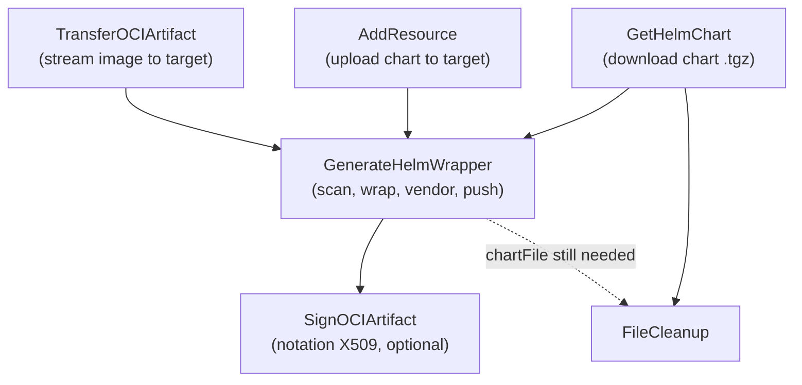

# Helm Localization at Transfer Time via Wrapper Charts

* **Status**: proposed
* **Deciders**: OCM Maintainer Team
* **Date**: 2026-07-16

Technical Story: After `ocm transfer` relocates the images referenced by a Helm
chart, the chart's `values.yaml` still points at the old registry. ADR 0004
explored solving this by rewriting the chart content during transfer, which
invalidates the original digest and signature and forces a resigning chain.
This ADR proposes an alternative that keeps the original chart untouched:
generate a small **wrapper chart** that depends on the original and overrides
only the image coordinates.

## Table of Contents

* [Context and Problem Statement](#context-and-problem-statement)
* [Decision Drivers](#decision-drivers)
* [Considered Options](#considered-options)
* [Decision Outcome](#decision-outcome)
  * [How the Wrapper Works](#how-the-wrapper-works)
  * [High-level Architecture](#high-level-architecture)
  * [Contract](#contract)
  * [Provenance](#provenance)
  * [Signing the Wrapper](#signing-the-wrapper)
* [Pros and Cons of the Options](#pros-and-cons-of-the-options)
* [Validation](#validation)
* [Known Limitations and Open Questions](#known-limitations-and-open-questions)
* [Conclusion](#conclusion)

## Context and Problem Statement

Consider a component version containing a Helm chart and the image it deploys:

```yaml
resources:
- name: podinfo-chart
  type: helmChart
  access:
    type: ociImage
    imageReference: ghcr.io/stefanprodan/charts/podinfo:6.11.1
- name: podinfo-image
  type: ociImage
  access:
    type: ociImage
    imageReference: ghcr.io/stefanprodan/podinfo:6.11.1
```

A transfer with `--copy-resources` relocates the image to the target registry
and updates the resource access in the descriptor. The chart's `values.yaml`,
however, is content inside the chart archive and still reads:

```yaml
image:
  registry: ghcr.io
  repository: stefanprodan/podinfo
  tag: 6.11.1
```

Installing the transferred chart deploys workloads that pull from the source
registry, defeating the purpose of the transfer (air-gapped environments,
registry allow-lists, provenance requirements).

ADR 0004 proposed localizing at transfer time by rewriting the resource
content through a transformer chain. That approach is good, however, it has a
cost: **modifying the content changes the digest, which invalidates the
component signature and requires a resigning process.** It also needs explicit
localization instructions provided with the chart by the component author.

This ADR takes a different approach. For Helm specifically, instead of changing
the chart, generate a second chart next to it and make that the parent of the
original chart. This parent chart will have values overrides for the image
locations discovered in the wrapped child.

## Decision Drivers

* **Preserve the original artifact.** The transferred chart _MUST_ remain
  byte-identical to the source, keeping existing digests and signatures valid.
* **Zero chart-author involvement.** Localization should work by convention
  (the well-known Helm values layout also used by Renovate), with no
  localization instructions embedded in the component version.
* **Standard consumption.** The result _MUST_ be installable by plain Helm,
  Flux, Argo and with no OCM-aware tooling at deploy time.
* **Library-first integration.** The mechanism must live in the transfer graph
  as a regular transformation node, because the Kubernetes controller consumes
  transfer as a library.
* **Trust for the new artifact.** The generated wrapper is new content and
  needs its own signature, produced during the same transfer.

## Considered Options

1. **Localize at Deploy Time.** Current status; deployment tooling applies
   localization instructions when the chart is used.
2. **Localize by Content Mutation.** Rewrite `values.yaml` inside the chart
   during transfer (ADR 0004's transformer-chain approach).
3. **Localize via Wrapper Charts.** This ADR.

## Decision Outcome

Chosen Option 1: **Localize at Deploy Time** is chosen because it's more discoverable.
Kro has been chosen as an industry standard by now and CEL parsing provides a lot of
flexible and powerful tooling around localization.

Justification:

The wrapper implementation described in here has too many moving parts and some of them
are difficult to discover and describe for users. Normally, users would have to worry
about the wrapper, and we would provide tooling to get the wrapper and get the right
OCI image reference URL for any installations. However, this means that it's
difficult to debug if the wrapper fails to install and even more cumbersome to understand
the architecture in case of failures by the user.

In turn, Kro is well documented, has a lot of use cases and the RGD + CEL parsing
makes for a nice visual guide to understand what is localized and what is not and
how and where in the helm chart these things need to happen without us trying to be
clever about it and figure it out. Explicit vs Implicit architecture.

### How the Wrapper Works

The generator scans the original chart's `values.yaml` for image blocks
following the well-known convention: a `repository` key, optionally refined by
`registry`, `tag`, and `version` siblings. Both dialects are supported, the
split form (`registry:` + `repository:`) and the host-embedded form
(`repository: ghcr.io/stefanprodan/podinfo`, the actual podinfo convention).

A candidate block only produces a localization if it **matches a sibling
resource access in the component version that was transferred and has a
digest**. This is a false-positive defense. Values that just look like image
blocks but do not correspond to a transferred resource, are left alone.

For the podinfo example above, the generated wrapper consists of two files.

`Chart.yaml`:

```yaml
apiVersion: v2
dependencies:
- alias: podinfo
  name: podinfo
  repository: oci://target.registry/charts
  version: 6.11.1
description: Localized wrapper for podinfo, generated by OCM transfer.
name: podinfo-localized
type: application
version: 6.11.1-localized.1
```

`values.yaml`:

```yaml
podinfo:
  image:
    digest: sha256:abc123
    repository: target.registry/library/podinfo
```

Design details:

* **Alias equals the original chart name**, so the overrides is under the
  key the original templates already read.
* **Version scheme is `<chartVersion>-localized.1`.** Semver build metadata
  (`+localized.1`) was rejected because OCI distribution tags forbid `+`. A
  prerelease suffix is OCI-tag-safe, and the prerelease-skipping semantics of
  semver range resolution do not matter here because the wrapper is consumed
  by exact reference. The `.1` counter leaves room for multiple wrapper
  revisions per original chart version.
* **The original chart archive is vendored into the wrapper byte-exact**, as
  `charts/<name>-<version>.tgz`. Nothing in the Helm install path resolves
  `oci://` dependencies at install time (`helm dependency build` is a dev-time
  command; Flux installs chart archives as-is), so the dependency must be
  physically present. Vendoring also closes a time-of-check gap: Helm
  dependencies are version-addressed and mutable, while the vendored archive
  freezes the exact transferred bytes under the wrapper's signature.
* **Wrapper generation is deterministic.** Same inputs produce the same chart
  bytes, which is why provenance metadata is kept out of the chart (see
  [Provenance](#provenance)).

The wrapper is pushed as a **standalone OCI Helm artifact** next to the
original chart, at `<chart-repository>/<chart>-localized:<version>`. It is
deliberately not added to the component version as a resource: it is derived,
reproducible transfer output, not source content.

This was the idea behind the POC. But the actual design doc described saving the
helm wrapper using the `Referrer` API. That makes it discoverable. The approach above
makes the wrapper hard to discover unless the user is aware of the naming and tagging
conventions correctly. And even then, multiple versions could make it difficult to see
what is the latest version for the wrapper.

### High-level Architecture

Localization is a transformation node in the transfer graph, wired in per Helm
chart resource when the `localize` option is set:



The wrapper node takes:

* the downloaded chart archive (`chartFile` from `GetHelmChart`),
* the chart resource after upload (`chartResource` from the add step, which
  determines where the wrapper is pushed),
* one `{source, target}` resource pair per transferred image, where the target
  is the post-transfer resource that has the relocated reference and digest.

Because uploads may return tag-only references, the node falls back to the
resource's `digest` field (SHA-256) to pin the localized image when the
reference itself carries no digest.

The `localize` option requires copying all resources as OCI artifacts
(`CopyModeAllResources` plus OCI artifact upload); the graph builder rejects
any other combination, since localization needs concrete target-registry
locations for every image.

### Contract

The core lives in `bindings/go/helm/localize` and tries to distance itself from
repository and transport things:

```go
// Scan finds localizable image blocks in the chart values by convention
// and matches them against the transferred resources.
func Scan(values map[string]any, mappings []ImageMapping) []Localization

// NewImageMapping adapts a pre-transfer and post-transfer OCIImage access
// pair into a mapping the scanner understands.
func NewImageMapping(source, target *accessv1.OCIImage) (ImageMapping, error)

// CreateHelmWrapper emits the deterministic wrapper chart definition.
func CreateHelmWrapper(meta WrapperMeta, locs []Localization) (*Wrapper, error)

// Package builds the wrapper .tgz (vendoring the original chart bytes) and
// wraps it in an OCI layout with the given manifest annotations.
func Package(ctx context.Context, wrapper *Wrapper, originalChart []byte,
    tmpDir string, annotations map[string]string) (*PackagedWrapper, error)
```

Orchestration (`bindings/go/helm/transformation`) exposes the graph node:

```yaml
type: GenerateHelmWrapper/v1alpha1
id: wrapPodinfoChart
spec:
  chartFile: ${getPodinfoChart.output.chartFile}
  chartResource: ${addPodinfoChart.output.resource}
  images:
    - source: <original v2 resource>
      target: ${transferPodinfoImage.output.resource}
  annotations:
    software.ocm/component: github.com/acme.org/podinfo:1.0.0
    software.ocm/repository: '{"type":"OCIRepository/v1","baseUrl":"..."}'
output:
  resource: <synthetic resource pointing at the pushed wrapper>
```

From the CLI, the entire mechanism is two flags (--sign-wrapper is optional):

```shell
ocm transfer component-version ./transport-archive \
  https://target.registry/target \
  --copy-resources --localize --sign-wrapper
```

Non-OCI image accesses (for example `localBlob`) are skipped with a log
message rather than failing the transfer. A chart-name mismatch between the
chart resource and its landed repository path skips wrapper generation with a
warning.

### Provenance

Backward provenance (wrapper to source component) is done by an **OCI manifest
annotations** set at push time:

* `software.ocm/component`: `<component-name>:<version>`
* `software.ocm/repository`: serialized source repository specification

These live on the manifest, not in `Chart.yaml`, because component identity and
repository are transfer-time metadata. Baking them into the chart would break
the determinism of the wrapper bytes.

An earlier design attached the wrapper to the original chart as an OCI
referrer. That was dropped for this proposal: referrers provide forward
discovery (original to wrapper), while this ADR here is backward
provenance only. The referrer implementation is available in the `oci`
bindings if forward discovery becomes a requirement.

### Signing the Wrapper

The wrapper is new content, so it gets its own signature. Signing is a
another graph node (`SignOCIArtifact`) rather than part of the push:
push-then-sign is two registry writes and the signer may use a
different credential identity than the pusher, and a separate node retries
independently.

* Signing uses [notation](https://notaryproject.dev/) with X509 certificates.
* Key material is resolved through the credential graph via a
  `NotationSigner/v1alpha1` consumer identity scoped to the target registry
  host. Certificate chain and private key can be inline PEM or file paths
  (matching cert-manager secret mounts). Missing signer credentials are a
  hard error: explicit opt-in via `--sign-wrapper` must not silently produce
  an unsigned artifact.
* Consumers verify with standard notation trust policies. Flux's
  source-controller (v1.2+) verifies via
  `OCIRepository.spec.verify: {provider: notation, secretRef: ...}`.

Known consideration for productization: notation signature validity is
checked against certificate validity at verify time. Short-lived certificates
(cert-manager defaults) invalidate old signatures on rotation unless an
RFC 3161 timestamp authority is used or wrappers are re-signed on re-transfer.

Notary is used here instead of cosign to avoid having to set up the entire signing
infrastructure of cosign for this. Instead, Notary perfectly integrates with Flux already
which means that the deployment can easily verify the wrapper by providing
the OCIRepository with the right secret.

## Pros and Cons of the Options

### [Option 1] Localize at Deploy Time

Pros:

* No transfer-time changes at all; artifact signatures untouched.

Cons:

* Failures surface at deploy time when everything is already packaged.
* Every environment repeats the localization work.

### [Option 2] Localize by Content Mutation (ADR 0004)

Pros:

* The transferred chart is directly deployable; consumers see one artifact.
* Fully general: any content change is expressible, not just image
  coordinates.

Cons:

* Changes the resource digest, invalidating the component signature; requires
  a resigning process and a transfer chain of trust.
* Requires authored localization instructions (CEL expressions or sibling
  resources) maintained by the component engineer.
* Reproducing "what exactly changed" requires diffing content rather than
  reading a small overlay.

### [Option 3] Localize via Wrapper Charts

Pros:

* Original chart bytes, digest, and signature are preserved end to end.
* Overrides are a small, human-readable values file.
* Convention-based; no instructions to author or maintain.
* Plain Helm semantics; installable by Helm, Flux, and Argo unchanged.
* Wrapper is independently signed during the same transfer.

Cons:

* Helm-only, for now; each deployment format needs its own wrapper strategy.
* Effectiveness depends on the chart following the values convention and on
  the template dialect it uses to render references (see open questions on
  digest pinning).
* One extra artifact per chart to store; the original chart archive is
  duplicated inside the wrapper (kilobytes, against the megabytes of relayed
  images).
* No forward discovery from the original chart to its wrapper right now, but
  this is possible to fix with Referrers.

## Validation

* Unit and golden tests in `bindings/go/helm/localize` (scanner tables,
  byte-for-byte golden wrapper output, determinism, vendoring), transformer
  tests in `bindings/go/helm/transformation`, graph wiring and flag-guard
  tests in `bindings/go/transfer`, and signing tests against a fake notation
  repository.
* End-to-end validation against ghcr.io with the real upstream podinfo chart
  and image: full transfer graph green, wrapper pushed at
  `.../podinfo/podinfo-localized:6.9.1-localized.1`, provenance annotations
  present, notation signature verified.
* Full GitOps loop demonstrated on kind: cert-manager-issued signing
  certificate, transfer with `--localize --sign-wrapper`, Flux `OCIRepository`
  with notation verification (`SourceVerified` succeeded), `HelmRelease`
  installing the wrapper via `chartRef`, and the kubelet pulling the image
  from the localized target registry.

A CLI integration test (transfer with `--localize` against a local registry,
asserting wrapper existence, annotations, and `helm template` output) is the
remaining test gap.

## Known Limitations and Open Questions

* **Digest pinning depends on the chart's template dialect (open decision).**
  The wrapper currently emits `{repository, digest}`. Charts that template
  `{{ .repository }}:{{ .tag }}` (podinfo and the dominant pattern) ignore the
  `digest` field, so the deployment is localized by doing a tricky hack like
  this: (`tag: latest@sha256:...`). The tag is ignored and digest is used instead.
* **Support needs to be provided per localization method.** For now, only Helm
  is implemented and OCI is supported. Non-OCI accesses are skipped with a log.
* **Scanner coverage**: the scalar `image: <full-ref>` string form and image
  blocks nested inside lists are not handled; only map-shaped blocks are.
* **Matching ambiguity**: when two resources share a repository and differ
  only in a field the values block omits, the first match wins. Hardening is
  to collect all matches and skip with a warning on ambiguity.
* **Subchart localization** (`Chart.lock`, nested dependencies) is untouched.
* **Module layout**: the scanner and wrapper generator are colocated in the
  `helm` module to avoid an import cycle. If a second format (Kustomize)
  materializes, the format-agnostic scanner extracts into a
  `bindings/go/localization` module.

## Conclusion

Wrapper charts localize Helm deployments at transfer time without touching a
byte of the original artifact. The component's existing signatures stay valid,
the localization delta is a small readable overlay with its own notation
signature and provenance annotations, and the result installs with plain Helm
tooling. The mechanism is implemented as ordinary transfer-graph nodes behind
`--localize` and optional `--sign-wrapper` and has been validated end to end
against a real registry and a Flux-verified cluster.
