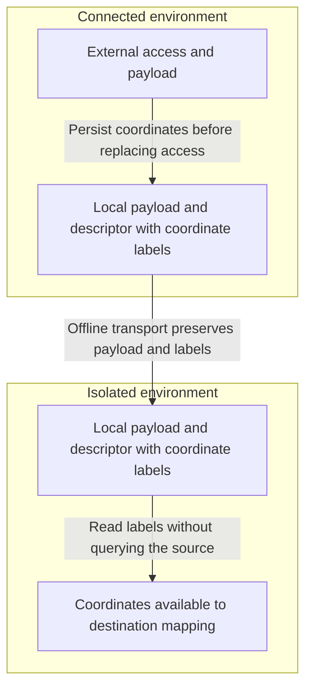
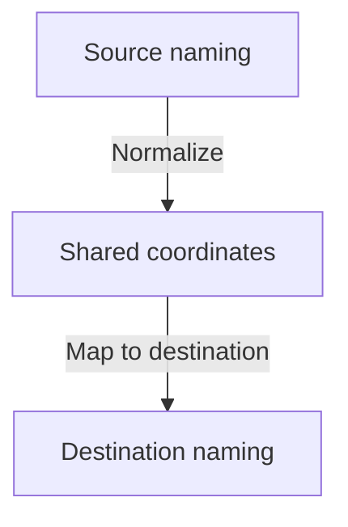
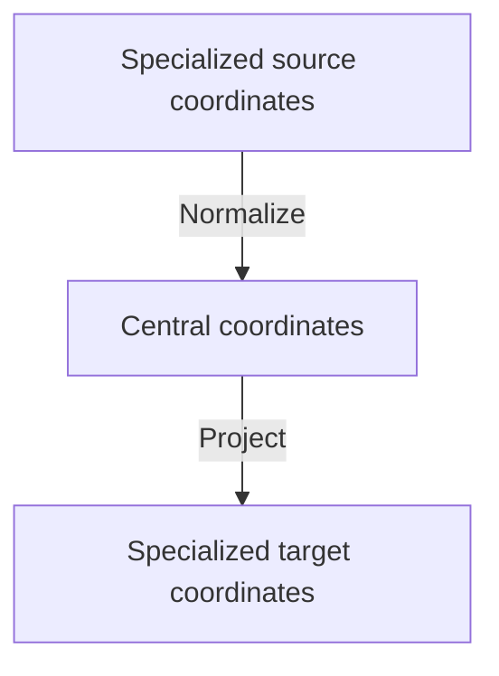

# ADR: Artifact Coordinates for Air-Gapped Transfer

- **Status**: proposed (decision pending)
- **Deciders**: SIG Runtime, Fabian Burth (@fabianburth)
- **Date**: 2026-09-18

## Context and Problem

Changing access to `localBlob` must preserve the naming information needed to publish an artifact elsewhere. Store that information in resource labels before replacing the external access. The OCM resource name/version may differ from the artifact's repository, tag, chart name, or object key.

During air-gapped transfer, the receiver has the descriptor and payload but cannot query the original source. Coordinates, also called reference hints here, must travel with the resource.

[EPIC #1264](https://github.com/open-component-model/ocm-project/issues/1264) starts with same-technology uploads and proposes a shared model for future cross-technology transfer. Adding a source should not require new naming mappings in every target.

## Scope

This ADR covers:

- Which naming information to retain before external access is replaced
- How to represent and persist coordinates alongside a resource
- How receivers interpret them without reaching the source
- How coordinates survive local copies, conversions, and later publication
- Three coordinate models and their trade-offs

Upload configuration, routing, CEL expressions, execution, and backend protocols are outside this ADR.

## Decision Status

No option has been selected. Type names and code examples are illustrative, not implemented APIs.

1. [Specialized coordinate families](#option-1-specialized-coordinate-families)
2. [Unified coordinates](#option-2-unified-coordinates)
3. [Hybrid coordinates through a shared hub](#option-3-hybrid-coordinates-through-a-shared-hub)

## Air-Gapped Transfer



For example, a source reference `registry.example/team/payments:1.4.0` provides repository `team/payments` and tag `1.4.0`. Both must survive when access becomes a local blob. The source registry is not needed to reconstruct that naming at the destination.

The offline bundle must contain the payload and coordinate metadata. A temporary file path, in-memory graph value, or remote `globalAccess` alone is insufficient. Receivers still need the schema support and adapters required by the chosen option.

## Coordinate Requirements

### Meaning and Boundaries

Coordinates describe portable naming, not a complete source access or a destination instruction. They exclude endpoints, credentials, headers, and signed URLs. Source provenance can be retained separately when needed.

| Source                     | Naming information to consider                               | Constraints                                                                                                            |
| -------------------------- | ------------------------------------------------------------ | ---------------------------------------------------------------------------------------------------------------------- |
| OCI artifact               | Registry-relative repository, tag, root digest               | Preserve tag and digest when both exist. Do not invent `latest`. The root digest is not the digest of a layout archive |
| Helm chart                 | Name and version from `Chart.yaml`                           | Requested access values and the OCM resource version are not authoritative. Verify against the archive                 |
| S3 object                  | Original object key                                          | Keep it opaque. Omit bucket, endpoint, region, and bucket-assigned version ID                                          |
| HTTP resource              | Original escaped URL path before redirects                   | A partial naming hint. Queries, headers, or request bodies can select different content at the same path               |
| GitHub source archive      | Owner, repository, pinned commit, optional informational ref | A commit is a source revision, not an archive digest or release version. Naming cannot recreate Git history            |
| Local blob or staging file | Previously retained coordinates                              | Do not derive artifact names from local storage references or temporary paths                                          |

An OCI tag is not necessarily a release version. A digest can pin an OCI reference but does not replace resource integrity verification. The unified model must account for such constraints even when they are kept outside its naming fields.

Naming also does not establish payload compatibility. A chart downloaded through HTTP may retain Helm identity after inspection. Adding Helm coordinates to arbitrary bytes does not make them a chart. Format conversion itself is outside this ADR, but its effects on coordinates are in scope.

### Derivation

- Derive coordinates before replacing external access, without requiring a later source lookup
- Use authoritative payload metadata where available, such as `Chart.yaml`
- Do not substitute the OCM resource name/version for missing artifact identity without explicit policy
- Parse full OCI references before removing the registry. Parse legacy relative `referenceName` values as relative names, not full references
- Preserve opaque S3 keys and escaped HTTP paths without cleaning, decoding, or silently renaming them
- Define HTTP path handling explicitly, including empty paths and the leading slash. Exclude query strings and request credentials
- Do not resolve a Git ref again just to recreate coordinates. Retain the pinned commit associated with the downloaded payload
- Reject invalid known coordinates rather than silently falling back to legacy hints

### Persistence and Lifecycle

All options persist coordinates in resource labels, including when access is `localBlob`. The labels belong to the resource, not the access object, so replacing access must not remove them. The examples use an unsigned `ocm.software/artifact-coordinates` label with an option-specific, versioned schema.

Every local copy and offline export/import must preserve these labels, even when the receiver cannot interpret their type or version. A `globalAccess` reference does not replace them. No extension to `LocalBlob` is needed, and graph-only storage is insufficient.

| Transition                              | Coordinate behavior                                                                                     |
| --------------------------------------- | ------------------------------------------------------------------------------------------------------- |
| External → local                        | Persist naming in resource labels before replacing access and retain compatible existing metadata       |
| Local → local                           | Preserve coordinate labels unchanged, including unknown types or versions and blobs with `globalAccess` |
| Content-preserving external publication | Retain information that the resulting access cannot reconstruct                                         |
| Content conversion                      | Preserve, translate, or remove fields according to the resulting representation                         |
| Subsequent download                     | Reconcile current-access naming with retained identity rather than blindly replacing it                 |
| Failed operation                        | Leave source coordinates and descriptor unchanged                                                       |

Changing storage must not lose coordinate information. Labels may be removed only after successful publication if the resulting access preserves all their naming information and it can be reconstructed without querying the source. Otherwise retain them. An S3 access, for example, generally does not preserve a chart's semantic name/version.

Decide whether logical names remain stable across hops or are deliberately rebased to the new access. Never guess which part of an external path was a previous destination prefix.

### Validation and Safety

- Treat coordinates as untrusted data, not permission to select endpoints or executable expressions
- Validate known fields and versions when producing or consuming them. Unknown metadata may be copied opaquely but not interpreted
- Modify copied output resources and preserve unrelated labels
- Reject automatic mutation of signing-relevant coordinate labels
- Keep media type and resource integrity metadata in their existing contracts
- Verify payload-defined identity against content and reject conflicting metadata
- Reject or explicitly resolve names that cannot be represented in the target naming grammar
- Detect conflicting target names without assuming equal names mean equal content

Unsigned coordinate edits preserve descriptor normalization only when other signing-relevant fields remain unchanged. Content conversion is not automatically signature-preserving.

## Option 1: Specialized Coordinate Families

### Model

Persist independently typed coordinates in one label. Each family defines native field meanings and validation.

```yaml
labels:
  - name: ocm.software/artifact-coordinates
    signing: false
    value:
      - type: HelmChartCoordinates/v1alpha1
        name: payments
        version: 1.4.0+build.1
      - type: OCIArtifactCoordinates/v1alpha1
        repository: team/charts/payments
        tag: 1.4.0_build.1
```

This example could describe a chart converted to OCI while retaining its Helm identity. Multiple entries do not imply conversion support. The Helm version and OCI tag are distinct values with a defined mapping.

```go
// Sketch of a native coordinate type.
type OCIArtifactCoordinates struct {
    Type       runtime.Type `json:"type"`
    Repository string       `json:"repository"`
    Tag        string       `json:"tag,omitempty"`
    Digest     string       `json:"digest,omitempty"`
}
```

Require a repository and at least one of tag or digest. Use at most one entry per family name across versions. Producers upsert their family rather than append duplicates. List order does not choose a destination or give one family precedence.

### Offline Consumption and Extensibility

The receiver decodes the relevant family. It can retain unknown families without understanding them. Compatible entries survive publication to another storage technology.

Same-technology naming is direct. Cross-technology mapping needs something to produce the target family. Without a shared model, adapters may accumulate pairwise mappings. Adding a mandatory shared model would move this design toward Option 3.

### Pros

- Precise native naming and validation
- Independently versioned families
- Direct same-technology round trips

### Cons

- Generic consumers cannot interpret arbitrary source families
- Cross-technology naming needs additional mappings or later normalization
- Multiple families require compatibility, reconciliation, and cleanup rules

## Option 2: Unified Coordinates

### Model

Sources normalize to one shared contract. Destination mapping consumes it without inspecting source-specific coordinate types.



A candidate naming schema:

```go
type ArtifactCoordinates struct {
    Type      runtime.Type `json:"type"`
    Namespace []string     `json:"namespace,omitempty"`
    Name      string       `json:"name,omitempty"`
    Version   string       `json:"version,omitempty"`
    Tag       string       `json:"tag,omitempty"`
    Path      *string      `json:"path,omitempty"`
}
```

| Field       | Meaning                                                                                       |
| ----------- | --------------------------------------------------------------------------------------------- |
| `namespace` | Logical naming segments without an endpoint or URL escaping                                   |
| `name`      | Artifact name, verified against payload metadata when available                               |
| `version`   | Artifact release version, excluding arbitrary tags, Git commits, and S3 version IDs           |
| `tag`       | Publication alias independent of release version                                              |
| `path`      | Optional opaque distribution name for byte storage. An empty path differs from a missing path |

```yaml
labels:
  - name: ocm.software/artifact-coordinates
    signing: false
    value:
      type: ArtifactCoordinates/v1alpha1
      namespace: [team, charts]
      name: payments
      version: 1.4.0+build.1
      path: team/charts/payments-1.4.0+build.1.tgz
```

The chart supplies name/version. Source normalization or policy supplies namespace and distribution naming. A format change must revalidate fields such as the filename.

This sketch is incomplete. OCI root-digest pins and Git revisions need a defined place alongside shared naming. An OCI root digest must not be replaced by the digest of its offline archive. Package variants, multiple aliases, and multi-file artifacts also need evaluation before stabilizing the schema.

### Offline Consumption and Extensibility

Persist the shared object so receivers can interpret naming without the original source adapter. Keep it when the current access cannot reconstruct its meaning.

A new source using supported semantics implements one normalizer. Compatible consumers remain unchanged. New naming concepts may require a schema revision.

Normalizers must define encoding precisely. An opaque S3 key and an escaped HTTP path do not share the same grammar. Preserving original spelling across all technologies is not guaranteed, and missing identity must not be invented.

### Pros

- One persistent naming contract for offline receivers
- No pairwise source-to-target naming mappings for supported semantics
- Generic consumers can use naming from any compatible source

### Cons

- Shared semantics must be defined before the API is stable
- A minimal schema loses native detail, while many optional fields risk ambiguity
- Exact native round trips may need separate metadata or explicit policy
- New identity concepts can require shared schema changes

## Option 3: Hybrid Coordinates Through a Shared Hub

### Model

Keep native types and map them through a shared semantic model. Each technology knows its own type and the shared contract, not every other type.



```go
// Sketch of coordinate mapping, not an upload interface.
type CoordinateAdapter[T any] interface {
    Normalize(native T, facts PayloadFacts) (CentralCoordinates, error)
    Project(central CentralCoordinates, facts PayloadFacts, policy NamingPolicy) (T, error)
}
```

`PayloadFacts` represents validated content metadata. `NamingPolicy` supplies explicit naming choices. The central model defines shared meanings as in Option 2, rather than wrapping opaque native payloads.

Mappings are partial, not guaranteed inverses. Missing information requires explicit policy or an error. Same-technology consumers can retain native details that do not fit the hub, while cross-technology projection uses the shared contract.

### Offline Consumption and Extensibility

Two persistence variants are possible:

| Variant                                                       | Benefit                                                     | Cost                                                                         |
| ------------------------------------------------------------- | ----------------------------------------------------------- | ---------------------------------------------------------------------------- |
| Persist native coordinates and derive the hub at the receiver | Reuses native schemas without duplicating shared fields     | The offline receiver needs a normalizer for the stored native family/version |
| Persist the hub with optional native details                  | Shared naming is usable without the original source adapter | Requires an envelope and consistency rules for overlapping fields            |

A persisted hub governs cross-technology projection. Reject conflicting overlapping native values. With an ephemeral hub, native families must normalize consistently or explicit policy must resolve different naming alternatives. List order is not authority.

A new source expressing existing shared semantics needs one adapter. Compatible target adapters remain unchanged. Native schemas can evolve independently, but new shared concepts still require changes to the hub.

### Pros

- Native fidelity with a shared cross-technology mapping boundary
- Native coordinate contracts can remain in place
- Technology-specific details need not all fit the shared schema

### Cons

- More types, mappings, and potentially duplicated metadata
- Still requires a precise shared model
- Conflict resolution and conversion invalidation are more involved
- Persistence trades offline adapter dependencies for schema complexity

## Comparison

| Criterion                                   | Specialized                          | Unified                              | Hybrid                                     |
| ------------------------------------------- | ------------------------------------ | ------------------------------------ | ------------------------------------------ |
| Native fidelity                             | Directly represented                 | May need extra metadata              | Native details retained                    |
| Cross-technology naming                     | Additional mappings                  | Shared contract                      | Shared contract between native types       |
| Offline naming support                      | Relevant native schemas and adapters | Shared schema                        | Source normalizer or persisted hub         |
| New source using supported shared semantics | No shared contract defined           | One normalizer                       | One source adapter                         |
| Schema evolution                            | Per family                           | Shared schema                        | Shared schema and native families          |
| Main risk                                   | Pairwise mappings                    | Incomplete or ambiguous common model | Consistency between native and shared data |

Options 2 and 3 avoid up to N × M naming mappings for supported semantics. Option 1 defers that normalization boundary. None provides universal format conversion.

## Evaluation

Test the coordinate contract with the source unreachable and only the transported payload and descriptor available.

- External → `localBlob` → offline export/import → local copy preserves coordinate labels with the source unreachable
- Local copies retain unknown coordinate families or versions, including when `localBlob` has `globalAccess`
- OCI repository, tag-only, digest-only, and tag-plus-digest naming survive offline transport
- Helm name/version remain available after storage as an S3 object
- HTTP paths preserve defined escaping and empty-path semantics without retaining request secrets
- Opaque S3 keys are not cleaned or decoded, and names collapsing across buckets are detected
- A chart obtained through HTTP or S3 yields the same verified Helm identity
- Content conversion updates or removes incompatible coordinate fields
- Receivers report missing adapters, unsupported schemas, and incomplete naming without consulting the source
- Coordinate cleanup does not discard information absent from the resulting access
- Repeated destination prefixes follow explicit retention or rebasing rules
- Conflicting metadata fails deterministically and signed labels remain unchanged
- A new source using supported shared semantics requires no changes to compatible consumers under Options 2 and 3

## Open Questions

1. Must cross-technology normalization be part of the first public contract?
2. Are native coordinate types useful enough to justify a hybrid over a unified model?
3. Must offline receivers interpret naming without the original source adapter?
4. Which native details must survive exactly, and where do digest pins and source revisions belong?
5. Should logical names remain stable across hops or be rebased after publication?
6. What versioning and migration rules should the coordinate label use?

After discussion, record the selected model, persistence strategy, and reasons for rejecting the alternatives.
