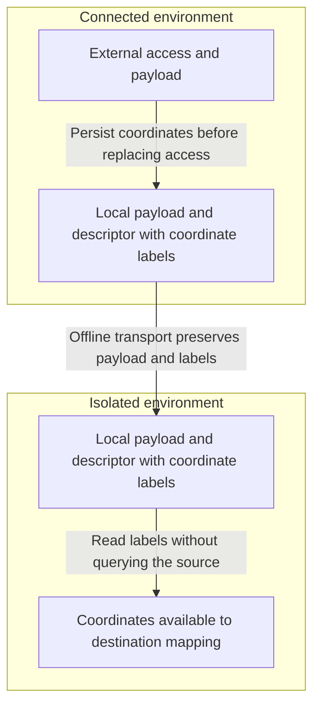
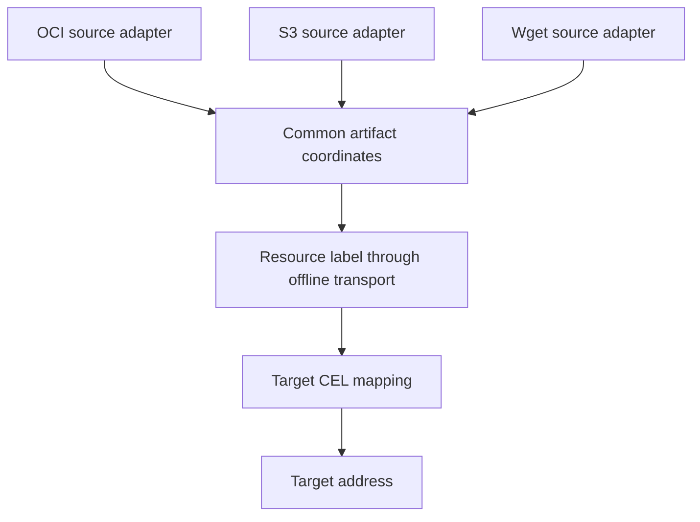
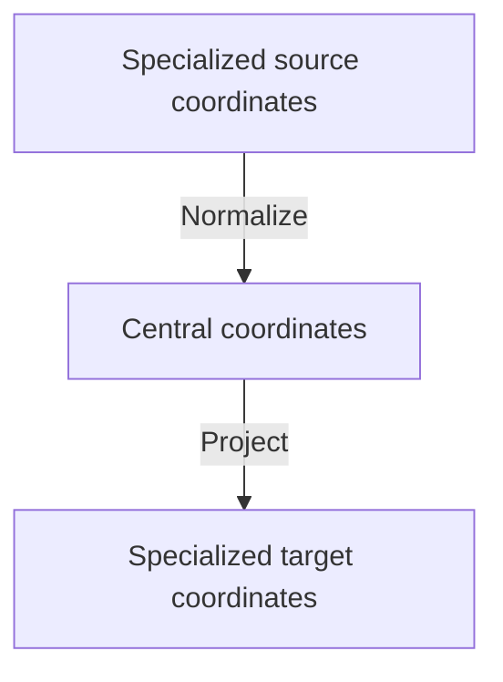

# ADR: Artifact Coordinates for Air-Gapped Transfer

- **Status**: proposed (decision pending)
- **Deciders**: SIG Runtime, Fabian Burth (@fabianburth)
- **Date**: 2026-09-18

## Context and Problem

Changing access to `localBlob` must preserve the naming information needed to publish an artifact elsewhere. Store that information in resource labels before replacing the external access. The OCM resource name/version may differ from the artifact's repository, tag, chart name, or object key.

During air-gapped transfer, the receiver has the descriptor and payload but cannot query the original source. Artifact coordinates must travel with the resource.

[EPIC #1264](https://github.com/open-component-model/ocm-project/issues/1264) starts with same-technology uploads and proposes a shared model for future cross-technology transfer. Adding a source should not require new naming mappings in every target.

## Scope

This ADR covers:

- Which naming information to retain before external access is replaced
- How to represent and persist coordinates alongside a resource
- How receivers interpret them without reaching the source
- How coordinates survive local copies, conversions, and later publication
- Three coordinate models and their trade-offs

Upload configuration, routing, execution, and backend protocols are outside this ADR. CEL examples only illustrate how destination mappings consume coordinates.

## Decision Status

No option has been selected. Type names and code examples are illustrative, not implemented APIs.

1. [Specialized coordinate families](#option-1-specialized-coordinate-families)
2. [Unified coordinates](#option-2-unified-coordinates)
3. [Hybrid coordinates through a shared hub](#option-3-hybrid-coordinates-through-a-shared-hub)

## Air-Gapped Transfer



For example, a source reference `registry.example/team/payments:1.4.0` provides repository `team/payments` and tag `1.4.0`. Both must survive when access becomes a local blob. Option 2 also retains the source registry and workspace so destination mappings can choose whether to use them.

The offline bundle must contain the payload and coordinate metadata. A temporary file path, in-memory graph value, or remote `globalAccess` alone is insufficient. Receivers still need the schema support and adapters required by the chosen option.

## Coordinate Requirements

### Meaning and Boundaries

Coordinates describe publication addresses, not complete source access methods or destination instructions. They exclude credentials, headers, and signed URLs. Option 2 retains source hosting authorities and workspaces as mapping inputs, not as instructions to contact those endpoints.

| Source                     | Naming information to consider                               | Constraints                                                                                                             |
| -------------------------- | ------------------------------------------------------------ | ----------------------------------------------------------------------------------------------------------------------- |
| OCI artifact               | Repository and tag, optionally source registry and workspace | Do not invent `latest`. Option 1 also retains root-digest pins, while Option 2 leaves digests outside its naming model  |
| Helm chart                 | Name and version from `Chart.yaml`                           | Requested access values and the OCM resource version are not authoritative. Verify against the archive                  |
| S3 object                  | Original object key                                          | Keep the key opaque. Option 2 also retains endpoint authority and bucket. Exclude region and bucket-assigned version ID |
| HTTP resource              | Original escaped URL path before redirects                   | A partial naming hint. Queries, headers, or request bodies can select different content at the same path                |
| GitHub source archive      | Owner, repository, pinned commit, optional informational ref | A commit is a source revision, not an archive digest or release version. Naming cannot recreate Git history             |
| Local blob or staging file | Previously retained coordinates                              | Do not derive artifact names from local storage references or temporary paths                                           |

An OCI tag is not necessarily a release version. A digest can pin an OCI reference but does not replace resource integrity verification. Option 2 leaves digests outside its naming fields and does not claim to reconstruct digest-pinned source access.

Naming also does not establish payload compatibility. A chart downloaded through HTTP may retain Helm identity after inspection. Adding Helm coordinates to arbitrary bytes does not make them a chart. Format conversion itself is outside this ADR, but its effects on coordinates are in scope.

### Derivation

- Derive coordinates before replacing external access, without requiring a later source lookup
- Use authoritative payload metadata where available, such as `Chart.yaml`
- Do not substitute the OCM resource name/version for missing artifact identity without explicit policy
- Let each source adapter extract coordinates using its own addressing rules, without a generic workspace splitter
- Use `looseref` for full OCI references, not arbitrary relative paths. Interpret legacy `referenceName` values only when their convention is known
- Preserve opaque S3 keys and escaped HTTP paths without cleaning, decoding, or silently renaming them
- Define HTTP path handling explicitly, including empty paths and the leading slash. Exclude query strings and request credentials
- Do not resolve a Git ref again just to recreate coordinates. Source revisions are separate from the publication naming in Option 2
- Reject invalid known coordinates rather than silently falling back to legacy hints

### Persistence and Lifecycle

All options persist coordinates in resource labels, including when access is `localBlob`. The labels belong to the resource, not the access object, so replacing access must not remove them. The examples use an unsigned `ocm.software/artifact-coordinates` label with an option-specific, versioned schema.

Every local copy and offline export/import must preserve these labels, even when the receiver cannot interpret their type or version. A `globalAccess` reference does not replace them. No extension to `LocalBlob` is needed, and graph-only storage is insufficient.

| Transition                              | Coordinate behavior                                                                                     |
| --------------------------------------- | ------------------------------------------------------------------------------------------------------- |
| External → local                        | Persist naming in resource labels before replacing access and retain compatible existing metadata       |
| Local → local                           | Preserve coordinate labels unchanged, including unknown types or versions and blobs with `globalAccess` |
| Content-preserving external publication | Retain information that the resulting access cannot reconstruct                                         |
| Content conversion                      | Preserve, translate, or remove fields according to the resulting representation                         |
| Subsequent download                     | Reconcile current-access naming with retained identity rather than blindly replacing it                 |
| Failed operation                        | Leave source coordinates and descriptor unchanged                                                       |

Changing storage must not lose coordinate information. Labels may be removed only after successful publication if the resulting access preserves all their naming information and it can be reconstructed without querying the source. Otherwise retain them. An S3 access, for example, generally does not preserve a chart's semantic name/version.

Decide whether logical names remain stable across hops or are deliberately rebased to the new access. Never guess which part of an external path was a previous destination prefix.

### Validation and Safety

- Treat coordinates as untrusted data, not permission to select endpoints or executable expressions
- Validate known fields and versions when producing or consuming them. Unknown metadata may be copied opaquely but not interpreted
- Modify copied output resources and preserve unrelated labels
- Reject automatic mutation of signing-relevant coordinate labels
- Keep media type and resource integrity metadata in their existing contracts
- Verify payload-defined identity against content and reject conflicting metadata
- Reject or explicitly resolve names that cannot be represented in the target naming grammar
- Detect conflicting target names without assuming equal names mean equal content

Unsigned coordinate edits preserve descriptor normalization only when other signing-relevant fields remain unchanged. Content conversion is not automatically signature-preserving.

## Option 1: Specialized Coordinate Families

### Model

This is the typed-coordinate approach from Fabian's proposal. Persist independently typed coordinates in one label. Each family defines native field meanings and validation.

```yaml
labels:
  - name: ocm.software/artifact-coordinates
    signing: false
    value:
      - type: HelmChartCoordinates/v1alpha1
        name: payments
        version: 1.4.0+build.1
      - type: OCIArtifactCoordinates/v1alpha1
        repository: team/charts/payments
        tag: 1.4.0_build.1
```

This example could describe a chart converted to OCI while retaining its Helm identity. Multiple entries do not imply conversion support. The Helm version and OCI tag are distinct values with a defined mapping.

Excerpt of the proposed native types, with descriptive Go names shown together here. The original uses `Coordinates` in separate technology packages.

```go
type OCIArtifactCoordinates struct {
    Type       runtime.Type `json:"type"`
    Repository string       `json:"repository"`
    Tag        string       `json:"tag,omitempty"`
    Digest     string       `json:"digest,omitempty"`
}

type HelmChartCoordinates struct {
    Type    runtime.Type `json:"type"`
    Name    string       `json:"name"`
    Version string       `json:"version"`
}

type S3ObjectCoordinates struct {
    Type      runtime.Type `json:"type"`
    ObjectKey string       `json:"objectKey"`
}
```

| Wire type                         | Native contract                                                                                 |
| --------------------------------- | ----------------------------------------------------------------------------------------------- |
| `OCIArtifactCoordinates/v1alpha1` | Registry-relative repository and at least one of tag or root digest. Preserve both when present |
| `HelmChartCoordinates/v1alpha1`   | Required name/version from the archive's `Chart.yaml`                                           |
| `S3ObjectCoordinates/v1alpha1`    | Required original object key, unchanged. No bucket, endpoint, or S3 version ID                  |

The proposed envelope is `type List []*runtime.Raw`. Each technology decodes its own payload. Use at most one entry per family name across versions, keyed by `runtime.Type.Name`. Producers upsert their family rather than append duplicates. List order does not choose a destination or give one family precedence.

### Offline Consumption and Extensibility

The receiver decodes the relevant family. It can retain unknown families without understanding them. Compatible entries survive publication to another storage technology.

Same-technology naming is direct. Cross-technology mapping needs something to produce the target family. Without a shared model, adapters may accumulate pairwise mappings. Adding a mandatory shared model would move this design toward Option 3.

### Pros

- Precise native naming and validation
- Independently versioned families
- Direct same-technology round trips

### Cons

- Generic consumers cannot interpret arbitrary source families
- Cross-technology naming needs additional mappings or later normalization
- Multiple families require compatibility, reconciliation, and cleanup rules

## Option 2: Unified Coordinates

### Model

Each source adapter translates its native address into one shared coordinate structure. The adapter knows its own addressing rules. The shared contract generalizes its output, not how it discovers workspace or resource boundaries.

Preserve the source authority, workspace, and resource path. Target mappings use CEL to decide what to retain, replace, or omit without inspecting the source access type.



Proposed schema:

```go
type ArtifactCoordinates struct {
    Type      runtime.Type `json:"type"`
    Authority string       `json:"authority,omitempty"`
    Workspace string       `json:"workspace,omitempty"`
    Path      *string      `json:"path,omitempty"`
    Tag       string       `json:"tag,omitempty"`
}
```

| Field       | Meaning                                                                                                             |
| ----------- | ------------------------------------------------------------------------------------------------------------------- |
| `authority` | Source hosting authority, such as a registry or endpoint host, including a port when present                        |
| `workspace` | Source-defined scope, such as an owner, group, or bucket                                                            |
| `path`      | Complete resource path within that scope. An empty path differs from a missing path                                 |
| `tag`       | Optional publication selector, such as an OCI tag or Helm chart version, not a promise of release-version semantics |

Fields are absent where the source has no equivalent. There is no invented `namespace`, generic path splitting, or substitution of OCM resource identity. A workspace may contain multiple segments when the source defines that scope. If no workspace boundary is known, retain the complete resource path rather than guessing one.

For `ghcr.io/stefanprodan/podinfo:sha256-ec73780a8425f59ea49f5bc8cdff0d598805a224fbaa1f86c67a244f250fa9da`:

```yaml
labels:
  - name: ocm.software/artifact-coordinates
    signing: false
    value:
      type: ArtifactCoordinates/v1alpha1
      authority: ghcr.io
      workspace: stefanprodan
      path: podinfo
      tag: sha256-ec73780a8425f59ea49f5bc8cdff0d598805a224fbaa1f86c67a244f250fa9da
```

Here the source adapter uses GHCR's owner/repository boundary. The full repository remains available as `workspace + "/" + path`. The `sha256-...` value is a tag, not a digest.

Digest handling remains outside this model. Existing resource integrity metadata keeps its own meaning and must not be treated as an interchangeable OCI manifest digest. Source-only selectors such as S3 version IDs and Git commits are also outside this publication-address contract. It is not a lossless serialization of source access.

### Source Normalization

| Source                     | `authority`                 | `workspace`                             | `path`                      | `tag`                       |
| -------------------------- | --------------------------- | --------------------------------------- | --------------------------- | --------------------------- |
| OCI image on GHCR          | `ghcr.io`                   | `stefanprodan`                          | `podinfo`                   | `6.9.0`                     |
| S3 object                  | `s3.example.com`            | `artifacts`                             | `apps/podinfo.tar.gz`       | Absent                      |
| Wget download              | `downloads.example.com`     | Absent                                  | `/releases/podinfo.tar.gz`  | Absent                      |
| GitHub source archive      | `github.com`                | `matthiasbruns`                         | `test`                      | Absent                      |
| Helm chart                 | Repository host             | Source-defined repository scope, if any | Chart name                  | Chart version               |
| Local blob or staging file | Retain existing coordinates | Retain existing coordinates             | Retain existing coordinates | Retain existing coordinates |

The OCI adapter can use `looseref` to separate registry, repository, and tag. Workspace extraction belongs to the adapter. Existing `referenceName` values are compatibility inputs when their convention is known, not the common schema.

Preserve opaque object keys and escaped HTTP paths without cleaning or silently decoding them. HTTP paths include their leading slash. Source adapters must not invent a tag from a query, Git ref, temporary filename, or object version ID. Sources without usable naming, including some HTTP downloads and OCI layers, need explicit naming input.

### Target Mapping

The following CEL expressions assume the shared object is exposed as `coordinates`. They illustrate naming only, not an upload configuration API.

Replace the registry and workspace for an OCI destination:

```cel
"registry.example/appetizers/" + coordinates.path + ":" + coordinates.tag
```

Replace only the registry:

```cel
"registry.example/" + coordinates.workspace + "/" +
coordinates.path + ":" + coordinates.tag
```

Build an S3 key retaining the source grouping:

```cel
coordinates.authority + "/" + coordinates.workspace + "/" +
coordinates.path + "/" + coordinates.tag
```

These examples require the referenced fields to be present. A target mapping must handle absent tags, path encoding, target grammar, and collisions explicitly. It must not guess that the final path segment is a tag. The target configuration supplies the destination bucket or endpoint. Wget describes download access, so HTTP publication requires an appropriate uploader.

The same boundary allows `github.com/matthiasbruns/test` to map to `gitlab.com/appetizers/test` by retaining `path` and replacing authority and workspace. This illustrates address mapping, not Git repository conversion support.

### Offline Consumption and Extensibility

Persist the shared object in the resource label before replacing external access with `localBlob`. Preserve it through local copies and offline export/import. The destination reads it without contacting the source or loading its normalizer. Publication must not silently replace retained source coordinates with the destination address.

A new source fitting the contract implements one normalizer. Compatible target mappings remain unchanged. New addressing concepts may require a schema revision. Payload compatibility and format conversion remain separate from address mapping.

### Pros

- One structured contract for destination CEL mappings across technologies
- Source authority, workspace, and path remain available for relocation decisions
- No pairwise source-to-target mappings for supported addressing concepts
- Offline receivers need the shared schema, not the original source adapter

### Cons

- Workspace boundaries, path encoding, and selector semantics need precise adapter contracts
- Some sources lack usable naming and require explicit input
- Target mappings must handle missing fields, encoding, and collisions
- The model does not retain source-only selectors or guarantee exact access reconstruction
- New addressing concepts can require shared schema changes

## Option 3: Hybrid Coordinates Through a Shared Hub

### Model

Keep native types and map them through a shared semantic model. Each technology knows its own type and the shared contract, not every other type.



```go
// Sketch of coordinate mapping, not an upload interface.
type CoordinateAdapter[T any] interface {
    Normalize(native T, facts PayloadFacts) (CentralCoordinates, error)
    Project(central CentralCoordinates, facts PayloadFacts, policy NamingPolicy) (T, error)
}
```

`PayloadFacts` represents validated content metadata. `NamingPolicy` supplies explicit naming choices. The central model defines shared meanings as in Option 2, rather than wrapping opaque native payloads.

Mappings are partial, not guaranteed inverses. Missing information requires explicit policy or an error. Same-technology consumers can retain native details that do not fit the hub, while cross-technology projection uses the shared contract.

### Compared with Specialized and Unified Coordinates

The hybrid retains types such as `HelmChartCoordinates` and `S3ObjectCoordinates` from Option 1, while adding the common mapping boundary from Option 2. For example, a Helm adapter maps chart name/version into shared `path`/`tag`, a naming policy derives an object key, and an S3 adapter projects that key into `objectKey`. The S3 adapter does not decode Helm coordinates.

Unlike the unified option, native consumers can keep their typed contracts. Unlike the specialized option alone, cross-technology mapping must pass through the shared model. Native details remain available when the shared projection is insufficient for a lossless round trip.

### Offline Consumption and Extensibility

Two persistence variants are possible:

| Variant                                                       | Benefit                                                     | Cost                                                                         |
| ------------------------------------------------------------- | ----------------------------------------------------------- | ---------------------------------------------------------------------------- |
| Persist native coordinates and derive the hub at the receiver | Reuses native schemas without duplicating shared fields     | The offline receiver needs a normalizer for the stored native family/version |
| Persist the hub with optional native details                  | Shared naming is usable without the original source adapter | Requires an envelope and consistency rules for overlapping fields            |

A persisted hub governs cross-technology projection. Reject conflicting overlapping native values. With an ephemeral hub, native families must normalize consistently or explicit policy must resolve different naming alternatives. List order is not authority.

A new source expressing existing shared semantics needs one adapter. Compatible target adapters remain unchanged. Native schemas can evolve independently, but new shared concepts still require changes to the hub.

### Pros

- Native fidelity with a shared cross-technology mapping boundary
- Native coordinate contracts can remain in place
- Technology-specific details need not all fit the shared schema

### Cons

- More types, mappings, and potentially duplicated metadata
- Still requires a precise shared model
- Conflict resolution and conversion invalidation are more involved
- Persistence trades offline adapter dependencies for schema complexity

## Comparison

| Criterion                                   | Specialized                          | Unified                              | Hybrid                                     |
| ------------------------------------------- | ------------------------------------ | ------------------------------------ | ------------------------------------------ |
| Native fidelity                             | Directly represented                 | May need extra metadata              | Native details retained                    |
| Cross-technology naming                     | Additional mappings                  | Shared contract                      | Shared contract between native types       |
| Offline naming support                      | Relevant native schemas and adapters | Shared schema                        | Source normalizer or persisted hub         |
| New source using supported shared semantics | No shared contract defined           | One normalizer                       | One source adapter                         |
| Schema evolution                            | Per family                           | Shared schema                        | Shared schema and native families          |
| Main risk                                   | Pairwise mappings                    | Incomplete or ambiguous common model | Consistency between native and shared data |

For a chart taken offline and later stored in S3, all options must retain its Helm identity in resource labels. The difference is how they obtain the object key:

- **Specialized:** produce an `S3ObjectCoordinates` entry through an additional mapping while preserving the Helm entry
- **Unified:** retain chart name/version as `path`/`tag` and let the target CEL mapping compose the object key
- **Hybrid:** normalize Helm coordinates to the hub and project the chosen path into S3 coordinates, retaining the original identity

Options 2 and 3 avoid up to N × M naming mappings for supported semantics. Option 1 defers that normalization boundary. None provides universal format conversion.

## Evaluation

Test the coordinate contract with the source unreachable and only the transported payload and descriptor available.

- External → `localBlob` → offline export/import → local copy preserves coordinate labels with the source unreachable
- Local copies retain unknown coordinate families or versions, including when `localBlob` has `globalAccess`
- OCI repository and tag survive offline transport, including tags that resemble digests
- Option 2 retains authority and workspace for CEL mapping, without adding a digest field
- Digest-only OCI inputs require an explicit destination naming policy under Option 2
- Helm name/version remain available after storage as an S3 object
- HTTP paths preserve defined escaping and empty-path semantics without retaining request secrets
- Opaque S3 keys are not cleaned or decoded, and names collapsing across buckets are detected
- A chart obtained through HTTP or S3 yields the same verified Helm identity
- Content conversion updates or removes incompatible coordinate fields
- Receivers report missing adapters, unsupported schemas, and incomplete naming without consulting the source
- Coordinate cleanup does not discard information absent from the resulting access
- Repeated destination prefixes follow explicit retention or rebasing rules
- Conflicting metadata fails deterministically and signed labels remain unchanged
- A new source using supported shared semantics requires no changes to compatible consumers under Options 2 and 3

## Open Questions

1. Must cross-technology normalization be part of the first public contract?
2. Are native coordinate types useful enough to justify a hybrid over a unified model?
3. Must offline receivers interpret naming without the original source adapter?
4. Which native details must survive exactly, and where do digest pins and source revisions belong?
5. Should logical names remain stable across hops or be rebased after publication?
6. What versioning and migration rules should the coordinate label use?

After discussion, record the selected model, persistence strategy, and reasons for rejecting the alternatives.
