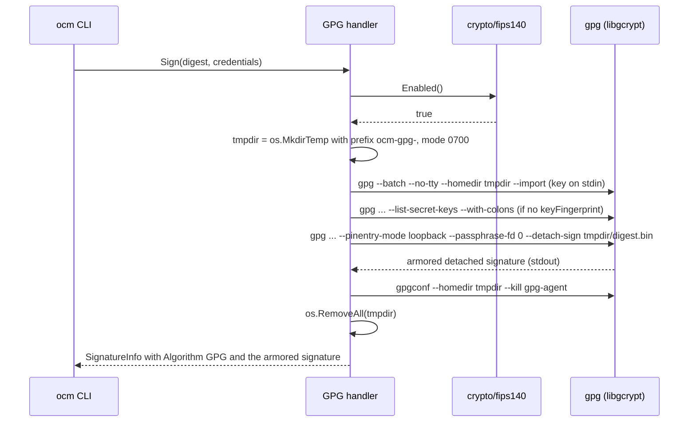

# FIPS 140-3 Compatibility of GPG and cosign Signing

* **Status**: proposed
* **Deciders**: OCM Technical Steering Committee
* **Date**: 2026-09-25

Technical Story: [ocm-project#1327](https://github.com/open-component-model/ocm-project/issues/1327), part of the FIPS 140-3 epic [ocm-project#1197](https://github.com/open-component-model/ocm-project/issues/1197). The documentation input in this ADR feeds [ocm-project#1314](https://github.com/open-component-model/ocm-project/issues/1314).

---

## Context and Problem Statement

Epic #1197 sets a single-artifact policy for FIPS 140-3: every OCM binary is built with `GOFIPS140` pinned to a frozen Go Cryptographic Module version and runs fail-open with `fips140=on`. There is no separate FIPS build. Users who do not need FIPS keep working exactly as before, and users on a FIPS host get validated cryptography from the same binary.

Two signing features do not fit this policy as implemented today:

* **GPG signing** ([ADR 0023](0023_gpg_signing.md)) runs in-process on `github.com/ProtonMail/go-crypto`. Part of its cryptography runs outside the Go Cryptographic Module, and unwrapping passphrase-protected keys is never FIPS-approved.
* **Sigstore signing** ([ADR 0017](0017_sigstore_integration.md)) shells out to a `cosign` binary. If none is on `PATH`, OCM downloads the upstream release, which is not built with `GOFIPS140`.

Only the `ocm` CLI binary and the CLI image are affected. The CLI registers the RSA, Sigstore and GPG handlers (`bindings/go/cli/internal/plugin/builtin/builtin.go:97-108`). The controller registers only the RSA handler (`bindings/go/kubernetes/controller/internal/setup/plugins.go:77-89`), and the RSA handler (`bindings/go/rsa/`) uses only standard library cryptography (`crypto/rsa`, `crypto/x509`), which is covered by the Go module.

This ADR decides how GPG and cosign behave in FIPS mode. Implementing the decision is tracked by the follow-up tasks listed under [Follow-up implementation tasks](#follow-up-implementation-tasks).

### Cryptographic surface analysis

#### Go Cryptographic Module

Facts from [the Go FIPS 140-3 documentation](https://go.dev/doc/security/fips140):

* Module v1.0.0 holds [CMVP certificate #5247](https://csrc.nist.gov/projects/cryptographic-module-validation-program/certificate/5247). It is the only certified version and is usable with Go 1.24+.
* Module v1.26.0 is "Pending Review" on the [CMVP Modules In Process list](https://csrc.nist.gov/projects/cryptographic-module-validation-program/modules-in-process/modules-in-process-list) (CAVP A8028) and is usable with Go 1.26+.
* `GOFIPS140=certified` and `GOFIPS140=inprocess` are aliases for these two versions.
* Setting `GODEBUG=fips140=on` on a binary built without `GOFIPS140` uses the unvalidated in-tree module. Selecting a frozen module with `GOFIPS140` at build time is the compliant mechanism.
* `fips140=only` is "not intended to be used in production".
* `GOFIPS140` only sets the *default* `GODEBUG`. The runtime reads `godebug.Value("#fips140")` (`$GOROOT/src/crypto/internal/fips140/fips140.go:18`), so `GODEBUG=fips140=off` at runtime disables FIPS mode. This ADR uses that as the documented opt-out.
* `crypto/fips140` provides `Enabled()`, `Version()`, `Enforced()` and `WithoutEnforcement(func())`.
* `crypto/cipher` CFB mode is "not validated as part of the FIPS 140-3 module" (doc comment on `NewCFBEncrypter` in `$GOROOT/src/crypto/cipher/cfb.go`).
* `go build` records the `GOFIPS140` build setting only when FIPS is enabled (`$GOROOT/src/cmd/go/internal/load/pkg.go:2522-2524`). Consumers read it with `debug/buildinfo.ReadFile(path)` from `BuildInfo.Settings`, key `GOFIPS140`.
* The repository toolchain is `go1.27.1` (`bindings/go/go.mod`: `go 1.27.0`, `toolchain go1.27.1`).

#### GPG

The GPG handler (`bindings/go/gpg/signing/handler/handler.go`, `internal/credentials/credentials.go`) uses `github.com/ProtonMail/go-crypto` v1.4.1. It is the only production importer of that library, which pulls in `github.com/cloudflare/circl` transitively.

* Sign is `openpgp.ArmoredDetachSign` over the hex-decoded digest bytes, with the hash restricted to SHA-256/384/512.
* Verify is `openpgp.CheckArmoredDetachedSignature`.
* Passphrase decryption goes through `entity.DecryptPrivateKeys`.
* The public keyring falls back to the private key when no public key is configured.
* `keyFingerprint` matches either the primary fingerprint or the long key ID.
* Credential keys: `privateKeyPGP`, `privateKeyPGPFile`, `passphrase`, `publicKeyPGP`, `publicKeyPGPFile`.

Primitive routing inside go-crypto:

| Key type | Sign/verify implementation | In Go module? | Approved? |
|---|---|---|---|
| RSA ≥2048 | standard library `crypto/rsa` (`openpgp/packet/public_key.go:822`) | yes | yes |
| ECDSA P-256/384/521 | `openpgp/internal/ecc/generic.go:116,121` → standard library `crypto/ecdsa` | yes | yes |
| ECDSA brainpool/secp256k1 | standard library legacy `big.Int` path | no | no |
| EdDSA / Ed25519 / Ed448 | `cloudflare/circl` (`openpgp/internal/ecc/ed25519.go:10`) | no | no |
| DSA | `crypto/dsa` | no | no |

* SHA-2 hashing goes through the standard library and is inside the module.
* v4 key fingerprints use SHA-1. This is a non-cryptographic identifier and is allowed under fail-open `fips140=on`.
* Unwrapping passphrase-protected keys is never FIPS-approved. It uses S2K (iterated/salted, or argon2 via `golang.org/x/crypto`), which is not an approved KDF. The cipher layer is AES-CFB, which is outside the module, plus a SHA-1 checksum, or the OCB/EAX modes implemented by go-crypto itself.
* No FIPS-validated OpenPGP library exists for Go. [ProtonMail/go-crypto#262](https://github.com/ProtonMail/go-crypto/issues/262) only covers SHA-1 panics.
* GnuPG 2.x performs all cryptography in libgcrypt, which has CMVP-validated builds on enterprise distributions, for example the [SUSE Linux Enterprise Libgcrypt Cryptographic Module, certificate #4722](https://csrc.nist.gov/projects/cryptographic-module-validation-program/certificate/4722). RHEL also ships validated libgcrypt builds [UNVERIFIED: exact RHEL version and certificate].
* libgcrypt enters FIPS mode when `/proc/sys/crypto/fips_enabled` is non-zero, when `/etc/gcrypt/fips_enabled` exists, or when `LIBGCRYPT_FORCE_FIPS_MODE` is set ([libgcrypt manual: Enabling FIPS mode](https://www.gnupg.org/documentation/manuals/gcrypt/Enabling-FIPS-mode.html)). In FIPS mode it restricts itself to approved algorithms.

#### cosign

The Sigstore handler (`bindings/go/sigstore/signing/handler/internal/cosign.go`, `cosign_download.go`, `handler.go`) runs `cosign` as a subprocess.

* `CosignBinary.resolveBinary` (`cosign.go:74-97`) first tries `LookPath("cosign")` with a minimum version of `v3.0.4` (`cosignMinimumVersion`). Otherwise `ensureOrDownloadCosign` fetches the upstream GitHub release pinned by `COSIGN_VERSION` (`v3.1.3`, in `internal/.env`) into `~/.cache/ocm/cosign/<version>/` and checks its SHA-256.
* There is no user-facing binary path override. `WithLookPath` and `WithExecCosign` in `handler_options.go` are test seams.
* The subprocess environment is `os.Environ()` (`handler.go:102`), plus `SIGSTORE_ID_TOKEN` when signing, so `GODEBUG` is inherited.
* Upstream cosign releases are not built with `GOFIPS140`. Upstream decided to keep standard Go cryptography in its releases and leave FIPS builds to downstream distributors ([sigstore/cosign#94](https://github.com/sigstore/cosign/issues/94)).
* Running upstream cosign with `GODEBUG=fips140=on` enables FIPS mode on the unvalidated in-tree module, which is not compliant.
* Third-party FIPS cosign builds exist: [Chainguard `cosign-fips`](https://images.chainguard.dev/directory/image/cosign-fips/overview) (paid, OpenSSL FIPS provider) [partially UNVERIFIED] and Red Hat Trusted Artifact Signer (RHTAS) on RHEL [FIPS claim UNVERIFIED].
* The keyless flow uses ECDSA P-256 with SHA-256, which are approved algorithms.
* `sigstore-go`, `sigstore/sigstore` and `go-tuf` use standard library cryptography. An in-process integration built with `GOFIPS140` would therefore be covered by the Go module.
* ADR 0017 chose the CLI wrapper over `sigstore-go` to limit dependencies.

#### Evidence

Observed with `go1.27.1` on darwin/arm64 while preparing this ADR:

* Evidence: `GODEBUG=fips140=only go test ./gpg/signing/handler/...` fails both packages (`TestGPGHandler_RoundTrip_Unprotected`, `TestPrivateEntityFromCredentials_Inline`) with `panic: crypto/sha1: use of SHA-1 is not allowed in FIPS 140-only mode`, raised from `(*PublicKey).setFingerprintAndKeyId` (`openpgp/packet/public_key.go:309`). This happens even for unprotected RSA keys, because v4 fingerprints use SHA-1. The same suite passes under `GODEBUG=fips140=on` (27 tests), so go-crypto only works fail-open.
* Evidence: a throwaway probe generated and encrypted an RSA-2048 key inside `fips140.WithoutEnforcement` and then called `DecryptPrivateKeys` under `GODEBUG=fips140=only`. It panics with `crypto/cipher: use of CFB is not allowed in FIPS 140-only mode` (`cfb.go:81`, called from `openpgp/packet/private_key.go:556`). Passphrase unwrapping runs outside the Go module.
* Evidence: a trivial program built with `GOFIPS140=v1.0.0` reports `build GOFIPS140=v1.0.0-c2097c7c` in `go version -m`. The same program built without `GOFIPS140` reports no `GOFIPS140` setting. The recorded value carries a suffix, so checks must match the `v` prefix, not an exact version.
* Evidence: `go version -m` on the upstream `cosign-darwin-arm64` v3.1.3 release reports `go1.26.4` and no `GOFIPS140` setting.

## Decision Drivers

* One artifact for FIPS and non-FIPS users.
* In FIPS mode, every cryptographic operation OCM triggers runs in a CMVP-validated module.
* No behavior change for users outside FIPS mode.
* Existing GPG users, including users of passphrase-protected keys (the ADR 0023 use case), keep a working path in FIPS mode.
* A clear, actionable error instead of silent non-compliance.
* A minimal new dependency surface.

## Considered Options

GPG:

* **G1**: approved-subset gate for in-process go-crypto
* **G2**: delegate to the system `gpg` binary in FIPS mode
* **G3**: deprecate and remove GPG, migrating users to RSA
* **G4**: build-tag FIPS variant without GPG

cosign:

* **C1**: FIPS guard with operator-supplied `cosign` only
* **C2**: OCM builds and distributes a `GOFIPS140` `cosign`
* **C3**: in-process `sigstore-go`
* **C4**: C1 now, plus C3 as a follow-up
* **C5**: pass `GODEBUG=fips140=on` to upstream `cosign`

## Decision Outcome

Chosen [G2](#gpg-system-gpg-backend-in-fips-mode) for GPG and [C4](#cosign-fips-guard-now-in-process-sigstore-go-next) for cosign.

Justification:

* G2 keeps passphrase-protected keys working, because unwrapping happens inside libgcrypt, which has CMVP validations. G1 cannot support passphrase-protected keys at all.
* G2 leaves non-FIPS users unchanged: outside FIPS mode the in-process go-crypto path stays as it is.
* G3 breaks ADR 0023 users. G4 violates the single-artifact rule.
* C4 closes the compliance gap immediately with little code, and commits to a true single-artifact end state in which all Sigstore cryptography runs in OCM's own module.
* C5 is not compliant, because it runs FIPS mode on an unvalidated module.
* C2 moves ownership of the cosign supply chain into OCM.

### GPG: system `gpg` backend in FIPS mode

#### Description

In FIPS mode the GPG handler stops using go-crypto and delegates Sign and Verify to the GnuPG `gpg` binary found on `PATH`. GnuPG performs all cryptography in libgcrypt, so on a FIPS-enabled host with a distribution-provided validated libgcrypt, every operation, including passphrase unwrapping, runs in a validated module. Key material still comes only from the OCM credential graph. The user's own GnuPG home directory is never touched. Outside FIPS mode nothing changes.

#### High-level Architecture

#### Contract

* **Trigger:** `crypto/fips140.Enabled()` is evaluated once per `Sign`/`Verify` call. `true` selects the `gpg` binary backend for both Sign and Verify. `false` keeps the current go-crypto path unchanged.
* **Binary:** `exec.LookPath("gpg")` only. There is no auto-download, because the point is the distribution-provided validated libgcrypt. The minimum GnuPG version is `2.2.0`, parsed from the first line of `gpg --version` (`gpg (GnuPG) X.Y.Z`). The `libgcrypt X.Y.Z` line is logged at debug level.
* **Isolation:** each operation uses a fresh `os.MkdirTemp("", "ocm-gpg-")` directory with mode `0700`, passed as `--homedir`. The user's `~/.gnupg` is never used, and key material still comes only from the OCM credential graph, so the ADR 0023 contract is unchanged. Common flags are `--batch --no-tty --homedir <dir>`. Cleanup always runs `gpgconf --homedir <dir> --kill gpg-agent` and then `os.RemoveAll(<dir>)`.
* **Key import:** armored key bytes (inline or from file, with the same `loadBytes` semantics as today) are piped to `gpg --import` on stdin, so OCM writes no key file to disk. `gpg-agent` keeps its protected copy of the key under the temporary home directory until cleanup.
* **Sign:**
  * The hex-decoded digest bytes are written to `<dir>/digest.bin`. They are not secret.
  * OCM runs `gpg --pinentry-mode loopback --passphrase-fd 0 --local-user <selector> --digest-algo <SHA256|SHA384|SHA512> --armor --detach-sign --output - <dir>/digest.bin` with the passphrase on stdin (empty stdin when there is no passphrase). The digest is passed as a file so that stdin can carry the passphrase portably. `ExtraFiles` is not used, because Windows lacks it.
  * Selector: `<keyFingerprint>!` when `keyFingerprint` is configured. Otherwise, the fingerprint of the first `fpr` record under the first `sec` record of `gpg --list-secret-keys --with-colons`, followed by `!`. This mirrors today's use of `keyring[0]`.
  * Output: stdout becomes `SignatureInfo{Algorithm: GPG, MediaType: application/vnd.ocm.signature.gpg, Value: <armored sig>}`, identical to today.
* **Verify:**
  * Import the public key, falling back to the private key as today.
  * Write the signature to `<dir>/sig.asc` and the digest to `<dir>/digest.bin`.
  * Run `gpg --status-fd 1 --trust-model always --verify <dir>/sig.asc <dir>/digest.bin`.
  * Success requires both `[GNUPG:] GOODSIG` and `[GNUPG:] VALIDSIG` status lines. When `keyFingerprint` is configured, the `VALIDSIG` signing-key fingerprint (field 1) or primary-key fingerprint (field 10) must equal it, or end with it for a long key ID, compared case-insensitively.
  * Anything else is an error that includes the status lines. With `--trust-model always` this keeps today's "any key in the provided keyring" semantics without web-of-trust prompts.
* **Interoperability:** both backends emit and consume RFC 4880 detached signatures over the same bytes. Signatures made in one mode verify in the other, provided libgcrypt in FIPS mode supports the key type. RSA ≥2048 and NIST ECDSA keys are supported; EdDSA and brainpool keys are not.
* **Errors (exact strings):**
  * Missing binary: `GPG signing in FIPS 140-3 mode requires the GnuPG "gpg" binary (>= 2.2.0) on PATH backed by a FIPS 140-3 validated libgcrypt; install it or set GODEBUG=fips140=off to use the built-in non-FIPS OpenPGP implementation`
  * Too old: `gpg on PATH (%s) is version %s, minimum required in FIPS 140-3 mode is 2.2.0`
  * Failed subprocess: `gpg %s failed: %w\nstderr: %s`, with stderr truncated to 4096 bytes like `cosign.go:120-124`.
* **Timeout:** 3 minutes per invocation, the same as `defaultOperationTimeout` in `cosign.go`.
* **Responsibility boundary:** OCM does not set `LIBGCRYPT_FORCE_FIPS_MODE` and does not verify that the libgcrypt build is validated. The operator provides a validated distribution GnuPG on a FIPS-enabled host. Validated libgcrypt builds exist only for specific Linux distributions; macOS and Windows have none.

### cosign: FIPS guard now, in-process `sigstore-go` next

#### Description

In FIPS mode OCM stops downloading the upstream cosign release and only uses a `cosign` binary the operator put on `PATH`. Because OCM cannot prove that an arbitrary binary uses a validated module, it inspects the Go build information and warns when the binary is not built with a frozen Go Cryptographic Module. As the next step, Sigstore signing and verification move in-process on `sigstore-go`, so they are compiled against OCM's own `GOFIPS140` module and the external binary disappears.

#### Contract

* **Trigger:** `crypto/fips140.Enabled()`, evaluated in `CosignBinary.resolveBinary`.
* **Resolution:** in FIPS mode only `LookPath("cosign")` is used, and the existing minimum-version check applies. Auto-download is disabled.
* **Error** when `cosign` is not on `PATH`: `cosign binary not found on PATH; auto-download of the upstream cosign release is disabled in FIPS 140-3 mode because it is not built against a validated FIPS module; install a FIPS 140-3 compliant cosign (>= v3.0.4) on PATH or set GODEBUG=fips140=off`
* **Build-info check (FIPS mode only):** call `debug/buildinfo.ReadFile(path)`. If there is no `GOFIPS140` setting, or its value does not start with `v`, emit a WARN log and continue (fail-open, not an error), because FIPS builds that are not Go-native, such as OpenSSL-based ones, exist. Message: `cosign on PATH is not built with a frozen Go Cryptographic Module; FIPS 140-3 compliance of cosign operations cannot be confirmed by OCM`, with attributes `path` and `gofips140`. If `ReadFile` returns an error, emit the same WARN with `gofips140=unknown`.
* **Environment:** the subprocess environment is unchanged (`os.Environ()`).
* **Recommended operator source** (documented example): `GOFIPS140=v1.0.0 CGO_ENABLED=0 go install github.com/sigstore/cosign/v3/cmd/cosign@v3.1.3`
* **Next step (C3):** a follow-up ADR supersedes ADR 0017 and moves `sign-blob`/`verify-blob` in-process with [`github.com/sigstore/sigstore-go`](https://github.com/sigstore/sigstore-go), so that it is compiled under OCM's `GOFIPS140` module. Rationale: cosign v3 itself depends on `sigstore-go`, and the keyless flow only uses approved algorithms. Once it lands, the `cosign` binary, the download code and this guard are removed.

## Pros and Cons of the Options

### [G1] Approved-subset gate for in-process go-crypto

Allow only RSA ≥2048 and NIST ECDSA keys in FIPS mode and reject everything else.

Pros:

* No external binary; works in the `scratch` CLI image and on every OS.
* No new dependencies.

Cons:

* Passphrase-protected keys are impossible in FIPS mode, because key unwrapping (S2K, AES-CFB, OCB/EAX) is never approved. This removes the primary ADR 0023 use case.
* Correctness depends on an allowlist kept in sync with go-crypto internals.

### [G2] Delegate to the system `gpg` binary in FIPS mode

Pros:

* All cryptography, including passphrase unwrapping, runs in a CMVP-validated libgcrypt on supported distributions.
* Passphrase-protected keys keep working.
* No change outside FIPS mode; signatures interoperate between both backends.
* No new Go dependencies.

Cons:

* External binary dependency in FIPS mode.
* The FIPS path is unavailable in the `scratch` CLI image and on macOS and Windows, which have no validated libgcrypt.
* Subprocess and temporary home directory handling adds code and test surface.

### [G3] Deprecate and remove GPG, migrating to RSA

Pros:

* Removes go-crypto and `circl` from the dependency graph.
* Signing is FIPS-native everywhere.

Cons:

* Breaking change for ADR 0023 users.
* The RSA handler has no passphrase-protected key support (`bindings/go/rsa/signing/handler/internal/pem/pem.go:25-43`).

### [G4] Build-tag FIPS variant without GPG

Pros:

* Simple to implement.

Cons:

* Violates the single-artifact rule of epic #1197.
* FIPS users lose GPG entirely.

### [C1] FIPS guard with operator-supplied `cosign` only

Pros:

* Small change; closes the gap of silently downloading a non-FIPS binary.
* No new dependencies.

Cons:

* Compliance depends on the operator supplying a FIPS build.
* OCM can only warn, not verify, when the binary is not a Go-native FIPS build.

### [C2] OCM builds and distributes a `GOFIPS140` `cosign`

Pros:

* Auto-download keeps working in FIPS mode.

Cons:

* OCM takes ownership of the cosign supply chain: building, signing, hosting and tracking upstream releases.
* Still an external binary per platform.

### [C3] In-process `sigstore-go`

Pros:

* True single artifact: Sigstore cryptography is compiled under OCM's `GOFIPS140` module.
* Removes the external binary and the download code.

Cons:

* About 50 additional transitive modules.
* Reverses the dependency decision of ADR 0017, so it needs its own ADR.

### [C4] C1 now, plus C3 as a follow-up

Pros:

* Closes the compliance gap immediately with little code.
* Commits to the single-artifact end state without blocking on the larger change.

Cons:

* Two changes instead of one; the C1 guard is temporary code.
* Until C3 lands, compliance still depends on the operator.

### [C5] Pass `GODEBUG=fips140=on` to upstream `cosign`

Pros:

* No code change; `GODEBUG` is already inherited through `os.Environ()`.

Cons:

* Not compliant: upstream cosign has no frozen module, so FIPS mode runs on the unvalidated in-tree module.

## Discovery and Distribution

* Both behaviors ship in the one `ocm` binary. There are no build tags.
* The CLI image stays `FROM scratch`. FIPS users who need GPG or cosign build a derived image from a FIPS distribution base (for example UBI 9 with `gnupg2`) that adds `gpg` and/or a `GOFIPS140` `cosign` on `PATH`.
* Both backends honour `GODEBUG=fips140=off` as the documented opt-out.

### Documentation input for #1314

Ready-to-paste user-facing points:

* **RSA signing** works in FIPS 140-3 mode everywhere, including the CLI image and the controller.
* **GPG signing in FIPS 140-3 mode** uses the GnuPG `gpg` binary on `PATH` instead of the built-in OpenPGP implementation.
  * Prerequisites: GnuPG >= 2.2.0 from a distribution that ships a FIPS 140-3 validated libgcrypt, on a host with FIPS mode enabled. The default `scratch` CLI image does not contain `gpg`; build a derived image, for example from UBI 9 with `gnupg2`.
  * Supported keys: RSA ≥2048 and NIST ECDSA (P-256/384/521), with or without passphrase. EdDSA, brainpool and DSA keys are not supported in FIPS mode.
  * Credentials are configured exactly as outside FIPS mode. OCM never uses your `~/.gnupg`.
  * Signatures created in FIPS mode verify outside FIPS mode and vice versa.
  * Error when `gpg` is missing: `GPG signing in FIPS 140-3 mode requires the GnuPG "gpg" binary (>= 2.2.0) on PATH backed by a FIPS 140-3 validated libgcrypt; install it or set GODEBUG=fips140=off to use the built-in non-FIPS OpenPGP implementation`
* **Sigstore signing in FIPS 140-3 mode** requires a FIPS 140-3 compliant `cosign` (>= v3.0.4) on `PATH`. OCM does not download cosign in FIPS mode.
  * Example: `GOFIPS140=v1.0.0 CGO_ENABLED=0 go install github.com/sigstore/cosign/v3/cmd/cosign@v3.1.3`
  * OCM logs a warning when the `cosign` on `PATH` is not built with a frozen Go Cryptographic Module.
  * Error when `cosign` is missing: `cosign binary not found on PATH; auto-download of the upstream cosign release is disabled in FIPS 140-3 mode because it is not built against a validated FIPS module; install a FIPS 140-3 compliant cosign (>= v3.0.4) on PATH or set GODEBUG=fips140=off`
* **Opt-out:** set `GODEBUG=fips140=off` to disable FIPS mode and use the built-in OpenPGP implementation and the automatic cosign download. Operations are then not FIPS 140-3 compliant.

### Follow-up implementation tasks

1. **"FIPS 140-3: GPG handler delegates to system gpg in FIPS mode"**
   * Implement the [GPG Contract](#gpg-system-gpg-backend-in-fips-mode) in a new package `bindings/go/gpg/signing/handler/internal/gpgbinary`, mirroring the injectable `LookPath`/`Exec` seams of `CosignBinary`.
   * Unit tests use a fake exec.
   * The integration test runs the `bindings/go/cli/integration/signing_gpg_integration_test.go` scenarios against a UBI 9 container with `gnupg2` and `LIBGCRYPT_FORCE_FIPS_MODE=1`, with the CLI built using `GOFIPS140=v1.0.0`.
   * The first acceptance item is a spike: confirm that a passphrase-protected RSA key imports and signs under libgcrypt FIPS mode via loopback pinentry, and that the agent socket works in a temporary home directory on macOS. If the spike fails, the task scope narrows to unencrypted keys in FIPS mode, and this ADR gets a follow-up note.
2. **"FIPS 140-3: disable cosign auto-download and warn on non-FIPS cosign in FIPS mode"**
   * Implement the [cosign Contract](#cosign-fips-guard-now-in-process-sigstore-go-next) in `bindings/go/sigstore/signing/handler/internal/cosign.go`.
   * Unit tests toggle FIPS mode via an injectable `fipsEnabled func() bool` field (default `crypto/fips140.Enabled`).
3. **"FIPS 140-3: ADR and implementation of in-process Sigstore signing/verification via sigstore-go (supersedes ADR 0017)"**

## Conclusion

In FIPS 140-3 mode, GPG signing delegates to a distribution-provided `gpg` backed by a validated libgcrypt, which keeps passphrase-protected keys working without changing behavior for anyone else. Sigstore signing stops auto-downloading non-FIPS upstream cosign immediately and moves in-process on `sigstore-go` next, so that eventually all OCM signing cryptography runs in the Go Cryptographic Module compiled into the single `ocm` binary.
