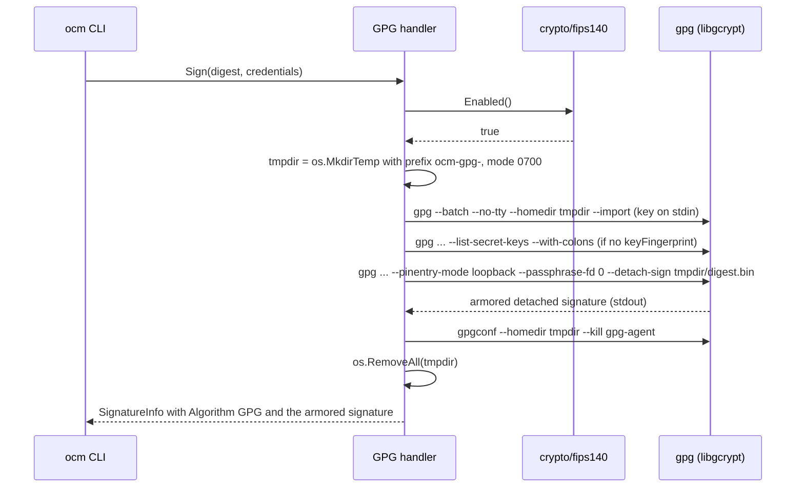

# FIPS 140-3 Compatibility of GPG and cosign Signing

* **Status**: proposed
* **Deciders**: OCM Technical Steering Committee
* **Date**: 2026-09-25

Technical Story: [ocm-project#1327](https://github.com/open-component-model/ocm-project/issues/1327), part of the FIPS 140-3 epic [ocm-project#1197](https://github.com/open-component-model/ocm-project/issues/1197). The documentation input in this ADR feeds [ocm-project#1314](https://github.com/open-component-model/ocm-project/issues/1314).

---

## Context and Problem Statement

Epic #1197 sets a single-artifact policy for FIPS 140-3: every OCM binary is built with `GOFIPS140` pinned to a frozen Go Cryptographic Module version and runs fail-open with `fips140=on`. There is no separate FIPS build. Users who do not need FIPS keep working exactly as before, and users on a FIPS host get validated cryptography from the same binary.

Two signing features do not fit this policy as implemented today:

* **GPG signing** ([ADR 0023](0023_gpg_signing.md)) runs in-process on `github.com/ProtonMail/go-crypto`. Part of its cryptography runs outside the Go Cryptographic Module, and unwrapping passphrase-protected keys is never FIPS-approved.
* **Sigstore signing** ([ADR 0017](0017_sigstore_integration.md)) shells out to a `cosign` binary. If none is on `PATH`, OCM downloads the upstream release, which is not built with `GOFIPS140`.

Only the `ocm` CLI binary and the CLI image are affected. The CLI registers the RSA, Sigstore and GPG handlers (`bindings/go/cli/internal/plugin/builtin/builtin.go:97-108`). The controller registers only the RSA handler (`bindings/go/kubernetes/controller/internal/setup/plugins.go:77-89`), and the RSA handler (`bindings/go/rsa/`) uses only standard library cryptography (`crypto/rsa`, `crypto/x509`), which is covered by the Go module.

This ADR decides how GPG and cosign behave in FIPS mode. Implementing the decision is tracked by the follow-up tasks listed under [Follow-up implementation tasks](#follow-up-implementation-tasks).

### Cryptographic surface analysis

#### Go Cryptographic Module

Facts from [the Go FIPS 140-3 documentation](https://go.dev/doc/security/fips140):

* Module v1.0.0 holds [CMVP certificate #5247](https://csrc.nist.gov/projects/cryptographic-module-validation-program/certificate/5247). It is the only certified version and is usable with Go 1.24+.
* Module v1.26.0 is "Pending Review" on the [CMVP Modules In Process list](https://csrc.nist.gov/projects/cryptographic-module-validation-program/modules-in-process/modules-in-process-list) (CAVP A8028) and is usable with Go 1.26+.
* `GOFIPS140=certified` and `GOFIPS140=inprocess` are aliases for these two versions.
* Setting `GODEBUG=fips140=on` on a binary built without `GOFIPS140` uses the unvalidated in-tree module. Selecting a frozen module with `GOFIPS140` at build time is the compliant mechanism.
* `fips140=only` is "not intended to be used in production".
* `GOFIPS140` only sets the *default* `GODEBUG`. The runtime reads `godebug.Value("#fips140")` (`$GOROOT/src/crypto/internal/fips140/fips140.go:18`), so `GODEBUG=fips140=off` at runtime disables FIPS mode. This ADR uses that as the documented opt-out.
* `crypto/fips140` provides `Enabled()`, `Version()`, `Enforced()` and `WithoutEnforcement(func())`.
* `crypto/cipher` CFB mode is "not validated as part of the FIPS 140-3 module" (doc comment on `NewCFBEncrypter` in `$GOROOT/src/crypto/cipher/cfb.go`).
* `go build` records the `GOFIPS140` build setting only when FIPS is enabled (`$GOROOT/src/cmd/go/internal/load/pkg.go:2522-2524`). Consumers read it with `debug/buildinfo.ReadFile(path)` from `BuildInfo.Settings`, key `GOFIPS140`.
* The repository toolchain is `go1.27.1` (`bindings/go/go.mod`: `go 1.27.0`, `toolchain go1.27.1`).

#### GPG

The GPG handler (`bindings/go/gpg/signing/handler/handler.go`, `internal/credentials/credentials.go`) uses `github.com/ProtonMail/go-crypto` v1.4.1. It is the only production importer of that library, which pulls in `github.com/cloudflare/circl` transitively.

* Sign is `openpgp.ArmoredDetachSign` over the hex-decoded digest bytes, with the hash restricted to SHA-256/384/512.
* Verify is `openpgp.CheckArmoredDetachedSignature`.
* Passphrase decryption goes through `entity.DecryptPrivateKeys`.
* The public keyring falls back to the private key when no public key is configured.
* `keyFingerprint` matches either the primary fingerprint or the long key ID.
* Credential keys: `privateKeyPGP`, `privateKeyPGPFile`, `passphrase`, `publicKeyPGP`, `publicKeyPGPFile`.

Primitive routing inside go-crypto:

| Key type | Sign/verify implementation | In Go module? | Approved? |
|---|---|---|---|
| RSA ≥2048 | standard library `crypto/rsa` (`openpgp/packet/public_key.go:822`) | yes | yes |
| ECDSA P-256/384/521 | `openpgp/internal/ecc/generic.go:116,121` → standard library `crypto/ecdsa` | yes | yes |
| ECDSA brainpool/secp256k1 | standard library legacy `big.Int` path | no | no |
| EdDSA / Ed25519 / Ed448 | `cloudflare/circl` (`openpgp/internal/ecc/ed25519.go:10`) | no | no |
| DSA | `crypto/dsa` | no | no |

* SHA-2 hashing goes through the standard library and is inside the module.
* v4 key fingerprints use SHA-1. This is a non-cryptographic identifier and is allowed under fail-open `fips140=on`.
* Unwrapping passphrase-protected keys is never FIPS-approved. It uses S2K (iterated/salted, or argon2 via `golang.org/x/crypto`), which is not an approved KDF. The cipher layer is AES-CFB, which is outside the module, plus a SHA-1 checksum, or the OCB/EAX modes implemented by go-crypto itself.
* No FIPS-validated OpenPGP library exists for Go. [ProtonMail/go-crypto#262](https://github.com/ProtonMail/go-crypto/issues/262) only covers SHA-1 panics.
* GnuPG 2.x performs all cryptography in libgcrypt. libgcrypt is not tied to one vendor: many Linux distributions hold active FIPS 140-3 validations for their libgcrypt build, so the GPG path in this ADR works with whichever validated distribution an operator already runs. Active certificates at the time of writing (CMVP search for `gcrypt`, status Active):

  | Distribution | Certificate |
  |---|---|
  | SUSE Linux Enterprise | [#5420](https://csrc.nist.gov/projects/cryptographic-module-validation-program/certificate/5420) (replaces #4722), [#5248](https://csrc.nist.gov/projects/cryptographic-module-validation-program/certificate/5248) |
  | Ubuntu 22.04 (Ubuntu Pro FIPS packages) | [#4793](https://csrc.nist.gov/projects/cryptographic-module-validation-program/certificate/4793) |
  | Amazon Linux 2023 | [#4971](https://csrc.nist.gov/projects/cryptographic-module-validation-program/certificate/4971) |
  | Oracle Linux 9 | [#4993](https://csrc.nist.gov/projects/cryptographic-module-validation-program/certificate/4993) |
  | AlmaLinux 9 (TuxCare) | [#5060](https://csrc.nist.gov/projects/cryptographic-module-validation-program/certificate/5060) |
  | Rocky Linux 8 and 9 (CIQ) | [#5117](https://csrc.nist.gov/projects/cryptographic-module-validation-program/certificate/5117) |
  | Red Hat Enterprise Linux 9 | [#5366](https://csrc.nist.gov/projects/cryptographic-module-validation-program/certificate/5366) |

* A certificate covers a specific build and version of libgcrypt, used as described in that module's security policy. Upstream libgcrypt, and distributions such as Debian or Alpine, have FIPS mode but no validation.
* libgcrypt enters FIPS mode when `/proc/sys/crypto/fips_enabled` is non-zero, when `/etc/gcrypt/fips_enabled` exists, or when `LIBGCRYPT_FORCE_FIPS_MODE` is set ([libgcrypt manual: Enabling FIPS mode](https://www.gnupg.org/documentation/manuals/gcrypt/Enabling-FIPS-mode.html)). In FIPS mode it restricts itself to the algorithms approved by that build. The set differs between versions: EdDSA is approved under FIPS 186-5, and the probe below shows libgcrypt 1.11+ accepting Ed25519 in FIPS mode while 1.9/1.10 reject it.

#### cosign

The Sigstore handler (`bindings/go/sigstore/signing/handler/internal/cosign.go`, `cosign_download.go`, `handler.go`) runs `cosign` as a subprocess.

* `CosignBinary.resolveBinary` (`cosign.go:74-97`) first tries `LookPath("cosign")` with a minimum version of `v3.0.4` (`cosignMinimumVersion`). Otherwise `ensureOrDownloadCosign` fetches the upstream GitHub release pinned by `COSIGN_VERSION` (`v3.1.3`, in `internal/.env`) into `~/.cache/ocm/cosign/<version>/` and checks its SHA-256.
* There is no user-facing binary path override. `WithLookPath` and `WithExecCosign` in `handler_options.go` are test seams.
* The subprocess environment is `os.Environ()` (`handler.go:102`), plus `SIGSTORE_ID_TOKEN` when signing, so `GODEBUG` is inherited.
* Upstream cosign releases are not built with `GOFIPS140`. Upstream decided to keep standard Go cryptography in its releases and leave FIPS builds to downstream distributors ([sigstore/cosign#94](https://github.com/sigstore/cosign/issues/94)).
* Running upstream cosign with `GODEBUG=fips140=on` enables FIPS mode on the unvalidated in-tree module, which is not compliant.
* Third-party FIPS builds of cosign exist, most prominently Chainguard `cosign-fips`, analyzed below.
* The keyless flow uses ECDSA P-256 with SHA-256, which are approved algorithms.
* `sigstore-go`, `sigstore/sigstore` and `go-tuf` use standard library cryptography. An in-process integration built with `GOFIPS140` would therefore be covered by the Go module.
* ADR 0017 chose the CLI wrapper over `sigstore-go` to limit dependencies.

#### Chainguard `cosign-fips`

* **What it is:** a container image, `cgr.dev/<organization>/cosign-fips` ([overview](https://images.chainguard.dev/directory/image/cosign-fips/overview), [specifications](https://images.chainguard.dev/directory/image/cosign-fips/specifications)). It is built on Chainguard OS from the package `cosign-fips-3`, with entrypoint `/usr/bin/cosign`, user `65532`, a shell but no package manager.
* **Access:** it is not a free image. The page offers "request a free trial", and an anonymous `oras manifest fetch cgr.dev/chainguard/cosign-fips:latest` returns `forbidden`, while the non-FIPS `cgr.dev/chainguard/cosign:latest` is public. The package recipe lives in a private repository, and there is no standalone binary download.
* **Cryptographic module:** the image page states that it ships a validated redistribution of the OpenSSL FIPS provider module, which is the Chainguard FIPS Provider for OpenSSL (for example [CMVP #5102](https://csrc.nist.gov/projects/cryptographic-module-validation-program/certificate/5102)). Chainguard builds Go programs with one of two toolchains ([Go 1.27 announcement](https://www.chainguard.dev/unchained/announcing-chainguard-container-images-for-go-1-27)):
  * `go-fips`: from Go 1.27 on, the native Go Cryptographic Module, pinned to `GOFIPS140=v1.0.0` with `DefaultGODEBUG=fips140=on`. Through Go 1.26 this image used OpenSSL instead.
  * `go-openssl-fips`: based on the Microsoft build of Go. At runtime it uses the host's OpenSSL FIPS provider and falls back to the Go module; the choice is made with `GODEBUG=cgr_fips=...`.

  Which toolchain builds `cosign-fips-3` is not published [UNVERIFIED]. Without registry access OCM cannot inspect the binary's build info.
* **Consequences for OCM:**
  * It meets the C1 guard: a FIPS-validated cosign that the operator puts on `PATH`. It is one option, not a requirement. Building cosign with `GOFIPS140` (see the cosign Contract) is free and needs no vendor.
  * If the binary is OpenSSL-backed, the build-info check finds no `GOFIPS140` setting and warns, although the setup is compliant. This is why the check only warns and never fails. Refining the check for OpenSSL-backed builds is part of follow-up task 2.
  * An OpenSSL-backed binary needs the OpenSSL FIPS provider shipped in the image, so copying `/usr/bin/cosign` onto another base image breaks it. The supported pattern is the other way round: use `cosign-fips` as the base image and copy the static `ocm` binary (`CGO_ENABLED=0`, `/ocm` in the CLI image) into it.
  * The image has no package manager, so `gpg` cannot be added to it. Operators who need both GPG and cosign in FIPS mode need an image that has both (for example through Chainguard Custom Assembly [not evaluated]) or run the two signing steps in separate images.
  * The cosign subprocess inherits the OCM environment (`os.Environ()`). `GODEBUG=fips140=off`, the OCM opt-out, therefore also reaches cosign, and any `GODEBUG=cgr_fips=...` setting passes through unchanged.

#### Evidence

Observed with `go1.27.1` on darwin/arm64 while preparing this ADR:

* Evidence: `GODEBUG=fips140=only go test ./gpg/signing/handler/...` fails both packages (`TestGPGHandler_RoundTrip_Unprotected`, `TestPrivateEntityFromCredentials_Inline`) with `panic: crypto/sha1: use of SHA-1 is not allowed in FIPS 140-only mode`, raised from `(*PublicKey).setFingerprintAndKeyId` (`openpgp/packet/public_key.go:309`). This happens even for unprotected RSA keys, because v4 fingerprints use SHA-1. The same suite passes under `GODEBUG=fips140=on` (27 tests), so go-crypto only works fail-open.
* Evidence: a throwaway probe generated and encrypted an RSA-2048 key inside `fips140.WithoutEnforcement` and then called `DecryptPrivateKeys` under `GODEBUG=fips140=only`. It panics with `crypto/cipher: use of CFB is not allowed in FIPS 140-only mode` (`cfb.go:81`, called from `openpgp/packet/private_key.go:556`). Passphrase unwrapping runs outside the Go module.
* Evidence: a trivial program built with `GOFIPS140=v1.0.0` reports `build GOFIPS140=v1.0.0-c2097c7c` in `go version -m`. The same program built without `GOFIPS140` reports no `GOFIPS140` setting. The recorded value carries a suffix, so checks must match the `v` prefix, not an exact version.
* Evidence: `go version -m` on the upstream `cosign-darwin-arm64` v3.1.3 release reports `go1.26.4` and no `GOFIPS140` setting.
* Evidence: a probe with an isolated home directory, following the flow in the GPG Contract below, ran in public container images with libgcrypt forced into FIPS mode (`gpgconf --show-versions` reports `fips-mode:y`). It imported armored, passphrase-protected RSA-3072 secret keys generated by `gpg` and by go-crypto v1.4.1 via stdin without a passphrase, signed with `--pinentry-mode loopback --passphrase-fd 0`, and verified with both `GOODSIG` and `VALIDSIG` in all of them: `registry.suse.com/bci/bci-base:15.7` (GnuPG 2.4.4, libgcrypt 1.11.0), `amazonlinux:2023` (`gnupg2-full` 2.3.7, libgcrypt 1.10.2), `ubuntu:22.04` (2.2.27, 1.9.4), `debian:stable-slim` (2.4.7, 1.11.0) and `alpine:3` (2.4.9, 1.12.2). `/etc/gcrypt/fips_enabled` enabled FIPS mode everywhere, but `LIBGCRYPT_FORCE_FIPS_MODE` was not honoured by the Ubuntu 22.04 build. Ed25519 key generation was rejected in FIPS mode by libgcrypt 1.9.4 and 1.10.2 and accepted by 1.11.0 and 1.12.2.

## Decision Drivers

* One artifact for FIPS and non-FIPS users.
* In FIPS mode, every cryptographic operation OCM triggers runs in a CMVP-validated module.
* No behavior change for users outside FIPS mode.
* Existing GPG users, including users of passphrase-protected keys (the ADR 0023 use case), keep a working path in FIPS mode.
* A clear, actionable error instead of silent non-compliance.
* A minimal new dependency surface.

## Considered Options

GPG:

* **G1**: approved-subset gate for in-process go-crypto
* **G2**: delegate to the system `gpg` binary in FIPS mode
* **G3**: deprecate and remove GPG, migrating users to RSA
* **G4**: build-tag FIPS variant without GPG

cosign:

* **C1**: FIPS guard with operator-supplied `cosign` only
* **C2**: OCM builds and distributes a `GOFIPS140` `cosign`
* **C3**: in-process `sigstore-go`
* **C4**: C1 now, plus C3 as a follow-up
* **C5**: pass `GODEBUG=fips140=on` to upstream `cosign`

## Decision Outcome

Chosen [G2](#gpg-system-gpg-backend-in-fips-mode) for GPG and [C4](#cosign-fips-guard-now-in-process-sigstore-go-next) for cosign.

Justification:

* G2 keeps passphrase-protected keys working, because unwrapping happens inside libgcrypt, which has CMVP validations. G1 cannot support passphrase-protected keys at all.
* G2 leaves non-FIPS users unchanged: outside FIPS mode the in-process go-crypto path stays as it is.
* G3 breaks ADR 0023 users. G4 violates the single-artifact rule.
* C4 closes the compliance gap immediately with little code, and commits to a true single-artifact end state in which all Sigstore cryptography runs in OCM's own module.
* C5 is not compliant, because it runs FIPS mode on an unvalidated module.
* C2 moves ownership of the cosign supply chain into OCM.

### GPG: system `gpg` backend in FIPS mode

#### Description

In FIPS mode the GPG handler stops using go-crypto and delegates Sign and Verify to the GnuPG `gpg` binary found on `PATH`. GnuPG performs all cryptography in libgcrypt, so on a FIPS-enabled host with a distribution-provided validated libgcrypt, every operation, including passphrase unwrapping, runs in a validated module. Key material still comes only from the OCM credential graph. The user's own GnuPG home directory is never touched. Outside FIPS mode nothing changes.

#### High-level Architecture

#### Contract

* **Trigger:** `crypto/fips140.Enabled()` is evaluated once per `Sign`/`Verify` call. `true` selects the `gpg` binary backend for both Sign and Verify. `false` keeps the current go-crypto path unchanged.
* **Binary:** `exec.LookPath("gpg")` only. There is no auto-download, because the point is the distribution-provided validated libgcrypt. The minimum GnuPG version is `2.2.0`, parsed from the first line of `gpg --version` (`gpg (GnuPG) X.Y.Z`). The `libgcrypt X.Y.Z` line is logged at debug level.
* **Isolation:** each operation uses a fresh `os.MkdirTemp("", "ocm-gpg-")` directory with mode `0700`, passed as `--homedir`. The user's `~/.gnupg` is never used, and key material still comes only from the OCM credential graph, so the ADR 0023 contract is unchanged. Common flags are `--batch --no-tty --homedir <dir>`. Cleanup always runs `gpgconf --homedir <dir> --kill gpg-agent` and then `os.RemoveAll(<dir>)`.
* **Key import:** armored key bytes (inline or from file, with the same `loadBytes` semantics as today) are piped to `gpg --import` on stdin, so OCM writes no key file to disk. `gpg-agent` keeps its protected copy of the key under the temporary home directory until cleanup.
* **Sign:**
  * The hex-decoded digest bytes are written to `<dir>/digest.bin`. They are not secret.
  * OCM runs `gpg --pinentry-mode loopback --passphrase-fd 0 --local-user <selector> --digest-algo <SHA256|SHA384|SHA512> --armor --detach-sign --output - <dir>/digest.bin` with the passphrase on stdin (empty stdin when there is no passphrase). The digest is passed as a file so that stdin can carry the passphrase portably. `ExtraFiles` is not used, because Windows lacks it.
  * Selector: `keyFingerprint` when configured. Otherwise, the fingerprint of the first `fpr` record under the first `sec` record of `gpg --list-secret-keys --with-colons`, which mirrors today's use of `keyring[0]`. The selector carries no `!` suffix, so GnuPG picks the signing-capable (sub)key of the selected key, as go-crypto does today; a certify-only primary key with a signing subkey keeps working.
  * Output: stdout becomes `SignatureInfo{Algorithm: GPG, MediaType: application/vnd.ocm.signature.gpg, Value: <armored sig>}`, identical to today.
* **Verify:**
  * Import the public key, falling back to the private key as today.
  * Write the signature to `<dir>/sig.asc` and the digest to `<dir>/digest.bin`.
  * Run `gpg --status-fd 1 --trust-model always --verify <dir>/sig.asc <dir>/digest.bin`.
  * Success requires both `[GNUPG:] GOODSIG` and `[GNUPG:] VALIDSIG` status lines. When `keyFingerprint` is configured, the `VALIDSIG` signing-key fingerprint (field 1) or primary-key fingerprint (field 10) must equal it, or end with it for a long key ID, compared case-insensitively.
  * Anything else is an error that includes the status lines. With `--trust-model always` this keeps today's "any key in the provided keyring" semantics without web-of-trust prompts.
* **Interoperability:** both backends emit and consume RFC 4880 detached signatures over the same bytes. Signatures made in one mode verify in the other, provided the libgcrypt build approves the key type in FIPS mode. RSA ≥2048 works on every build probed. EdDSA depends on the libgcrypt version (see Evidence), and DSA signing is no longer approved under FIPS 186-5. The authoritative list is the security policy of the operator's validated module.
* **Errors (exact strings):**
  * Missing binary: `GPG signing in FIPS 140-3 mode requires the GnuPG "gpg" binary (>= 2.2.0) on PATH backed by a FIPS 140-3 validated libgcrypt; install it or set GODEBUG=fips140=off to use the built-in non-FIPS OpenPGP implementation`
  * Too old: `gpg on PATH (%s) is version %s, minimum required in FIPS 140-3 mode is 2.2.0`
  * Failed subprocess: `gpg %s failed: %w\nstderr: %s`, with stderr truncated to 4096 bytes like `cosign.go:120-124`.
* **Timeout:** 3 minutes per invocation, the same as `defaultOperationTimeout` in `cosign.go`.
* **Responsibility boundary:** OCM does not switch libgcrypt into FIPS mode (neither `LIBGCRYPT_FORCE_FIPS_MODE` nor `/etc/gcrypt/fips_enabled`) and does not verify that the libgcrypt build is validated. The operator runs a GnuPG whose libgcrypt holds a validation for their platform, on a host where FIPS mode is enabled. OCM does not prefer or require any particular distribution; the Context section lists several. Validated libgcrypt builds exist only for Linux distributions; macOS and Windows have none.

### cosign: FIPS guard now, in-process `sigstore-go` next

#### Description

In FIPS mode OCM stops downloading the upstream cosign release and only uses a `cosign` binary the operator put on `PATH`. Because OCM cannot prove that an arbitrary binary uses a validated module, it inspects the Go build information and warns when the binary is not built with a frozen Go Cryptographic Module. As the next step, Sigstore signing and verification move in-process on `sigstore-go`, so they are compiled against OCM's own `GOFIPS140` module and the external binary disappears.

#### Contract

* **Trigger:** `crypto/fips140.Enabled()`, evaluated in `CosignBinary.resolveBinary`.
* **Resolution:** in FIPS mode only `LookPath("cosign")` is used, and the existing minimum-version check applies. Auto-download is disabled.
* **Error** when `cosign` is not on `PATH`: `cosign binary not found on PATH; auto-download of the upstream cosign release is disabled in FIPS 140-3 mode because it is not built against a validated FIPS module; install a FIPS 140-3 compliant cosign (>= v3.0.4) on PATH or set GODEBUG=fips140=off`
* **Build-info check (FIPS mode only):** call `debug/buildinfo.ReadFile(path)`. If there is no `GOFIPS140` setting, or its value does not start with `v`, emit a WARN log and continue (fail-open, not an error). FIPS builds that are not Go-native exist, for example OpenSSL-backed builds, which Chainguard `cosign-fips` may be. Message: `cosign on PATH is not built with a frozen Go Cryptographic Module; FIPS 140-3 compliance of cosign operations cannot be confirmed by OCM`, with attributes `path` and `gofips140`. If `ReadFile` returns an error, emit the same WARN with `gofips140=unknown`. The check only confirms that a frozen module is compiled in, not that the module version holds a CMVP certificate (v1.26.0 is still in process). Choosing a certified module version for the operator-supplied `cosign` is the operator's responsibility, just as OCM's own `GOFIPS140` pin is a release decision under epic #1197.
* **Environment:** the subprocess environment is unchanged (`os.Environ()`).
* **Recommended operator source** (documented example): `GOFIPS140=v1.0.0 CGO_ENABLED=0 go install github.com/sigstore/cosign/v3/cmd/cosign@v3.1.3`
* **Next step (C3):** a follow-up ADR supersedes ADR 0017 and moves `sign-blob`/`verify-blob` in-process with [`github.com/sigstore/sigstore-go`](https://github.com/sigstore/sigstore-go), so that it is compiled under OCM's `GOFIPS140` module. Rationale: cosign v3 itself depends on `sigstore-go`, and the keyless flow only uses approved algorithms. Once it lands, the `cosign` binary, the download code and this guard are removed.

## Pros and Cons of the Options

### [G1] Approved-subset gate for in-process go-crypto

Allow only RSA ≥2048 and NIST ECDSA keys in FIPS mode and reject everything else.

Pros:

* No external binary; works in the `scratch` CLI image and on every OS.
* No new dependencies.

Cons:

* Passphrase-protected keys are impossible in FIPS mode, because key unwrapping (S2K, AES-CFB, OCB/EAX) is never approved. This removes the primary ADR 0023 use case.
* Correctness depends on an allowlist kept in sync with go-crypto internals.

### [G2] Delegate to the system `gpg` binary in FIPS mode

Pros:

* All cryptography, including passphrase unwrapping, runs in a CMVP-validated libgcrypt on supported distributions.
* Passphrase-protected keys keep working.
* No change outside FIPS mode; signatures interoperate between both backends.
* No new Go dependencies.

Cons:

* External binary dependency in FIPS mode.
* The FIPS path is unavailable in the `scratch` CLI image and on macOS and Windows, which have no validated libgcrypt.
* Subprocess and temporary home directory handling adds code and test surface.

### [G3] Deprecate and remove GPG, migrating to RSA

Pros:

* Removes go-crypto and `circl` from the dependency graph.
* Signing is FIPS-native everywhere.

Cons:

* Breaking change for ADR 0023 users.
* The RSA handler has no passphrase-protected key support (`bindings/go/rsa/signing/handler/internal/pem/pem.go:25-43`).

### [G4] Build-tag FIPS variant without GPG

Pros:

* Simple to implement.

Cons:

* Violates the single-artifact rule of epic #1197.
* FIPS users lose GPG entirely.

### [C1] FIPS guard with operator-supplied `cosign` only

Pros:

* Small change; closes the gap of silently downloading a non-FIPS binary.
* No new dependencies.

Cons:

* Compliance depends on the operator supplying a FIPS build. The only turnkey vendor build found, Chainguard `cosign-fips`, is a paid image. The free alternative is building cosign with `GOFIPS140`.
* OCM can only warn, not verify, when the binary is not a Go-native FIPS build. For OpenSSL-backed builds the warning is a false positive.

### [C2] OCM builds and distributes a `GOFIPS140` `cosign`

Pros:

* Auto-download keeps working in FIPS mode.

Cons:

* OCM takes ownership of the cosign supply chain: building, signing, hosting and tracking upstream releases.
* Still an external binary per platform.

### [C3] In-process `sigstore-go`

Pros:

* True single artifact: Sigstore cryptography is compiled under OCM's `GOFIPS140` module.
* Removes the external binary and the download code.

Cons:

* About 50 additional transitive modules.
* Reverses the dependency decision of ADR 0017, so it needs its own ADR.

### [C4] C1 now, plus C3 as a follow-up

Pros:

* Closes the compliance gap immediately with little code.
* Commits to the single-artifact end state without blocking on the larger change.

Cons:

* Two changes instead of one; the C1 guard is temporary code.
* Until C3 lands, compliance still depends on the operator.

### [C5] Pass `GODEBUG=fips140=on` to upstream `cosign`

Pros:

* No code change; `GODEBUG` is already inherited through `os.Environ()`.

Cons:

* Not compliant: upstream cosign has no frozen module, so FIPS mode runs on the unvalidated in-tree module.

## Discovery and Distribution

* Both behaviors ship in the one `ocm` binary. There are no build tags.
* The CLI image stays `FROM scratch`. The `ocm` binary is static (`CGO_ENABLED=0`, `/ocm` in `ghcr.io/open-component-model/cli`), so FIPS users who need GPG or cosign copy it into an image that already has the tools, on any base they trust:
  * GPG: any distribution image with GnuPG ≥2.2 whose libgcrypt is validated for that distribution (see the certificate table), for example SUSE Linux Enterprise BCI, Amazon Linux 2023 or Ubuntu Pro FIPS.
  * cosign: a `cosign` built with `GOFIPS140` added to any image, or a vendor FIPS cosign image such as Chainguard `cosign-fips` used as the base image, with `ocm` copied in (`FROM cgr.dev/<organization>/cosign-fips`, `COPY --from=ghcr.io/open-component-model/cli:<version> /ocm /usr/bin/ocm`, `ENTRYPOINT ["/usr/bin/ocm"]`).
* Both backends honour `GODEBUG=fips140=off` as the documented opt-out.

### Documentation input for #1314

Ready-to-paste user-facing points:

* **RSA signing** works in FIPS 140-3 mode everywhere, including the CLI image and the controller.
* **GPG signing in FIPS 140-3 mode** uses the GnuPG `gpg` binary on `PATH` instead of the built-in OpenPGP implementation.
  * Prerequisites: GnuPG >= 2.2.0 whose libgcrypt holds a FIPS 140-3 validation for your Linux distribution, on a host with FIPS mode enabled. OCM does not require a particular distribution. The default `scratch` CLI image does not contain `gpg`; copy the static `ocm` binary into an image of your distribution that has GnuPG installed.
  * Supported keys: whatever your validated libgcrypt approves in FIPS mode, with or without passphrase. RSA ≥2048 always works. EdDSA depends on the libgcrypt version, and DSA is not supported. Check your module's security policy.
  * Credentials are configured exactly as outside FIPS mode. OCM never uses your `~/.gnupg`.
  * Signatures created in FIPS mode verify outside FIPS mode and vice versa.
  * Error when `gpg` is missing: `GPG signing in FIPS 140-3 mode requires the GnuPG "gpg" binary (>= 2.2.0) on PATH backed by a FIPS 140-3 validated libgcrypt; install it or set GODEBUG=fips140=off to use the built-in non-FIPS OpenPGP implementation`
* **Sigstore signing in FIPS 140-3 mode** requires a FIPS 140-3 compliant `cosign` (>= v3.0.4) on `PATH`. OCM does not download cosign in FIPS mode.
  * Build it yourself: `GOFIPS140=v1.0.0 CGO_ENABLED=0 go install github.com/sigstore/cosign/v3/cmd/cosign@v3.1.3`
  * Or use a vendor FIPS build, such as the Chainguard `cosign-fips` image (subscription required), as the base image and copy the static `ocm` binary into it. Do not copy its `cosign` binary into another image, because it may depend on the OpenSSL FIPS provider shipped in that image.
  * OCM logs a warning when the `cosign` on `PATH` is not built with a frozen Go Cryptographic Module. The warning also appears for compliant OpenSSL-backed builds; confirm those with the vendor's tooling.
  * Error when `cosign` is missing: `cosign binary not found on PATH; auto-download of the upstream cosign release is disabled in FIPS 140-3 mode because it is not built against a validated FIPS module; install a FIPS 140-3 compliant cosign (>= v3.0.4) on PATH or set GODEBUG=fips140=off`
* **Opt-out:** set `GODEBUG=fips140=off` to disable FIPS mode and use the built-in OpenPGP implementation and the automatic cosign download. Operations are then not FIPS 140-3 compliant.

### Follow-up implementation tasks

1. **"FIPS 140-3: GPG handler delegates to system gpg in FIPS mode"**
   * Implement the [GPG Contract](#gpg-system-gpg-backend-in-fips-mode) in a new package `bindings/go/gpg/signing/handler/internal/gpgbinary`, mirroring the injectable `LookPath`/`Exec` seams of `CosignBinary`.
   * Unit tests use a fake exec.
   * The integration test runs the `bindings/go/cli/integration/signing_gpg_integration_test.go` scenarios against a public `debian:stable-slim` container with `gnupg` and `/etc/gcrypt/fips_enabled` present, with the CLI built using `GOFIPS140=v1.0.0`. The test checks behavior in libgcrypt FIPS mode, not validation, so it needs no vendor image. Use the file trigger, because `LIBGCRYPT_FORCE_FIPS_MODE` is not honoured by every build (see Evidence).
   * On Linux, the import/sign/verify flow with passphrase-protected RSA keys is already confirmed in FIPS mode (see Evidence). The first acceptance item is a spike on macOS: confirm that `gpg-agent` starts and its socket works in an `os.MkdirTemp` home directory, since socket paths there can exceed the Unix socket path limit. If the spike fails, the FIPS backend is documented as Linux-only; macOS has no validated libgcrypt anyway.
2. **"FIPS 140-3: disable cosign auto-download and warn on non-FIPS cosign in FIPS mode"**
   * Implement the [cosign Contract](#cosign-fips-guard-now-in-process-sigstore-go-next) in `bindings/go/sigstore/signing/handler/internal/cosign.go`.
   * Unit tests toggle FIPS mode via an injectable `fipsEnabled func() bool` field (default `crypto/fips140.Enabled`).
   * With a trial of Chainguard `cosign-fips`, record which build settings its binary carries (`go version -m`). If they reliably identify an OpenSSL-backed FIPS build (for example a `GOEXPERIMENT` value or a toolchain-specific setting), log that case at INFO instead of WARN. Otherwise keep the WARN.
3. **"FIPS 140-3: ADR and implementation of in-process Sigstore signing/verification via sigstore-go (supersedes ADR 0017)"**

## Conclusion

In FIPS 140-3 mode, GPG signing delegates to a distribution-provided `gpg` backed by a validated libgcrypt, which keeps passphrase-protected keys working without changing behavior for anyone else. Sigstore signing stops auto-downloading non-FIPS upstream cosign immediately and moves in-process on `sigstore-go` next, so that eventually all OCM signing cryptography runs in the Go Cryptographic Module compiled into the single `ocm` binary.
