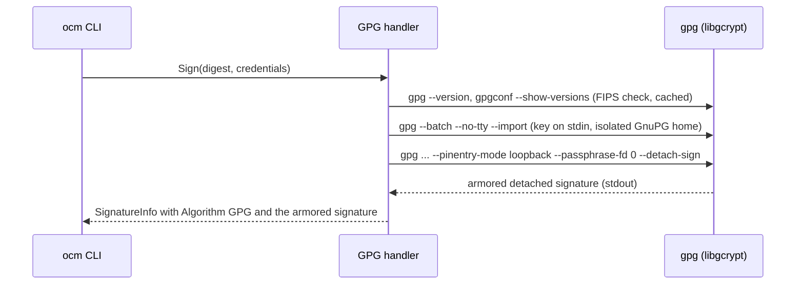

# FIPS 140-3 Compatibility of GPG and cosign Signing

* **Status**: proposed
* **Deciders**: OCM Technical Steering Committee
* **Date**: 2026-10-05

Technical Story: [ocm-project#1327](https://github.com/open-component-model/ocm-project/issues/1327), part of the FIPS 140-3 epic [ocm-project#1197](https://github.com/open-component-model/ocm-project/issues/1197). The user documentation for [ocm-project#1314](https://github.com/open-component-model/ocm-project/issues/1314) is the [FIPS 140-3 reference](../../website/content/docs/reference/standards-and-regulations/fips.md).

This ADR records the decisions implemented in [#3691](https://github.com/open-component-model/open-component-model/pull/3691) (GPG through the system `gpg`) and [#3747](https://github.com/open-component-model/open-component-model/pull/3747) (FIPS 140-3 builds and enforcement). Where the code and this ADR disagree, the code and the FIPS reference are the source of truth, and this ADR must be updated.

---

## Context and Problem Statement

Epic #1197 sets a single-artifact policy for FIPS 140-3: every OCM binary is built with `GOFIPS140` set to a frozen Go Cryptographic Module version, and there is no separate FIPS build. Users who do not need FIPS keep working, and users on a FIPS host get validated cryptography from the same binary.

Two signing features did not fit this policy:

* **GPG signing** ([ADR 0023](0023_gpg_signing.md)) ran in-process on `github.com/ProtonMail/go-crypto`. Part of its cryptography runs outside the Go Cryptographic Module, and unwrapping passphrase-protected keys is never FIPS-approved.
* **Sigstore signing** ([ADR 0017](0017_sigstore_integration.md)) shells out to a `cosign` binary. If none is on `PATH`, OCM downloads the upstream release, which is not built with `GOFIPS140`.

A third path surfaced during implementation: **Helm chart provenance verification** also runs OpenPGP on go-crypto (see [Helm provenance](#helm-provenance)).

Both the `ocm` CLI and the controller are affected:

* The CLI signs and verifies. It registers the RSA, Sigstore and GPG handlers (`bindings/go/cli/internal/plugin/builtin/builtin.go`).
* The controller only verifies and registers only the RSA handler (`bindings/go/kubernetes/controller/internal/setup/plugins.go`), which uses standard library cryptography (`crypto/rsa`, `crypto/x509`) covered by the Go module. A component signed with GPG or Sigstore cannot be verified by the controller today, with or without FIPS. Registering those handlers is a separate feature; this ADR defines how they behave in FIPS mode once registered.
* Both binaries link Helm provenance verification through the Helm digest processor and Helm's `pkg/downloader`.

This ADR decides how GPG, cosign and Helm provenance behave in each FIPS runtime mode.

### Cryptographic surface analysis

#### Go Cryptographic Module

Facts from [the Go FIPS 140-3 documentation](https://go.dev/doc/security/fips140):

* Module v1.0.0 holds [CMVP certificate #5247](https://csrc.nist.gov/projects/cryptographic-module-validation-program/certificate/5247). It is the only certified version and is usable with Go 1.24+.
* Module v1.26.0 is usable with Go 1.26+ and covered by CAVP A8028, but has no CMVP certificate yet. It is on the [CMVP Modules In Process list](https://csrc.nist.gov/projects/cryptographic-module-validation-program/modules-in-process/modules-in-process-list) as "Go Cryptographic Module | Geomys LLC | FIPS 140-3 | Comment Resolution - CMVP (9/10/2026)". "Comment Resolution" means CMVP review comments are being answered; it is not a certificate.
* `GOFIPS140=certified` and `GOFIPS140=inprocess` are aliases for these two versions. OCM builds with `GOFIPS140=certified` (root `.env`), so builds move to v1.26.0 once the Go toolchain marks it certified.
* A binary built with `GOFIPS140` has `DefaultGODEBUG=fips140=on`. FIPS mode is therefore **always enabled** in release builds unless the user sets `GODEBUG=fips140=off`.
* Setting `GODEBUG=fips140=on` on a binary built without `GOFIPS140` uses the unvalidated in-tree module. Selecting a frozen module with `GOFIPS140` at build time is the compliant mechanism.
* `fips140=only` makes non-approved algorithms return an error or panic. Go documents it as "not intended to be used in production".
* The runtime mode is fixed when the process starts; `os.Setenv("GODEBUG", ...)` later has no effect.
* `crypto/fips140` provides `Enabled()` (`on` or `only`), `Enforced()` (`only`), `Version()` and `WithoutEnforcement(func())`.
* `go build` records the `GOFIPS140` build setting only when FIPS is enabled. Consumers read it with `debug/buildinfo.ReadFile(path)` from `BuildInfo.Settings`, key `GOFIPS140`.

#### GPG

Before #3691, the GPG handler used `github.com/ProtonMail/go-crypto`, which pulls in `github.com/cloudflare/circl`. Primitive routing inside go-crypto:

| Key type | Sign/verify implementation | In Go module? | Approved? |
|---|---|---|---|
| RSA ≥2048 | standard library `crypto/rsa` | yes | yes |
| ECDSA P-256/384/521 | standard library `crypto/ecdsa` | yes | yes |
| ECDSA brainpool/secp256k1 | standard library legacy `big.Int` path | no | no |
| EdDSA / Ed25519 / Ed448 | `cloudflare/circl` | no | no |
| DSA | `crypto/dsa` | no | no |

* v4 key fingerprints use SHA-1, so go-crypto panics under `fips140=only` even for unprotected RSA keys (see [Evidence](#evidence)).
* Unwrapping passphrase-protected keys is never FIPS-approved: S2K (iterated/salted, or argon2 via `golang.org/x/crypto`) is not an approved KDF, and the cipher layer is AES-CFB, which is outside the module, or OCB/EAX implemented by go-crypto itself.
* No FIPS-validated OpenPGP library exists for Go. [ProtonMail/go-crypto#262](https://github.com/ProtonMail/go-crypto/issues/262) only covers SHA-1 panics.
* GnuPG 2.x performs all cryptography in libgcrypt. Many Linux distributions hold active FIPS 140-3 validations for their libgcrypt build. Active certificates at the time of writing (CMVP search for `gcrypt`, status Active):

  | Distribution | Certificate |
  |---|---|
  | SUSE Linux Enterprise | [#5420](https://csrc.nist.gov/projects/cryptographic-module-validation-program/certificate/5420) (replaces #4722), [#5248](https://csrc.nist.gov/projects/cryptographic-module-validation-program/certificate/5248) |
  | Ubuntu 22.04 (Ubuntu Pro FIPS packages) | [#4793](https://csrc.nist.gov/projects/cryptographic-module-validation-program/certificate/4793) |
  | Amazon Linux 2023 | [#4971](https://csrc.nist.gov/projects/cryptographic-module-validation-program/certificate/4971) |
  | Oracle Linux 9 | [#4993](https://csrc.nist.gov/projects/cryptographic-module-validation-program/certificate/4993) |
  | AlmaLinux 9 (TuxCare) | [#5060](https://csrc.nist.gov/projects/cryptographic-module-validation-program/certificate/5060) |
  | Rocky Linux 8 and 9 (CIQ) | [#5117](https://csrc.nist.gov/projects/cryptographic-module-validation-program/certificate/5117) |
  | Red Hat Enterprise Linux 9 | [#5366](https://csrc.nist.gov/projects/cryptographic-module-validation-program/certificate/5366) |

* A certificate covers a specific build and version of libgcrypt, used as described in that module's security policy. Upstream libgcrypt, and distributions such as Debian or Alpine, have FIPS mode but no validation.
* libgcrypt enters FIPS mode when `/proc/sys/crypto/fips_enabled` is non-zero, when `/etc/gcrypt/fips_enabled` exists, or when `LIBGCRYPT_FORCE_FIPS_MODE` is set ([libgcrypt manual: Enabling FIPS mode](https://www.gnupg.org/documentation/manuals/gcrypt/Enabling-FIPS-mode.html)). `gpgconf --show-versions` reports it as a `fips-mode:y` or `fips-mode:n` line. In FIPS mode libgcrypt restricts itself to the algorithms approved by that build; EdDSA is approved under FIPS 186-5, and libgcrypt 1.11+ accepts Ed25519 in FIPS mode while 1.9/1.10 reject it.

#### Helm provenance

* `bindings/go/helm/internal/download/download.go` sets `downloader.VerifyIfPossible` when the Helm credentials have a `keyring`. Helm then verifies the chart's `.prov` file with `helm.sh/helm/v4/pkg/provenance`, which is OpenPGP on go-crypto.
* It has the same limits as the former go-crypto GPG path: SHA-1 key fingerprints panic under `fips140=only`, and EdDSA goes through `circl`.
* It is not an OCM signature, so the GPG backend does not cover it.

#### cosign

The Sigstore handler (`bindings/go/sigstore/signing/handler/internal/cosign.go`, `cosign_download.go`) runs `cosign` as a subprocess.

* `CosignBinary.resolveBinary` first tries `LookPath("cosign")` with a minimum version of `v3.0.4`. Otherwise `ensureOrDownloadCosign` fetches the upstream GitHub release pinned by `COSIGN_VERSION` (`bindings/go/sigstore/signing/handler/internal/.env`) into `~/.cache/ocm/cosign/<version>/` and checks its SHA-256.
* The subprocess environment is `os.Environ()` plus `SIGSTORE_ID_TOKEN` when signing, so `GODEBUG` is inherited.
* Upstream cosign releases are not built with `GOFIPS140`. Upstream decided to leave FIPS builds to downstream distributors ([sigstore/cosign#94](https://github.com/sigstore/cosign/issues/94)).
* Running upstream cosign with `GODEBUG=fips140=on` enables FIPS mode on the unvalidated in-tree module, which is not compliant.
* The keyless flow uses ECDSA P-256 with SHA-256, which are approved algorithms.

#### Chainguard `cosign-fips`

* **What it is:** a container image, `cgr.dev/<organization>/cosign-fips` ([overview](https://images.chainguard.dev/directory/image/cosign-fips/overview), [specifications](https://images.chainguard.dev/directory/image/cosign-fips/specifications)). It is built on Chainguard OS from the package `cosign-fips-3`, with entrypoint `/usr/bin/cosign`, user `65532`, a shell but no package manager.
* **Access:** it is not a free image. An anonymous `oras manifest fetch cgr.dev/chainguard/cosign-fips:latest` returns `forbidden`, while the non-FIPS `cgr.dev/chainguard/cosign:latest` is public. There is no standalone binary download.
* **Cryptographic module:** the image page states that it ships a validated redistribution of the OpenSSL FIPS provider module (for example [CMVP #5102](https://csrc.nist.gov/projects/cryptographic-module-validation-program/certificate/5102)). Chainguard builds Go programs with `go-fips` (from Go 1.27 on, the native Go Cryptographic Module pinned to `GOFIPS140=v1.0.0`) or `go-openssl-fips` (Microsoft build of Go with the host's OpenSSL FIPS provider) ([Go 1.27 announcement](https://www.chainguard.dev/unchained/announcing-chainguard-container-images-for-go-1-27)). Which toolchain builds `cosign-fips-3` is not published [UNVERIFIED].
* **Consequences for OCM:**
  * A `go-fips` build carries a `GOFIPS140=v...` build setting and passes the build-info check in every mode.
  * An OpenSSL-backed build carries no `GOFIPS140` setting. Under `fips140=on` it is used and logged at debug level; under `fips140=only` it is rejected, although the setup can be compliant. This is a documented gap.
  * An OpenSSL-backed binary needs the OpenSSL FIPS provider shipped in the image, so the supported pattern is to use `cosign-fips` as the base image and copy the static `ocm` binary into it.
  * The image has no package manager, so `gpg` cannot be added to it.

#### Evidence

Observed with `go1.27.1` on darwin/arm64 while preparing this ADR:

* `GODEBUG=fips140=only go test ./gpg/signing/handler/...` (go-crypto implementation) fails with `panic: crypto/sha1: use of SHA-1 is not allowed in FIPS 140-only mode`, raised from `(*PublicKey).setFingerprintAndKeyId` (`openpgp/packet/public_key.go:309`), also for unprotected RSA keys. The same suite passes under `fips140=on`.
* A probe that encrypted an RSA-2048 key inside `fips140.WithoutEnforcement` and called `DecryptPrivateKeys` under `fips140=only` panics with `crypto/cipher: use of CFB is not allowed in FIPS 140-only mode` (`openpgp/packet/private_key.go:556`). Passphrase unwrapping runs outside the Go module.
* A program built with `GOFIPS140=v1.0.0` reports `build GOFIPS140=v1.0.0-c2097c7c` in `go version -m`; built without `GOFIPS140` it reports no setting. Checks therefore match the `v` prefix, not an exact version.
* `go version -m` on the upstream `cosign-darwin-arm64` v3.1.3 release reports `go1.26.4` and no `GOFIPS140` setting.
* `gpg` with libgcrypt forced into FIPS mode (`fips-mode:y`) imported armored, passphrase-protected RSA-3072 keys generated by `gpg` and by go-crypto via stdin, signed with `--pinentry-mode loopback --passphrase-fd 0`, and verified with `GOODSIG` and `VALIDSIG` in `registry.suse.com/bci/bci-base:15.7` (GnuPG 2.4.4, libgcrypt 1.11.0), `amazonlinux:2023` (`gnupg2-full` 2.3.7, libgcrypt 1.10.2), `ubuntu:22.04` (2.2.27, 1.9.4), `debian:stable-slim` (2.4.7, 1.11.0) and `alpine:3` (2.4.9, 1.12.2). `/etc/gcrypt/fips_enabled` enabled FIPS mode everywhere.
* Verification with public keys only starts no `gpg-agent`.
* The Docker Desktop credential helper (`docker-credential-desktop`, a non-FIPS Go binary) panics on MD5 when it inherits `GODEBUG=fips140=only` from OCM.

## Decision Drivers

* One artifact for FIPS and non-FIPS users.
* Release builds run in FIPS mode by default, so FIPS mode alone must not break existing users.
* In a FIPS environment, every cryptographic operation OCM triggers can run in a CMVP-validated module.
* Existing GPG users, including users of passphrase-protected keys (the ADR 0023 use case), keep a working path in FIPS mode.
* A clear, actionable error instead of silent non-compliance when the user asks for strict enforcement.
* A minimal new dependency surface.

## Considered Options

Enforcement trigger:

* **E1**: enforce whenever FIPS mode is enabled (`fips140.Enabled()`)
* **E2**: log under `fips140=on`, enforce only under `fips140=only` (`fips140.Enforced()`)

GPG:

* **G1**: approved-subset gate for in-process go-crypto
* **G2**: delegate to the system `gpg` binary
* **G3**: deprecate and remove GPG, migrating users to RSA
* **G4**: build-tag FIPS variant without GPG

cosign:

* **C1**: FIPS check of the `cosign` binary, operator-supplied FIPS `cosign` for strict mode
* **C2**: OCM builds and distributes a `GOFIPS140` `cosign`
* **C3**: pass `GODEBUG=fips140=on` to upstream `cosign`

Helm provenance:

* **H1**: reject a `keyring` under `fips140=only`
* **H2**: verify `.prov` files with the system `gpg` backend

## Decision Outcome

Chosen [E2](#runtime-modes-log-under-on-enforce-under-only) for enforcement, [G2](#gpg-system-gpg-backend) for GPG (in every mode), [C1](#cosign-fips-check-tiered-by-mode) for cosign, and [H1](#helm-provenance-rejected-under-only) for Helm provenance.

Justification:

* E1 would break every user: release builds have `DefaultGODEBUG=fips140=on`, so `Enabled()` is true for everyone who does not set `GODEBUG=fips140=off`. Under E1, the cosign download alone would stop working for all users of the single artifact. E2 keeps `on` fail-open, matching the Go module's own behavior in that mode, and gives operators who need hard guarantees an explicit switch.
* G2 keeps passphrase-protected keys working, because unwrapping happens inside libgcrypt, which has CMVP validations. G1 cannot support passphrase-protected keys at all. G3 breaks ADR 0023 users. G4 violates the single-artifact rule.
* G2 applies in every mode, not only in FIPS mode: release builds are always in FIPS mode, so a go-crypto fallback would only serve `GODEBUG=fips140=off`, while doubling the test surface. Removing go-crypto from OCM's own code also lets the import guard (see [Guardrails](#guardrails)) reject it.
* C1 needs little code and no new dependencies. C2 moves ownership of the cosign supply chain into OCM. C3 is not compliant, because it runs FIPS mode on an unvalidated module.
* H1 is consistent with how non-FIPS `cosign` and `gpg` are treated. H2 would need Helm's provenance format reimplemented around `gpg`.

### Runtime modes: log under `on`, enforce under `only`

#### Description

Every release binary is built with `GOFIPS140=certified` and runs with `fips140=on` by default. OCM never refuses an operation because of FIPS in that mode; it logs at debug level when a step runs outside the FIPS boundary. With `GODEBUG=fips140=only`, the same steps fail with an explicit error. `GODEBUG=fips140=off` disables FIPS mode and all checks.

#### Contract

| Step | `fips140=off` | `fips140=on` (default) | `fips140=only` |
|---|---|---|---|
| `cosign` on `PATH` without a `GOFIPS140=v...` build setting | used | used, debug log | rejected (`ErrCosignNotFIPSBuild`) |
| no `cosign` on `PATH` | upstream release downloaded | downloaded, debug log | rejected (`ErrCosignDownloadInFIPSMode`); a cached download is not used either |
| `gpg` whose libgcrypt is not in FIPS mode | used | used, debug log | rejected (`ErrGPGNotInFIPSMode`) |
| Helm chart download with a `keyring` | provenance verified | verified, debug log | rejected (`ErrProvenanceVerificationInFIPSMode`) |
| resource or reference digest not SHA-256/SHA-512 | signed/verified, warning | signed/verified, warning (CLI and controller) | rejected (`ErrUnsupportedDigestHash`) |

* Triggers: `crypto/fips140.Enforced()` decides rejection, `crypto/fips140.Enabled()` decides the debug log. Both are injectable in the cosign and GPG backends so tests cover all three modes in one process.
* Both binaries log `FIPS 140-3 mode` with `enabled` and `module` at startup (CLI at debug level).
* `fips140=only` stays documented as a testing and assessment mode, as Go documents it.

### GPG: system `gpg` backend

#### Description

The GPG handler delegates Sign and Verify to the GnuPG `gpg` binary on `PATH` in every mode ([#3691](https://github.com/open-component-model/open-component-model/pull/3691)). GnuPG performs all cryptography in libgcrypt, so on a FIPS-enabled host with a validated libgcrypt every operation, including passphrase unwrapping, runs in a validated module. `github.com/ProtonMail/go-crypto` is no longer used by OCM's own code. Signatures made by the former go-crypto implementation still verify (`testdata/gocrypto` fixtures).

#### High-level Architecture

```mermaid
sequenceDiagram
    participant CLI as ocm CLI
    participant H as GPG handler
    participant G as gpg (libgcrypt)
    CLI->>H: Sign(digest, credentials)
    H->>G: gpg --version, gpgconf --show-versions (FIPS check, cached)
    H->>G: gpg --batch --no-tty --import (key on stdin, isolated GnuPG home)
    H->>G: gpg ... --pinentry-mode loopback --passphrase-fd 0 --detach-sign
    G-->>H: armored detached signature (stdout)
    H-->>CLI: SignatureInfo with Algorithm GPG and the armored signature
```

#### Contract

* **Binary:** `exec.LookPath("gpg")` only, no download. Minimum GnuPG `2.2.0`, parsed from `gpg --version`; the libgcrypt version is logged at debug level. Missing binary: `GPG signing requires the GnuPG "gpg" binary (>= 2.2.0) on PATH; install GnuPG, in FIPS 140-3 mode one backed by a FIPS 140-3 validated libgcrypt`.
* **FIPS check:** in FIPS mode (`on` or `only`), OCM runs `gpgconf --show-versions` and requires a `fips-mode:y` line. A missing `gpgconf`, a missing line or `fips-mode:n` fails the check, which is handled per the [runtime mode contract](#runtime-modes-log-under-on-enforce-under-only). The error reads `with GODEBUG=fips140=only, GPG signing and verification require a gpg whose libgcrypt runs in FIPS mode (gpgconf --show-versions reports fips-mode:y; enable it with /etc/gcrypt/fips_enabled or a FIPS-mode kernel)`.
* **Key source:** `GPGSigningConfiguration.keySource` selects `credentials` (default) or `keyring`.
  * `credentials`: the key material comes from the OCM credential graph and is imported into a GnuPG home that belongs to the operation; the user's `~/.gnupg` is never touched.
  * `keyring`: `gpg` runs against `$GNUPGHOME` or `~/.gnupg` and the running `gpg-agent`, so hardware tokens and the agent's passphrase cache work. Key material in the credentials is rejected; verification requires the full key fingerprint.
* **Sign:** the passphrase goes to `gpg` on stdin (`--pinentry-mode loopback --passphrase-fd 0`), the digest is written to a file, and stdout becomes the armored detached signature. The selector is `keyFingerprint` when configured, otherwise the first secret key; GnuPG picks the signing-capable (sub)key.
* **Verify:** imports public key material only, so no `gpg-agent` starts, and runs `gpg --status-fd 1 --trust-model always --no-auto-key-retrieve --verify`. Exactly one good signature (`GOODSIG` and `VALIDSIG`) is accepted; a configured `keyFingerprint` must match the signing or primary key.
* **Timeout:** 3 minutes per operation.
* **Concurrency:** with `keySource: credentials`, concurrent operations never share a keyring, a `gpg-agent` or a lock file. Verify, the only operation the controller runs, starts no agent, so parallel reconciles only cost one short-lived `gpg` process each. With `keySource: keyring`, operations share the user's GnuPG home and agent.
* **Responsibility boundary:** OCM checks that libgcrypt runs in FIPS mode, but cannot check that the build is validated. The operator runs a GnuPG whose libgcrypt holds a validation for their platform. Validated libgcrypt builds exist only for Linux distributions.
* **Controller:** once the controller registers the GPG handler, this contract applies for Verify. The controller image has no `gpg`, so GPG verification needs a derived image (see [Discovery and Distribution](#discovery-and-distribution)).

### cosign: FIPS check, tiered by mode

#### Description

OCM keeps running the `cosign` binary. In FIPS mode it reads the Go build information of the `cosign` it is about to use and checks for a frozen Go Cryptographic Module. Under `fips140=on` a failed check is logged and the upstream download stays available; under `fips140=only` OCM only accepts a `GOFIPS140` build on `PATH`.

#### Contract

* **Resolution:** `LookPath("cosign")` with the existing minimum version `v3.0.4`. Without one on `PATH`, OCM downloads the pinned upstream release, except under `fips140=only`: `cosign binary not found on PATH; with GODEBUG=fips140=only, downloading cosign is disabled because the upstream release is not a FIPS build: install a cosign built with GOFIPS140 and ensure it is on PATH`.
* **Build-info check (FIPS mode only):** `debug/buildinfo.ReadFile(path)` must report a `GOFIPS140` setting whose value starts with `v`. Otherwise: `with GODEBUG=fips140=only, Sigstore signing and verification require a cosign built against a frozen Go Cryptographic Module (GOFIPS140=v<version>, see go version -m)`, wrapped with the path and the found value. The check confirms that a frozen module is compiled in, not that the version holds a CMVP certificate.
* **Environment:** the subprocess environment is unchanged (`os.Environ()`), so `GODEBUG` reaches `cosign`.
* **Recommended operator source:** `CGO_ENABLED=0 GOFIPS140=certified go install github.com/sigstore/cosign/v3/cmd/cosign@<COSIGN_VERSION>`.
* **OCM's own release:** the component publish workflow uses the upstream `cosign` (installed with `sigstore/cosign-installer`, which verifies the release signature). The CLI runs there in `fips140=on`, and the keyless signature uses approved algorithms either way.

### Helm provenance: rejected under `only`

#### Contract

* With a `keyring` in the Helm credentials, `NewReadOnlyChartFromRemote` returns `ErrProvenanceVerificationInFIPSMode` under `fips140=only` before downloading: `with GODEBUG=fips140=only, Helm chart provenance verification is not available: Helm verifies provenance with OpenPGP outside the Go Cryptographic Module; remove the keyring from the Helm credentials or run OCM without fips140=only`.
* Under `fips140=on` verification runs as before and is logged at debug level.
* Without a `keyring`, OCM only passes `.prov` files through.

### Strict-mode exceptions

Two features use non-approved hashes for non-security purposes and run them inside `crypto/fips140.WithoutEnforcement`, so they keep working under `fips140=only`. FIPS mode itself stays on: `crypto/tls` fixes its FIPS policy at init, so TLS still negotiates approved algorithms only inside `WithoutEnforcement` (checked with X25519-only and ChaCha20-only test servers, which are rejected in `on` and `only`).

* **Git** identifies objects by SHA-1. `download.Download` in `bindings/go/git/internal/download` runs clone, fetch and archive outside enforcement. The archive OCM records is digested with SHA-256.
* **wget checksum verification** accepts MD5 and SHA-1 checksums that a server publishes. `checksum.Algorithm.New()` wraps only these two hashes. The digest OCM records and signs is always SHA-256.

### Guardrails

* **Import guard:** `golangci.yml` adds `depguard` rules for first-party, non-test code that reject `crypto/des`, `crypto/rc4`, `crypto/dsa`, `golang.org/x/crypto/` (except the reviewed `golang.org/x/crypto/ssh`), `github.com/ProtonMail/go-crypto` and secp256k1 libraries, and limit `crypto/md5` and `crypto/sha1` to `bindings/go/wget/checksum`.
* **Strict-mode tests:** the mode is fixed per process, so a single test cannot switch it. Test packages named `fips140` (`bindings/go/cli/cmd/fips140`, `git/fips140`, `helm/fips140`, `wget/fips140`) set `//go:debug fips140=only` and run on every `task bindings/go:test`, covering construct/sign/verify, Git downloads, the Helm rejection and legacy checksum verification. All other tests run in `fips140=on`; the mode-dependent checks in the cosign, GPG and digest code are tested for all three modes with injected mode functions.
* **Build:** release binaries are built with `GOTOOLCHAIN=local`, so a toolchain mismatch with `go.mod` fails the build instead of downloading another toolchain.

## Pros and Cons of the Options

### [E1] Enforce whenever FIPS mode is enabled

Pros:

* No silent non-FIPS operation on a FIPS host.

Cons:

* Release builds are always in FIPS mode, so every user loses the cosign download and any non-FIPS `gpg`, which breaks the single-artifact goal.
* Users would need `GODEBUG=fips140=off` to get the previous behavior, which also turns off FIPS mode for OCM's own cryptography.

### [E2] Log under `on`, enforce under `only`

Pros:

* No behavior change for users who do not opt in.
* Operators get hard guarantees with one documented setting.

Cons:

* Under the default mode, non-FIPS external binaries are only visible at debug level.
* `fips140=only` is not intended for production by Go, and other non-FIPS Go binaries that inherit it (for example the Docker Desktop credential helper) can panic.

### [G1] Approved-subset gate for in-process go-crypto

Allow only RSA ≥2048 and NIST ECDSA keys in FIPS mode and reject everything else.

Pros:

* No external binary; works in the `scratch` CLI image and on every OS.

Cons:

* Passphrase-protected keys are impossible in FIPS mode, because key unwrapping (S2K, AES-CFB, OCB/EAX) is never approved.
* SHA-1 fingerprints still panic under `fips140=only`.
* Correctness depends on an allowlist kept in sync with go-crypto internals.

### [G2] Delegate to the system `gpg` binary

Pros:

* All cryptography, including passphrase unwrapping, runs in a CMVP-validated libgcrypt on supported distributions.
* Passphrase-protected keys and, with `keySource: keyring`, hardware tokens work.
* Removes go-crypto from OCM's own code; no new Go dependencies.

Cons:

* Breaking: GnuPG >= 2.2.0 on `PATH` is required in every mode.
* Unavailable in the `scratch` CLI image; no validated libgcrypt on macOS and Windows.
* Subprocess handling adds code and test surface.

### [G3] Deprecate and remove GPG, migrating to RSA

Pros:

* Signing is FIPS-native everywhere.

Cons:

* Breaking change for ADR 0023 users.
* The RSA handler has no passphrase-protected key support.

### [G4] Build-tag FIPS variant without GPG

Pros:

* Simple to implement.

Cons:

* Violates the single-artifact rule of epic #1197.
* FIPS users lose GPG entirely.

### [C1] FIPS check with operator-supplied `cosign` for strict mode

Pros:

* Small change; no new dependencies.
* The default mode keeps the automatic download.

Cons:

* Strict compliance depends on the operator supplying a FIPS build; the only turnkey vendor build found, Chainguard `cosign-fips`, is a paid image.
* OpenSSL-backed FIPS builds carry no `GOFIPS140` setting and are rejected under `fips140=only`.

### [C2] OCM builds and distributes a `GOFIPS140` `cosign`

Pros:

* The download keeps working under `fips140=only`.

Cons:

* OCM takes ownership of the cosign supply chain: building, signing, hosting and tracking upstream releases.
* Still an external binary per platform.

### [C3] Pass `GODEBUG=fips140=on` to upstream `cosign`

Pros:

* No code change; `GODEBUG` is already inherited.

Cons:

* Not compliant: upstream cosign has no frozen module, so FIPS mode runs on the unvalidated in-tree module.

### [H1] Reject a `keyring` under `fips140=only`

Pros:

* Explicit error instead of a panic; consistent with `cosign` and `gpg`.

Cons:

* No provenance verification under `fips140=only`.

### [H2] Verify `.prov` files with the system `gpg`

Pros:

* Provenance verification inside a validated libgcrypt.

Cons:

* Reimplements Helm's provenance check outside Helm; a separate change if users need it.

## Discovery and Distribution

* All behavior ships in the one `ocm` binary and the one controller image. There are no build tags.
* The CLI image is `FROM scratch` with the static `/ocm` binary (`CGO_ENABLED=0`) and a CA bundle, without `cosign` or `gpg`. FIPS users who need GPG or a FIPS `cosign` either mount a FIPS `cosign` at `/usr/local/bin/cosign`, or copy `ocm` into an image that has the tools:
  * GPG: any distribution image with GnuPG ≥2.2 whose libgcrypt is validated for that distribution, for example SUSE Linux Enterprise BCI, Amazon Linux 2023 or Ubuntu Pro FIPS.
  * cosign: a `cosign` built with `GOFIPS140`, or a vendor FIPS cosign image such as Chainguard `cosign-fips` used as the base image, with `ocm` copied in.
* The controller image is `gcr.io/distroless/static:nonroot` with a static `/manager` binary. Once the controller verifies GPG signatures, FIPS users build a derived image with GnuPG and a validated libgcrypt and set it in the Helm chart values.
* User documentation: the [FIPS 140-3 reference](../../website/content/docs/reference/standards-and-regulations/fips.md) covers the support policy, runtime modes, verifying a binary, digest algorithms, `cosign`, GPG, Helm provenance, the strict-mode exceptions and known limitations. The GPG and Sigstore how-tos list the `fips140=only` errors under Troubleshooting.

### Follow-up tasks

Implemented:

* GPG through the system `gpg` ([#3691](https://github.com/open-component-model/open-component-model/pull/3691)).
* `cosign` FIPS check and download policy, GPG libgcrypt FIPS check, Helm provenance rejection, digest enforcement, strict-mode exceptions and guardrails ([#3747](https://github.com/open-component-model/open-component-model/pull/3747)).

Open:

1. **"FIPS 140-3: controller verification with GPG and Sigstore handlers"**
   * When the controller registers the GPG or Sigstore handler, apply this ADR's contracts for Verify, and document the derived controller image.
   * Add an integration test that verifies a GPG-signed component in FIPS mode with a derived controller image.
2. **"FIPS 140-3: accept OpenSSL-backed FIPS cosign builds under fips140=only"**
   * With a trial of Chainguard `cosign-fips`, record which build settings its binary carries. If they reliably identify an OpenSSL-backed FIPS build, accept it under `fips140=only`.

## Conclusion

OCM ships one artifact built against the certified Go Cryptographic Module. The default `fips140=on` mode never refuses an operation for FIPS reasons and logs steps that leave the FIPS boundary; `fips140=only` turns those steps into explicit errors. GPG signing always runs in the system `gpg`, so a validated libgcrypt covers it, including passphrase-protected keys. Sigstore signing runs the external `cosign`, checked for a `GOFIPS140` build. Helm provenance verification is rejected under `fips140=only`.
