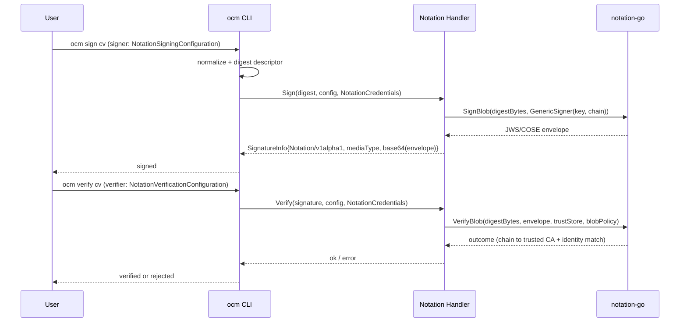

# Notation (Notary Project) Signing Support

* **Status**: proposed
* **Deciders**: OCM Technical Steering Committee
* **Date**: 2026-09-17

**Technical Story**: OCM ships RSA/PEM, GPG, and Sigstore signing handlers. Organizations aligned with the [Notary Project](https://notaryproject.dev/) (formerly Notary v2) — the CNCF standard for signing OCI artifacts — cannot reuse that ecosystem's signature format, trust store, and trust policy model for OCM component versions. This ADR adds a native Notation signing handler.

---

## Context and Problem Statement

`ocm sign componentversion` and `ocm verify componentversion` dispatch to a plugin-based signing registry keyed by the runtime type of the signer/verifier configuration in `.ocmconfig`. Built-in handlers today are RSA (RSASSA-PSS / PKCS1-v1.5), GPG, and Sigstore.

The Notary Project defines a standardized signature envelope (JWS `application/jose+json` and COSE `application/cose`) and a trust-store/trust-policy model implemented by the [`notation`](https://github.com/notaryproject/notation) CLI and the [`notation-go`](https://github.com/notaryproject/notation-go) library. Users invested in that ecosystem (existing X.509 signing certificates, established CA trust anchors, tooling that consumes Notary envelopes) have no way to produce or verify those envelopes for OCM component versions.

OCM signs a precomputed **digest** of the normalized component descriptor, not the artifact bytes. Any new handler must therefore sign the digest OCM provides and round-trip it through the algorithm's own signature representation.

## Decision Drivers

* Produce and verify standard Notary Project signature envelopes (JWS/COSE) for OCM component versions
* Match the OCM `signing.Handler` contract exactly so no core changes are required
* Reuse existing X.509 key material and CA trust anchors
* Keep OCM the single source of truth for key/trust material (no dependency on external `notation` config on disk)
* Register the handler in the CLI by default, like RSA/GPG/Sigstore

## Considered Options

* **Option A**: Native built-in handler using the `notation-go` **library** blob API (`notation.SignBlob` / `notation.VerifyBlob`), in-process, with key/trust material supplied via OCM credentials.
* **Option B**: Wrap the external `notation` CLI binary as a subprocess (as the Sigstore handler wraps `cosign`), reading its on-disk trust store and trust policy.
* **Option C**: Do nothing; direct users to sign OCI artifacts with `notation` separately from OCM signing.

## Decision Outcome

Chosen **Option A**: native built-in handler on the `notation-go` blob library.

Justification:

* Follows the exact same pattern as the RSA handler (in-process crypto, X.509 chain + trust anchor from credentials) — no new infrastructure.
* No external binary to distribute, discover, version-check, or auto-download; verification is fully offline.
* OCM credentials remain the single source of truth; no dependency on `~/.config/notation` layout or a filesystem trust store/policy.
* Option B adds subprocess and on-disk-config coupling that the Sigstore handler only tolerates because `cosign`'s keyless flow has no in-process equivalent — Notation's blob API does.
* Option C leaves component-version signatures outside the Notary ecosystem entirely.

---

## Option A: Native Notation Built-in Handler

### Description

New Go packages under `ocm.software/open-component-model/bindings/go/notation/` implement `signing.Handler` using `notation-go`:

* `notation/signing/v1alpha1` — algorithm constant `Notation/v1alpha1`; `SignConfig` (`NotationSigningConfiguration/v1alpha1`) and `VerifyConfig` (`NotationVerificationConfiguration/v1alpha1`).
* `notation/spec/credentials/v1` — `NotationCredentials/v1` (private key, certificate chain, trusted CA certificates; inline-PEM or file-path).
* `notation/spec/identity/v1` — `Notation/v1` consumer identity (symmetric for sign and verify).
* `notation/signing/handler` — the handler.

**Sign**: OCM's descriptor digest (hex) is decoded to bytes and fed to `notation.SignBlob` using `signer.NewGenericSigner(privateKey, certChain)`. The resulting JWS (default) or COSE envelope is base64-encoded into `SignatureInfo.Value`, with `Algorithm = "Notation/v1alpha1"` and `MediaType` the envelope media type.

**Verify**: the digest bytes and the base64 envelope are decoded; an in-memory `truststore.X509TrustStore` is built from the credential-supplied CA certificates, plus an in-code `trustpolicy.BlobDocument` (one global statement). `notation.VerifyBlob` confirms the envelope binds the re-hashed bytes, the signing chain terminates at a trusted CA, and the identity matches the configured `trustedIdentities` (default `["*"]`). Revocation checking is skipped (offline verification must not depend on OCSP/CRL reachability); integrity, authenticity, and chain validation remain enforced.

### High-level Architecture

### Contract

* Signer selection: `.ocmconfig` `signing.config.ocm.software/v1alpha1` with `signer.type: NotationSigningConfiguration/v1alpha1` (and `verifier.type: NotationVerificationConfiguration/v1alpha1`). Registration via `RegisterInternalComponentSignatureHandler` auto-registers both config types so dispatch works by default.
* Credentials: `NotationCredentials/v1` resolved against the consumer identity `Notation/v1` (`signature: <name>`).
* Wire format: `signature.algorithm = "Notation/v1alpha1"`; `signature.mediaType` ∈ {`application/jose+json`, `application/cose`}; `signature.value` = base64 of the Notary Project signature envelope.

## Pros and Cons of the Options

### Option A: Native library handler

Pros:

* In-process; no external binary, subprocess, or auto-download.
* Fully offline verification; no dependency on notation's on-disk config.
* Same package/registration pattern as RSA — low review surface, no core changes.

Cons:

* Depends on `notation-go`'s blob API, which no tagged `notation-go` release ships yet (`SignBlob`/`VerifyBlob` exist only on unreleased commits). We pin the same `notation-go`/`notation-core-go` commits that the released `notation` CLI **v2.0.0-rc.1** depends on, so the combination is one the Notary Project maintainers ship and test together rather than a raw `main` snapshot.
* Requires registering the SHA-384 digest algorithm with `go-digest` (notation selects SHA-384 for 3072-bit RSA keys; the pinned `go-digest` does not register it by default).

### Option B: External `notation` CLI wrapper

Pros:

* Reuses the full `notation` trust-store/trust-policy and plugin ecosystem verbatim.

Cons:

* Subprocess management, binary distribution/version checks, and on-disk config coupling.
* Verification would depend on filesystem trust-store layout, breaking the OCM-credentials-as-source-of-truth principle.

### Option C: Do nothing

Pros:

* No new dependency.

Cons:

* Component-version signatures stay outside the Notary Project ecosystem; no reuse of Notary envelopes/trust for OCM.

## Discovery and Distribution

The handler is compiled into the `ocm` CLI and registered by default in `bindings/go/cli/internal/plugin/builtin`. No plugin install is required. The `notation-go` and `notation-core-go` dependencies in `bindings/go/go.mod` are pinned to the exact commits that the released `notation` CLI v2.0.0-rc.1 uses. Once a tagged `notation-go` release ships the blob API, the pin should move to that release.

## Conclusion

Add a native Notation signing handler built on the `notation-go` blob library. It implements `signing.Handler`, takes key/certificate/CA material from OCM credentials, produces standard Notary Project JWS/COSE envelopes, and verifies them fully in-process and offline. This brings the Notary Project ecosystem to OCM component-version signing with zero infrastructure overhead and no core changes.
