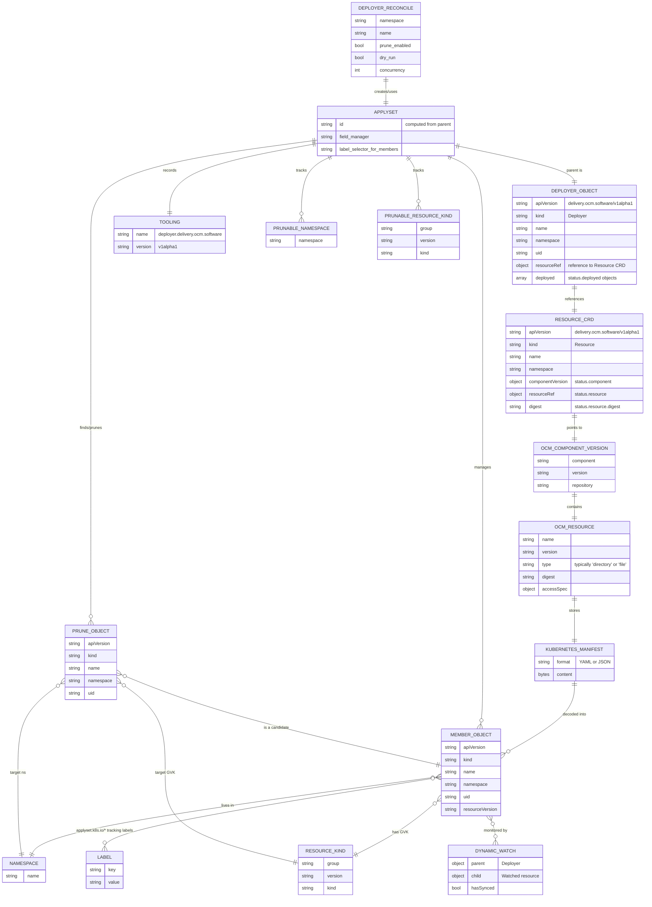

# ApplySet for OCM Deployer Controller

This package implements the ApplySet specification ([KEP-3659](https://github.com/kubernetes/enhancements/blob/master/keps/sig-cli/3659-kubectl-apply-prune/README.md)) for use in the OCM Deployer Controller. It provides declarative, set-based resource management with automatic pruning of orphaned resources.

## Overview

The ApplySet implementation enables the OCM Deployer Controller to:
- Track sets of Kubernetes resources deployed from OCM component versions
- Automatically prune resources that are no longer part of the desired state
- Maintain ownership and lifecycle metadata on deployed resources
- Support concurrent apply operations for improved performance
- Enable field-level conflict detection through server-side apply

## Integration with OCM Deployer

In the OCM Deployer Controller, the ApplySet is used to manage Kubernetes resources that are downloaded from OCM (Open Component Model) repositories. The flow is:

1. **Deployer CRD** references a **Resource CRD** 
2. **Resource CRD** points to an OCM component version in a repository
3. Deployer downloads the Kubernetes manifest from the OCM resource
4. Manifest is decoded into unstructured Kubernetes objects
5. ApplySet is created with the **Deployer** object as the parent
6. All objects are added to the ApplySet and applied to the cluster
7. (Optional) Orphaned resources are pruned if no longer in the manifest

## Entity Relationship Diagram



## Deployer ApplySet Flow

```mermaid
flowchart TD
    A[Deployer Reconcile Loop] --> B[Get Resource CRD]
    
    B --> C{Resource Ready?}
    C -->|No| Z1[Mark NotReady<br/>Requeue]
    C -->|Yes| D[Get OCM Session]

    D --> E[Lookup Component Version<br/>in OCM Repository]
    E --> F[Select Resource from CV<br/>by name + version + extraIdentity]
    
    F --> G[Verify Resource Signature]
    G --> H{Digest Matches?}
    H -->|No| Z2[Mark NotReady<br/>Digest Mismatch]
    H -->|Yes| I[Download Manifest<br/>from OCM Resource]

    I --> J[Decode YAML/JSON<br/>into Unstructured Objects]
    J --> K[Create ApplySet<br/>Parent: Deployer Object]

    K --> L[For each object:<br/>Set ownership labels/annotations<br/>Set controller reference<br/>Default namespace/apiVersion]
    L --> M[Add object to ApplySet]

    M --> N[Pre-update Parent<br/>Store intended membership<br/>GKs + Namespaces in annotations]
    N --> O[Apply desired manifests<br/>Using server-side apply]

    O --> P[Label each applied object<br/>with applyset tracking labels]

    P --> Q{Prune enabled?}
    Q -->|No| R[Track objects with<br/>Dynamic Informer Manager]
    Q -->|Yes| S[Discover prunable namespaces]
    
    S --> T[Discover prunable resource kinds]
    T --> U[List live objects<br/>matching ApplySet selector]

    U --> V{Object in desired set?}
    V -->|Yes| W[Keep object]
    V -->|No| X[Prune object<br/>Delete resource]

    W --> Y{More objects?}
    X --> Y
    Y -->|Yes| V
    Y -->|No| R

    R --> AA[Update Deployer Status<br/>deployed[] with references]
    AA --> AB[Mark Ready<br/>Set RequeueAfter]
    AB --> AC[ApplySet Complete]

    Z1 --> AC
    Z2 --> AC
    AC --> AD[End Reconciliation]

```

## ApplySet State Diagram for OCM Deployer

```mermaid
stateDiagram-v2
  [*] --> DeployerReconcile

  DeployerReconcile --> FetchResource : get Resource CRD
  FetchResource --> NotReady : resource not ready
  FetchResource --> OCMSession : resource ready

  OCMSession --> ComponentVersion : create session
  ComponentVersion --> DownloadResource : lookup CV
  DownloadResource --> VerifyDigest : get manifest

  VerifyDigest --> NotReady : digest mismatch
  VerifyDigest --> DecodeObjects : digest ok

  DecodeObjects --> CreateApplySet : parse YAML/JSON
  CreateApplySet --> AddObjects : parent: Deployer

  AddObjects --> PrepareObjects : set ownership
  PrepareObjects --> AddToSet : controller reference + defaults
  AddToSet --> PreUpdateParent : all objects added

  PreUpdateParent --> Applying : parent updated with GKs

  Applying --> Labeling : server-side apply
  Labeling --> Applied : member labels set

  Applied --> PruneCheck
  PruneCheck --> TrackObjects : prune disabled
  PruneCheck --> DiscoverPruneScope : prune enabled

  DiscoverPruneScope --> ListingCandidates : namespaces + kinds
  ListingCandidates --> EvaluatingCandidate : list with selector

  EvaluatingCandidate --> Keeping : in desired set
  EvaluatingCandidate --> Pruning : not in desired set

  Keeping --> NextCandidate
  Pruning --> NextCandidate : delete object

  NextCandidate --> EvaluatingCandidate : more candidates
  NextCandidate --> TrackObjects : no more candidates

  TrackObjects --> RegisterWatches : dynamic informer
  RegisterWatches --> UpdateStatus : watches registered

  UpdateStatus --> MarkReady : update deployed[]
  MarkReady --> Done : set conditions

  NotReady --> Done
  Done --> [*]

  state Applying {
    [*] --> ServerSideApply
    ServerSideApply --> FieldManager
    FieldManager --> [*]
  }

  state DiscoverPruneScope {
    [*] --> ReadAnnotations
    ReadAnnotations --> ParseGKs
    ParseGKs --> ParseNamespaces
    ParseNamespaces --> [*]
  }

  state RegisterWatches {
    [*] --> ForEachObject
    ForEachObject --> CheckSynced
    CheckSynced --> RegisterInformer : not synced
    CheckSynced --> Skip : already synced
    RegisterInformer --> [*]
    Skip --> [*]
  }

```



## Key Components

### ApplySet Parent
In the OCM Deployer Controller, the **Deployer** custom resource is used as the ApplySet parent. This provides:
- A stable identity for the ApplySet (computed from Deployer name/namespace/kind/group)
- Labels: `applyset.k8s.io/id=<applyset-id>`
- Annotations: 
  - `applyset.k8s.io/tooling=deployer.delivery.ocm.software/v1alpha1`
  - `applyset.k8s.io/contains-group-kinds=<comma-separated list>`
  - `applyset.k8s.io/additional-namespaces=<comma-separated list>`

### Member Objects
Resources deployed from the OCM manifest are labeled with:
- `applyset.k8s.io/part-of=<applyset-id>` - Links the object to its ApplySet
- `delivery.ocm.software/managed-by=deployer.delivery.ocm.software` - Identifies the managing controller
- Additional ownership labels for OCM resource tracking

Each object also has a controller reference set to the Deployer for proper garbage collection.

### Field Manager
Each Deployer instance uses a unique field manager: `deployer.delivery.ocm.software/<deployer-uid>`

This ensures that different Deployers don't conflict with each other when managing the same resource types.

### Pruning (Future Enhancement)
Currently, pruning is disabled by default (`enablePruning = false`). When enabled in the future:
- Resources that exist in the cluster with the ApplySet labels
- But are NOT in the current manifest
- Will be automatically deleted

This keeps the cluster state synchronized with the OCM component version.

### Dynamic Resource Watching
After applying resources, the Deployer Controller:
1. Registers dynamic watches for each deployed resource
2. Monitors resource changes via informers
3. Triggers reconciliation when watched resources change
4. Maintains a finalizer to ensure watches are cleaned up on deletion

## Usage Example

```go
// In the Deployer reconciler
applySetConfig := applyset.Config{
    ToolingID: applyset.ToolingID{
        Name:    "deployer.delivery.ocm.software",
        Version: "v1alpha1",
    },
    FieldManager: fmt.Sprintf("deployer.delivery.ocm.software/%s", deployer.UID),
    ToolLabels: map[string]string{
        "delivery.ocm.software/managed-by": "deployer.delivery.ocm.software",
    },
    Concurrency: runtime.NumCPU(),
}

// Create ApplySet with Deployer as parent
set, err := applyset.New(ctx, deployer, client, restMapper, applySetConfig)
if err != nil {
    return fmt.Errorf("failed to create ApplySet: %w", err)
}

// Add objects downloaded from OCM
for _, obj := range manifestObjects {
    objCopy := obj.DeepCopy()
    
    // Set ownership and controller reference
    setOwnershipLabels(objCopy, resource, deployer)
    controllerutil.SetControllerReference(deployer, objCopy, scheme)
    
    // Add to ApplySet
    if _, err := set.Add(ctx, objCopy); err != nil {
        return fmt.Errorf("failed to add object: %w", err)
    }
}

// Apply all objects (prune=false currently)
result, err := set.Apply(ctx, false)
if err != nil {
    return fmt.Errorf("failed to apply: %w", err)
}
```

## Labels and Annotations

### ApplySet Parent (Deployer)
```yaml
apiVersion: delivery.ocm.software/v1alpha1
kind: Deployer
metadata:
  name: my-app-deployer
  namespace: default
  labels:
    applyset.k8s.io/id: applyset-xyzABC123...
  annotations:
    applyset.k8s.io/tooling: deployer.delivery.ocm.software/v1alpha1
    applyset.k8s.io/contains-group-kinds: "ConfigMap,Secret,Deployment.apps"
    applyset.k8s.io/additional-namespaces: "app-namespace,monitoring"
```

### Member Object (Deployed Resource)
```yaml
apiVersion: apps/v1
kind: Deployment
metadata:
  name: my-app
  namespace: default
  labels:
    applyset.k8s.io/part-of: applyset-xyzABC123...
    delivery.ocm.software/managed-by: deployer.delivery.ocm.software
    delivery.ocm.software/resource-name: manifests
    delivery.ocm.software/resource-version: v1.0.0
  ownerReferences:
  - apiVersion: delivery.ocm.software/v1alpha1
    kind: Deployer
    name: my-app-deployer
    uid: <deployer-uid>
    controller: true
```

## Future Enhancements

- **Prune Configuration**: Add `spec.prune` field to Deployer CRD to enable/disable pruning per-deployer
- **Prune Strategies**: Support different pruning strategies (immediate, delayed, manual)
- **Status Propagation**: Propagate health status from deployed resources back to Deployer status
- **Dry-Run Support**: Add dry-run capability for preview before actual deployment
- **Rollback Support**: Track previous ApplySet states for rollback capabilities

## References

- [KEP-3659: kubectl apply --prune](https://github.com/kubernetes/enhancements/blob/master/keps/sig-cli/3659-kubectl-apply-prune/README.md)
- [OCM Specification](https://ocm.software/)
- [Server-Side Apply](https://kubernetes.io/docs/reference/using-api/server-side-apply/)
