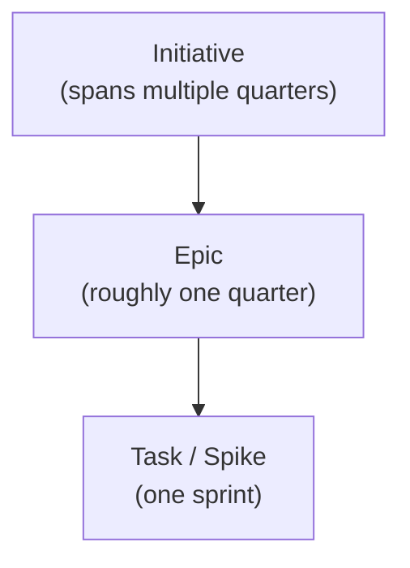

This page describes how the OCM team organizes its day-to-day development work. All meetings listed here are open to
the public - anyone is welcome to join, listen, or participate.

## How We Structure Work

All work items are GitHub issues tracked on the
[OCM Backlog Board](https://github.com/orgs/open-component-model/projects/10). Work is organized in a hierarchy:

### Initiatives

An initiative is a top-level work item. Its title is prefixed with `Initiative:` and it aggregates
multiple epics. Initiatives represent the team's vision and are used to communicate progress to stakeholders from a
broader perspective.

Example:
[Initiative: Lifecycle Management](https://github.com/open-component-model/ocm-project/issues/409)

### Epics

An epic is a work item prefixed with `EPIC:` that uses the `epic` type. Epics
organize tasks into manageable chunks that help track progress towards a larger goal.

Epics contain:
- A technical description
- A user story
- Defined scope
- Sub-issues as tasks

An epic should have one assignee who takes ownership of the story. See the
[epic template](https://github.com/open-component-model/ocm-project/blob/main/.github/ISSUE_TEMPLATE/epic.md)
for the expected structure.

### Tasks

A task is a work item using the `task` type. It is a small item of work that should be completable in one
sprint. All planned tasks are part of an epic.

Tasks document work and make progress traceable so someone else can pick it up. They contain a technical description
and structure the work for the engineer. See the
[task template](https://github.com/open-component-model/ocm-project/blob/main/.github/ISSUE_TEMPLATE/task.md)
for the expected structure.

### Spikes

A spike is a work item using the `spike` type. It is used for explorative work - research tasks or
proofs-of-concept. A spike is time-boxed to answer a predefined question or to conceptualize a solution.

Unlike a task, the result of a spike is open-ended. Story points for spikes are referential and should roughly align
with the number of days spent (e.g., 1 day time-boxed = 1 story point). See the
[spike template](https://github.com/open-component-model/ocm-project/blob/main/.github/ISSUE_TEMPLATE/spike.md)
for the expected structure.

## Project Board and Issue Tracking

All work is tracked on the
[OCM Backlog Board](https://github.com/orgs/open-component-model/projects/10/views/1) in the
[ocm-project](https://github.com/open-component-model/ocm-project) repository. The board has several views:

| View | Purpose |
|------|---------|
| [Current Sprint](https://github.com/orgs/open-component-model/projects/10/views/20) | Active sprint work |
| [Next Sprint](https://github.com/orgs/open-component-model/projects/10/views/21) | Upcoming sprint queue |
| [Backlog](https://github.com/orgs/open-component-model/projects/10/views/1) | All open issues, prioritized |
| [Roadmap](https://github.com/orgs/open-component-model/projects/10/views/5) | Timeline view of planned work |
| [Epics](https://github.com/orgs/open-component-model/projects/10/views/16) | High-level feature tracks |

## How Issues Enter the Sprint

Anyone can propose work for an upcoming sprint. The process is:

1. **Create an issue** in the relevant repository (or in
   [ocm-project](https://github.com/open-component-model/ocm-project/issues) for cross-cutting work). Write a clear
   description following the appropriate issue template.
2. **Self-refine the issue** - ensure it has enough context for others to understand scope and intent.
3. **Add it to the project board** with status "Needs Refinement", assign an initial priority, and place it in the
   next sprint.
4. **Refinement discussion** - during the weekly refinement meeting the team discusses the issue. If everyone
   understands it, it is story-pointed and its priority is evaluated.
5. **Ready for sprint** - once refined, the issue moves to the "Next-Up" column and is available for sprint planning.

## Meetings


We are working on making all meeting links publicly discoverable. In the meantime, reach out on
[Zulip](https://linuxfoundation.zulipchat.com/#narrow/channel/532975-neonephos-ocm-support) or
[Slack](https://kubernetes.slack.com/archives/C05UWBE8R1D) to receive a calendar invite.


| Meeting | Cadence | Purpose |
|---------|---------|---------|
| Daily Standup | Every workday | Casual sync - not mandatory, not necessarily work-related |
| Planning | Biweekly (Monday) | Review the [Next Sprint](https://github.com/orgs/open-component-model/projects/10/views/21) view, agree on sprint goals |
| Retrospective | Biweekly (Monday) | Reflect on what went well and what to improve, then close the sprint |
| Refinement | Weekly (Thursday) | Discuss items in "Needs Refinement" on the [Next Sprint](https://github.com/orgs/open-component-model/projects/10/views/21) view, clarify scope, and story-point |
| Warroom | Every workday | Synchronous coordination on tasks or open topics |
| [Community Call]() | First Wednesday of the month | Project updates, demos, and open Q&A with the broader community |
| TSC Meeting | First Monday of the month | Governance decisions, SIG approvals ([meeting notes](https://github.com/open-component-model/open-component-model/tree/main/docs/steering/meeting-notes)) |

## Decision-Making

Day-to-day technical decisions are made by the contributors doing the work, in pull requests and issues. For
decisions that affect multiple areas or establish a precedent, the team uses
[Architecture Decision Records (ADRs)](https://github.com/open-component-model/open-component-model/tree/main/docs/adr).

Larger decisions that affect project direction are escalated to the TSC. The process is:

1. Discuss in a GitHub issue, SIG meeting, or on Slack/Zulip
2. If consensus is not reached, bring it to the TSC agenda
3. The TSC decides by majority vote (quorum: 50% of voting members)

For full governance details, see the [Governance]() page and the
[Project Charter](https://github.com/open-component-model/open-component-model/blob/main/docs/steering/CHARTER.md).

## Communication Channels

For communication channels and how to reach the team, see the
[Community Engagement]() page.
