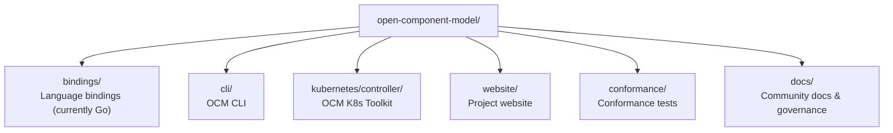
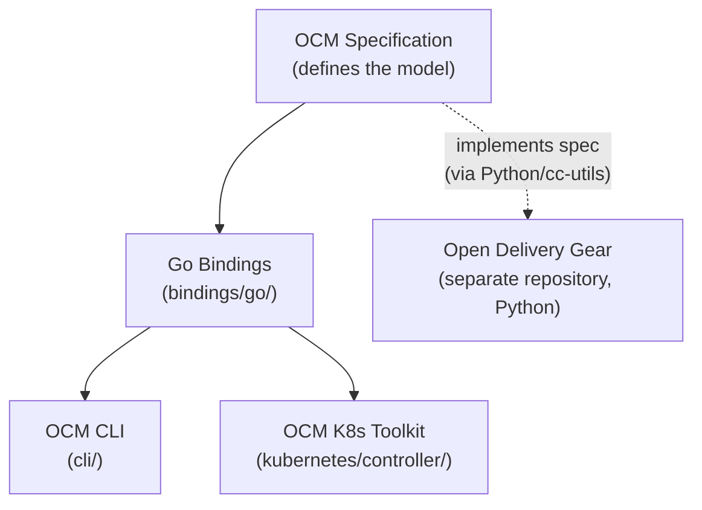

Welcome to the Open Component Model (OCM). This page gives you everything you need to orient yourself in the project,
understand how it is built, and find the right starting point for your interests.



**To use the OCM CLI**
Basic command-line experience and familiarity with container images or software packaging concepts.

**To use the Kubernetes controllers**
Working knowledge of Kubernetes (clusters, manifests, custom resources).

**To contribute code**
The core libraries, CLI, and controllers are written in Go (1.26+) and use [Task](https://taskfile.dev/) as their build
runner. Contributions in other areas - such as language bindings, documentation, the website, or tooling - may use
different languages and are equally welcome


## What is OCM?

Imagine you ship a product that consists of a container image, a Helm chart, two config files, and a monitoring
dashboard. Today, these artifacts live in registries in different locations, are versioned independently, and have no
formal link between them. When you need to deliver the whole product to a customer - especially one running in a
restricted network with no internet access - you must assemble everything manually, hoping nothing is missing or
mismatched.

The Open Component Model solves this. Think of it as a **delivery receipt** for software: a signed document that lists
exactly what is in the package, where each piece came from, and who verified it. OCM calls this a **Software Bill of
Delivery** (SBoD) - similar to how a shipping manifest lists the contents of a container, an SBoD lists the contents of
a software delivery.

Concretely, OCM is a standard and toolkit for describing, signing, transporting, and deploying software artifacts as a
single unit. Its core concept is the **component version** - a manifest that groups all artifacts belonging to a
delivery, assigns them a shared identity and version, and enables cryptographic signing and transport across
environments (including networks without internet access).

To learn more about the model itself, start with these overview pages:







## The Mono-Repository

All active OCM development happens in a single repository:
[open-component-model](https://github.com/open-component-model/open-component-model). The mono-repo contains the Go
library, the CLI, the Kubernetes controllers, conformance tests, and this website - all sharing one dependency tree and
one test suite.


The [ocm](https://github.com/open-component-model/ocm) and
[ocm-controller](https://github.com/open-component-model/ocm-controller) repositories are the previous generation of
OCM tooling. They are no longer actively developed. All new work targets the mono-repo above. Read the
[OCM v2 announcement]() for background on why the project was completely
rewritten.


## Technical Layers

OCM is built as a stack of layers. Each layer builds on the one below it:

**OCM Specification** - The formal standard that defines how components, resources, and signatures are represented. It
is technology-agnostic and lives in its own repository:
[ocm-spec](https://github.com/open-component-model/ocm-spec).

**Go Bindings** (`bindings/go/`) - The reference implementation of the specification in Go. The `bindings/` directory is
structured to welcome implementations in other languages in the future. This library provides the core types and
operations (creating, signing, resolving, transferring component versions) that the CLI and controllers build on.

**OCM CLI** (`cli/`) - A command-line tool for the Pack-Sign-Transport workflow. Built on the Go bindings,
it is designed for interactive use and CI/CD pipelines. Start with
[Install the OCM CLI]().

**OCM K8s toolkit** (`kubernetes/controller/`) - A set of controllers that handle deployment and verification of
OCM component versions in Kubernetes clusters. They use a dependency chain of custom resources: Repository, Component,
Resource, and Deployer. Read more in the [Kubernetes Controllers]()
concept page.

**Open Delivery Gear (ODG)** - A compliance automation engine that subscribes to OCM component versions and
continuously scans delivery artifacts for security and compliance issues. ODG tracks findings against configurable SLAs,
supports assisted rescoring, and provides a Delivery Dashboard UI for both platform operators and application teams. It
is designed for public and sovereign cloud scenarios where trust-but-verify assurance is required. ODG lives in its own
repository: [open-delivery-gear](https://github.com/open-component-model/open-delivery-gear).

## Getting Started

The getting-started guides walk you through the full workflow - from installing the CLI to deploying with Kubernetes
controllers. The first two guides (CLI installation and creating a component version) require no Kubernetes knowledge.





## Advanced Topics

Once you are comfortable with the basics, explore these concept pages for a deeper technical understanding:









## Project Organization

OCM is an open standard contributed to the [Linux Foundation](https://www.linuxfoundation.org/) under the
[NeoNephos Foundation](https://neonephos.org/). A Technical Steering Committee (TSC) provides technical oversight,
sets project direction, and coordinates across working groups. The TSC meets monthly in public and publishes
[meeting notes](https://github.com/open-component-model/open-component-model/tree/main/docs/steering/meeting-notes).

Specific technical areas are owned by Special Interest Groups (SIGs). Currently, **SIG Runtime** maintains the Go
bindings, CLI, and Kubernetes controllers. SIGs are open to new members - see the
[SIG Handbook](https://github.com/open-component-model/open-component-model/blob/main/docs/community/SIGs/SIG-Handbook.md)
for how to join or propose a new SIG.

For full details on governance, TSC membership, and the project charter, see the
[Governance]() page. To learn how the team works day-to-day - meetings,
planning, and decision-making - see [How We Work]().

## Contributing and Engaging

Ready to contribute or connect with the community?

- **[Community Engagement]()** - Communication channels (Slack, Zulip), community calls,
  and how to reach the team.
- **[Contributing Guide]()** - Fork-and-pull workflow, pull request process, DCO
  sign-off, and guidelines for AI-generated code. This covers the general process for all repositories and links to
  repository-specific build and test instructions.

If you are looking for something to work on, check the
[`kind/good-first-issue`](https://github.com/search?q=org%3Aopen-component-model+label%3A%22kind%2Fgood-first-issue%22+state%3Aopen&type=issues)
label across our repositories, or join the discussion on
[Slack](https://kubernetes.slack.com/archives/C05UWBE8R1D) or
[Zulip](https://linuxfoundation.zulipchat.com/#narrow/channel/532975-neonephos-ocm-support).
