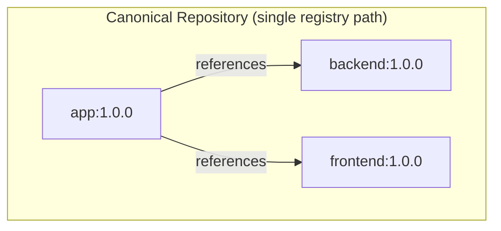
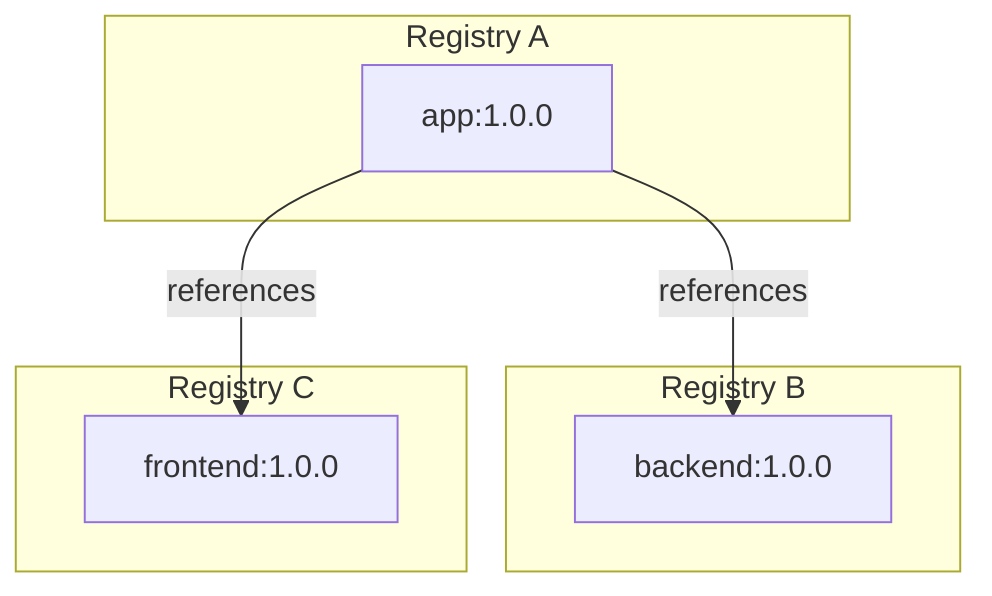
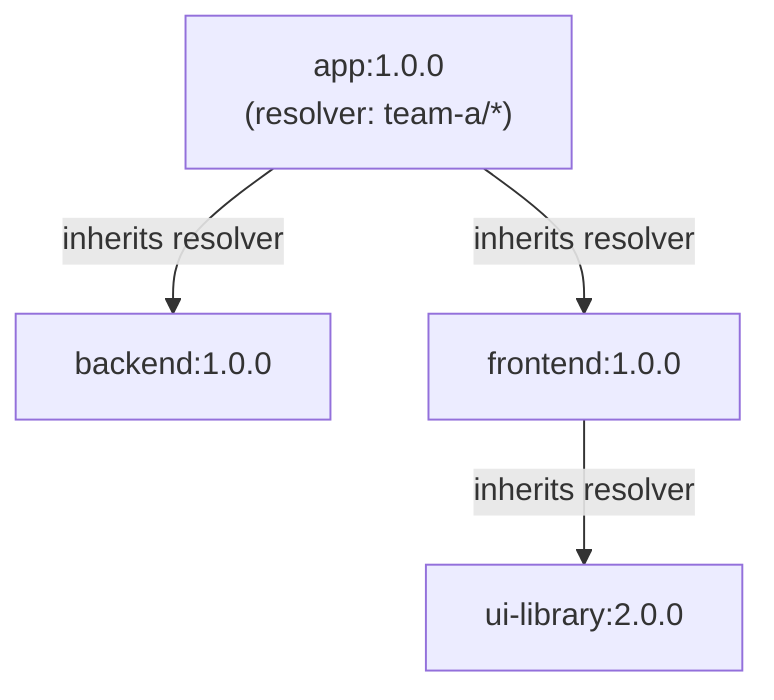

In OCM, a component reference carries only a component name and version, never a repository URL. This is a deliberate design choice that enables location-independent software delivery. This page explains the reasoning behind that decision, the concept of canonical repositories, and how resolvers provide the missing link between component references and their storage locations.

## Component References Are Location-Free

A [component reference]() in OCM is defined by three fields:

| Field | Purpose |
| --- | --- |
| `componentName` | The globally unique name of the referenced component (e.g., `ocm.software/core/backend`) |
| `version` | The version of the referenced component |
| `digest` | Optional digest for integrity verification |

Notably absent: any indication of **where** the referenced component is stored. There is no repository URL, no registry address, no storage path.

This is intentional. If references included repository locations, every mirror, transfer, or relocation would require rewriting component descriptors, which would invalidate signatures. By keeping references location-free, OCM ensures that:

- **Signatures survive transport.** A component version signed in a development registry can be verified in a production registry without any descriptor changes.
- **The same component graph works everywhere.** Whether components live in a public cloud registry, a private harbor instance, or a CTF archive on a USB drive, the references between them remain identical.
- **Mirroring is metadata-preserving.** Transferring a component graph to a new registry doesn't require patching internal references. The descriptors are copied as-is.

This design is what makes OCM's [transfer model]() possible: artifacts can move across registry boundaries, air gaps, and organizational boundaries without losing integrity or provenance.

## What Are Canonical Repositories?

A **canonical repository** is a repository that contains all components of a component graph: the root component and every component it references, directly or transitively.



When all components live in the same repository, recursive operations like `ocm get cv --recursive` work without any additional configuration. The CLI looks up referenced components in the same repository where it found the root.

OCM does **not** enforce canonical repositories. Components can be spread across any number of registries and repository paths:



In practice, components are often distributed across registries because:

- Different teams own different components and publish to separate registry namespaces.
- Components have different access control requirements, with some being public and others private.
- Organizations consume third-party components from external registries.
- Components follow different release cadences and lifecycle stages.

Both patterns (canonical and distributed) are fully supported. The difference is operational: canonical repositories are simpler to work with, while distributed layouts offer more flexibility at the cost of requiring resolver configuration.

## How Resolvers Bridge the Gap

Since component references don't specify where a component lives, something needs to provide that mapping at resolution time. That's the job of **resolvers**.

A resolver maps a component name pattern (glob) to a repository. When the CLI encounters a component reference during a recursive operation, it walks the configured resolver list in order, finds the first pattern that matches the component name, and queries the associated repository.

```yaml
type: generic.config.ocm.software/v1
configurations:
  - type: resolvers.config.ocm.software/v1alpha1
    resolvers:
      - repository:
          type: OCIRepository/v1
          baseUrl: ghcr.io
          subPath: team-a/components
        componentNamePattern: "ocm.software/team-a/*"
      - repository:
          type: OCIRepository/v1
          baseUrl: ghcr.io
          subPath: team-b/components
        componentNamePattern: "ocm.software/team-b/*"
```

In this example, any component whose name starts with `ocm.software/team-a/` is resolved from `ghcr.io/team-a/components`, while `ocm.software/team-b/` components are resolved from `ghcr.io/team-b/components`.

Resolvers are the runtime complement to the static component descriptor. The descriptor says **what** is referenced; the resolver says **where** to find it. This separation keeps the descriptor portable and the resolution strategy configurable per environment.

For the full resolver configuration schema and pattern syntax, see the [Resolver Configuration Reference](). For a hands-on walkthrough, see the [Working with Resolvers]() tutorial.

## Resolver Propagation in Recursive Discovery

When the CLI resolves a component graph recursively, it doesn't just resolve the root component's direct references but follows the entire tree. During this traversal, **resolvers propagate from parent to child**.

This means that within a single resolution tree, all referenced components are fetched using the same resolver context that was established at the root. The CLI creates a consistent "canonical context" for the entire operation:



Each child component inherits its parent's resolver for fetching, and its parent's target repository for transfer operations. This ensures consistency: within a single resolution tree, a component is always fetched from the same source.

### Conflict Detection

If a component is referenced by multiple parents that specify **different** resolvers, the CLI raises an error rather than silently picking one. This prevents ambiguous resolution where the same component could come from different sources depending on which path through the graph is traversed first.

For example, if `app-a` resolves `shared-lib` from Registry A, and `app-b` resolves `shared-lib` from Registry B, and both are part of the same resolution tree, the CLI will report a conflict. This is by design: it forces the operator to provide an explicit, unambiguous resolver configuration.

## Summary

| Concept | Purpose |
| --- | --- |
| **Location-free references** | Component references carry only name, version, and digest, not a repository. This preserves signatures and enables transport. |
| **Canonical repositories** | A repository containing all components in a graph. Simplifies operations but is not required. |
| **Resolvers** | Runtime mapping from component name patterns to repositories. Required when components are distributed across registries. |
| **Resolver propagation** | Children inherit their parent's resolver during recursive operations, creating a consistent resolution context. Conflicts are detected and reported. |

## Next Steps

- [Working with Resolvers](): Hands-on tutorial for configuring resolvers
- [Transfer and Transport](): How location-free references enable transport across boundaries

## Related Documentation

- [Component Identity](): How OCM identifies components, versions, and artifacts
- [Resolvers](): The resolver concept and configuration overview
- [Resolver Configuration Reference](): Full schema, repository types, and pattern syntax
