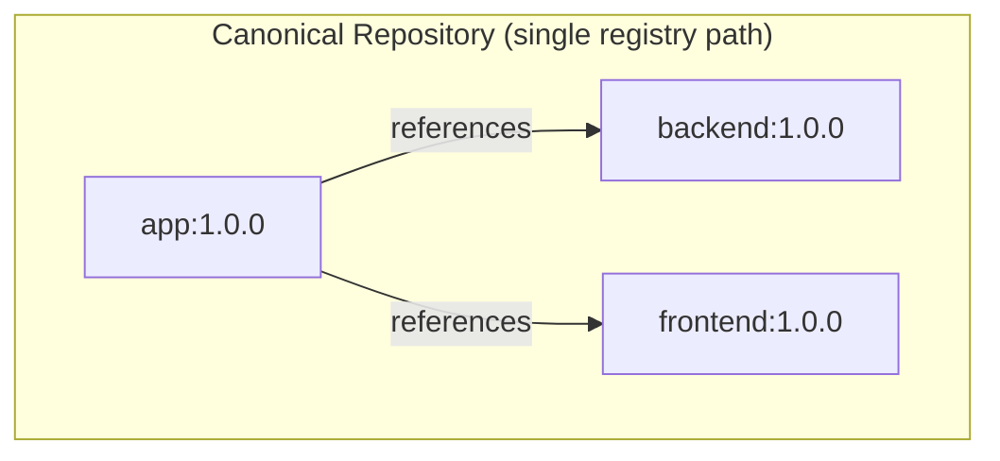
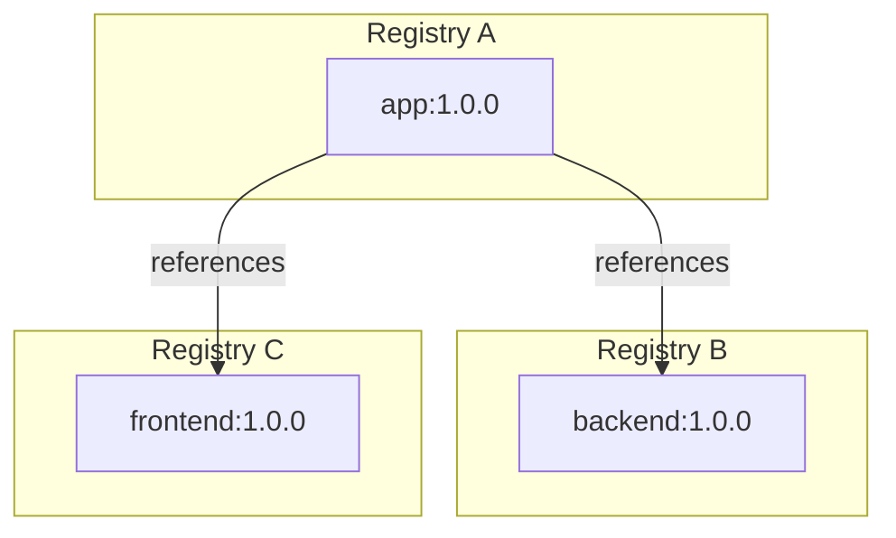
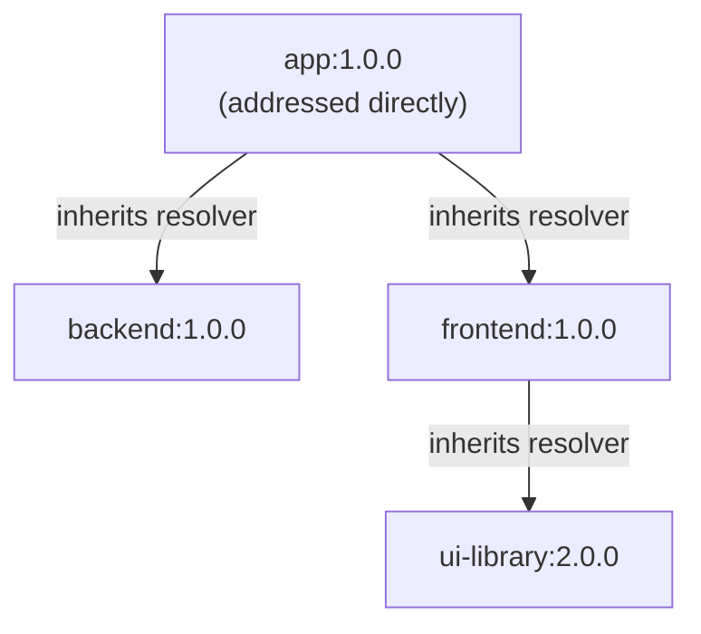

## What Are Canonical Component Repositories?

A **canonical repository** is a repository that contains all components of a component graph: the root component and every component it references, directly or transitively.

When all components live in the same repository, recursive operations like `ocm get cv --recursive` work without any additional configuration. The CLI looks up referenced components in the same repository where it found the root.

OCM does **not** require canonical repositories. Components can be spread across any number of registries and repository paths. The concept of canonical repositories is a convenience, not a constraint.

## Why Does This Concept Exist?

### Location-free references preserve integrity

A [component reference]() in OCM carries only a component name, version, and an optional digest. It never includes a repository URL, registry address, or storage path.

This is a deliberate design choice. If references included repository locations, every mirror, transfer, or relocation would require rewriting component descriptors, which would invalidate signatures. By keeping references location-free, OCM ensures that:

- **Signatures survive transport.** A component version signed in a development registry can be verified in a production registry without any descriptor changes.
- **The same component graph works everywhere.** Whether components live in a public cloud registry, a private harbor instance, or a CTF archive on a USB drive, the references between them remain identical.
- **Mirroring is metadata-preserving.** Transferring a component graph to a new registry doesn't require patching internal references. The descriptors are copied as-is.

This design is what makes OCM's [transfer model]() possible: artifacts can move across registry boundaries, air gaps, and organizational boundaries without losing integrity or provenance.

### Canonical repositories simplify operations

When all components of a graph live in one repository, the CLI can resolve the entire graph without any additional configuration. This is the simplest operational model: you point the CLI at a repository and a root component, and it can traverse the full dependency tree.

In practice, however, components are often distributed across registries because:

- Different teams own different components and publish to separate registry namespaces.
- Components have different access control requirements, with some being public and others private.
- Organizations consume third-party components from external registries.
- Components follow different release cadences and lifecycle stages.

Both patterns (canonical and distributed) are fully supported. Canonical repositories are simpler to work with, while distributed layouts offer more flexibility at the cost of requiring [resolver]() configuration.

## How It Works

### Root components are always addressed directly

The CLI always needs an explicit repository for the **root** component. You provide this on the command line when running a command like `ocm get cv`. Resolvers are not involved in locating the root. They only come into play for the components that the root (or its children) reference.

### Resolvers bridge the gap for referenced components

Since component references don't specify where a component lives, something must provide that mapping at resolution time. That is the job of [resolvers](). A resolver maps component name patterns to repositories so the CLI can locate referenced components during recursive operations.

When components are distributed across registries, resolvers are the runtime complement to the static component descriptor: the descriptor says **what** is referenced, while the resolver says **where** to find it. This separation keeps the descriptor portable and the resolution strategy configurable per environment.

For details on how resolvers work, how to configure them, and the pattern syntax, see the [Resolvers]() concept page.

### Resolver propagation in recursive discovery

When the CLI resolves a component graph recursively, it follows the entire dependency tree, not just the root's direct references. During this traversal, **resolvers propagate from parent to child**.

This means that within a single resolution tree, all referenced components are fetched using the same resolver context that was established at the root. The CLI creates a consistent "canonical context" for the entire operation:

Each child component inherits its parent's resolver for fetching, and its parent's target repository for transfer operations. This ensures consistency: within a single resolution tree, a component is always fetched from the same source.

### Conflict detection

If a component is referenced by multiple parents that specify **different** resolvers, the CLI raises an error rather than silently picking one. This prevents ambiguous resolution where the same component could come from different sources depending on which path through the graph is traversed first.

For example, if `app-a` resolves `shared-lib` from Registry A, and `app-b` resolves `shared-lib` from Registry B, and both are part of the same resolution tree, the CLI reports a conflict. This forces the operator to provide an explicit, unambiguous resolver configuration.

## Key Properties

| Property | Description |
| -------- | ----------- |
| **Location-free references** | Component references carry only name, version, and digest. This preserves signatures across transport. |
| **Canonical repository** | A repository containing all components in a graph. Simplifies operations but is not required. |
| **Root addressed directly** | The root component is always located via an explicit repository on the command line, not via resolvers. |
| **Resolver propagation** | Children inherit their parent's resolver during recursive operations, creating a consistent resolution context. |
| **Conflict detection** | If the same component would be resolved from different sources, the CLI raises an error. |

## Relationship to Other Concepts

- **[Component Identity]()**: Component references use the identity model (name, version, digest) without including storage locations.
- **[Resolvers]()**: Resolvers provide the runtime mapping from component names to repositories that canonical repositories make unnecessary.
- **[Transfer and Transport]()**: Location-free references are what make transfer possible without rewriting descriptors or invalidating signatures.
- **[Signing and Verification]()**: Signatures remain valid across transfers because access locations are excluded from the signed digest.

## When to Use It

- **Use canonical repositories** when you control the full component graph and want the simplest possible operational model. A single repository with all components means no resolver configuration is needed.
- **Canonical repositories become important** after a transfer: `ocm transfer cv --recursive --copy-resources` creates a canonical repository in the target, making the transferred graph self-contained.
- **You can ignore canonical repositories** when your components are intentionally distributed across registries. In that case, configure [resolvers]() to map component names to their respective repositories.

## Next Steps

- [Working with Resolvers](): Hands-on tutorial for configuring resolvers
- [Transfer and Transport](): How location-free references enable transport across boundaries

## Related Documentation

- [Resolvers](): The resolver concept and configuration overview
- [Resolver Configuration Reference](): Full schema, repository types, and pattern syntax
