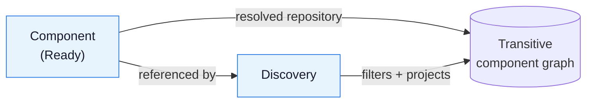

A `Discovery` publishes a filtered, optionally projected view of the transitive
reference graph of a `Component`. It is a read-only, query-style resource: it
downloads no artifacts, creates no external resources, and provides no
signature-verification guarantees for the descriptors it filters.

For a worked example, see the
[Discover Component Graphs]()
how-to guide.

## What Discovery does

A `Discovery` references a `Component` in the same namespace via
`spec.componentRef.name`. When that `Component` is `Ready`, the controller:

1. Uses the repository resolved in the `Component`'s
   `status.component.repositorySpec` as the traversal base. Resolvers from the
   effective OCM configuration also apply, so references may resolve elsewhere.
2. Resolves the **entire** reachable component graph before filtering or
   publishing anything.
3. Applies the reference, component, and resource selectors.
4. Sorts descriptors lexicographically by `(component.name, component.version)`.
5. Publishes filtered raw v2 descriptors in `status.components`, or projected
   records in `status.extracted` when `spec.extract` is set.




The controller resolves the complete graph even when your selectors target an
exact identity, and the first resolution failure cancels the rest: the last
successful payload is retained and `Ready` goes `False` with reason
`ResolutionFailed`. There is no partial resolution and no identity-based
short-circuiting.


## Selectors

`spec.referenceSelector`, `spec.componentSelector`, and `spec.resourceSelector`
are all optional `Selector` objects. A `Selector` has three clauses, all ANDed
together. A nil or empty selector matches everything.

- **`matchIdentity`** — Matches elements whose identity contains all specified
  key-value pairs. Keys must be present, including comparisons against an empty
  value.
- **`matchLabels`** — Matches elements carrying labels with the specified
  **string** values. Non-string label values are matched via `expression` only.
- **`expression`** — A CEL expression evaluated for each element; it must
  evaluate to a boolean. An empty expression is a no-op.

Selector CEL bindings:

- `identity` — the element identity, a map of string to string. On the
  reference stage it also carries `componentName`, the name of the referenced
  component, alongside the reference's own name, version, and extra identity.
- `labels` — a map from label name to the decoded JSON value of the label.

The stages run in order. The `referenceSelector` scans the references of **all**
resolved descriptors and keeps each target with at least one matching incoming
reference; the root survives only if something in the graph references it, so in
a plain tree a nonempty reference selector drops it. The `componentSelector`
then filters the surviving components. The `resourceSelector` filters each
surviving component's resources **and drops the component when none of them
match**, so selecting by resource selects the components that carry such a
resource.

### semverCheck

Selector and extraction expressions can call `semverCheck(version, constraint)`,
which returns a boolean using SemVer semantics (SemVer applies only to
`semverCheck`; graph ordering is lexicographic):

```yaml
componentSelector:
  expression: semverCheck(identity.version, ">=2.7.0, <2.10.0")
```

## Extraction

Set exactly one extraction mode under `spec.extract`. `extract: {}` is invalid.

- **`byResources`** (bindings `component`, `resource`) — Each map value is a CEL
  expression evaluated once per surviving `(component, resource)` pair.
- **`byComponents`** (binding `component`) — Each map value is a CEL expression
  evaluated once per surviving component.
- **`expression`** (binding `components`) — A single CEL expression evaluated
  once over the complete filtered descriptor list; must return a list of objects.

Notes:

- Map-mode values use v2 JSON field names (for example `component.name`,
  `resource.access.imageReference`). An explicitly empty map (`byResources: {}`)
  emits one empty record per iteration.
- `expression` mode binds full v2 descriptors (for example
  `components[0].component.componentReferences`) and is strict: it must produce
  objects with string keys.
- All modes must return a list of objects. Anything else fails with
  `ExtractFailed`.

### Absent, null, and missing

There are three possible outcomes:

**A missing access** — an absent map key, an absent attribute, an out-of-range
list index — is never an error. In `byResources` and `byComponents` the field is
omitted from the record, and the record is kept even if all its fields disappear.
Within a selector it simply does not match.

**A field that is present but `null`** is the trap. `descriptor/v2` declares
`resources`, `sources` and `componentReferences` without `omitempty`, so a
component with none of them serializes `null` rather than omitting the key:

```yaml
# Stalls the Discovery: size(null) is "no such overload", an ExtractFailed.
byComponents:
  refs: size(component.componentReferences)
```

```yaml
byComponents:
  # single quotes are required
  refs: 'component.componentReferences == null ? 0 : size(component.componentReferences)'
```

`expression` mode is stricter: the same access that `byComponents` silently
drops fails the whole Discovery. Guard every optional read with `has()` (is the
key there at all) **and** `!= null` (is it there but empty) — a key present with
a `null` value passes `has()`:

```yaml
extract:
  expression: |
    components.map(c, {
      "name": c.component.name,
      "refs": has(c.component.componentReferences) && c.component.componentReferences != null
        ? size(c.component.componentReferences) : 0,
    })
```

**An expression returning `null` or `optional.none()`** is not a missing access:
the key is written into the record with an explicit `null` rather than omitted.

## Configuration and repository scope

Discovery uses the shared OCM configuration propagation of the controller chain:

- **No `spec.ocmConfig`:** inherit only parent (`Component`) configuration
  entries marked `Propagate`.
- **Explicit `spec.ocmConfig`:** resolve those entries instead of the implicit
  inheritance.

The effective configuration is published in `status.effectiveOCMConfig` and used
uniformly for the root and all transitive fetches, including any resolvers it
configures.

## Status semantics

The controller publishes at most one of `status.components` or
`status.extracted`; a CEL validation rule rejects both being set. Presence is
meaningful: an **uncomputed** field is **absent**, while a **selected but empty**
result is an empty list (`[]`), never omitted or null.

On success, including when nothing matches, the controller sets `Ready=True`
with reason `Succeeded`, removes `Stalled`/`Reconciling`, and advances
`status.observedGeneration`. An empty result names the selector stage that
matched nothing, reference, component, or resource, in the `Ready` message.

On failure the controller **retains the last successful payload**, even if it
belongs to the previous output mode, and updates only the conditions:

- **`ResolutionFailed`** (`Ready=False`): The graph could not be resolved —
  repository, auth or network failure, or an unavailable component version.
  **Retried with backoff**, since the cause is usually transient and a failure
  below the root produces no watch event to recover from.
- **`SelectorFailed`** (`Ready=False`, `Stalled=True`): Selector compilation,
  evaluation or type error, including exhausting the CEL cost budget on a very
  large graph.
- **`ExtractFailed`** (`Ready=False`, `Stalled=True`): The same for extraction,
  plus an output that is not a list of objects.
- **`PayloadTooLarge`** (`Ready=False`, `Stalled=True`): The payload exceeds the
  1MiB limit; refine the selectors or extraction. The size is checked before
  writing, so the oversized candidate never reaches the API server.


`status.observedGeneration` advances only on a successful reconciliation, and a
failed Discovery keeps its last successful payload. So `status.components` /
`status.extracted` may not reflect the current spec even while `Ready` is
`True`. Always gate consumption on `Ready=True` **and**
`status.observedGeneration == metadata.generation`:

- After a spec change, the previous `Ready=True` stands until the new generation
  has been reconciled.
- A suspended object writes no status at all, so it keeps reporting the result
  of the last spec it did reconcile.


## Scheduling

Discovery is watch-driven with no interval. It watches exactly two things: its
own generation, and the referenced `Component`'s resolved info, effective
config, readiness and termination. Every input that can change the *graph* is
watched or version-pinned — references resolve by version, so the graph cannot
change without the `Component`'s resolved version changing.

Configuration sources are deliberately not watched: credentials decide whether
the graph can be fetched, not what it contains. A Discovery that failed on
credentials retries with exponential backoff (up to five minutes between
attempts), so fixing the `Secret` revives it without a spec change, just not
immediately.

`status.observedComponentDigest` skips the walk when the root digest is
unchanged since the last run. It is only recorded when every reference in the
resolved graph has a digest, since one missing digest anywhere breaks the chain.
A generation change on the `Discovery` always forces a full walk regardless.

Suspended and deleting objects exit reconciliation immediately and retain their
existing conditions and payload. Terminally failed (`Stalled=True`) objects are
not requeued.

## Deletion protection

A referencing `Discovery` blocks deletion of its `Component`, the same way a
referencing `Resource` does. Deleting or retargeting the `Discovery` releases the
old `Component`. Discovery creates no external resources, so it carries no
finalizer of its own and sets no owner reference on the `Component`.

## Not supported

- Partial resolution, `UnresolvedReference`, `status.unresolved`, or
  `PartiallyResolved`.
- Identity-based short-circuiting of the traversal.
- Artifact/resource downloads.
- Signature-verification guarantees for the filtered descriptors. Filtered
  descriptors are **not** signature-verification inputs.
- Multi-root discovery.

## Related Documentation

- [How-To: Discover Component Graphs]() -
  Create a `Discovery` and publish a filtered view of a component graph
- [Concept: Kubernetes Controllers]() -
  How Discovery fits alongside the reconciliation chain
- [Reference: Discovery CRD]() -
  Full field reference for the Discovery resource
