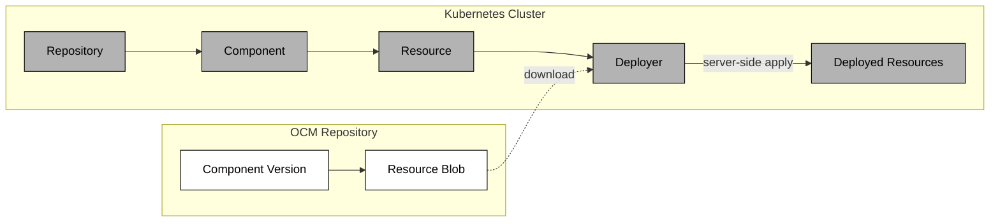

The Deployer is a Kubernetes controller that takes an OCM resource, typically containing Kubernetes manifests such as a `ResourceGraphDefinition`, plain YAML, or other deployable content, downloads it from a `Resource`, and applies it to the cluster using server-side apply.

The Deployer references an OCM `Resource` object. When the status of that resource becomes `Ready`, the Deployer downloads the referenced blob, decodes any YAML/JSON manifests it contains, and applies them to the cluster.

To reach the successful deployment status, the following chain of objects has to be reconciled: `Repository` -> `Component` -> `Resource` -> `Deployer`.

The `Repository` validates that the OCM repository is reachable. The `Component` downloads and verifies the component version descriptor from that repository. Once the component is `Ready`, the `Resource` will fetch the resource descriptor and store it in its status. The Deployer watches for this and when the `Resource` is `Ready`, it downloads the content and applies it to the cluster.

## Deployer and NamespacedDeployer

The controller offers two kinds with the same apply, prune and drift semantics:

| | `Deployer` | `NamespacedDeployer` |
| --- | --- | --- |
| Scope | Cluster | Namespaced |
| Applies with | The controller's own permissions | The service account in `spec.serviceAccountName`, or the controller's own permissions if empty |
| Deploys | Anything the controller may manage | Anything its service account may manage |
| Resource and OCM config references | Any namespace | Its own namespace only |

Use the `NamespacedDeployer`. Its service account's RBAC is the only limit on what a deployment can do: a `Role`
keeps it in its namespace, a `ClusterRole` and `ClusterRoleBinding` allow cluster-scoped objects such as kro
`ResourceGraphDefinitions` or objects in other namespaces. The `NamespacedDeployer` is no security boundary beyond
that RBAC: it stays in its namespace only if its service account does. Its `Resource` and OCM configuration
references must always point to its own namespace, so teams cannot read other namespaces' credentials through it.
Objects without a namespace default to the deployer's namespace.

`spec.serviceAccountName` is optional. Without it, the `NamespacedDeployer` applies and prunes with the controller's
own service account, so it can deploy anything the controller can. Set it whenever the deployer must be limited to its
own RBAC.


The cluster-scoped `Deployer` applies with the controller's own, cluster-wide permissions, so anyone who may create a
`Deployer` may deploy anything the controller can. It remains for existing installations, and the API server returns
a deprecation warning for it. Move to the `NamespacedDeployer` with the how-to guide *Migrate a Deployer to a
NamespacedDeployer*.


Both kinds can run side by side, and the Helm values `manager.deployer.enabled` and
`manager.namespacedDeployer.enabled` turn each controller off.

Objects in the `NamespacedDeployer`'s own namespace carry its owner reference. Cluster-scoped objects and objects in
other namespaces cannot, as Kubernetes rejects namespaced owners for them. They carry the
`delivery.ocm.software/namespaced-deployer` annotation instead, which the controller uses for drift detection.

## ApplySet Semantics

The Deployer uses [ApplySet](https://github.com/kubernetes/enhancements/blob/master/keps/sig-cli/3659-kubectl-apply-prune/README.md) (KEP-3659) for resource lifecycle management.

Every apply operation goes through Kubernetes server-side apply. When a manifest no longer includes a resource that was previously applied, the deployer automatically prunes it. Ownership is tracked through the `applyset.kubernetes.io/part-of` label, which ties each deployed resource back to the deployer instance that created it.

The Deployer manages the full lifecycle of what it deploys: creation, updates, and cleanup.

## Drift Detection

The Deployer registers dynamic informers for every resource it deploys. If something modifies or deletes a deployed resource externally, the Deployer picks up the change and re-applies the desired state on the next reconciliation.

These informers are created at runtime and only for the specific resource types that are actually deployed.

## Deletion and Finalizers

When a `Deployer` object is deleted, cleanup happens in two phases. First, the `delivery.ocm.software/applyset-prune` finalizer removes all deployed resources through ApplySet pruning. Once that completes, the `delivery.ocm.software/watch` finalizer unregisters the dynamic informers.

The `Deployer` will not be fully removed until both phases finish, ensuring no orphaned resources are left behind.

A `NamespacedDeployer` prunes with its service account. If that service account or its permissions are already gone,
it does not prune. Objects in its own namespace carry its owner reference, so the Kubernetes garbage collector
removes them anyway. Cluster-scoped objects and objects in other namespaces are **orphaned**: the deployer reports
them in a `DeletionFailed` Warning event and is removed without them.


`kubectl delete -f` on a file that contains the `NamespacedDeployer` together with its service account, `Role`,
`ClusterRole` or bindings removes the permissions at the same time and orphans cluster-scoped objects such as
`ResourceGraphDefinitions`. Delete the `NamespacedDeployer` first and wait until it is gone, then delete its RBAC.
If objects were orphaned, check the deployer's events and delete them by hand.


## Caching

Downloaded resource blobs are cached by digest in an LRU cache. If the digest has not changed between reconciliations, the Deployer skips re-downloading and re-applying. This reduces both network traffic and unnecessary applies.

There is also another cache during the component resolution that caches the component descriptor. But that happens before this part is even reached.

## Labels and Annotations

The Deployer stamps deployed resources with metadata for traceability in the form of **labels** and **annotations**:




| Label | Value |
| ----- | ----- |
| `app.kubernetes.io/managed-by` | `deployer.delivery.ocm.software` for a Deployer, `namespaceddeployer.delivery.ocm.software` for a NamespacedDeployer |
| `app.kubernetes.io/name` | Resource name |
| `app.kubernetes.io/version` | Resource version |
| `app.kubernetes.io/part-of` | Deployer name |




| Annotation | Value |
| ---------- | ----- |
| `digest.resource.delivery.ocm.software/value` | Resource digest |
| `component.delivery.ocm.software/name` | Component name |
| `component.delivery.ocm.software/version` | Component version |




## Common Use Cases

Which of the sections below applies depends on two independent choices: whether your
application is packaged as a Helm chart or plain manifests, and whether you want kro's RGDs to
orchestrate the deployment or apply it directly with the `NamespacedDeployer`.

### No orchestration: apply manifests directly

If your application is already plain Kubernetes manifests and you don't need an RGD's templating or
composition, skip kro entirely. The [Deploy Manifests with Deployer]()
how-to applies a Deployment straight from an OCM component using only the OCM Controllers.

### Helm chart, RGD applied manually

The [Deploy a Helm Chart]() getting-started tutorial
walks through applying a `ResourceGraphDefinition` for the [Podinfo](https://github.com/stefanprodan/podinfo)
application, with the RGD written and applied by hand. Start here if you're new to RGDs.

### Helm chart, RGD shipped inside the component (bootstrap pattern)

Packaging the `ResourceGraphDefinition` ([RGD](https://kro.run/docs/concepts/rgd/overview)) inside the OCM
component itself, rather than applying it by hand, lets developers ship deployment instructions alongside
their software. Once the `NamespacedDeployer` applies the RGD, [kro](https://kro.run/) reconciles it into a CRD that
operators instantiate. The RGD includes the deployer-specific CRDs — `HelmRelease` and `OCIRepository` for
Flux, or `Application` for Argo CD. See [Deploy an Application from a Helm Chart with OCM and kro]() for a full walkthrough.

### Plain manifests, RGD shipped inside the component, no Helm

The same bootstrap pattern, but for applications that aren't packaged as a Helm chart: the RGD renders plain
manifests directly, so there's no chart and no GitOps deployer in the path. Two RGDs are [chained
together](https://kro.run/docs/building-abstractions/rgd-chaining/), one creating an instance of the other's
kind, which gives the application its own typed Kubernetes API. See [Deploy an Application from Chained RGDs
with OCM and kro]() for a full walkthrough.

## Related Documentation

- [OCM Controllers](), overview of the controller ecosystem
- [Setup Controller Environment](), prerequisites for running the controllers
