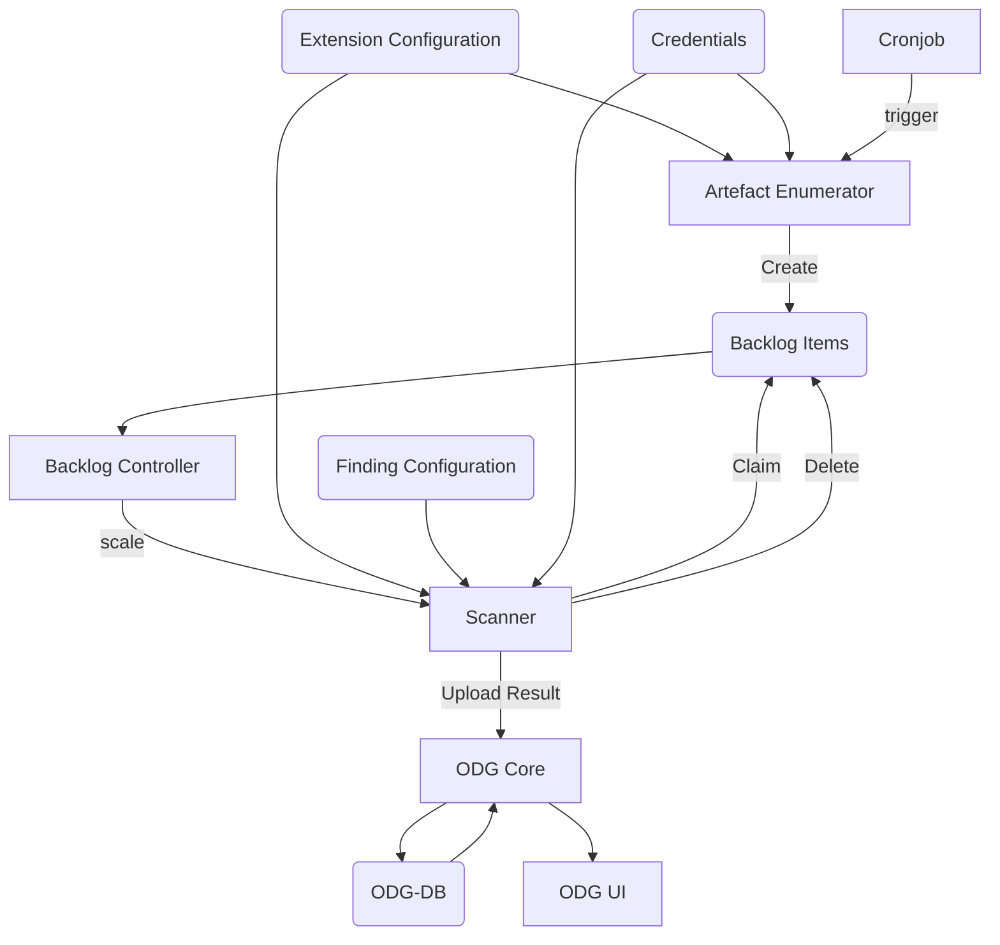

## What is the ODG System Architecture?

Open Delivery Gear (ODG) is a Kubernetes-native compliance automation engine designed for continuous security and compliance scanning of software components modelled with the Open Component Model (OCM). It orchestrates a set of loosely coupled components — a central API, a database, a UI, and pluggable extensions — to continuously discover artefacts, schedule scans, collect findings, and surface compliance state. ODG solves the problem of maintaining up-to-date, traceable compliance evidence across many software components without manual coordination.

## Why does it exist?

Compliance automation at scale requires processing many components across many versions with different scanning tools and reporting requirements. ODG was designed so that:

- **Core functionality stays minimal** — new capabilities come from extensions, not from growing a monolith.
- **State is centralised** — all findings and metadata live in one database, making queries, SLA tracking, and audits consistent.
- **Work is asynchronous** — a queue-based model lets extensions scale independently and process artefacts autonomously.
- **Kubernetes primitives are used directly** — CRDs, Deployments, and CronJobs replace bespoke scheduling and orchestration logic.

## How it works



### Core Components

#### ODG Database (odg-db)

The ODG Database serves as the **sole persistency layer** for the entire system. All findings, metadata, compliance snapshots, and configuration state flow through this component.

**Responsibilities:**

- Store findings and metadata as `ArtefactMetadata` entries
- Correlate metadata with OCM coordinates (component name, version, artefact identity)
- Maintain compliance snapshots tracking artefact processing state
- Store scanner metadata writebacks and rescoring decisions
- Track discovery dates for SLA enforcement
- Cache OCM component information

The database uses a correlation model where all data is linked to an `artefact` identifier. This allows grouping findings and metadata across different scans, versions, and extensions whilst maintaining traceability to specific OCM components or runtime artefacts.

#### ODG Core (odg-core)

ODG Core provides the **central API** layer and serves as the primary entry point for both human users and automated systems.

**Responsibilities:**

- Expose API endpoints for CRUD operations on artefact metadata
- Proxy database operations with business logic enforcement
- Handle authentication and authorisation (implemented via OAuth)
- Serve data payloads for the ODG UI application
- Provide high-level OCM functions, e.g.:
  - List component versions
  - Calculate differences between OCM component versions
  - Resolve component dependencies recursively
- Maintain artefact scan information
- Coordinate metadata queries with complex filtering

The core API is the single gateway through which extensions upload findings, the UI retrieves data, and external systems integrate with ODG.

#### ODG UI (odg-ui)

The Delivery Dashboard provides the **primary user interface** for interacting with ODG.

**Capabilities:**

- Browse OCM components and their artefacts
- View compliance status and findings with SLA tracking
- Create and manage finding assessments and rescorings
- Submit scanner metadata writebacks
- Monitor ODG system health (pod status, backlog queue depth)

The UI is a static web application served by a dedicated webserver, consuming data exclusively through the ODG Core API.

#### Artefact Enumerator

The Artefact Enumerator acts as the **orchestration engine** for automated scanning workflows. It runs as a Kubernetes CronJob on a configurable schedule. For each configured OCM component:

1. **Discovery**: Fetch the component descriptor and recursively resolve all dependencies
2. **Tracking**: Create or update compliance snapshots for each artefact (resource or source)
3. **Change Detection**: Compare current state against previous scan information
4. **Triggering**: For each extension, evaluate if scanning is needed based on:
   - New artefact versions
   - Configured scan interval elapsed
   - Explicit manual trigger
5. **Backlog Creation**: Generate `BacklogItem` custom resources for required scans

Compliance snapshots persist state across enumerator runs, ensuring stable tracking of what needs processing and enabling graceful cleanup when artefacts are removed from the configuration.

#### Backlog Items

Backlog Items are **Kubernetes Custom Resources** (CRs) that represent queued work for extensions. They implement a **priority queue** pattern: extensions claim items by adding a claim annotation, process the artefact, then delete the item upon completion.

```yaml
apiVersion: delivery-gear.gardener.cloud/v1
kind: BacklogItem
metadata:
  name: <extension>-<hash>
  namespace: <my-namespace>
  labels:
    delivery-gear.gardener.cloud/service: <extensionName>
    delivery-gear.gardener.cloud/claimed: "<Boolean>"
  annotations:
    delivery-gear.gardener.cloud/claimed-at: <timestamp>
    delivery-gear.gardener.cloud/claimed-by: <extensionName>-<suffix>
spec:
  artefact:
    component_name: example.org/component
    component_version: 1.0.0
    artefact_kind: resource
    artefact:
      artefact_name: my-image
      artefact_version: 1.0.0
      artefact_type: ociImage
      artefact_extra_id: {}
  priority: 8
  timestamp: '2025-01-01T12:00:00.000000+00:00'
```

#### Backlog Controller

The Backlog Controller provides **dynamic scaling** of extension workers based on queue depth. It watches `BacklogItem` custom resources across all extensions, calculates required replica counts, scales Kubernetes Deployments up or down, and detects and releases stale claims (items claimed but not processed within timeout).

### Extensions

Extensions are **modular components** that implement specific scanning, analysis, or reporting capabilities. They operate independently and communicate only through the ODG Core API.

ODG supports two integration models:

1. **Fully Integrated (In-Cluster)** — deployed as part of the ODG Helm chart, scaled automatically by the backlog controller, consume configuration from ConfigMaps.
2. **Lightly Integrated (Out-of-Cluster)** — run externally (CI pipeline, separate cluster, local machine), upload findings via ODG Core API, manage their own deployment and triggering.

#### Scanner Lifecycle

Scanners are the most common extension type. Their processing lifecycle is:

1. **Claim**: Worker queries for pending backlog items and claims one
2. **Fetch**: Retrieve artefact content (OCI image, source code, etc.)
3. **Scan**: Execute analysis (vulnerability detection, malware scanning, licence checks)
4. **Upload**: Submit findings as `ArtefactMetadata` to ODG Core API
5. **Cleanup**: Delete obsolete findings and mark scan complete
6. **Delete**: Remove the backlog item to signal completion

**Examples of scanner extensions:**

- **Vulnerability Scanner (BDBA)**: Detects known vulnerabilities in software packages
- **Malware Scanner (ClamAV)**: Scans artefacts for malicious content
- **Cryptographic Asset Inventory**: Catalogues cryptographic material
- **OS End-of-Life Detection**: Identifies unsupported operating system versions
- **SBoM Generator**: Creates Software Bill of Materials

#### Extension Triggers

Extensions can be triggered in two ways:

1. **Backlog-Driven** (Recommended) — extension deployed as Kubernetes Deployment, scaled automatically by backlog controller, workers run a continuous claim-process loop.
2. **Schedule-Driven** — extension deployed as Kubernetes CronJob, runs at fixed intervals regardless of artefact changes; suitable for periodic reporting or aggregation tasks.

#### Extension Data Model

Extensions communicate through the `ArtefactMetadata` model:

- **artefact**: OCM or runtime artefact identity (correlation ID)
- **meta**: Datasource, type, discovery date, processing time allowance
- **data**: Extension-specific payload (findings, informational data)

**Metadata Types:**

1. **Meta Types**: System-level tracking (e.g., `meta/artefact_scan_info`)
2. **Finding Types**: Deviations requiring remediation (e.g., `finding/vulnerability`)
3. **Informational Types**: Enrichment data (e.g., file paths, package inventories)

Each metadata entry has a unique **key** derived from artefact identity, datasource, type, and payload key, enabling idempotent updates and discovery date retention.

#### Common Extensions

**Issue Replicator** — creates and manages GitHub issues for findings, groups findings by artefact, type, and due date, assigns issues to responsible teams, and closes issues when findings are remediated or artefacts removed.

**Responsibles Extension** — determines ownership for artefacts based on configurable rules, uploads responsible information for use by issue replicator, supports multiple strategies (static, component-based, CODEOWNERS).

### Instance-Specific Configuration

ODG instances are customised through Kubernetes-native configuration resources.

#### Extension Configuration

Deployed as a **ConfigMap** (`extensions-cfg`), this configuration defines which extensions are enabled, extension-specific parameters, OCM components to track, and backlog controller scaling parameters.

```yaml
artefact_enumerator:
  components:
    - component_name: example.org/my-component
      ocm_repo_url: europe-docker.pkg.dev/gardener-project/releases
      version: greatest
      max_versions_limit: 1
```

#### Finding Configuration

Deployed as a **ConfigMap** (`findings-cfg`), this configuration defines supported finding types, severity categorisations, allowed processing times (SLAs) per severity, GitHub issue reporting configuration, and artefact grouping rules.

```yaml
- type: finding/vulnerability
  categorisations:
    - id: CRITICAL
      display_name: Critical
      allowed_processing_time: 30
      rescoring: manual
      selector:
        cve_score_range:
          max: 10
          min: 9
      value: 8
  issues:
    enable_issues: true
    attrs_to_group_by:
      - component_name
      - artefact.artefact_name
```

#### Credentials

Sensitive information (API keys, GitHub tokens, registry credentials) is stored as **Kubernetes Secrets** and mounted into relevant pods.

### Persistence Architecture

All persistent state resides in the **ODG Database**, accessed exclusively through the **ODG Core API**.

**Artefact Metadata** — indexed by artefact identity, supports efficient queries by component, type, datasource, or custom attributes, retains discovery dates across updates.

**Compliance Snapshots** — track processing state per artefact, store last scan timestamps per extension, enable graceful cleanup of removed artefacts.

**Scanner Metadata Writebacks** — persist corrections to scanner-detected metadata, scoped from single artefact to global across components.

**Rescorings** — override finding severity or SLA deadlines, support temporary exceptions with expiration.

**Caching** — OCM component descriptors and responsible lookups are cached to reduce network overhead.

Consistency guarantees:

- **Single Writer**: Only ODG Core API writes to the database
- **Idempotent Updates**: Metadata updates use stable keys to prevent duplication
- **Discovery Date Retention**: Custom logic preserves initial discovery dates even when finding keys change

## Key properties

| Property | Description |
| --- | --- |
| Deployment model | Kubernetes-native; all components are Kubernetes workloads |
| Persistence | Single database layer, accessed only via ODG Core API |
| Extensibility | New scanners integrate without core changes |
| Scaling | Backlog controller auto-scales extension workers |
| Triggering | Queue-based (backlog items) or schedule-based (CronJob) |
| Configuration | ConfigMaps (`extensions-cfg`, `findings-cfg`) and Secrets |
| State isolation | Extensions never write to the database directly |

## Relationship to other concepts

- [Correlating metadata to OCM]() — describes the `ArtefactMetadata` model that extensions use to communicate with ODG Core
- [Reacting upon OCM events]() — details the artefact enumerator and compliance snapshot lifecycle
- [Lifecycling GitHub Issues]() — describes the issue-replicator extension
- [Overwriting OCM component responsibles]() — describes the responsibles extension
- [Generating Software Bill of Materials]() — describes the SBOM-generator extension
- [SLA Violation Profiler]() — describes the SLA audit extension

## When to use it

Read this document when:

- You are **onboarding** to ODG and need a mental model of how the components relate
- You are **deploying** ODG and need to understand which Kubernetes resources to configure
- You are **building an extension** and need to understand how scanners integrate
- You are **operating** ODG and need to understand scaling, state, and entry points

## Next steps

- [Deploying the Open Delivery Gear locally]()
- [Setting up a hybrid dev setup]()
- [Prepare your component for ODG]()
- [Contribute a new Extension]()

## Related documentation

- [Correlating metadata to OCM]()
- [Reacting upon OCM events]()
- [Lifecycling GitHub Issues]()
- [Overwriting OCM component responsibles]()
- [Generating Software Bill of Materials]()
- [SLA Violation Profiler]()
