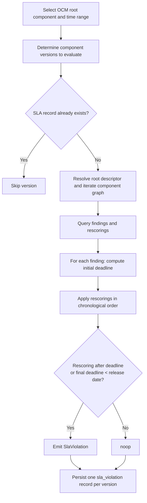

## What is the SLA Violation Profiler?

The SLA-Violation-Profiler is an ODG extension that derives auditable evidence of Service Level Agreement (SLA) compliance from findings that already exist in the ODG database. For a configured OCM root component, it recursively evaluates whether findings were resolved or rescored within the processing time the SLA permits, and persists the outcome as `sla_violation` records that can be queried for reporting and audits.

## Why does it exist?

Compliance obligations require software teams to demonstrate that findings were handled within agreed timeframes. Reconstructing this evidence manually for a past audit period is expensive: findings, rescorings, and release dates must be correlated across many component versions. The SLA-Violation-Profiler automates this correlation and produces a persistent, per-release verdict that can be replayed later without recomputing the underlying history.

## How it works

The profiler follows a two-step approach: recognise policy violations per component version, then materialise them as a single SLA record for the release.

### Scope

- **Input**: an OCM root component and either a specific version or a time range of versions to evaluate.
- **Output**: one `sla_violation` `ArtefactMetadata` record per evaluated root component version, containing the list of individual policy violations that remained open at that version's release date.
- **Persistence**: results are written back to the database through the ODG Core API.

### 1. Resolve versions to evaluate

For each configured component, the profiler determines the set of versions to scan:

- If a fixed `version` is configured, that version is used directly.
- Otherwise, the ODG Core API is queried for the most recent component versions within the configured `time_range`, bounded by `max_versions_limit`.

Versions for which an `sla_violation` record already exists in the delivery database are skipped. This makes the extension safe to re-run (idempotent): prior audits remain stable, and only new releases will be evaluated.

### 2. Collect findings and rescorings for the release

For each version, the profiler resolves the OCM root descriptor and traverses the component graph to collect the artefact identities of all transitively referenced components. It then queries the ODG Core API for:

- all finding records attached to any of these components; and
- all `rescoring` records that reference those findings.

The version's **release date** is taken from the root component's creation date.

### 3. Determine the effective deadline per finding

For each finding, an initial deadline is computed from its discovery date and its `allowed_processing_time`:

```text
deadline = discovery_date + allowed_processing_time
```

Findings without an `allowed_processing_time` are ignored, since no SLA applies. Findings whose `meta.creation_date` is later than the release date are also ignored, because they did not yet exist at the moment of release.

Rescorings created after the release date are discarded, as they represent knowledge the release could not have had. The remaining rescorings are sorted by creation date and applied in order. Each rescoring can shift the effective deadline in one of three ways:

- an explicit `due_date` on the rescoring becomes the new deadline;
- an updated `allowed_processing_time` is added to the original discovery date to produce a new deadline; or
- if neither is set, the deadline is cleared; a subsequent rescoring may reinstate it.

### 4. Detect policy violations

Two conditions produce a `SlaViolation` for a finding:

1. A rescoring was created **after** the current deadline had already passed — the SLA was breached before the finding was reassessed.
2. Once all rescorings have been applied, the final deadline still lies **before** the release date — the finding shipped in the release with an overdue SLA.

Each violation captures the type-specific identifying attributes of the underlying finding, the `referenced_type`, and the `ComponentArtefactId` the finding was attached to.

### 5. Persist one SLA record per release

All violations detected for a given root version are aggregated into a single `ArtefactMetadata` entry:

- `meta.datasource`: `sla-violation-profiler`
- `meta.type`: `sla_violation`
- `artefact`: the root component's `ComponentArtefactId`
- `data`: an `SlaViolations` object containing the list of `SlaViolation` entries; an empty list indicates a compliant release.

The records are pushed to the ODG Core API in a single `update_metadata` call at the end of the run.

### Evaluation flow



### Data model

The extension produces records of type `sla_violation` and datasource `sla-violation-profiler`. The `data` payload has the following shape:

- `SlaViolations`
  - `sla_violations`: list of
    - `SlaViolation`
      - `finding`: the type-specific identifying fields of the underlying finding
      - `referenced_type`: the datatype of the underlying finding (e.g. any `finding/*` datatype supported by the ODG data model)
      - `artefact`: the `ComponentArtefactId` the finding was attached to

See [Correlating metadata to OCM]() for the surrounding `ArtefactMetadata` model.

### Idempotency and re-runs

The extension is designed to run as a scheduled job. Because existing `sla_violation` records for a `(component_name, component_version)` pair suppress re-evaluation, re-runs process only those versions that have not yet been profiled. To re-evaluate a version after its underlying data has changed, the existing `sla_violation` record must first be removed from the delivery database. See [Run custom SQL commands in ODG]() for instructions on how to connect to the ODG database and execute SQL commands directly.

## Key properties

| Property | Description |
| --- | --- |
| Input | OCM root component with a version or time range |
| Output | One `sla_violation` `ArtefactMetadata` record per release |
| Idempotency | Existing records suppress re-evaluation; safe to re-run |
| Rescoring cutoff | Rescorings after the release date are discarded |
| Empty list | Indicates a compliant release (no violations) |
| Re-evaluation | Requires manual deletion of the existing `sla_violation` record |

## Relationship to other concepts

- [ODG System Architecture]() — describes how the profiler integrates as a scheduled extension
- [Correlating metadata to OCM]() — defines the `ArtefactMetadata` model used for both input findings and output `sla_violation` records
- [Reacting upon OCM events]() — the artefact enumerator manages component versions that the profiler evaluates

## When to use it

Refer to this document when:

- You need to **produce audit evidence** that findings were handled within SLA timeframes
- You are **debugging why a release shows SLA violations** and need to understand the rescoring logic
- You want to understand the **idempotency model** and when re-evaluation is triggered
- You need to **re-evaluate a version** after its underlying findings or rescorings changed

## Next steps

- [Deploying the Open Delivery Gear locally]()
- [Setting up a hybrid dev setup]()
- [Setup from scratch (macOS)]()

## Related documentation

- [ODG System Architecture]()
- [Correlating metadata to OCM]()
- [Reacting upon OCM events]()
- [Lifecycling GitHub Issues]()
- [Overwriting OCM component responsibles]()
- [Generating Software Bill of Materials]()
