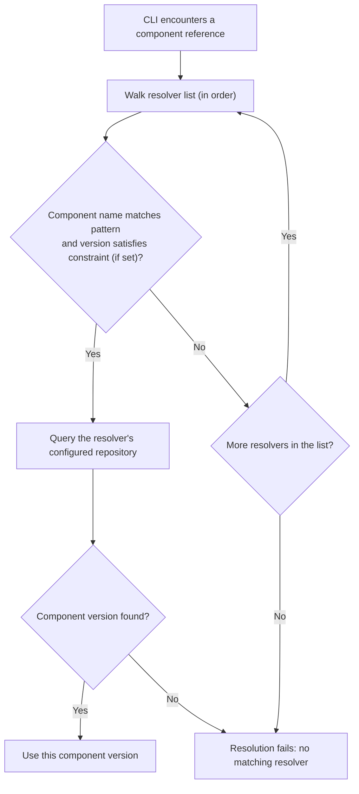

## Why Resolvers?

In OCM, a component can **reference** other components. For example, an `app` component might reference a `backend` and
a `frontend` component. These referenced components don't have to live in the same repository as the app — and in
practice, they often don't. Teams publish components independently, to different registries or repository paths.

This creates a problem: when you ask the CLI to recursively resolve a component graph, it needs to know **where** to
find each referenced component. The repository you pass on the command line only tells the CLI where to find the
**root** component. For everything else, the CLI needs a mapping from component names to repositories.

That's what resolvers provide.

## What Are Resolvers?

A resolver maps a **component name pattern** (glob) to an

*

*[OCM repository](https://github.com/open-component-model/ocm-spec/blob/main/doc/01-model/01-model.md#component-repositories)
**.
When the CLI encounters a component reference during recursive operations, it walks the list of configured resolvers,
finds the first pattern that matches the referenced component name, and queries the associated repository.



## Configuration

Resolvers are configured in the OCM configuration file (by default `$HOME/.ocmconfig`). Each resolver entry maps a
component name pattern and an optional version constraint to a repository. Resolvers are evaluated in order — the first
matching entry wins.

The repository field supports different repository types, including OCI registries and file-based CTF archives.
Component name patterns use common glob syntax (e.g., `*` for single-level, `**` for multi-level matching).
Resolver entries can also include an optional version constraint to restrict matching to specific semver ranges.


For the full configuration schema, supported repository types, and pattern syntax details, see the
[Resolver Configuration Reference]().


## Recursive Resolution

When a component version has references to other component versions (via `componentReferences`), the CLI can follow
these references recursively using the `--recursive` flag. The CLI uses resolvers to locate each referenced component
in its respective repository — without them, recursive resolution across multiple repositories is not possible.

## OCM Transfer

Resolvers play an important role in transferring component versions across registries. When transferring a component
graph with `--recursive`, the CLI uses resolvers to locate each referenced component so it can copy the entire graph
to the target repository. Combined with a local blob uploader configuration, this enables full transfers of component graphs —
including all referenced resources — across registry boundaries or even air-gapped environments.

For more information about OCM transfer, see the
[Transfer and Transport]() concept.

## Matching and Ordering

Resolver selection is deterministic and driven entirely by list order. The CLI walks
the resolver list top to bottom, and the **first entry whose `componentNamePattern`
matches the referenced component name** — and whose optional `versionConstraint` is
satisfied — wins. There is no probing, retrying, or priority: the outcome is decided by
the position of entries in the list alone.

### Glob syntax

`componentNamePattern` uses common glob syntax matched against the full component name:

- `*` matches a single path segment (it does not cross `/` separators).
- `**` matches across multiple levels.
- `?` matches a single character, and `[...]` matches a character class.
- A bare pattern such as `my-org.example/services` matches that name exactly. To match
  the name **and** everything beneath it, use `my-org.example/services{,/*}`; to match
  only the children, use `my-org.example/services/*`. A pattern of `*` matches every
  component name.

For the complete pattern syntax and supported repository types, see the
[Resolver Configuration Reference]().

### Ordering and specificity

Because the first match wins, **place more specific patterns before broader ones** so
the right repository is matched first. A hostname- or prefix-wide catch-all (for
example `componentNamePattern: "*"` pointing at a local CTF archive) belongs last, after
every targeted entry. When two entries could match the same name, the earlier one is
always used — reordering the list changes the resolution result.


This differs from the deprecated `ocm.config.ocm.software` fallback resolver, which
used priority-based ordering and probed every matching repository until one succeeded.
Glob-based resolvers never probe: they return the first matching repository
deterministically for both `get` and `add`. See
[Migrate Legacy Resolvers]()
for the migration procedure.


### Version-split repositories

When different versions of the same component live in different repositories, use the
`versionConstraint` field to route each version range to the correct repository. Each
entry can share the same `componentNamePattern` but restrict matching to a semver range,
so the first entry whose pattern **and** constraint match wins:

```yaml
- type: resolvers.config.ocm.software/v1alpha1
  resolvers:
    - repository:
        type: OCIRepository/v1
        baseUrl: new-registry.example
        subPath: current
      componentNamePattern: "my-org.example/*"
      versionConstraint: ">=2.0.0"
    - repository:
        type: OCIRepository/v1
        baseUrl: old-registry.example
        subPath: legacy
      componentNamePattern: "my-org.example/*"
      versionConstraint: "<2.0.0"
```

This reproduces, deterministically, the version spread that the deprecated fallback
resolver achieved through probe-and-retry. For the full version constraint syntax, see
[Version Constraints]().

## Next Steps

- [Add Component References]() — Hands-on walkthrough for
  declaring component references and setting up resolvers for shared and multi-registry setups
- [How-To: Migrate from Deprecated Resolvers]() —
  Replace deprecated fallback
  resolvers with glob-based resolvers

## Related Documentation

- [Reference: Resolver Configuration]() — Full schema,
  repository types, and pattern syntax
- [Canonical Component Repositories]() — Why references are location-free and how resolvers bridge the gap
- [Component Identity]() — Core concepts behind component versions,
  identities, and references
- [How-To: Transfer Components Across an Air Gap]() — Use OCM Transfer
  to move components between air-gapped environments
- [Tutorial: Understand Credential Resolution]() — Configure
  credentials for OCI registries
