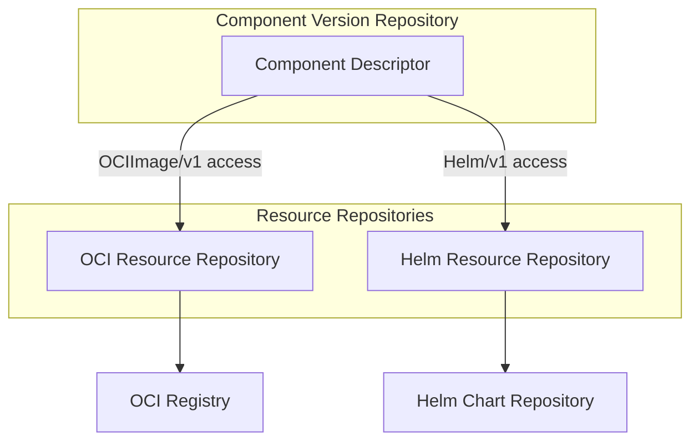

A component version describes a set of resources (container images, Helm charts, configuration files) but it does not necessarily store those resources itself. Resource repositories are the abstraction OCM uses to upload, download, and authenticate against the actual storage backends where resource artifacts live.

## Why Separate Resource Storage?

Component versions are stored in a component version repository (typically an OCI registry). Each component version contains a descriptor listing its resources, but the resources themselves may live somewhere else entirely: a different OCI registry, a Helm chart repository, or a cloud storage bucket.

This separation exists for practical reasons:

- **Resources predate component versions.** A container image often exists in a registry long before anyone wraps it in a component version. OCM needs to reference it where it already lives rather than requiring a copy.
- **Different storage, different protocols.** OCI images use the OCI distribution spec. Helm charts use HTTP index-based repositories or OCI. Future resource types may use entirely different protocols. A single abstraction cannot hide these differences, so each needs its own implementation.
- **Credentials differ per backend.** Accessing an OCI registry requires OCI credentials. Accessing a Helm repository requires Helm-style credentials. Resource repositories resolve the correct [credential consumer identity]() for each backend, integrating with OCM's [credential system]().

## How It Works

Every resource in a component descriptor carries an **access specification** with a `type` field (e.g., `OCIImage/v1`, `Helm/v1`). When OCM needs to download or upload a resource, it uses the access type to look up the matching resource repository in a plugin registry.

Each resource repository implements three operations:

1. **Resolve credential identity**: determine what credentials are needed to access the resource.
2. **Download**: fetch the resource content as a blob.
3. **Upload**: push resource content to the backend (not all backends support this).

OCM ships with built-in resource repositories for OCI artifacts and Helm charts. For the full technical details (supported access types, credential resolution rules, and per-repository capabilities), see the [Resource Repositories Reference]().

## Extensibility Through Plugins

Resource repositories are extensible through the [plugin system](). An external plugin can add support for new access types without modifying OCM itself. The plugin declares which access types it supports, and OCM routes requests to it automatically.

This means organizations can support proprietary artifact stores, custom download protocols, or specialized authentication flows by implementing a resource repository plugin.

## How Resource Repositories Fit Into Transfer

During [transfer](), resource repositories play a central role. When transferring with `--copy-resources`, OCM uses the source resource repository to download each resource artifact and the target resource repository to upload it. This is how a container image moves from one OCI registry to another or how a Helm chart gets re-hosted into a target environment.

Without resource repositories, transfer would only be able to copy component descriptors (metadata). Resource repositories make self-contained, air-gappable transfers possible.

## What's Next?

- [Reference: Resource Repositories](): complete technical reference for each built-in resource repository
- [Reference: Input and Access Types](): access type specifications that resource repositories handle

## Related Documentation

- [Concept: Credential System](): how credentials are resolved for resource access
- [Concept: Transfer and Transport](): how resource repositories enable artifact transfer
- [Concept: Plugin System](): how to extend OCM with custom resource repository plugins
