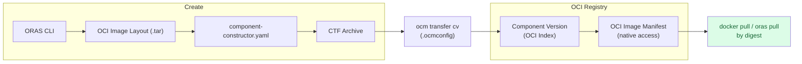

In this guide, you'll learn how to embed OCI artifacts as local blobs inside component versions, so that after a transfer they become natively accessible — pullable with standard OCI tools like `docker pull`, `oras pull`, or `crane`.

## What You'll Learn

- Create an OCI image layout using the ORAS CLI
- Embed an OCI image layout as a local blob in a component version
- Reference an external OCI image by value so it can be internalized during transfer
- Fetch an existing remote artifact with ORAS and embed it

## Scenario

You're packaging a microservice as an OCM component. The component includes a container image that must travel with the component — not just as a reference, but as an embedded artifact. When the component arrives at a target registry, you want the image to be pullable directly with standard OCI tooling, without needing the OCM CLI.

OCM v2 makes this possible through its [OCI-compatible index representation](https://github.com/open-component-model/ocm-spec/blob/main/doc/04-extensions/03-storage-backends/oci.md#62-index-representation). When a component version is stored in an OCI registry, native OCI artifacts (images, Helm charts, OCI image layouts) stored as local blobs are mapped to proper OCI manifests within the component version's index. This means they can be accessed directly by digest using any OCI-compliant client.

## How It Works



The component version is stored as an OCI index. Local blobs with OCI media types are stored as separate OCI manifests within that index, making them natively accessible by their digest.

## Prerequisites

- [OCM CLI installed]()
- [ORAS CLI](https://oras.land/docs/installation) installed (for embedding OCI image layouts)
- [jq](https://jqlang.org/) installed (for inspecting JSON)
- Access to an OCI registry (e.g. a local registry via `docker run -d -p 5001:5000 registry:2`)

## Authoring





In this use case, you create an OCI image layout from scratch using ORAS and embed it in a component version, ready to transfer to an OCI registry where it becomes natively accessible.





### Set up a working directory

```bash
mkdir -p /tmp/ocm-native-oci && cd /tmp/ocm-native-oci
```





### Create a sample artifact with ORAS

Create a simple file and package it as an OCI artifact using ORAS. This produces an OCI image layout on disk:

```bash
# Create sample content
echo '{"message": "hello from OCM"}' > artifact.json

# Create an OCI image layout directory using ORAS
mkdir -p oci-layout
oras push --oci-layout oci-layout:latest \
  --artifact-type application/vnd.example.config \
  artifact.json:application/json
```

Verify the layout was created:

```bash
ls oci-layout/
```

You should see the standard OCI image layout structure:

```text
blobs/
index.json
oci-layout
```





### Create the component constructor

Create a `component-constructor.yaml` that embeds the OCI image layout directory using the `dir/v1` input type:

```yaml
cat > component-constructor.yaml << 'EOF'
# yaml-language-server: $schema=https://ocm.software//schemas/bindings/go/constructor/schema-2020-12.json
components:
- name: github.com/acme.org/native-oci-demo
  version: 1.0.0
  provider:
    name: acme.org
  resources:
    - name: my-oci-artifact
      type: ociArtifact
      version: 1.0.0
      input:
        type: dir/v1
        path: ./oci-layout
        mediaType: application/vnd.ocm.software.oci.layout.v1+tar
EOF
```

Key points:

- The `type: dir/v1` input packs the directory into a tar archive and embeds it by value as a local blob
- The `mediaType: application/vnd.ocm.software.oci.layout.v1+tar` tells OCM this is an OCI image layout, not an opaque blob — the `dir/v1` input automatically produces the tar archive expected by this media type
- During `ocm add cv`, OCM unpacks the layout and stores the contained manifest directly — the resulting local blob has the native OCI media type (e.g. `application/vnd.oci.image.manifest.v1+json`), not the tar media type





### Build the component version {#build-embed}

```bash
ocm add cv
```

<details>
<summary>Expected output</summary>

```text
 COMPONENT                          | VERSION | PROVIDER
------------------------------------+---------+----------
 github.com/acme.org/native-oci-demo | 1.0.0   | acme.org
```

</details>





### Inspect the component version

Examine the component descriptor to see how the resource was stored:

```bash
ocm get cv ./transport-archive//github.com/acme.org/native-oci-demo:1.0.0 -o yaml
```

<details>
<summary>Expected output</summary>

```yaml
- component:
    name: github.com/acme.org/native-oci-demo
    provider: acme.org
    resources:
      - access:
          localReference: sha256:...
          mediaType: application/vnd.oci.image.manifest.v1+json
          type: LocalBlob/v1
        name: my-oci-artifact
        relation: local
        type: ociArtifact
        version: 1.0.0
    version: 1.0.0
  meta:
    schemaVersion: v2
```

</details>

Notice that the resource has `access.type: LocalBlob/v1` with the native OCI manifest media type. OCM recognized the OCI image layout during ingestion, unpacked it, and stored the manifest directly. The `localReference` contains the digest of the embedded manifest.









In this use case, you create a component version that references an external OCI image by value. The image stays external for now; during transfer it is internalized as a local blob.





### Set up a working directory {#setup-transfer}

```bash
mkdir -p /tmp/ocm-transfer-native && cd /tmp/ocm-transfer-native
```





### Create a component with an external image reference

Create a component that references an existing OCI image by reference (not by value):

```yaml
cat > component-constructor.yaml << 'EOF'
# yaml-language-server: $schema=https://ocm.software//schemas/bindings/go/constructor/schema-2020-12.json
components:
- name: github.com/acme.org/transfer-demo
  version: 1.0.0
  provider:
    name: acme.org
  resources:
    - name: app-image
      type: ociImage
      version: 1.0.0
      access:
        type: ociArtifact
        imageReference: ghcr.io/stefanprodan/podinfo:6.9.1
EOF
```

Build the component version:

```bash
ocm add cv
```





### Inspect the external reference

```bash
ocm get cv ./transport-archive//github.com/acme.org/transfer-demo:1.0.0 -o yaml
```

<details>
<summary>Expected output</summary>

```yaml
- component:
    name: github.com/acme.org/transfer-demo
    provider: acme.org
    resources:
      - access:
          imageReference: ghcr.io/stefanprodan/podinfo:6.9.1@sha256:...
          type: ociArtifact
        name: app-image
        relation: external
        type: ociImage
        version: 1.0.0
    version: 1.0.0
  meta:
    schemaVersion: v2
```

</details>

The image is referenced externally — it still lives in `ghcr.io`. The component descriptor only stores the reference.









In this use case, you fetch an existing OCI artifact from a remote registry using ORAS and embed it into a component version.





### Set up a working directory {#setup-fetch}

```bash
mkdir -p /tmp/ocm-fetch-oci && cd /tmp/ocm-fetch-oci
```





### Fetch the OCI artifact with ORAS

Pull an existing artifact from a remote registry into a local OCI image layout:

```bash
mkdir -p oci-layout
oras copy ghcr.io/stefanprodan/podinfo:6.9.1 --to-oci-layout oci-layout:latest
```





### Create the component constructor {#constructor-fetch}

```yaml
cat > component-constructor.yaml << 'EOF'
components:
- name: github.com/acme.org/fetched-oci-demo
  version: 1.0.0
  provider:
    name: acme.org
  resources:
    - name: app-image
      type: ociArtifact
      version: 1.0.0
      input:
        type: dir/v1
        path: ./oci-layout
        mediaType: application/vnd.ocm.software.oci.layout.v1+tar
EOF
```





### Build the component version {#build-fetch}

```bash
ocm add cv
```









## Check Your Understanding


The media type (`application/vnd.ocm.software.oci.layout.v1+tar`) tells OCM that the blob contains a valid OCI image layout. During `ocm add cv`, OCM unpacks the tar, extracts the manifests and layers, and stores them as native OCI objects. The resulting local blob has the native OCI media type (e.g. `application/vnd.oci.image.manifest.v1+json`). Without the correct media type, OCM would store the tar as an opaque layer that cannot be accessed natively.



You now have one or more component versions with embedded (or externally referenced) OCI artifacts in `./transport-archive`.
To transfer them to an OCI registry, internalize external references as local blobs, and pull the artifacts natively with
standard OCI tooling, continue with
[Pull OCI Artifacts Natively]().
Keep this terminal and the `/tmp/ocm-native-oci`, `/tmp/ocm-transfer-native`, and `/tmp/ocm-fetch-oci` workspaces open; the next guide picks up where this one ends.


## Related Documentation

- [Concept: Transfer and Transport]() — Understand resource handling during transfer
- [Reference: Input and Access Types]() — All supported resource types
- [OCM OCI Storage Spec: Index Representation](https://github.com/open-component-model/ocm-spec/blob/main/doc/04-extensions/03-storage-backends/oci.md#62-index-representation) — How component versions map to OCI indexes
