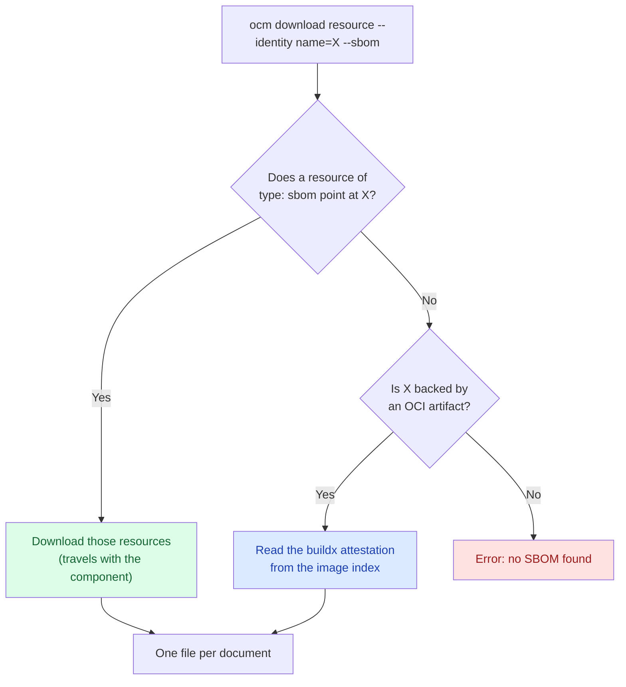

A component version tells you *which artifacts* you deliver. It does not tell you *what is inside* them. That answer
lives in a Software Bill of Materials. Today, SBOMs might be located in various places, and we need a way to unify them
and get all of them together to one location. For the why, see [Software Bills of Materials]().

In this guide you build a component version that ships a binary and a third-party image. You generate the SBOM for the
binary yourself and link it durably, while the image already carries an SBOM that `docker buildx build --sbom=true`
attached. Retrieving both — and confirming they survive a transfer — is covered in the companion transfer guide.


`ocm download resource --sbom` is experimental. What is discovered, how it is written out, and the flag itself may
change in a future release depending on user feedback to offer a better UX.


## What You'll Learn

- Link an SBOM you produced yourself to the resource it describes, using the `ocm.software/artifact-references` label
- Prepare an OCI image whose SBOM `docker buildx build --sbom=true` already attached
- Build a component version that carries both into a CTF archive

**Estimated time:** ~15 minutes

## Scenario

We'll create a component version consisting of two things: a CLI binary, and the
[podinfo](https://github.com/stefanprodan/podinfo) image, which you consume as-is from a third party.

Let's try to identify if *CVE-2026-56854* is out, and we are affected by it. SBOMs live in many locations, and OCM helps
in identifying them and bringing them in to one place.

- Nothing is attached to your binary. You generate its SBOM yourself and have to say, somewhere durable, which resource
  it describes.
- `podinfo` already has an SBOM, attached by BuildKit when it was built. Nobody has to generate anything, but you do
  have to know where to look.

OCM has you covered.

## How It Works

`ocm download resource --sbom` tries two strategies currently, in order, and the first one that finds anything, wins.



**Strategy 1, the artifact-references label.** A resource of `type: sbom` has a label naming the resource it
describes. Because the link is an ordinary label on an ordinary resource, it is part of the component descriptor. It
gets signed, and it goes wherever the component version is transferred to. This ensures that the SBOM and the reference
are both part of the signature therefore, are immutable without a signature change.

**Strategy 2, the buildx attestation.** For a resource backed by an OCI artifact, OCM reads the image index and looks
for the attestation manifests BuildKit creates next to each platform's image. Nothing has to be added to the component
version at all. The index is read from wherever the resource currently lives: the origin registry while the access is
still an `OCIImage/v1`, or the component version's own storage once a by-value transfer has copied it in.


Only the BuildKit layout is understood right now. SBOMs attached by cosign, or published through the OCI referrers API, are not
discovered at this time. You can read more about BuildKit attestation at [SBOM attestations](https://docs.docker.com/build/metadata/attestations/sbom/).


## Prerequisites

- [OCM CLI installed]() at a version that has
  `ocm download resource --sbom`
- [`syft`](https://github.com/anchore/syft) to generate an SBOM for the binary
- `jq`, for inspecting documents
- Network access to `ghcr.io`

## Steps

### Set up the workspace

```bash
mkdir -p /tmp/ocm-sbom-tutorial && cd /tmp/ocm-sbom-tutorial
```

We'll be using the ocm CLI itself as the binary. Point at wherever it is installed, and remember the workspace:

```bash
export OCM_CLI_LOCATION="$(command -v ocm)"
export WORKSPACE="$PWD"
```

Both are read by the component constructor further down.

### Generate an SBOM for the binary

Let's create an SBOM for the above binary.

```bash
syft scan "file:$OCM_CLI_LOCATION" -o spdx-json > ocm-cli.spdx.json
```

Check that you got a document with packages in it:

```bash
jq '{spdxVersion, name, packages: (.packages | length)}' ocm-cli.spdx.json
```

```json5
{
  "spdxVersion": "SPDX-2.3",
  "name": "ocm",
  "packages": 108 // this may vary
}
```

### Describe the component version

Create `component-constructor.yaml` with three resources: the binary, the SBOM that describes it, and the image.

```yaml
components:
  - name: ocm.software/examples/sbom-demo
    version: 1.0.0
    provider:
      name: ocm.software

    resources:
      - name: ocm-cli
        type: blob
        version: 1.0.0
        input:
          type: File/v1
          path: ${OCM_CLI_LOCATION}
          mediaType: application/octet-stream

      # Using artifact-references, link back to the binary by label.
      - name: ocm-cli-sbom
        type: sbom
        version: 1.0.0
        labels:
          - name: ocm.software/artifact-references
            signing: true
            value:
              - identity:
                  name: ocm-cli
        input:
          type: File/v1
          path: ${WORKSPACE}/ocm-cli.spdx.json
          mediaType: application/spdx+json

      # This is the reference to podinfo that has been built using buildx.
      - name: podinfo
        type: ociImage
        version: 6.9.2
        relation: external
        access:
          type: OCIImage/v1
          imageReference: ghcr.io/stefanprodan/podinfo:6.9.2
```

Explanation on how the `ocm-cli-sbom` is structured:

- **`type: sbom`**: a resource pointing at the binary with any other type is skipped.
- **`ocm.software/artifact-references`**: This label's value is a *list*, so one SBOM can describe
  several resources.
- **`identity.name`**: `name` is required and must match. `version` is optional: leave it out, as above, and any
  version of `ocm-cli` matches, which means you do not have to touch the label on every release. Any other key you add
  is treated as an extra identity attribute and MUST match the target's extra identity `exactly`.

Build it into a CTF archive:

```bash
ocm add cv --working-directory /
```

```text
 COMPONENT                       │ VERSION │ PROVIDER
─────────────────────────────────┼─────────┼──────────────
 ocm.software/examples/sbom-demo │ 1.0.0   │ ocm.software
```

Without `--repository`, this writes a CTF into `./transport-archive`, which is what the companion transfer guide reads
from. `File/v1` only reads files inside the working directory, that defaults to the constructor file's directory. Using
`--working-directory /` allows reading the ocm binary on your `PATH`.

Let's verify that the label is now part of the component descriptor:

```bash
ocm get cv ./transport-archive/ -o yaml | grep -A6 artifact-references
```

```yaml
      - name: ocm.software/artifact-references
        signing: true
        value:
        - identity:
            name: ocm-cli
```

This means, that the label's value is now immutable as it is part of the signature.


You now have a component version with a linked SBOM in `./transport-archive`.
To retrieve, collect, scan, and verify SBOMs survive a transfer, continue with
[Download SBOMs]().
Keep this terminal and the `/tmp/ocm-sbom-tutorial` workspace open, the next guide picks up where this one ends.


## Related Documentation

- [Reference: Input and Access Types]() - `File/v1`, `OCIImage/v1`, and what a local blob uploader turns them into
- [Concept: Software Bills of Materials]() - What an SBOM is and why OCM binds it to the component version
- [Blog: Shipping SBOMs with Your Components](/blog/2026-07-28-shipping-sboms-with-your-components/) - The proof of concept this feature grew out of
