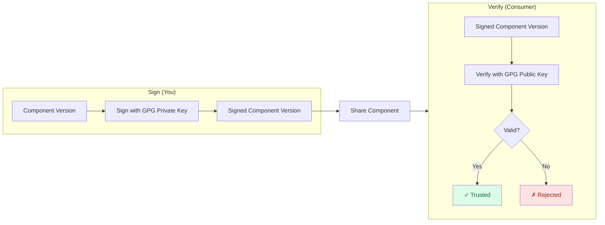

In this tutorial, you'll sign a component version with a GPG private key and verify it with the corresponding public key.
By the end, you'll understand how to use OpenPGP (GPG) signatures with OCM for component authenticity and integrity.

## What You'll Learn

- Create a GPG key pair for signing and verification
- Export ASCII-armored public and private keys
- Configure OCM credentials for GPG signing
- Sign a component version in a CTF archive
- Verify the GPG signature

**Estimated time:** ~15 minutes

## Scenario

You're a software engineer who manages components and uses GPG keys (the same keys used for signing Git commits or releases) to sign OCM component versions.
This lets consumers verify that:

1. **The component is authentic** — it comes from you, not an imposter
2. **The component has integrity** — it hasn't been tampered with since signing

## How It Works



The producer signs the component version with a GPG private key, creating an ASCII-armored OpenPGP detached signature.
Consumers verify using the corresponding public key to confirm authenticity and integrity.

## Prerequisites

- [OCM CLI installed]()
- [GnuPG](https://gnupg.org/download/) 2.2 or later installed (`gpg` binary available in `$PATH`); OCM runs it to sign and verify
- A component version to sign (we'll create one if you don't have one)

## Steps





### Create a sample component (if needed)

If you already have a component version in a CTF archive,
e.g. by following our [Create a Component Version]() guide, skip to the next step.

Create a simple helloworld component:

```bash
# Create a directory for the tutorial
mkdir -p /tmp/ocm-gpg-tutorial && cd /tmp/ocm-gpg-tutorial

# Create a basic `component-constructor.yaml` without any resources:
cat > component-constructor.yaml << 'EOF'
components:
- name: github.com/acme.org/helloworld
  version: 1.0.0
  provider:
    name: acme.org
EOF

# Create component version in a CTF archive located at ./transport-archive
ocm add cv
```

You should see that the component version was created successfully.

<details>
<summary>Expected output</summary>

```text
 COMPONENT                      │ VERSION │ PROVIDER
────────────────────────────────┼─────────┼──────────
 github.com/acme.org/helloworld │ 1.0.0   │ acme.org
```

</details>




### Generate a GPG key pair

Create a directory for your keys and generate a GPG key pair:

```bash
# Create a directory for the generated keys
mkdir -p /tmp/ocm-gpg-tutorial/keys

# Non-interactive batch generation (RSA 4096, no expiry, no passphrase protection)
gpg --batch --gen-key << 'EOF'
%no-protection
Key-Type: RSA
Key-Length: 4096
Subkey-Type: RSA
Subkey-Length: 4096
Name-Real: OCM Tutorial Key
Name-Email: ocm-tutorial@example.com
Expire-Date: 0
%commit
EOF
```

Verify the key was created and note the fingerprint:

```bash
gpg --list-secret-keys --keyid-format=long
```

<details>
<summary>Expected output</summary>

```text
sec   rsa4096/ABCDEF1234567890 2026-01-01 [SC]
      AABBCCDDEEFF00112233445566778899AABBCCDD
uid           [ultimate] OCM Tutorial Key <ocm-tutorial@example.com>
ssb   rsa4096/1122334455667788 2026-01-01 [E]
```

The 40-character string (`AABBCCDDEEFF00112233445566778899AABBCCDD`) is your key fingerprint.
You'll need it if you want to pin a specific key when your keyring contains multiple keys.

</details>


Never commit it to version control or share it.


For more details, see [How-to: Generate Signing Keys]().




### Export the keys to files

Export the private and public keys as ASCII-armored files that OCM can load:

```bash
# Export private key — replace FINGERPRINT with the fingerprint from the previous step
gpg --export-secret-keys --armor FINGERPRINT > /tmp/ocm-gpg-tutorial/keys/signing-key.asc

# Export public key
gpg --export --armor FINGERPRINT > /tmp/ocm-gpg-tutorial/keys/verify-key.asc

# Secure the private key file
chmod 600 /tmp/ocm-gpg-tutorial/keys/signing-key.asc
```

Verify both files exist:

```bash
ls -la /tmp/ocm-gpg-tutorial/keys/*.asc
```





### Configure signing credentials

Create a new `.ocmconfig` in the current directory and copy the content below to it, to tell OCM where to find your keys.
If you already have a `$HOME/.ocmconfig` file you can skip creating a new one and just add the credential configuration to your existing file.

The same file also selects the GPG signing handler.
Unlike RSA (the default when no signer is configured), GPG has to be selected explicitly.

A detailed How-To guide is available here: [How-to: Configure Signing Credentials]().

```bash
touch /tmp/ocm-gpg-tutorial/.ocmconfig

cat > /tmp/ocm-gpg-tutorial/.ocmconfig << 'EOF'
type: generic.config.ocm.software/v1
configurations:
  - type: credentials.config.ocm.software
    consumers:
      - identity:
          type: GPG/v1alpha1
          signature: default
        credentials:
          - type: GPGCredentials/v1alpha1
            privateKeyPGPFile: /tmp/ocm-gpg-tutorial/keys/signing-key.asc
            publicKeyPGPFile: /tmp/ocm-gpg-tutorial/keys/verify-key.asc
  - type: signing.config.ocm.software/v1alpha1
    signer:
      type: GPGSigningConfiguration/v1alpha1
    verifier:
      type: GPGSigningConfiguration/v1alpha1
EOF
```

> 👉 The `signature: default` name is used when you don't specify `--signature` on the command line.

To pin a specific key when the keyring contains multiple keys, add one line _keyFingerprint_ in the above config.

```yaml
  - type: signing.config.ocm.software/v1alpha1
    signer:
      type: GPGSigningConfiguration/v1alpha1
      keyFingerprint: AABBCCDDEEFF00112233445566778899AABBCCDD   # added
```

#### Use GPG for one signature only

To keep RSA elsewhere and use GPG for a single named signature, add a `signature` field to the signer entry. GPG then applies only to `ocm sign cv --signature gpg-release`, and everything else falls back to the default RSA signer:

```yaml
  - type: signing.config.ocm.software/v1alpha1
    signature: gpg-release                                     # added
    signer:
      type: GPGSigningConfiguration/v1alpha1
```

#### Sign with a key from your own GnuPG keyring

The config above takes the key material from the GPG credentials (`keySource: credentials`, the default). To sign with a key from your own GnuPG keyring instead (`$GNUPGHOME`, or `~/.gnupg`), including keys on a hardware token such as a YubiKey, set `keySource: keyring`. OCM then uses your running `gpg-agent`, which unlocks the key from its cache, via pinentry, or with a `passphrase` from the credentials.

Key material in the GPG credentials is rejected with `keySource: keyring`, so it is never ambiguous which key signs. Remove `privateKeyPGPFile` and `publicKeyPGPFile` (or `privateKeyPGP` and `publicKeyPGP`) from the GPG consumer entry. Keep the entry only if you pass a `passphrase`; otherwise remove it entirely:

```yaml
type: generic.config.ocm.software/v1
configurations:
  - type: credentials.config.ocm.software
    consumers:
      - identity:
          type: GPG/v1alpha1
          signature: default
        credentials:
          - type: GPGCredentials/v1alpha1
            passphrase: my-secret-passphrase                   # optional; key files removed
  - type: signing.config.ocm.software/v1alpha1
    signer:
      type: GPGSigningConfiguration/v1alpha1
      keySource: keyring                                       # added
      keyFingerprint: AABBCCDDEEFF00112233445566778899AABBCCDD
```

Without `keyFingerprint`, gpg signs with its default key. Every `gpg` invocation times out after 3 minutes, which includes waiting for pinentry or a touch on a hardware token.

For more details, see [How-to: Configure Signing Credentials]().




### Sign the component version

Sign your component with the GPG private key. The GPG handler comes from the signing entry in the config:

```bash
ocm sign cv ./transport-archive//github.com/acme.org/helloworld:1.0.0 \
  --config /tmp/ocm-gpg-tutorial/.ocmconfig
```

The same command works against a remote OCI registry, point it at the registry reference instead of the local archive:

```bash
ocm sign cv ghcr.io/<your-namespace>//github.com/acme.org/helloworld:1.0.0 \
  --config /tmp/ocm-gpg-tutorial/.ocmconfig
```

<details>
<summary>Expected output</summary>

```text
digest:
  hashAlgorithm: SHA-256
  normalisationAlgorithm: jsonNormalisation/v4alpha1
  value: 4e376182b3d535143e8e009b1e467df3a5b0c1f912c71ae432200654c355606f
name: default
signature:
  algorithm: GPG
  mediaType: application/vnd.ocm.signature.gpg
  value: |-
    -----BEGIN PGP SIGNATURE-----
    ...
    -----END PGP SIGNATURE-----

time=... level=INFO msg="signed successfully" name=default digest=4e376182b3d535143e8e009b1e467df3a5b0c1f912c71ae432200654c355606f hashAlgorithm=SHA-256 normalisationAlgorithm=jsonNormalisation/v4alpha1
```

</details>

Verify the signature was added:

```bash
ocm get cv ./transport-archive//github.com/acme.org/helloworld:1.0.0 -o yaml | grep -A 10 signatures:
```

You should see a `signatures:` section with algorithm `GPG` and a PGP signature block.





### Verify right after signing

Verify the signature using the public key. The GPG handler comes from the `verifier` field of the same config entry:

```bash
ocm verify cv ./transport-archive//github.com/acme.org/helloworld:1.0.0 \
  --config /tmp/ocm-gpg-tutorial/.ocmconfig
```

<details>
<summary>Expected output</summary>

```text
time=... level=INFO msg="verifying signature" name=default
time=... level=INFO msg="signature verification completed" name=default duration=...
time=... level=INFO msg="SIGNATURE VERIFICATION SUCCESSFUL"
```

</details>

> ✅ **Success!** ✅  
> The component version is verified as authentic and unmodified.




## Verify a GPG signature

The tutorial above verifies right after signing, with the same `.ocmconfig`. This section is for the **consumer side**: you received a GPG-signed component version and the signer's public key, and you want to confirm authenticity. You need the signer's public key on disk and pointed at by `publicKeyPGPFile` in `.ocmconfig`, or present in your GnuPG keyring. With Sigstore (see [Sign with Sigstore]()) you don't install a public key at all, you just declare which identity you trust.

### Point `.ocmconfig` at the signer's public key

If you signed locally, the same `.ocmconfig` you wrote above already works, skip to the verify command.

If you're verifying a signature **someone else** produced, follow [How-To: Configure Signing Credentials → GPG]() using only the signer's public key (`publicKeyPGPFile`); the `privateKeyPGPFile` entry is not needed for verification.

Verification takes the handler from `.ocmconfig`, so put the `type: GPGSigningConfiguration/v1alpha1` under the `verifier` field. RSA is the default when no verifier is configured, so this is what tells `ocm verify` to use GPG:

```yaml
- type: signing.config.ocm.software/v1alpha1
  signer:
    type: GPGSigningConfiguration/v1alpha1
  verifier:
    type: GPGSigningConfiguration/v1alpha1                     # added
```

If you are only verifying, the `signer` field can be left out entirely:

```yaml
- type: signing.config.ocm.software/v1alpha1
  verifier:
    type: GPGSigningConfiguration/v1alpha1
```

If the signer's public key is already in your GnuPG keyring (`$GNUPGHOME`, or `~/.gnupg`), verify against the keyring instead of a key file by setting `keySource: keyring`. The keyring may hold many keys, so this requires the **full** fingerprint of the key you trust; a signature by any other key in the keyring fails. Keys revoked or expired in your keyring are rejected, and gpg never fetches keys from the network during verification.

Key material in the GPG credentials is rejected with `keySource: keyring`, and verification needs no passphrase. Remove the GPG consumer entry with `publicKeyPGPFile` (or `privateKeyPGPFile`) from `.ocmconfig`; the verifier entry is all you need:

```yaml
type: generic.config.ocm.software/v1
configurations:
- type: signing.config.ocm.software/v1alpha1
  verifier:
    type: GPGSigningConfiguration/v1alpha1
    keySource: keyring
    keyFingerprint: B118BE3A32BE4AF28E37E881167C7102F8AC81E4
```


Give the entry a `signature` field to scope it to a single signature; without one it applies to every signature. Because the verifier is resolved per signature, a component carrying a GPG signature next to an RSA one can be verified in a single run, each with its own handler.



`signature: default` applies to a signature *named* `default`; it is not a catch-all for an omitted `--signature` flag. If the signature was created with `--signature <name>`, set the same value in the consumer identity.



Consumer identities are matched **exactly**. Credentials are looked up under the name of the signature being verified, so a `signature: default` entry does not serve a signature named `prod`, and an entry with no `signature` field at all matches nothing. Give every signature its own consumer entry, otherwise a run without `--signature` fails on the signatures that have no matching credential.


### Run the verify command

The GPG handler comes from the `verifier` field of the config entry.

```bash
ocm verify cv \
  /tmp/helloworld/transport-archive//github.com/acme.org/helloworld:1.0.0
```

<details>
<summary>Expected output</summary>

```text
time=2026-06-15T12:03:39.929+02:00 level=INFO msg="verifying signature" name=default
time=2026-06-15T12:03:39.930+02:00 level=INFO msg="signature verification completed" name=default duration=894.458µs
time=2026-06-15T12:03:39.930+02:00 level=INFO msg="SIGNATURE VERIFICATION SUCCESSFUL"
```

</details>

The command exits with status code `0` on success.

### Verify a specific signature

If the component carries multiple signatures (e.g. a GPG signature alongside an RSA one), select the one to verify by name:

```bash
ocm verify cv \
  --signature prod \
  /tmp/helloworld/transport-archive//github.com/acme.org/helloworld:1.0.0
```

Without `--signature`, **every** signature on the descriptor is verified. Configuration and credentials are resolved separately for each one, under that signature's own name.

## What You've Learned

Congratulations! You've successfully:

- ✅ Generated a GPG key pair for signing and verification
- ✅ Exported the keys to ASCII-armored files
- ✅ Configured OCM to use your keys via `.ocmconfig`
- ✅ Configured the GPG signer and verifier to select the GPG handler
- ✅ Signed a component version with your GPG private key
- ✅ Verified the signature using the public key

## Troubleshooting

### Symptom: `Error: signing failed: private key not found in credentials`

**Cause:** No matching `GPG/v1alpha1` consumer entry in `.ocmconfig`, either the consumer block is missing, the `signature:` name doesn't match `--signature`, or `privateKeyPGPFile` isn't set.

**Fix:** Confirm the consumer block exists and the `signature:` value matches. Without `--signature`, OCM looks for `signature: default`. See [How-to: Configure Signing Credentials]().

### Symptom: `Error: signing failed: private key not found` (preceded by `no signer configured, using default`)

**Cause:** No signing entry in `.ocmconfig`. OCM defaulted to RSA, then couldn't find an RSA private key.

**Fix:** Add the `signing.config.ocm.software/v1alpha1` entry with the GPG signer, as shown in the configuration step. If the entry has a `signature` field, it only applies when `--signature` names that same signature.

### Symptom: `Error: signature "default" already exists`

**Cause:** The component version already carries a signature with that name.

**Fix:** Pass `--force` to overwrite, or pick a different `--signature <name>` to add a second signature alongside the first.

### Symptom: `Error: --signer-spec is no longer supported ...`

**Cause:** The signer used to be passed as a file. It now lives in the OCM configuration.

**Fix:** Move the contents of the old spec file under the `signer` field of a `signing.config.ocm.software/v1alpha1` entry and drop the flag.

### Symptom: `GPG signing requires the GnuPG "gpg" binary (>= 2.2.0) on PATH`

**Cause:** OCM delegates all OpenPGP operations to GnuPG, and no `gpg` binary was found on `PATH`.

**Fix:** Install GnuPG 2.2 or later (`brew install gnupg`, `sudo apt-get install gnupg`, `sudo dnf install gnupg2`) and make sure `gpg` is on `PATH`.

### Symptom: `with GODEBUG=fips140=only, GPG signing and verification require a gpg whose libgcrypt runs in FIPS mode`

**Cause:** OCM runs with `GODEBUG=fips140=only`, and the `libgcrypt` of your `gpg` does not run in FIPS mode (`gpgconf --show-versions` reports `fips-mode:n`), or `gpgconf` is not on `PATH`.

**Fix:** Use a GnuPG whose `libgcrypt` runs in FIPS mode, see [FIPS 140-3: GPG](#gpg), or run OCM without `fips140=only`.

### Symptom: `SIGNATURE VERIFICATION FAILED: gpg verify failed: exit status 2` with `Can't check signature: No public key`

**Cause:** The public key in `.ocmconfig` doesn't match the key that signed, most often because you exported a different key, or the signer rotated their key after signing.

**Fix:** Confirm `publicKeyPGPFile` points at the verifier-key file the signer actually shared. If you signed locally, re-run the export step above to regenerate `verify-key.asc` from the same fingerprint.

### Symptom: `SIGNATURE VERIFICATION FAILED: load GPG public key: load public key: open ...: no such file or directory`

**Cause:** The `publicKeyPGPFile` path in `.ocmconfig` doesn't exist on disk.

**Fix:** Check the path is correct and readable. Absolute paths avoid working-directory surprises.

### Symptom: `SIGNATURE VERIFICATION FAILED: signature was made by key ... which does not match the configured key fingerprint "..."`

**Cause:** The verifier contains a `keyFingerprint` that matches neither the key that made the signature nor its primary key.

**Fix:** Either remove `keyFingerprint` from the verifier (any key in the file will be tried) or correct it. Run `gpg --show-keys /tmp/keys/verify-key.asc` to confirm the actual fingerprint.

### Symptom: `SIGNATURE VERIFICATION FAILED: verifying with the GnuPG keyring requires the full key fingerprint ...`

**Cause:** The verifier sets `keySource: keyring` without a full 40-character `keyFingerprint`. A long key ID is not accepted, because it does not identify a key reliably among all keys in a keyring.

**Fix:** Set `keyFingerprint` to the full fingerprint of the key you trust (`gpg --fingerprint <key>`; spaces and a `0x` prefix are accepted).

## Best Practices for Production

Now that you understand the workflow, here are key practices for production environments:

- **Reuse existing GPG keys** — If you already sign Git tags or release artifacts with a GPG key, the same key works for OCM.
- **Protect private keys** — Use a hardware token (YubiKey, OpenPGP card) or a passphrase-protected key; OCM supports the `passphrase` credential property.
- **Rotate keys periodically** — OCM supports multiple signatures per component version to ease key transitions.
- **Distribute public keys securely** — Publish your public key to a key server (e.g. `keys.openpgp.org`) or share via a trusted channel.
- **Verify before deployment** — Make signature verification a mandatory step in your deployment pipeline.
- **Pin key fingerprints**: use `keyFingerprint` on the signer to constrain signing. Set it on the `verifier` to constrain verification.

## Check Your Understanding


The OCM CLI defaults to the RSA handler when no signer is configured.
GPG has a different configuration type (`GPGSigningConfiguration/v1alpha1`) that must be specified explicitly.
A signing entry carrying just that type is enough to select the GPG handler.



Both sign the component descriptor digest, but they differ in key format and signature encoding:

- **RSA** uses PEM-encoded keys (PKCS#1 / PKCS#8) and produces a raw hex or PEM-wrapped signature.
- **GPG** uses ASCII-armored OpenPGP keyring files and produces an ASCII-armored OpenPGP detached signature.

GPG is a natural fit if you already manage GPG keys for code signing or release workflows.



Yes. Add the `passphrase` property to your credentials block:

```yaml
credentials:
  - type: GPGCredentials/v1alpha1
    privateKeyPGPFile: /path/to/signing-key.asc
    publicKeyPGPFile: /path/to/verify-key.asc
    passphrase: my-secret-passphrase
```

OCM passes the passphrase to `gpg` on standard input; it is never written to disk. GnuPG unlocks the key in a temporary GnuPG home directory, which OCM removes after each operation.



Yes. Each signature has a distinct `name`. Use `--signature <name>` when signing to create named signatures, and OCM will store all of them on the component version.



## Cleanup

Remove the tutorial artifacts:

```bash
rm -rf /tmp/ocm-gpg-tutorial
```

## Next Steps

- [Tutorial: Plain RSA Signatures]() — Sign with raw RSA keys instead of GPG.
- [Tutorial: PEM-encoded Signatures]() — Use X.509 certificate chains with RSA for enterprise PKI trust.
- [How-to: Generate Signing Keys]() — Step-by-step creating key pairs.
- [How-to: Configure Signing Credentials]() — Set up OCM to use your keys for signing and verification.

## Related Documentation

- [Concept: Signing and Verification]() — Understand the theory behind OCM signing
