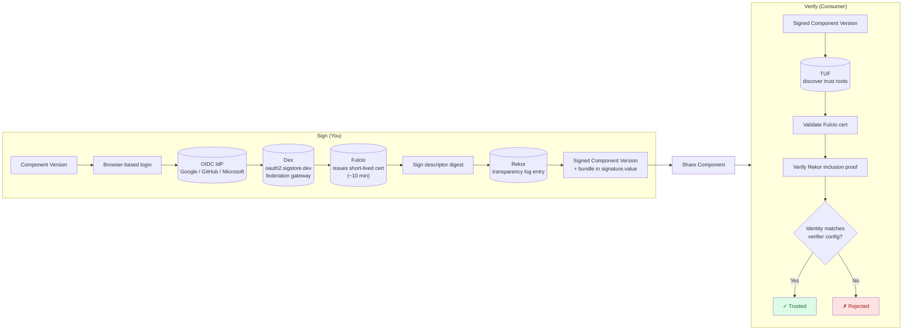

In this tutorial you'll sign a component version with [Sigstore](https://www.sigstore.dev/) and verify it again — without generating a key pair.
Your OIDC identity (Google, GitHub, or Microsoft) is what proves authorship, and a verifier only needs to know which identity to trust.

For the conceptual background — what Fulcio, Rekor, and TUF each do, and how identity-based trust differs from key pinning —
see [Concept: Sigstore (Keyless)]()
and [Concept: Identity-Based Trust]().

## What You'll Learn

- Configure OCM to use your OIDC identity as a signing credential
- Sign a component version with `ocm sign cv` against public Sigstore
- Read the recorded identity out of a Sigstore signature
- Verify the signature by declaring whose identity you trust

**Estimated time:** ~10 minutes

## How It Works



On the sign side: you log in at your OIDC provider, Dex relays the federated token to Fulcio, Fulcio issues a short-lived certificate bound to your identity, OCM signs the descriptor digest with the ephemeral key, and Rekor records the entry in its transparency log. The signature, certificate, and inclusion proof are bundled into the component descriptor.

On the verify side: TUF supplies the current trust roots, OCM validates the Fulcio certificate, checks the Rekor inclusion proof, and matches the certificate's identity against the configured verifier. The consumer doesn't need a public key — they declare which OIDC identity they trust, and OCM checks that the signature was made by that identity.

## Prerequisites

- [OCM CLI installed]()
- A web browser on the same machine — signing opens a browser window for OIDC login
- An account at one of {Google, GitHub, Microsoft} — public Sigstore federates with these
- Network access to `*.sigstore.dev` — corporate firewalls sometimes block these
- A component version to sign (we'll create one if you don't have one)
- Optional: `yq`and `jq` for inspecting the signature bundle (not required for signing or verification)


The OCM CLI invokes the `cosign` binary (v3.0.4 or later) under the hood. If it's not on your PATH, OCM downloads and
caches it under `~/.cache/ocm/cosign/...` on first use. Subsequent runs skip the download. To keep Sigstore signing
inside the FIPS 140-3 boundary, put a cosign built against the Go Cryptographic Module on your PATH instead; with
`GODEBUG=fips140=only`, OCM requires one. See the [FIPS reference](#sigstore-and-cosign).


## Scenario

- **Component:** `github.com/acme.org/helloworld:1.0.0` in a local CTF archive
- **Working directory:** `/tmp/ocm-sigstore-tutorial`
- **Signer identity:** your OIDC login at Google, GitHub, or Microsoft

## Steps





### Create a sample component (if needed)

If you already have a component version in a CTF archive, e.g. by following our [Create a Component Version]() guide, skip to the next step.

Otherwise create a small helloworld component:

```bash
mkdir -p /tmp/ocm-sigstore-tutorial && cd /tmp/ocm-sigstore-tutorial

cat > component-constructor.yaml << 'EOF'
components:
- name: github.com/acme.org/helloworld
  version: 1.0.0
  provider:
    name: acme.org
EOF

ocm add cv
```

<details>
<summary>Expected output</summary>

```text
 COMPONENT                      │ VERSION │ PROVIDER
────────────────────────────────┼─────────┼──────────
 github.com/acme.org/helloworld │ 1.0.0   │ acme.org
```

</details>

This creates a `transport-archive` directory containing your component version.





### Configure the signing credential

Sigstore's signer credential is your OIDC identity, not a private key on disk. Tell OCM to obtain it interactively at sign time by adding a consumer entry to `.ocmconfig`:

```bash
cat > .ocmconfig << 'EOF'
type: generic.config.ocm.software/v1
configurations:
- type: credentials.config.ocm.software
  consumers:
  - identity:
      type: SigstoreSigner/v1alpha1
      signature: default
    credentials:
    - type: OIDCIdentityTokenProvider/v1alpha1
EOF
```

Two things are happening here:

- **`identity.type: SigstoreSigner/v1alpha1`** — when `ocm sign` looks up a credential, this is the consumer identity it asks for. The `signature: default` field matches the default signature name; if you sign with `--signature prod`, you'd add a second entry with `signature: prod`.
- **`credentials.type: OIDCIdentityTokenProvider/v1alpha1`** — instructs OCM to run the interactive OIDC flow (open a browser, exchange the code for a token) instead of reading a static token from the config. This is the only credential type that triggers the browser flow.

No `algorithm` field is needed in the consumer identity — Sigstore is the only signing algorithm that uses this consumer type, so the lookup is unambiguous.





### Select the signer

The signer selects which signing handler runs. Add it to the same `.ocmconfig`:

```bash
cat >> .ocmconfig << 'EOF'
- type: signing.config.ocm.software/v1alpha1
  signer:
    type: SigstoreSigningConfiguration/v1alpha1
EOF
```

That's the full signer for public Sigstore. With no other fields, the handler uses the public-good Fulcio (`fulcio.sigstore.dev`) and Rekor (`rekor.sigstore.dev`) endpoints, with trust roots discovered automatically via TUF.


The signer picks **how** to sign (which handler, which endpoints). The consumer identity provides the credential **the handler asks for** (the OIDC token, in this case). Both must be present for signing to succeed: the signer on its own has no token, the credential on its own has no handler. Linking them is the consumer-identity `type` and `signature` fields. To use Sigstore for one signature only, add `signature: <name>` next to the signer.






### Sign the component version

The configuration above is identical for interactive (local) and CI/CD runs. Only the sign invocation differs: locally OCM opens a browser for the OIDC login, in CI the runner's workload identity provides the token with no browser. The resulting signature, Fulcio certificate, and Rekor entry are produced the same way and verifiers cannot tell the difference.





Run the sign command:

```bash
ocm sign cv \
  --config ./.ocmconfig \
  ./transport-archive//github.com/acme.org/helloworld:1.0.0
```

A browser window opens against the public Sigstore login page (Dex). Pick your identity provider (Google, GitHub, or Microsoft), authenticate, and you'll see an OCM "Signing identity verified!" page. Return to the terminal — signing continues automatically.

What just happened, step by step:

1. OCM exchanged your OIDC token at Fulcio for a short-lived signing certificate (~10 minutes validity) bound to your email address.
2. It hashed the component descriptor and signed the hash with the certificate's ephemeral key.
3. The signed entry was recorded in the Rekor transparency log.
4. The signature, the Fulcio certificate, and the Rekor inclusion proof are bundled into the component descriptor's `signatures` field as one self-contained blob.

<details>
<summary>Expected output</summary>

```text
digest:
  hashAlgorithm: SHA-256
  normalisationAlgorithm: jsonNormalisation/v4alpha1
  value: 4e376182b3d535143e8e009b1e467df3a5b0c1f912c71ae432200654c355606f
name: default
signature:
  algorithm: Sigstore/v1alpha1
  mediaType: application/vnd.dev.sigstore.bundle.v0.3+json
  value: eyJtZWRpYVR5cGUiOiJhcHBsaWNhdGlvbi92bmQuZGV2LnNpZ3N0b3JlLmJ1bmRsZS52MC4z...

time=2026-05-20T15:32:55.725+02:00 level=INFO msg="signed successfully" name=default digest=4e376182b3d535143e8e009b1e467df3a5b0c1f912c71ae432200654c355606f hashAlgorithm=SHA-256 normalisationAlgorithm=jsonNormalisation/v4alpha1
```

</details>





In a pipeline there is no browser, so the runner's workload identity becomes the signing identity. This walkthrough uses **GitHub Actions**; other providers work the same way (see the box at the end).

**Grant the workflow permission to mint OIDC tokens.** GitHub Actions only emits a workload-identity token when the workflow declares `id-token: write`. Add it at workflow level (or per job):

```yaml
permissions:
  contents: read
  id-token: write   # required for Sigstore signing
```

Without this, the sign step fails with `unable to mint OIDC token`.

**The same `.ocmconfig` works as-is.** OCM auto-detects GitHub Actions' `ACTIONS_ID_TOKEN_REQUEST_TOKEN` environment variable and uses it instead of opening a browser, so nothing changes between local interactive runs and CI runs.

**Sign in a workflow step.** Drop a sign step into your workflow:

```yaml
jobs:
  sign:
    runs-on: ubuntu-latest
    permissions:
      contents: read
      id-token: write
    steps:
      - uses: actions/checkout@v4
      - name: Install OCM CLI
        run: |
          curl -sfL https://ocm.software/install-cli.sh | bash
      - name: Sign component version
        run: |
          ocm sign cv \
            ghcr.io/${{ github.repository_owner }}//github.com/acme.org/helloworld:1.0.0
```

A successful run logs `signed successfully` and embeds the Sigstore bundle into the component descriptor, the same shape as the interactive flow. The bundle's Fulcio cert records the workflow identity (`https://github.com/<org>/<repo>/.github/workflows/<file>@refs/heads/<branch>`) and the GitHub Actions OIDC issuer, which are what a verifier matches against.


GitHub Actions OIDC tokens expire quickly, often within minutes. The `ocm sign` step must complete before the token expires. For long pipelines, request the token (i.e. run the sign step) just before you need it, not at the start of the workflow.




Skip the install step by invoking `ocm` from the official container image (`ghcr.io/open-component-model/cli`) directly with `docker run`. The image is based on Garden Linux `bare-libc` for minimal attack surface (`ocm`, a FIPS build of `cosign`, `gpg` in FIPS mode, and CA certs, no shell), so it cannot be used as a GitHub Actions [`container:`](#run-from-a-container-image) job runtime. Because `cosign` is on `PATH`, OCM does not download it. The `-slim` tags (`cli:<version>-slim`) are the `FROM scratch` variant with only `ocm` and CA certs, without `cosign` or `gpg`; see the [FIPS reference](#artifacts) for the contents of both.

```yaml
jobs:
  sign:
    runs-on: ubuntu-latest
    permissions:
      contents: read
      id-token: write
    steps:
      - uses: actions/checkout@v4
      - name: Sign component version
        run: |
          docker run --rm \
            -v "$PWD":/work -w /work \
            -e ACTIONS_ID_TOKEN_REQUEST_TOKEN \
            -e ACTIONS_ID_TOKEN_REQUEST_URL \
            ghcr.io/open-component-model/cli:0.6.0 \
            sign cv \
              ghcr.io/${{ github.repository_owner }}//github.com/acme.org/helloworld:1.0.0
```

The OIDC environment variables are forwarded explicitly so OCM can mint a workload-identity token from inside the container. Pin a specific tag (e.g. `:0.x.y`) instead of `:latest` for reproducible builds. See [How-to: Use the OCM CLI container image](#run-from-a-container-image) for full image documentation.

The OCM release workflow publishes a [GitHub artifact attestation](https://docs.github.com/en/actions/security-for-github-actions/using-artifact-attestations) for each CLI image. The attestation is a Sigstore bundle under the hood, the same Fulcio cert and Rekor log entry mechanics as the component-version signing this section is about, only the publication path differs (GitHub's attestation API instead of the OCM signature itself). Verify the image before pulling:

```bash
gh attestation verify oci://ghcr.io/open-component-model/cli:0.6.0 \
  --owner open-component-model
```





The mechanism is the same; only how the runner exposes the OIDC token differs. Two patterns:

1. **The runner exports a known env var** that OCM auto-detects (like `ACTIONS_ID_TOKEN_REQUEST_TOKEN` for GitHub Actions). Check your provider's docs.
2. **The runner gives you a token via an API or file.** Set `SIGSTORE_ID_TOKEN` from it before calling `ocm sign cv`:

   ```bash
   SIGSTORE_ID_TOKEN=$(your-runner-fetches-OIDC-token) \
     ocm sign cv ...
   ```

OCM checks `SIGSTORE_ID_TOKEN` first, then `ACTIONS_ID_TOKEN_REQUEST_TOKEN`, then falls back to the credential provider configured in `.ocmconfig`. Whichever route the token takes, the signature, certificate, and Rekor entry are identical.











### Inspect the signature

Before verifying, take a look at what was actually written to the component descriptor. This is where Sigstore's identity-based trust becomes concrete:

```bash
ocm get cv ./transport-archive//github.com/acme.org/helloworld:1.0.0 -o yaml \
  | yq '.[0].signatures[] | select(.signature.algorithm == "Sigstore/v1alpha1")'
```

You should see your signature with the recorded identity:

```yaml
name: default
digest:
  hashAlgorithm: SHA-256
  normalisationAlgorithm: jsonNormalisation/v4alpha1
  value: 4e376182b3d535143e8e009b1e467df3a5b0c1f912c71ae432200654c355606f
signature:
  algorithm: Sigstore/v1alpha1
  mediaType: application/vnd.dev.sigstore.bundle.v0.3+json
  value: <base64-encoded Sigstore bundle>
```

The `value` field is the full Sigstore bundle — base64-encoded JSON containing three things in one self-contained blob: the **signature bytes**, the **Fulcio certificate** (your email is recorded as the certificate's Subject Alternative Name, and the OIDC issuer URL is recorded as a certificate extension), and the **Rekor inclusion proof**. All three travel with the component descriptor; nothing needs to be fetched at verify time.

The exact bundle layout is defined by the [Sigstore protobuf bundle spec](https://github.com/sigstore/protobuf-specs/blob/main/protos/sigstore_bundle.proto) — see the upstream [Sigstore documentation](https://docs.sigstore.dev/) for the full schema. To inspect a specific bundle, decode the `value` field with `base64 -d` and pipe it through `jq`, e.g. by appending `| yq '.signature.value' | base64 -d | jq` to the previous command.





### Configure the verifier identity

Verification is "do I trust *this identity*?" — not "do I have *this public key*?" Tell OCM which identity you trust by adding a `verifier` to the same `.ocmconfig`.

Two values matter:

- **`certificateIdentity`** — the email or workload identity of whoever signed (e.g. your own email, copied from the previous step's output). Use `certificateIdentityRegexp` instead to match a pattern of identities (see below).
- **`certificateOIDCIssuer`** — *which* OIDC provider they logged in with (different providers can have the same email). Use `certificateOIDCIssuerRegexp` instead to match a pattern of issuers.

You must set one identity field and one issuer field — exact or regex.

Append it to `.ocmconfig`:

```bash
cat >> .ocmconfig << 'EOF'
- type: signing.config.ocm.software/v1alpha1
  verifier:
    type: SigstoreVerificationConfiguration/v1alpha1
    certificateOIDCIssuer: https://accounts.google.com
    certificateIdentity: jane.doe@example.com
EOF
```

Replace `certificateIdentity` with the email you logged in with, and adjust `certificateOIDCIssuer` to match your provider:

| Signer logged in via | `certificateOIDCIssuer` value |
| --- | --- |
| Google | `https://accounts.google.com` |
| GitHub | `https://github.com/login/oauth` |
| Microsoft | `https://login.microsoftonline.com` |


Public Sigstore uses Dex (`oauth2.sigstore.dev`) as a federation gateway, but the issuer URL recorded in the Fulcio certificate is the **upstream identity provider** — the one in the table above. Don't put `oauth2.sigstore.dev` here.


#### Two unrelated "issuer" concepts

The verifier's `certificateOIDCIssuer` field is **not** the same thing as the OCM signature `issuer` field used by the RSA/PEM signing handlers. They are independent concepts that happen to share a name:

- **OCM signature issuer** — a descriptor-level field on the signature, carrying an [RFC 2253](https://datatracker.ietf.org/doc/html/rfc2253) Distinguished Name (e.g. `CN=Signer,O=Acme,C=US`). It is set on the signing side by the RSA/PEM handlers and inspected by their verifiers. Sigstore signatures don't use it.
- **Sigstore OIDC issuer** — a URL recorded as an [extension on the Fulcio certificate](https://github.com/sigstore/fulcio/blob/main/docs/oid-info.md) inside the Sigstore bundle, identifying which OIDC provider authenticated the signer. The verifier's `certificateOIDCIssuer` is matched against this extension.

When you configure a verifier for Sigstore, you are configuring the **Sigstore OIDC issuer** check only.

#### Trust a pattern of identities, not a single email

`certificateIdentity` and `certificateOIDCIssuer` require an exact match. For team-wide trust — "anyone at my org who logged in via our IdP" — use the regex variants `certificateIdentityRegexp` and `certificateOIDCIssuerRegexp` instead. Realistic example: trust any signer with an `@example.com` email who logged in via Google:

```yaml
- type: signing.config.ocm.software/v1alpha1
  verifier:
    type: SigstoreVerificationConfiguration/v1alpha1
    certificateOIDCIssuer: https://accounts.google.com
    certificateIdentityRegexp: ^[^@]+@example\.com$
```

The exact and regex variants are mutually exclusive per field — set `certificateIdentity` *or* `certificateIdentityRegexp`, not both. The same applies to `certificateOIDCIssuer` / `certificateOIDCIssuerRegexp`. Anchor your patterns (`^...$`) and escape literal dots (`\.`) — an unanchored `.*@example\.com` would also match `attacker@example.com.evil.io`.





### Verify right after signing

Run verify. The Sigstore handler and the identity constraints both come from `.ocmconfig`:

```bash
ocm verify cv \
  --config ./.ocmconfig \
  ./transport-archive//github.com/acme.org/helloworld:1.0.0
```

<details>
<summary>Expected output</summary>

```text
time=2026-05-20T15:35:18.412+02:00 level=INFO msg="verifying signature" name=default
time=2026-05-20T15:35:18.951+02:00 level=INFO msg="signature verification completed" name=default duration=539.512209ms
time=2026-05-20T15:35:18.951+02:00 level=INFO msg="SIGNATURE VERIFICATION SUCCESSFUL"
```

</details>

> ✅ **Success!** ✅
> The component version is verified as authentic and signed by the identity you trusted.

What just ran: OCM extracted the Sigstore bundle from the descriptor, validated the Fulcio certificate against TUF-discovered trust roots, checked the Rekor inclusion proof, and finally compared the certificate's identity against your configured verifier. None of those steps required a public key from the signer — the certificate-bound identity is the trust anchor.





## Verify a Sigstore signature

The tutorial above verifies the signature you just created, interactively, on the same machine. This section is for the **consumer side**: you received a Sigstore-signed component version and want to confirm it was signed by an identity you trust. There's no public key to install, you declare the expected identity and OCM checks the signature was made by it.

The flow is the same whether the signature was made interactively (a person logging in via a browser) or in a CI pipeline (a workflow's workload identity). Only the identity you trust differs: a person's email and consumer OIDC issuer (Google, GitHub, Microsoft) for the interactive case, a workflow URL and CI-provider OIDC issuer for the CI case.

If you've done classical key-based verification, here's what changes:

| Aspect                  | RSA                                                    | Sigstore                                                        |
|-------------------------|--------------------------------------------------------|-----------------------------------------------------------------|
| Before you start        | Obtain the signer's public key, configure `.ocmconfig` | Nothing — declare expected identity in `.ocmconfig`             |
| What proves trust       | Signature decrypts with the public key you have        | Signature ties back to an OIDC identity you've decided to trust |
| What the verifier needs | The signer's public key (rotated and re-distributed)   | The expected OIDC identity and issuer — no long-lived key       |

For the **interactive** case, the verifier config is exactly the `verifier` entry from [Configure the verifier identity](#configure-the-verifier-identity) above, matching the signer's email and consumer OIDC issuer. Run the same [`ocm verify cv`](#verify-right-after-signing) command. The rest of this section covers the CI case and reading the identity out of a signature someone else produced.

### Verify a CI (workload identity) signature

CI signatures are made by a workflow's workload identity, not a person. Trust them with a workflow URL and the CI provider's OIDC issuer:

- **`certificateOIDCIssuer`** — which IdP minted the workload-identity token
- **`certificateIdentity`** — the workflow URL the IdP stamps into the cert

For **GitHub Actions** the values are:

| Field                   | Value                                                                          |
| ----------------------- | ------------------------------------------------------------------------------ |
| `certificateOIDCIssuer` | `https://token.actions.githubusercontent.com`                                  |
| `certificateIdentity`   | `https://github.com/<org>/<repo>/.github/workflows/<file>@refs/heads/<branch>` |

Add the entry to the `configurations` list of your `.ocmconfig`:

```yaml
- type: signing.config.ocm.software/v1alpha1
  verifier:
    type: SigstoreVerificationConfiguration/v1alpha1
    certificateOIDCIssuer: https://token.actions.githubusercontent.com
    certificateIdentity: https://github.com/acme/helloworld/.github/workflows/release.yml@refs/heads/main
```

For GitHub Actions you often want to accept a release workflow on **any** ref (any branch, any tag). Use `certificateIdentityRegexp` instead of `certificateIdentity`:

```yaml
- type: signing.config.ocm.software/v1alpha1
  verifier:
    type: SigstoreVerificationConfiguration/v1alpha1
    certificateOIDCIssuer: https://token.actions.githubusercontent.com
    certificateIdentityRegexp: ^https://github\.com/acme/helloworld/\.github/workflows/release\.yml@refs/.*$
```

Exactly one of `certificateIdentity` or `certificateIdentityRegexp` is required (the same applies to the issuer's `*Regexp` form). Then run `ocm verify cv` exactly as in the interactive case.



The mechanism is the same; only the issuer URL and identity shape are provider-specific. Two ways to find them:

- Read your provider's OIDC discovery document at `https://<provider>/.well-known/openid-configuration` — the `issuer` field is what goes into `certificateOIDCIssuer`.
- Decode an existing signature to read the values directly (see the decode recipe below); the SAN identity is in the `URI:` line.



### Read the identity from a received signature

Verifying a signature **someone else** produced? Decode the Fulcio certificate to read the exact identity to paste into your spec. The OIDC issuer is recorded under the Sigstore-defined OID `1.3.6.1.4.1.57264.1.1`; the identity is the `email:` entry in the Subject Alternative Name for interactive logins, or the `URI:` entry for CI/workload signatures. The cert is buried two base64 layers deep:

```bash
REF=ctf::./ctf//github.com/acme.org/helloworld:1.0.0

ocm get cv "$REF" -o yaml \
  | yq '.[].signatures[]? | select(.signature.algorithm == "Sigstore/v1alpha1") | .signature.value' \
  | head -1 | base64 -d | jq -r '.verificationMaterial.certificate.rawBytes' \
  | base64 -d | openssl x509 -inform DER -noout -text \
  | awk '
    /1.3.6.1.4.1.57264.1.1:/ {flag="issuer"; next}
    /^[[:space:]]*X509v3 /    {san=0}
    /Subject Alternative Name/ {san=1}
    san && /^ *email:/ {sub(/^[ \t]*email:/,""); print "certificateIdentity:    " $0; next}
    san && /URI:/      {sub(/.*URI:[ \t]*/,""); print "certificateIdentity:    " $0; next}
    flag=="issuer" {sub(/^[ \t]+/,""); print "certificateOIDCIssuer: " $0; flag=""}
  '
```

Output is two lines you can paste straight under the `verifier` field.

Note: `ocm get cv -o yaml` also shows a `signature.issuer` field on the OCM signature object — don't rely on it for verification. The cert is the authoritative source.

### Verify a specific signature

If the component carries multiple signatures (e.g. an RSA signature and a Sigstore signature), select one by **name** with `--signature`. The name is whatever was set at sign time, `default` if no `--signature` flag was passed *when signing*. Omitting the flag here verifies every signature rather than picking one:

```bash
ocm verify cv \
  --signature default \
  ghcr.io/<your namespace>//github.com/acme.org/helloworld:1.0.0
```


The verifier's `type` field decides **which algorithm/handler** verifies the signature. The `--signature` flag picks **which named signature** on the component to verify (matched by name, not by algorithm).

You can also scope a config entry itself to one signature by giving it a `signature` field. The verifier is then resolved per signature, so a run without `--signature` verifies every signature, each with the handler its own name resolves to.


## What You've Learned

- ✅ Configured OCM to use your OIDC identity as a signing credential, with no key pair to manage
- ✅ Signed a component version using a short-lived Fulcio certificate
- ✅ Read the recorded identity out of a Sigstore signature
- ✅ Verified the signature by declaring which identity you trust
- ✅ Saw how the configured signer and the `.ocmconfig` consumer identity link via `signature` name

## Troubleshooting

### Symptom: "browser did not open" or "timed out waiting for authentication callback"

**Cause:** The OIDC flow needs a browser on the machine running `ocm sign`, plus a free loopback port (`127.0.0.1`) for the OAuth callback.

**Fix:** Run on a workstation with a graphical browser. Headless environments need the CI flow above (workload identity tokens), the interactive flow is not designed for unattended use.

### Symptom: "OIDC provider does not support PKCE S256"

**Cause:** The OIDC provider you're using doesn't support a security feature the OCM CLI requires for browser-based login.

**Fix:** Use a provider that supports it. Public Sigstore (Google/GitHub/Microsoft via `sigstore.dev`) does, and most modern enterprise IdPs do too. If you're pointing at a custom enterprise provider, check with your platform team.

### Symptom: "issuer mismatch in callback"

**Cause:** Your OIDC provider returned a different issuer URL than the one configured.

**Fix:** Make sure the `issuer` in `.ocmconfig` matches your provider's canonical issuer URL exactly (scheme, host, path, trailing slashes matter). If you're using public Sigstore defaults, you don't need to set `issuer` at all.

### Symptom: Permission denied on registry

**Cause:** Missing write access to the OCI registry.

**Fix:** Configure registry credentials in `.ocmconfig`. See [How-To: Configure Credentials for Multiple Registries]().

### Symptom: "unable to mint OIDC token" in GitHub Actions

**Cause:** The workflow (or job) is missing `permissions: id-token: write`.

**Fix:** Add it as shown above. Workflow-level scope works for all jobs; per-job scope works for that job only.

### Symptom: "Fulcio returned 400: error processing the identity token"

**Cause:** The OIDC token expired between minting and the actual sign call. Common in long pipelines that fetch the token early.

**Fix:** Move the sign step closer to where the token is minted. If you absolutely need an earlier token, your CI may support refreshing it explicitly.

### Symptom: OCM still asks for browser auth in CI

**Cause:** Neither `SIGSTORE_ID_TOKEN` nor `ACTIONS_ID_TOKEN_REQUEST_TOKEN` is set in the env that OCM sees. Often a step-scoping or shell-quoting issue.

**Fix:** From the same step, run `env | grep -E 'SIGSTORE_ID_TOKEN|ACTIONS_ID_TOKEN_REQUEST_TOKEN'` right before `ocm sign cv` to confirm what's actually exported. For GitHub Actions, also confirm `permissions: id-token: write` is in scope.

### Symptom: "no matching CertificateIdentity found"

**Cause:** The signature was made by a different identity than what your spec expects, or the same identity but via a different OIDC provider.

The full error names which side did not match. For an identity mismatch:

```text
Error: SIGNATURE VERIFICATION FAILED: cosign verify-blob failed: exit status 1
stderr: Error: failed to verify certificate identity: no matching CertificateIdentity found, last error: expected SAN value "nobody@nowhere.invalid", got "john.doe@gmail.com"
```

For an issuer mismatch:

```text
Error: SIGNATURE VERIFICATION FAILED: cosign verify-blob failed: exit status 1
stderr: Error: failed to verify certificate identity: no matching CertificateIdentity found, last error: expected issuer value "https://accounts.google.com", got "https://github.com/login/oauth"
```

**Fix:** Update `certificateIdentity` / `certificateOIDCIssuer` in your verifier config to match the identity actually recorded in the signature. Watch for trailing slashes and capitalization. Read the actual identity with the decode recipe above.

### Symptom: identity mismatch with a long workflow URL (CI)

**Cause:** Subtle differences in the workflow path: ref type (`refs/heads/` vs `refs/tags/`), branch name, file casing, or trailing slashes.

**Fix:** Decode the actual cert (recipe above) and copy the `URI:` line verbatim into `certificateIdentity`. For multi-ref signing, switch to `certificateIdentityRegexp`.

### Symptom: "keyless verification requires both an issuer constraint ... and an identity constraint"

**Cause:** Your verifier config is missing `certificateIdentity`, `certificateOIDCIssuer`, or both.

The full error:

```text
Error: SIGNATURE VERIFICATION FAILED: invalid verification config: keyless verification requires both an issuer constraint (CertificateOIDCIssuer or CertificateOIDCIssuerRegexp) and an identity constraint (CertificateIdentity or CertificateIdentityRegexp)
```

**Fix:** Both are mandatory, they're how Sigstore knows whose signatures to accept. See [Configure the verifier identity](#configure-the-verifier-identity) above.

## Where to next

- **Running an enterprise Sigstore stack?** [Concept: Signing and Verification]() and [ADR 0017: Sigstore Integration](https://github.com/open-component-model/open-component-model/blob/main/docs/adr/0017_sigstore_integration.md) cover the `signingConfig` field and the `trusted_root_json` credential for private deployments.
- **Curious about the theory?** [Concept: Signing and Verification]() explains identity-based trust, how it differs from RSA key pinning, and why Sigstore works in air-gapped scenarios.
- **Other algorithms?** [Tutorial: Plain Signatures]() (RSA key pair) and [Tutorial: Certificate Chains (PEM)]() (PKI-based).

## Cleanup

```bash
rm -rf /tmp/ocm-sigstore-tutorial
```

## Related Documentation

- [Concept: Signing and Verification]() — Identity-based trust and the Sigstore stack
- [Verify a Sigstore signature](#verify-a-sigstore-signature) — Confirm a signature was made by an identity you trust
- [ADR 0017: Sigstore Integration](https://github.com/open-component-model/open-component-model/blob/main/docs/adr/0017_sigstore_integration.md) — Sigstore design and OIDC flow details
